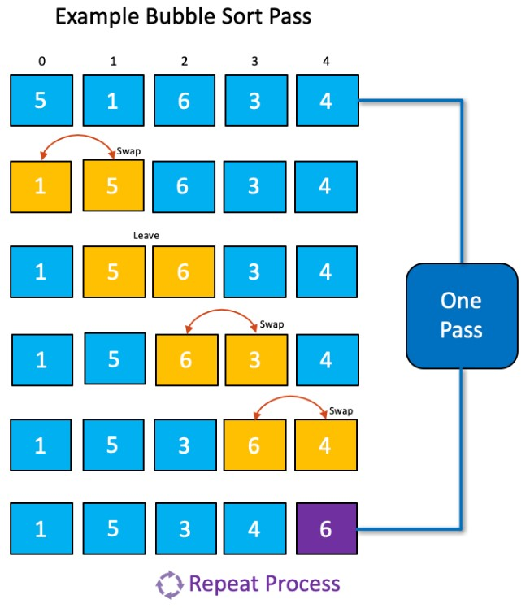
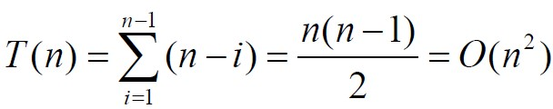
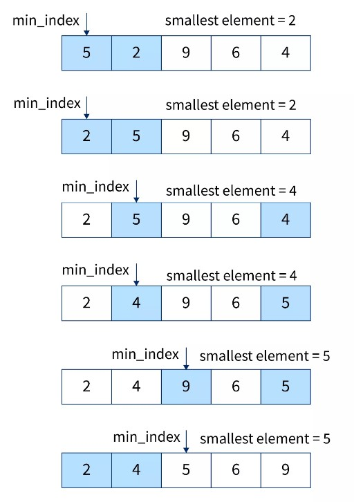
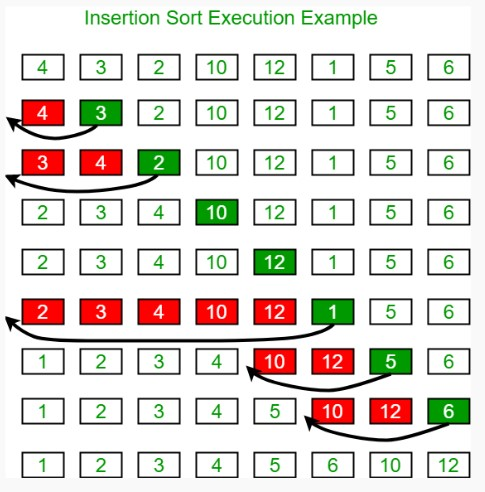
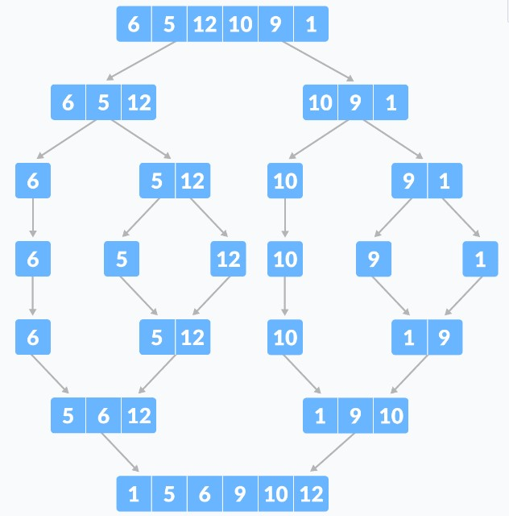
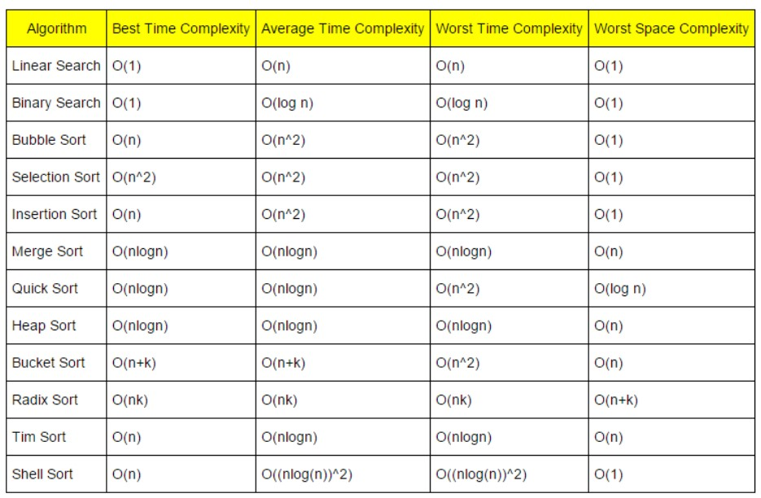

# Sorting Algorithm <!-- omit in toc -->

## Index <!-- omit in toc -->

- [1. Bubble Sort (거품 정렬)](#1-bubble-sort-거품-정렬)
  - [1.1. 동작 과정](#11-동작-과정)
  - [1.2. 복잡도](#12-복잡도)
  - [1.3. Python 구현](#13-python-구현)
- [2. Selection Sort (선택 정렬)](#2-selection-sort-선택-정렬)
  - [2.1. 동작 과정](#21-동작-과정)
  - [2.2. 복잡도](#22-복잡도)
  - [2.3. Python 구현](#23-python-구현)
- [3. Insertion Sort (삽입 정렬)](#3-insertion-sort-삽입-정렬)
  - [3.1. 동작 과정](#31-동작-과정)
  - [3.2. 복잡도](#32-복잡도)
  - [3.3. Python 구현](#33-python-구현)
- [4. Shell Sort](#4-shell-sort)
  - [4.1. 동작 과정](#41-동작-과정)
  - [4.2. 복잡도](#42-복잡도)
  - [4.3. Python 구현](#43-python-구현)
- [5. Heap Sort (힙 정렬)](#5-heap-sort-힙-정렬)
- [6. Merge Sort (병합 정렬)](#6-merge-sort-병합-정렬)
  - [6.1. 동작 과정](#61-동작-과정)
  - [6.2. 복잡도](#62-복잡도)
  - [6.3. Python 구현](#63-python-구현)
- [7. Quick Sort (퀵 정렬)](#7-quick-sort-퀵-정렬)
  - [7.1. 동작 과정](#71-동작-과정)
  - [7.2. 복잡도](#72-복잡도)
  - [7.3. Python 구현](#73-python-구현)
- [8. Counting Sort (계수 정렬)](#8-counting-sort-계수-정렬)
  - [8.1. 동작 과정](#81-동작-과정)
  - [8.2. 복잡도](#82-복잡도)
  - [8.3. Python 구현](#83-python-구현)
- [9. 복잡도 비교](#9-복잡도-비교)

# 1. Bubble Sort (거품 정렬)

가장 시간복잡도가 높은 알고리즘이기 때문에 사용을 추천하지 않는다.  
단, 정렬이 되었는지 판단할 수 있어 거의 정렬이 된 데이터에 대해서는 유효하다.

## 1.1. 동작 과정

1.  0 ~ n-1 번 인덱스에 대해서 현재 숫자와 뒤의 숫자를 비교한다. 현재 숫자가 더 클 경우 스왑한다.  
    그 결과 뒤에서 첫번째 수는 배열에서 첫번째로 큰 수가 자리한다.
2.  0 ~ n-2 번 인덱스에 대해서 현재 숫자와 뒤의 숫자를 비교한다. 현재 숫자가 더 클 경우 스왑한다.  
     그 결과 뒤에서 두번째 수는 배열에서 두번째로 큰 수가 자리한다.  
    ...
3.  0 ~ 0 번 인덱스에 대해서 대해서 현재 숫자와 뒤의 숫자를 비교한다. 현재 숫자가 더 클 경우 스왑한다.  
     그 결과 뒤에서 N-1 번째 수는 배열에서 N-1번째로 큰 수가 자리한다.



## 1.2. 복잡도

- **공간복잡도 O(1)**  
  주어진 배열 내에서 스왑하며 연산이 이뤄지기 때문에 추가 메모리를 필요로 하지 않는다.
- **시간복잡도 O(n\*\*2)**  
  비교와 스왑 연산이 (n-1 + n-2 + n-3 + .... + 3 + 2 + 1)회 일어난다.  
    
  (단, 최선의 경우 O(n)의 복잡도를 가진다.)

## 1.3. Python 구현

```python
def bubble_sort(nums):
    N = len(nums)

    # 배열의 길이에 대응하는 횟수만큼 루프를 돈다.
    for i in range(N):
        is_swapped = False  # 루프에 대해서 스왑여부를 판단하는 플래그

        # 스왑여부를 탐색하는 배열 길이를 하나씩 줄여나간다.
        # 루프를 돌 때마다, 탐색한 배열에서 가장 큰 숫자가 순서대로 뒷쪽에 쌓이기 때문.
        for j in range(N - i -1):
            if nums[j] > arr[j + 1]:
                arr[j], arr[j + 1] = arr[j + 1], arr[j] # 현재 숫자가 뒤의 숫자보다 클 경우, 스왑
                is_swapped = True   # 플래그를 바꿔준다

        if not is_swapped:  # 루프에 대해서 한 번도 스왑이 일어나지 않았으면, 정렬 완료
            return nums

    return nums
```

# 2. Selection Sort (선택 정렬)

## 2.1. 동작 과정

1. 0 ~ n-1번 인덱스 중 가장 작은 값을 찾아 0번 인덱스와 스왑한다.
2. 1 ~ n-1번 인덱스 중 가장 작은 값을 찾아 1번 인덱스와 스왑한다.  
   ...
3. n-2 ~ n-1번 인덱스 중 가장 작은 값을 찾아 n-2번 인덱스와 스왑한다.



## 2.2. 복잡도

- **공간복잡도 O(1)**  
  주어진 배열 내에서 스왑하며 연산이 이뤄지기 때문에 추가 메모리를 필요로 하지 않는다.
- **시간복잡도 O(n\*\*2)**  
  비교 연산이 (n-1 + n-2 + n-3 + .... + 3 + 2 + 1)회 일어나고, n-1번의 스왑 연산이 일어난다.  
  

## 2.3. Python 구현

```python
def selection_sort(nums):
    N = len(nums)

    # N-1 번 최솟값을 찾아낸다.
    for i in range(N - 1):
        min_idx = i # i번째 숫자를 포함(기준으로 삼음)

        # i+1번째부터 순회하며 i번째 가장 작은 값을 탐색
        for j in range(i + 1, N):
            if nums[j] < nums[min_idx]:
                min_idx = j

        nums[i], nums[min_idx] = nums[min_idx], nums[i] # i번째 숫자와 i번째 작은 숫자를 스왑
    return nums
```

# 3. Insertion Sort (삽입 정렬)

간단하게 말해 배열의 앞부분을 정렬된 배열, 뒷 부분을 정렬되지 않은 배열로 구분한다. 그리고 정렬되지 않은 배열의 가장 앞에 수를 꺼내서 정렬된 배열의 적절한 위치로 삽입한다.

## 3.1. 동작 과정

1. 0 ~ 1번 인덱스 중 1번 인덱스 값이 들어갈 위치를 찾아 넣는다.
2. 0 ~ 2번 인덱스 중 2번 인덱스 값이 들어갈 위치를 찾아 넣는다.  
   ...
3. 0 ~ n-1번 인덱스 중 n-1번 인덱스 값이 들어갈 위치를 찾아 넣는다.



## 3.2. 복잡도

- **공간복잡도 O(1)**  
  주어진 배열 내에서 스왑하며 연산이 이뤄지기 때문에 추가 메모리를 필요로 하지 않는다.
- **시간복잡도 O(n\*\*2)**  
  비교 연산이 최대 (1 + 2 + 3 + .... + n-3 + n-2 + n-1)회 일어나고, n-1번의 스왑 연산이 일어난다.  
    
  (단, 정렬되어 있는 값의 경우 비교 연산만 n-1번 이루어져 O(n)의 시간복잡도를 가진다.)

## 3.3. Python 구현

```python
def insertion_sort(nums):
    N = len(nums)

    # 1 ~ n-1 번 인덱스에 대해서 반복
    for i in range(1, N):
        cur_num = nums[i]
        j = i - 1

        # 왼쪽 배열에서 i번째 숫자가 들어갈 위치를 찾는다.
        while j >= 0 and cur_num < array[j]:
            array[j + 1] = array[j] # 숫자를 하나씩 오른쪽으로 민다.
            j = j - 1

        array[j + 1] = cur_num  # i번째 숫자를 삽입

    return nums
```

# 4. Shell Sort

삽입정렬을 보완하기 위한 알고리즘이다. 앞서 살펴본 것 처럼 쉘 알고리즘은 **정렬이 잘 되어 있을수록 시간복잡도가 줄어든다.** 비교연산을 해야할 횟수(거리)가 줄어들기 때문이다. 반대로 생각하면, **정렬을 위해 비교해야할 거리가 클 수록 시간 복잡도가 늘어난다.**

위와 같은 특징에서 착안해서, 쉘 정렬은 배열의 전체적인 정렬도를 점차 높이는 방법으로 삽입 정렬을 수행한다. gap만큼 떨어진 숫자들을 하나의 부분 배열로 간주해서 삽입 정렬을 수행하고, 이 gap을 점차 1까지 줄여나간다.

## 4.1. 동작 과정

1. gap의 초기 크기를 n // 2로 결정한다.
2. gap ~ n-1번째 인덱스를 기준점으로 왼쪽 숫자들에 대해서 gap의 간격으로 부분배열을 만들고, 삽입정렬을 수행한다.
3. gap의 크기를 2로 나눈다.
4. gap의 크기가 1이 될 때까지 2 ~ 3의 과정을 반복한다.

## 4.2. 복잡도

- **공간복잡도 O(1)**  
  주어진 배열 내에서 스왑하며 연산이 이뤄지기 때문에 추가 메모리를 필요로 하지 않는다.
- **시간복잡도 O(n\*\*2)**  
  쉘 정렬과 동일하게 O(n\*\*2)의 복잡도를 가진다.
    
  그러나 최선과 평균 시간 복잡도가 O(n\*log n)이다.

## 4.3. Python 구현

```python
def shell_sort(nums):
    N = len(nums)

    gap = N // 2    # 첫 gap은 배열 크기의 반으로 지정한다.
    while gap > 0:  # gap이 1이 될 때까지 줄여나간다.

        # gap의 크기만큼 간격을 띄고 shell 정렬을 수행한다.
        for i in range(gap, N):
            cur_num = nums[i]
            j = i - gap

            cur_num < array[j]:
            while j >= gap and cur_num < nums[j]:
                array[j] = array[j - gap]
                j -= gap

            array[j] = cur_num
        gap //= 2   # gap은 2로 나눈 몫으로 줄여나간다
```

# 5. Heap Sort (힙 정렬)

[자료구조 힙](https://github.com/Byongho96/TIL/blob/master/Data%20Structure/Heap.md)을 이용한 정렬 방법이다.

길이가 n인 heap 배열은 depth가 log n 이다.

- pop 연산 시, logN 번의 비교 및 치환이 일어난다.(Heapify)
- 정렬을 위해서 N번의 pop 연산이 일어난다.

따라서 힙을 이용한 연산의 시간 복잡도는 O(n \* log n)dlek.

# 6. Merge Sort (병합 정렬)

**분할 정복법** 중 하나의 큰 문제를 여러 개의 작은 문제로 쪼개서, 작은 문제를 해결한 결과를 모아서 큰 문제의 답을 얻는다. 분할 정복 특징 상, 재귀로 구현된다.

## 6.1. 동작 과정

1. 배열의 길이가 1이 될 때 까지, 반으로 쪼갠다.(분할)
2. 쪼개진 배열을 2개씩 비교 정렬하며 합친다.(병합)



## 6.2. 복잡도

- **공간복잡도 O(n)**  
  배열을 병합할 때, 병합 결과를 담을 배열이 필요하므로 공간 복잡도 는 O(n)이다.
- **시간복잡도 O(n\*log n)**  
  크기가 n인 데이터를 절반 씩 분할 했을 경우, 병합하는 깊이는 log n이다. 각 depth에 대해 병합 시에는 모든 데이터에 대해서 한 번씩 비교연산이 일어난다. O(n \* log n)

## 6.3. Python 구현

```python
def merge_sort(nums):
    # 베이스 반환 조건: 1개 이하의 배열이 되면 반환한다.
    if len(nums) < 2:
        return nums

    # 배열을 반으로 나눠서, 왼쪽과 오른쪽 배열에 대해 각각 재귀호출 한다.
    mid = len(nums) // 2
    left_arr = merge_sort(nums[:mid])  # left_arr는 왼쪽 배열이 정렬된 값이다.
    right_arr = merge_sort(nums[mid:])   # right_arr는 오른쪽 배열이 정렬된 값이다.

    # left_arr와 right_arr는 각 정렬된 값이다.
    # left_arr와 right_arr를 앞에서부터 서로 비교하며 merged_arr에 작은 값을 merged_arr에 채워 넣는다.
    l = r = 0
    merged_arr = []
    while l < len(left_arr) and r < len(right_arr): # 양 배열 중 적어도 하나를 탐색 완료할 때까지
        if left_arr[l] < right_arr[h]:
            merged_arr.append(left_arr[l])
            l += 1
        else:
            merged_arr.append(right_arr[r])
            r += 1
    merged_arr += left_arr[l:]
    merged_arr += right_arr[r:]

    return merged_arr   # left_arr와 right_arr를 병합해서 정렬한 값 반환
```

# 7. Quick Sort (퀵 정렬)

병합 정렬과 비슷하게 문제를 분할하면서 이뤄진다. 단 다음과 같은 차이점이 있다.

1. 배열의 중간에 위치한 값 아닌 pivot값을 기준으로 분할한다. pivot 값을 기준으로 큰 숫자와 작은 숫자의 갯수가 동일할 수록 알고리즘이 효율적이다.
2. 배열을 **분할 할 때, 비교연산**이 일어난다.

1번 기준에 따라 pivot값을 어떻게 선택하느냐에 따라서 시간 복잡도가 달라진다. 최대 O(n\*\*2)까지 커질 수 있는 불안정한 정렬 알고리즘이다.

## 7.1. 동작 과정

1. 배열의 pivot을 설정한다.
2. pivot과 나머지 숫자를 비교 연산하여, pivot보다 작은 숫자 배열과, 큰 숫자 배열을 얻는다.
3. 작은 숫자 배열과, 큰 숫자 배열에 대해서 (1 ~ 2)의 과정을 반복한다.
4. 배열의 길이가 1이하로 쪼개지면 그대로 다시 합친다.

## 7.2. 복잡도

- **공간 복잡도**  
  인메모리 정렬 방식을 사용할 경우, O(log n)의 공간복잡도로 구현 가능하다. ~~뭔소린지 모르겠다~~
- **시간 복잡도**  
  pivot값이 이상적으로 선택되었을 경우, 병합정렬과 마찬가지로 (log n)의 깊이의 대해서, 각각 n번의 비교 연산이 일어나므로 **O(n\*log n)의 복잡도**를 가진다.

  그러나 최악의 경우 분할정복이 (n)의 깊이를 가지므로 **O(n\*\*2)의 복잡도**를 가진다.

## 7.3. Python 구현

```python
# 이 코드에서는 pivot을 병합 정렬과 동일하게 배열의 중간위치 값으로 설정한다.
def quick_sort(nums):
    # 베이스 반환 조건: 1개 이하의 배열이 되면 반환한다.
    if len(nums) <= 2:
        return nums

    pivot = nums[len(nums) // 2]    # pivot 설정
    lesser_arr, equal_arr, greater_arr = [], [], [] # 각각 pivot보다) 작은 숫자 배열, 동일한 숫자 배열, 큰 숫자 배열
    for num in arr:
        if num < pivot:
            lesser_arr.append(num)
        elif num > pivot:
            greater_arr.append(num)
        else:
            equal_arr.append(num)

    # pivot보다 작은 숫자배열과, pivot보다 큰 숫자 배열을 quick_sort에 재귀호출 한다.
    # 결과를 그대로 이어 붙여 반환한다.
    return quick_sort(lesser_arr) + equal_arr + quick_sort(greater_arr)
```

# 8. Counting Sort (계수 정렬)

특정한 조건이 만족할 때, O(n + k)의 시간복잡도로 정렬할 수 있다. 이 때 k는 배열에 존재하는 숫자의 크기 범위이다. 즉 k가 데이터의 갯수 n보다 작으면, **O(n)**의 정렬이 가능하다.

- 배열에 존재하는 모든 숫자가 0이상의 정수여야 한다.
- 배열에 존재하는 숫자의 크기 범위(k)가 지나치게 커서는 안된다.

## 8.1. 동작 과정

1. 배열의 숫자 범위(k)에 해당하는 `[0] * k`의 누적합 예비 배열을 만든다.
2. 배열을 1회 순회하며, 숫자를 인덱스로 하는 누적합 예비 배열의 값을 +1 한다.
3. 누적합 예비 배열을 누적합하여 누적합 배열을 만든다.
4. 누적합 배열을 1회 순회하며, 값만큼 인덱스를 출력한다.

## 8.2. 복잡도

- **공간 복잡도 O(k)**  
  숫자 범위(k)에 해당하는 배열을 생성해야 한다.
- **시간 복잡도 O(n+k)**  
  배열을 1회 순회 O(n)하고, 누적합 배열을 1회 순회 O(k)한다.

## 8.3. Python 구현

```python
def counting_sort(nums, K):
    N = len(nums)

    # 누적합 예비 배열을 생성한다.
    count_sum = [0] * (K)
    for i in range(0, N):
        count_sum[nums[i - 1]] += 1

    # 누적합 배열을 만든다. (인덱스에 해당하는 값이 들어가야할 마지막 인덱스 번호를 가리킨다.)
    for i in range(1, K):
        counts[i] += counts[i-1]

    # 배열의 값을 인덱스로 하는 누적합 배열을 찹조한다. -> 해당 값이 들어가야할 마지막 인덱스 번호
    # 결과 배열의 해당 인덱스에 숫자를 집어넣는다.
    # 다음 값을 위해 해당 값을 인덱스로 하는 누적합 배열의 값을 -1 한다.
    # 내가 그린 기린 그림은 잘 그린 기린 그림이고...
    result = [0] * N
    for num in nums:
        idx = count_sum [num]
        result[idx - 1] = num
        count_sum[num] -= 1
```

# 9. 복잡도 비교




