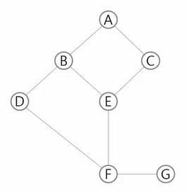

# Stack
## 1. Property
* **linear data structure**
    * one data -> another data
* **LIFO(Last-In-First-Out)**
## 2. Operators
* push(obj)
    * top += 1
        * top: pointer for the last item
    * stk[top] = x
    ```python
    # append is slow
    def push(item):
        s.append(item)
    ```
    ```python
    # Usually stack size is confined
    def push(item, size):
        global top
        top += 1
        if top == size:
            print('Overflow')
        else:
            stack[top] = item
    
    size = 10
    stack = [0] * size
    top = -1
    ```
    ```python
    top += 1
    stack[top] = item
    ```
* pop
    * You don't have to actually pop the item. JUST USE THE POINTER
    ```python
    def pop():
        if len(stack) == 0:
            return
        else:
            return stack.pop(-1)
    ```
    ```python
    # Usually stack size is confined
    def pop():
        global top
        if top == -1:
            print('Underflow')
            return
        else:
            top -= 1
            return stack.pop[top+1]
    print(pop())
    ```
    ```python
    if top > -1:
        top -= 1
        print(stack[top+1])
    ```
* isEmpty
* peek
## 3. Application
### 3-1. **Parenthesis Check**
* err1: the stack is empty while checking
* err2: wrong pair
* err2: the stack is not empty after checking
### 3-2. **Functon Call**
* when a function is called, local variables and address to be ruturned are saved in the stack memory
* main -> f1 -> f2 -> f1 -> main
### 3-3. **Recursive Function Call**
* allocating new memory with different paramter
* later called function ends earlier
    ```python
    def f(i, N): # i: current step, N: goal step
        if i==N:
            print(f'{i}: to do in the final step')
            return
        else:
            print(f'{i}: to do in the middle step')
            f(i+1, N)
    f(0,3)
    # 0: to do in the middle step
    # 1: to do in the middle step
    # 2: to do in the middle step
    # 3: to do in the final step
    ```
    ```python
    def f(i, N):
        if i == N:
            print('Out of range')
            return
        else:
            print(A[i])
            f(i+1, N)
    N = 3
    A = [1, 2, 3]
    f(0, N)
    # 1
    # 2
    # 3
    # Out of range
    ```
* **Memoization**
    * recursive function uses too much memory cause the number of function calls increases rapidly
    * Skip repeated operations by Memorizing the already calculated data
        ```python
        def fibo(n):
            if n>= 2 and len(memo) <= n: # memo이 대응값이 없으면
                memo.append(fibo(n-1) + fibo(n-2))  # memo에 추가
            return memo[n]  # memo에서 데이터를 읽어서 반환
        memo = [0, 1]
        ```
* **DP(Dynamic Programming)**
    * loop
    * Solve for small subsets first -> solve for larger subsets -> solve for the original set
        ```python
        def fibo(n):
            f = [0, 1]
            for i in range(2, n+1):
                f.append(f[i-1] + f[i-2])
            return f[n]
        ```
### 3-4. **DFS(Depth First Search)**
* **Stack can be used in DFS for saving the path!!**
* DFS Algorithm
    1. visit the node 'v'
    2. search the adjacent nodes
        * if there is a node 'w' that is not visted yet, push node 'v' into the stack and visit the node 'w'
        * Otherwise, pop the stack and go back to the previous node
    3. repeat 1~2. until the stack is empty
    
    ```python
    adjList = [[1, 2],      # 0
               [0, 3, 4],   # 1
               [0, 4],      # 2
               [1, 5],      # 3
               [1, 2, 5],   # 4
               [3, 4, 6],   # 5
               [5]]
    ```
    ```python
    # iterative
    def DFS(v, N):
        visited = [0] * N # for cheking whether have visited
        stack = [0] * N
        top = -1

        visited[v] = 1  # strat point
        # print(v)
        while True:
            for w in adjList[v]:
                if visited[w] == 0:
                    top += 1
                    stack[top] = v
                    v = w
                    visited[v] = 1
                    # print(v)
                    break
            else:
                if top != -1:
                    v = stack[top]
                    top -= 1
                else:
                    break
    
    DFS(0, 7) # 0, 1, 3, 5, 4, 2, 6
    ```
    ```python
    # recursive
    def DFS(v, N):
        visited = [0] * 7
        visited[v] = 1  # strat point
        # print(v)
        for w in adjList[v]:
            if visited[w] == 0:
                DFS(w)

    DFS(0) # 0, 1, 3, 5, 4, 2, 6
    ```
* Making the graph from the edges data
    ```python
    V, E = map(int, input().split()) # 0~V번의 점, E개의 간선
    adjList = [[] for _ in range(V+1)]  # V+1 개의 노드
    for _ in range(E):
        a, b = map(int, input().split())
        adjList[a].append(b)
        adjList[b].append(a)
    ```
### 3-5. Postfix notation
* infix notation: A + B
* postfix notation: AB+
* infix -> postfix
    * the order
        |operator|order|
        |---|---|
        |*|2|
        |/|2|
        |+|1|
        |-|1|
        |(|0|
    * get a token
        * if operand: print
        * if operator
            * if '(':
                * push
            * elif ')':
                * append(pop) until '('
                * pop '('
            * elif order(the operator) > order(stack[top]):
                * push
            * else:
                * append(pop) until lower operator

        ```python


        ```
* operation
    * if operand: push
    * if operator:
        * n1 = stack.pop
        * n2 = stack.pop
        * stack.push(result)