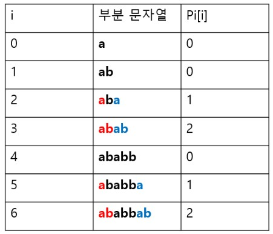
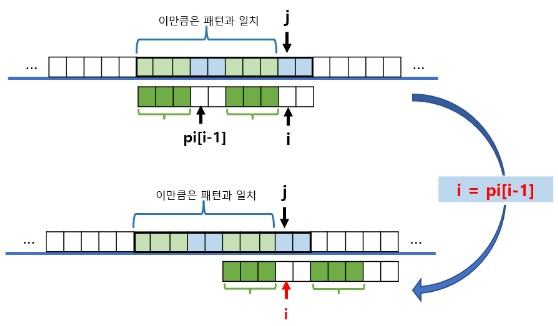

## 1. String
**Even strings are stored as 0 abd 1**
 * .jpg/.mp4/.doc ...: all the file has its own encoding rule (binary data) <-> (desirable data)
### 1-1. Standoard Code
**the encoding character rule for information interchagne**
* ASCII(American Standard Code for Information interchange)
  * 1st bit: Parity Bit
    * for detecting error by checksum
  * 7bit character encoding standard
    
* Extended ASCII
  * using all the 8bit
* UTF-8 (Unicdoe)
  * MIN: 8bit, MAX: 32bit
  * default encoding rule in python
---
## 2. Matching Pattern
### 2-1. Bruce-Force
* **O(MN)**
  ```python
  p  =  'is'
  t  = 'This is a book'

  def BruteForce(p, t):
    M = len(p)
    N = len(t)
    i  = 0 # an index for p(string)
    j  = 0 # an index for t(pattern)
    while j < M and i < N:
      if t[i] != p[j]:
        i = i - j 
        j = -1 # consdier the following expressions
      i += 1
      j += 1
    if j == M: return i - M # Success: the start index
    else: return -1
  print(BruteForce(p,t)) # 2
  ```
### 2-2. KMP Alogrithm
[KMP Explanation with images](https://yiyj1030.tistory.com/495)
* **O(N)~O(MN)**
* **STEP**
  1. Make Pi table(Longest Prefix Suffix Array) for the pattern(pat)
    
  2. Browse a string skipping some characters by referring to the Pi table
    
    ```python
    # Making LPS array(Pi table)
    def computeLPSArray(pat):
      table = [0] * len(pat)

      i = 0 # index for prefix
      j = 1 # index for suffix
      while j < len(pat):
        if pat[i] == pat[j]:  # 하나를 늘렸을 때 같으면, i인덱스에 1을 더한 값(갯수)을 저장
          i += 1
          table[j] = i
          j += 1
        else: # 하나를 늘렸을 때 틀리면,
          if i != 0: # prefix 인덱스가 처음을 참조하는게 아니라면
            i = table(i-1)  # 그 전의 인덱스의 table값
                            # table(i-1) = 3 -> 3개가 반복된다 (0,1,2)
                            # 3번 인덱스로 가는 것은 반복구간 이후의 값, 새로 비교할 지점
                            # 여기의 값이 pat[j]와 같으면 i+1이 테이블에 저장. 새로운(감소된) lps지점 형성
          else: # prefix가 처음이라면, 0넣고 다음 j
            table[j] = 0
            j += 1
    ```
    ```python
    # More Intuitive: Making LPS array(Pi table)
    def computeLPSArray2(pat):
      N = len(pat)
      table = [0] * N  # 위 함수에서 else조건문을 빼기 위해서

      i = 0 # index for prefix
      j = 1 # index for suffix
      for j in range(1, N): # j를 한번씩 늘리면서 실행(cause While문)
        while i > 0 and pat[i] != pat[j]:
          i = table[i-1]
        if pat[i] == pat[j]:
            i += 1
            table[j] = i
    ```
    ---
    ```python
    # KMP Algorithm with computeLPSArray func
    def kmp(string, pat):
      table = computeLPSArray9(pat)

      result = [0]
      i = 0
      for j in range(len(string)): # 순차적으로 탐색
        while i > 0 and pat[i] != string[j]:
          i = table[i-1]
        if pat[i] == string[j]:
            i += 1
            if i == len(pat):
              result.append(j - 1 + 1)
              i = table[i-1]
      return result

### 2-3. Boyer-Moore Algorithm
[Boyer-Moore explanation with images](https://wondytyahng.tistory.com/entry/%EB%B3%B4%EC%9D%B4%EC%96%B4%EB%AC%B4%EC%96%B4)

```python

def bm_match(txt, pat):
	# Making skip table for all the ASCII
  skip = [None] * 256

	for pt in range(256): # values which is not in the pat
		skip[pt] = len(pat)

	for i, pt in enumerate(pat):  # for values in the pattern
		skip[ord(pt)] = len(pat) - i - 1

	# Searching
  result = []
	while pt < len(txt):  # index for text
		pp = len(pat) -1  # idnex for pattern. Always compare from the end
		while txt[pt] == pat[pp]: #
			if pp == 0: # when find the pattern in the string
				result.append(pt)
			pt -= 1
			pp -= 1
    # if (the order of 'c' in the 'pattern' from the behind) > (the order of 'c' in the 'txt section' from the behind) 
    # for the normal case -> skip as the table
    # for the abnormal case -> skip just one
	  pt += skip[ord(txt[pt])] if skip[ord(txt[pt])] > len(pat) - pp else len(pat) - pp
	
	return -1
```
* [for the pt+=](https://dbehdrhs.tistory.com/72)

---
## 3. Encryption
### 3-1. Caesar cipher
* string combination of 'A~Z'and 'a~z', and the key is n
```python
def Caesar(string, n):
  string = list(string)

  for i in range(len(string)):
    if string[i].isupper():
      s[i] = chr((ord(string[i]) - ord('A') + n) % 26 + ord('A'))
    elif string[i].islower():
      s[i] = chr((ord(string[i]) - ord('a') + n) % 26 + ord('a'))
    
  return ''.join(string)

```
### 3-2. bit array - xor
|a|b|a^b|(a\^b)^b|
|---|---|---|---|
|0|0|0|0|
|0|1|1|0|
|1|0|1|1|
|1|1|0|1|
---
## 4. Compression
### 4-1. Run-length Encoding
```python
def RLE(string):
  string += chr(ord(string[-1]) + 1)
  encoded ''
  cnt = 1
  for i in range(1, len(string)):
    if string[i] == string[i-1]:
      cnt += 1
    else:
      encoded += string[i-1] + str(cnt)
      cnt = 1

  return encoded
```
### 4-2. Huffman_Coding
[허프만코딩_블로그설명](len(string))
* distinctive prefix
---
## 5. Palindrome
* the longest parlindrome in the string
```python
def longestPalindorme(s):
  def expand(left, right):
    while left >= 0 and right < len(s) and s[left] == s[right]:
      left -= 1
      right += 1
    return s[left + 1:right]
  
  if len(s) < 2 or s == s[::-1]:
    return s

  result = ''
  for i in range(len(s)-1):
    result = max(result, expand(i, i+1), expand(i, i+2), key=len)
  return result
```