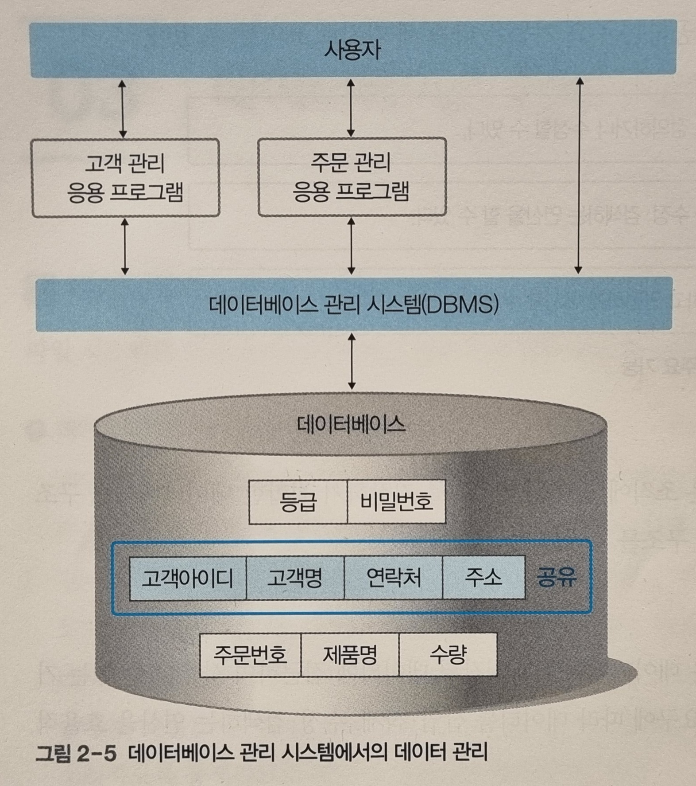

김연희, 『데이터베이스 개론』, 한빛아카데미(2022.07.20), Chpater 02

# Ch2. 데이터베이스 관리 시스템<!-- omit in toc -->

- [2.1. 데이터베이스 관리 시스템의 등장 배경](#21-데이터베이스-관리-시스템의-등장-배경)
  - [2.1.1. 파일 시스템의 한계점](#211-파일-시스템의-한계점)
- [2.2. 데이터베이스 관리 시스템의 정의](#22-데이터베이스-관리-시스템의-정의)
  - [2.2.1. 데이터베이스 관리 시스템](#221-데이터베이스-관리-시스템)
- [2.3. 데이터베이스 관리 시스템의 장단점](#23-데이터베이스-관리-시스템의-장단점)
  - [2.3.1. 장점](#231-장점)
  - [2.3.2. 단점](#232-단점)
- [2.4. 데이터베이스 관리 시스템의 발전](#24-데이터베이스-관리-시스템의-발전)
  - [2.4.1. 1세대: 네트워크/계층 DBMS](#241-1세대-네트워크계층-dbms)
  - [2.4.2. 2세대: 관계DBMS](#242-2세대-관계dbms)
  - [2.4.3. 3세대: 객체지향/객체관계 DBMS](#243-3세대-객체지향객체관계-dbms)
  - [2.4.4. 4세대: NoSQL/NewSQL DBMS](#244-4세대-nosqlnewsql-dbms)

파일 시스템이 지닌 한계점과, 그에 대한 데이터베이 관리 시스템의 핵심 기능과 장단점.

## 2.1. 데이터베이스 관리 시스템의 등장 배경

### 2.1.1. 파일 시스템의 한계점

**파일 시스템**

> 운영체제와 함께 설치되며, 데이터를 파일로 관리할 수 있도록 파일의 CRDU 기능을 제공한다.

- **파일 시스템의 한계점**

  1. **데이터의 중복**  
     파일 시스템은 응용 프로그램별로 파일을 유지하기 때문에, 같은 데이터가 서로 다른 파일에 중복 될 수 있다. 단순히 저장공간의 낭비 뿐 아니라, 데이터 일관성을 유지하는데 어려움이 있다.

  2. **SW의 파일 종속성**  
     응용 프로그램이 파일에 직접 접근하기 때문에, 파일 구조에 종속적이다.따라서 SW를 독립적으로 업데이트 혹은 이식하거나, 반대로 데이터구조를 마음대로 바꾸기 어렵다.

  3. **보안/동시 공유/회복 기능 부족**  
     사용자에게 파일단위로 권한을 부여하기 때문에, 데이터 보안을 세분화하기 어렵다. 하나의 파일에 동시에 다른 응용프로그램이 차지할 수 없기 때문에, 데이터의 동시 공유가 어렵다.또한 데이터 회복 기능이 부족하다.

## 2.2. 데이터베이스 관리 시스템의 정의

### 2.2.1. 데이터베이스 관리 시스템

> 데이터를 데이터베이스에 통합하여 저장하고 관리하여, 응용프로그램의 데이터 요청을 처리하여 결과를 리턴한다.

- **데이터베이스 관리 시스템의 주요 기능**
  - **정의 기능**  
    데이터베이스의 구조를 설계한다.
  - **조작 기능**  
    데이터베이스에 저장된 데이터에 대한 CRUD(Create/Read/Update/Delete)기능을 제공한다.
  - **제어 기능**  
    데이터를 여러 사용자가 공유해도 정확하고 안전하게 유지하도록 한다.

## 2.3. 데이터베이스 관리 시스템의 장단점

### 2.3.1. 장점

- **데이터 독립성**  
  응용 프로그램을 대신하여 데이터 베이스에 접근하기 때문에, 응용프로그램과 데이터베이스가 서로 독립적이다.
- **데이터 동시 공유**  
  동일한 데이터를 응용프로그램의 요구에 따라 다양한 구조로 제공하고, 기술적으로 동시접근을 가능케한다.
- **데이터 보안**  
  사용자별로 접근 가능한 데이터베이스 영역을 세분화하여 제한하거나 접근 수준을 차별화할 수있다.
- **데이터 무결성**  
  데이터의 정확성과 일관성을 유지하는 것
  - 개체 무결성: 모든 데이터는 테이블에서 고유하게 식별되는 기본 키를 가진다.
  - 참조 무결성: 참조 관계에 있는 두 테이블이 있을 때, 참조하는 데이터의 외래키값은 없거나 참조하는 레코드의 기본키값을 가져야한다.
  - 도메인 무결성: 테이블의 각 필드마다 입력되는 데이터의 유효성을 보장한다.
- **데이터 회복**  
  데이터 복구 기능을 지원한다.
- **데이터 표준화**  
  데이터에 대한 모든접근이 DBMS를 통해 이루어지기 때문에, 데이터에 접근화는 방법, 데이터의 형식과 구조 등을 표준화하기 쉽다. 그에 따라 데이터는 응용 프로그램에 독립적으로 존재하기 때문에 데이터베이스의 구조가 변경되어도 응용프로그램을 변경할 필요가 없다.

### 2.3.2. 단점

- **비용**  
  데이터베이스 관리 시스템은 별도 구매해야 하며, 운용 시 컴퓨터 자원을 파일시스템에 비해 비교적 많이 소모한다.
- **백업과 회복 방법의 복잡성**  
  동시 공유 및 데이터의 통합 관리 기능 등을 지원하기 때문에, 오류 발생 시 회복이 비교적 복잡하다.
- **중앙 집중 관리로 인한 취약점**  
  모든 데이터가 데이터베이스에 통합되어 있기 때문에, DBMS에 장애가 발생하면 의존하는 모든 응용프로그램의 사용이 영향받는다.

## 2.4. 데이터베이스 관리 시스템의 발전

### 2.4.1. 1세대: 네트워크/계층 DBMS

- **네트워크 DBMS**
  - Directed 그래프 구조로 데이터의 상호관계를 표현한 데이터 모델
  - N : M 대응관계를 가진다.
- **계층 DBMS**
  - 트리 구조로 데이터의 상호관계를 계층적으로 표현한 데이터 메돌
  - 1 : N 대응관계를 가진다.

모두 복잡한 현실 세계를 표현하기 어렵고, 구조 변경이 어렵다는 단점이 있다.

### 2.4.2. 2세대: 관계DBMS

테이블 형태로 데이터 모델을 정의하며, 외래키를 통해 다른 테이블(데이터 모델)간의 관계를 가진다. 1:1, 1:N, M:N 대응 관계를 지원한다.

### 2.4.3. 3세대: 객체지향/객체관계 DBMS

프로그래밍의 클래스와 객체 개념을 데이터 베이스에 도입한 DBMS

- **객체지향 DBMS**  
  데이터를 객체로써 저장되며, 프로그래밍에서처럼 각 클래스는 객체의 구조뿐 아니라 메소드를 정의한다.
  현재는 시장에서 많은 파이를 차지하지 않는다. [송요한, [IT산업 20년 전]객체지향 데이터베이스의 몰락, 컴퓨터월드, 2015.05.31](https://www.comworld.co.kr/news/articleView.html?idxno=48790)
- **객체관계 DBMS**
  객체지향 데이터베이스 모델을 가진 관계형 데이터베이스 관리 시스템

현재 상용되는 많은 DBMS들이 ORM(Object Relational Mapping)라이브러리를 통해 객체관계 DBMS로 분류될 수 있지 않을까 싶다... (ORM: 객체 지향 프로그래밍 언어의 객체와 데이터베이스의 데이터의 상호변환을 지원)

### 2.4.4. 4세대: NoSQL/NewSQL DBMS

멀티미디어 데이터나 검샐 로그와 같은 비정형 데이터가 대량으로 생산되며, 비정형 데이터를 저장하는데 더 적합한 4세대 DBMS의 필요성이 대두되고 있다. 기업 별로 독자개발하여 쓰이고 있으며, 아직 표준화가 이뤄지지 않았다.

**NoSQL**
[Simply Explained, How do NoSQL database work?, YouTube, 2020.12.09](https://www.youtube.com/watch?v=0buKQHokLK8)

- **특징**  
  RDBMS와 달리 데이터간의 관계성 없이 모두 독립적으로 존재한다. Schema가 없고, 오로지 key(pk)와 value만으로 데이터가 구성되어 있다.  
  value는 또 다시 json과 같은 key-value형식의 문서로 정의되어 있기 때문에, 다양한 필드에 그에 대한 값을 저장할 수 있다.
- **장점**
  - 데이터가 독립적이기 때문에, 대용량 데이터를 분리하여 여러 서버에서 나눠 관리할 수 있다. 여러 서버 가운데서 데이터를 찾기 위해는 해쉬함수에 pk를 적용한 값을 참조한다.
  - 데이터가 구조가 정형화되지 않았기 때문에 데이터의 생성 및 수정이 쉽다.
- **단점**
  - 데이터를 pk로만 접근할 수 있기 때문에, 기존의 RBDMS에서처럼 데이터의 필드값을 다양하게 활용하여 데이터에 접근하는 것이 매우 어렵다.
