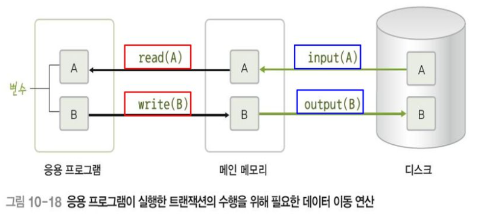
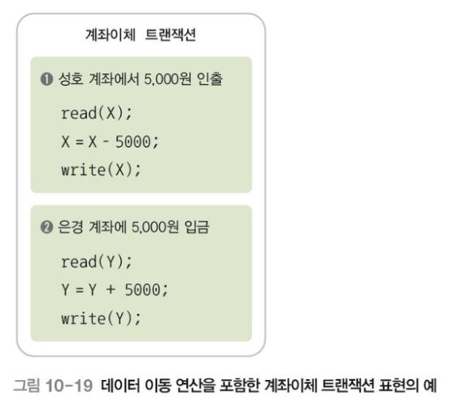

김연희, 『데이터베이스 개론』, 한빛아카데미(2022.07.20), Chpater 10

# Ch10. 회복과 병행 제어

데이터베이스에 문제가 발생했을 대 이를 원래 상태로 회복하고, 사용자들이 데이터베이스를 동시에 사용하더라도 다툼 없이 사이좋게 사용할 수 있도록 하는 병행 제어 기능을 알아보자

## 10.1. 트랜잭션

### 10.1.1. 트랜잭션의 개념

트랜잭션은 작업 하나를 수행하는 데 필요한 데이터베이스의 연산(SQL문)들을 모아놓은 것으로, 데이터베이스에서 논리적인 작업의 단위가 된다. 도한 데이터베이스에 장애가 발생했을 대 데이터를 복구사는 작업의 단위도 된다.

예를들어 A가 B에게 500원을 이체하는 계좌이체 트랜잭션의 다음과 같이 2개의 SQL문으로 구성할 수 있다.

```sql
UPDATE 계좌
SET 잔액 = 잔액 - 500
WHERE 계좌소유자 = 'A';

UPDATE 계좌
SET 잔액 = 잔액 + 500
WHERE 계좌소유자 = 'B';
```

만일 시스템의 장애로 첫 번째 SQL문만 실행되는 오류가 발생하였다면, 시스템이 정상적으로 작동하게 되었을 때 두 번째 UPDATE문을 실행하거나, 첫 번째 UPDATE문의 실행을 취소하여 트랜잭션을 작업 전 상태로 되돌아가게 해야 한다.

트랜잭션은 복구작업과 제어작업을 수행하는 중요한 단위로써, 트랜잭션의 모든 명령문이 완벽하게 처리되거나 하나도 처리되지 않아야 한다.

### 10.1.2. 트랜잭션의 특성

- **원자성**
  - 트랜잭션을 구성하는 연산들은 모두 실행되거나, 혹은 하나도 실행되지 않아야 한다. 즉 트랜잭션을 구성하는 연산 중 일부만 데이터베이스에 반영되는 일이 없게 한다.
- **일관성**
  - 트랜잭션이 이루어진 후에도 데이터베이스의 일관성을 유지해야 한다. 즉 데이터베이스의 특징적인 제약이나 규칙을 만족해야 한다.
- **격리성**
  - 현재 수행 중인 트랜잭션이 완료될 때까지 트랜잭션이 생성한 중간 연산 결과에 다른 트랜잭션들이 접근할 수 없음을 의미한다.
- **지속성**
  - 트랜잭션이 성공적으로 완료된 후 데이터베이스에 반영한 수행 결과는 어떠한 경우에도 손실되지 않고 영구적이다. 즉, 시스템에 장애가 발생하더라도 트랜잭션 작업 결과는 없어지지 않고 데이터베이스에 그대로 남아 있도록 회복 기능을 가져야한다.

위 트랜잭션의 4가지 특성은 각각 DBMS의 회복과 병행지원 기능으로 만족된다.\

| DBMS 기능      | 트랜잭션 특성  |
| -------------- | -------------- |
| 회복 기능      | 원자성, 지속성 |
| 병행 제어 기능 | 일관성, 격리성 |

### 10.1.3. 트랜잭션의 연산

- **commit 연산**
  - 트랜잭션의 수행이 성공적으로 완료되었음을 선언하는 연산.
  - 연산의 결과를 데이터베이스에 반영한다.
- **rollback 연산**
  - 트랜잭션의 수행이 실패했음을 선언하는 연산.
  - 트랜잭션의 연산 결과를 취소하고 트랜잭션이 수행되기 전의 상태로 돌아간다.

### 10.1.4. 트랜잭션의 상태


- **활동 상태**
  - 트랜잭션이 수행 중인 상태
- **부분 완료 상태**
  - 트랜잭션의 마지막 연산까지 완료된 상태
- **완료 상태**
  - commit 연산으로 트랜잭션의 수행 결과가 DB에 반영된 상태
- **실패 상태**
  - 트랜잭션을 더 이상 정상적으로 수행할 수 없는 상태
- **철회 상태**
  - 트랜잭션이 수행되기 전 데이터베이스 상태로 트랜잭션이 종료된 상태
  - 철회되 트랜잭션은 상황에 다라 다시 수행되거나 폐기된다.

## 10.2. 장애와 회복

데이터베이스의 회복 기능은 트랜잭션의 원자성을 보장하며, 데이터 베이스를 일관된 상태로 유지시킨다.

### 10.2.1. 장애와 유형

시스템이 제대로 동작하지 않는 상태를 장애라고 한다.

| 유형          | 의미                                                                                         |
| ------------- | -------------------------------------------------------------------------------------------- |
| 트랜잭션 장애 | 트랜잭션의 논리적 오류, 잘못된 데이터 입력, 시스템 자원의 과다 사용, 처리 대상 데이터의 부재 |
| 시스템 장애   | 하드웨어 이상으로 메인 메모리에 저장된 정보가 손실되거나 교착된 상태                         |
| 미디어 장애   | 디스크 헤드의 손상이 나고장 등으로 데이터베이스의 일부가 손상된 상태                         |

### 10.2.2. 데이터베이스의 저장 연산

**저장장치의 종류**

저장 장치는 장애가 발생했을 때 대응하는 방법에 따라 3 종류로 분류할 수 있다.

| 저장 장치          | 설명                                                                                                     |
| ------------------ | -------------------------------------------------------------------------------------------------------- |
| 휘발성 저장 장치   | 장애가 발생하면 저장된 데이터가 손실된다                                                                 |
| 비휘발성 저장 장치 | 장애가 발생해도 저장된 데이터가 손실되지 않는다. 다만 저장장치 자체에 이상이 발생하면 데이터가 손실된다. |
| 안정 저장 장치     | 비휘발성 저장 장치를 이용해 데이터 복사본을 여러 개 만드는 것                                            |

데이터베이스의 데이터를 CPU가 처리하기 위해서는 메인메모리로 데이터를 읽어와야 한다. 디스크와 메인 메모리 간의 데이터 이동은 블록단위로 수행된다.



**데이터 이동 연산**

| 연산     | 의미                                                                           |
| -------- | ------------------------------------------------------------------------------ |
| input()  | 디스크 블록에 저장되어 잇는 데이터를 메인 메모리 버퍼 블록으로 이동시키는 연산 |
| output() | 메인 메모리 버퍼 블록에 있는 데이터를 디스크 블록으로 이동시키는 연산          |
| read()   | 메인 메모리 버퍼 블록에 저장되어 있는 데이터를 프로그램 변수로 읽어오는 연산   |
| write()  | 프로그램 변수 값을 메인 메모리 버퍼 블록에 있는 데이터에 기록하는 연산         |



### 10.2.3. 회복 기법

**회복을 위한 연산**

**로그 레코드의 종류**

**로그 회복 기법**

- **즉시 갱신 회복 기법**
- **지연 갱신 회복 기법**

## 10.3. 병행 제어

### 10.3.1. 병행 수행과 병행 제어

### 10.3.2. 병행 수행의 문제

### 10.3.3. 트랜잭션 스케쥴

### 10.3.4. 병행 제어 기법
