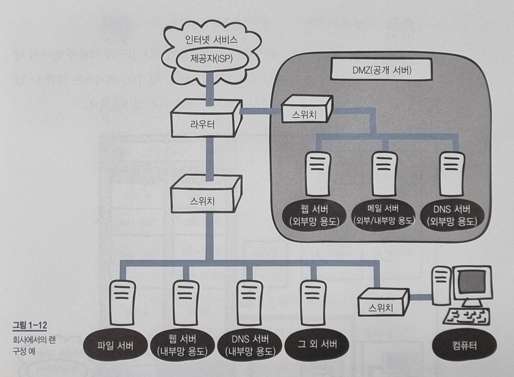

미즈구치 카츠야, 『모두의 네트워크』, 이승룡 역, 길벗(2022), 1장

# Ch1. 네트워크 첫걸음 <!-- omit in toc -->

- [1.1. 네트워크의 구조](#11-네트워크의-구조)
  - [1.1.1. 컴퓨터 네트워크](#111-컴퓨터-네트워크)
  - [1.1.2. 패킷](#112-패킷)
- [1.2. 정보의 양을 나타내는 단위](#12-정보의-양을-나타내는-단위)
  - [1.2.1. 비트와 바이트](#121-비트와-바이트)
- [1.3. LAN과 WAN](#13-lan과-wan)
  - [1.3.1. LAN과 WAN의 차이](#131-lan과-wan의-차이)
- [1.4. 가정에서의 LAN 구성](#14-가정에서의-lan-구성)
  - [1.4.1. 가정에서의 네트워크 구성](#141-가정에서의-네트워크-구성)
- [1.5. 회사에서의 LAN 구성](#15-회사에서의-lan-구성)
  - [1.5.1. 소규모 회사에서의 네트워크 구성(온프레미스)](#151-소규모-회사에서의-네트워크-구성온프레미스)

네트워크를 배우기 앞서 기초지식을 학습한다.

## 1.1. 네트워크의 구조

### 1.1.1. 컴퓨터 네트워크

> 분산되어 있는 컴퓨터를 통신망으로 연결하여 자원을 공유할 수 있게한 것.  
> 컴퓨터 간 실제 연결은 광케이블과 같은 유선 혹은 와이파이와 같은 무선 매체를 통해 이뤄진다.

인터넷은 TCP/IP 프로토콜를 기반으로 전 세계적으로 연결되어있는 컴퓨터 네트워크 통신망을 말한다.

### 1.1.2. 패킷

> 네트워크를 통해 전송되는 형식화된 작은 데이터 조각

큰 데이터를 그대로 네트워크를 통해 송 수신 경우, 네트워크의 대역폭[^1]을 많이 점유해서 다른 데이터의 흐름을 막을 수 있다. 따라서 데이터를 작은 크기의 패킷으로 분할하여 전송한다.
데이터를 분할하여 보내는 만큼, 수신측 컴퓨터에서 패킷을 다시 정렬할 수 있도록 패킷에는 제어정보를 담긴다.
[^1]: 단위 시간당 전송할 수 있는 데이터 전송량. bps(bits per second) 단위를 사용한다.

## 1.2. 정보의 양을 나타내는 단위

정보의 양에 대한 수학적 정의는 다음과 같다.

- I = log2(1/P)

  - I: 정보량 (단위 bit)
  - P: 사건이 일어날 확률

수학적 정의에 따르면 사건이 일어날 확률이 낮을수록 이를 표현하기 위한 정보의 양은 많아진다. 동전 뒤집기를 예시로 들면 다음과 같다.
동전이 앞면인지 뒷면인지는 (P = 1/2)의 확률을 가진다. 따라서 I = log2(2) = 1 bit 의 정보량으로 동전 뒤집기의 결과를 표현할 수 있다.

### 1.2.1. 비트와 바이트

> **비트(bit).** 0과 1의 정보를 나타내는 최소단위

> **바이트(byte).** 1byte = 8bit

n비트(bit)로는 2^n개의 가짓 수를 표현할 수 있다.

## 1.3. LAN과 WAN

### 1.3.1. LAN과 WAN의 차이

> **LAN(Local Area Network)**

근거리 통신망으로 하나의 네트워크를 이룬다.
통상적인 인터넷 구조에서는, 한 개의 공유기의 내부측에서 형성된 네트워크를 말한다.

WAN(Wide Area Network)

광역 통신망으로 LAN과 LAN을 연결한 네트워크이다.
거대한 통신 인프라를 필요로 하기 때문에, 보편적으로 ISP(Internet Service Producer)가 서비스를 지원한다.

## 1.4. 가정에서의 LAN 구성

### 1.4.1. 가정에서의 네트워크 구성

[프로그, "공유기는 어떻게 IP를 할당할까 - 인터넷 공유기 원리", 2020.04.19](https://m.blog.naver.com/kim04099/221917309214)
위 포스팅을 참고하여 작성하였습니다.

- **WAN 측**
  - 공인 IP 주소: 인터넷 서비스 제공자(ISP)가 IP관리 기관(IANA)로부터 받은 공인 IP를 공유기마다 할당
  - 인터넷 회선: 광 케이블 등의 회선으로 인터넷 서비스 제공자(ISP)가 가진 인터넷 인프라에 연결
- **LAN 측**
  - 사설 IP 주소: 공유기와 같은 네트워크 장비에 개별적으로 할당되어 해당 네트워크 장비에 연결된 로컬 네트워크 상에서만 통용되는 IP주소
  - 이더넷 케이블(랜선): LAN을 구축하기 위해 사용되는 케이블
- **NAT(Network Address Translation)**
  - 여러개의 사설 IP주소를 하나의 공인 IP주소에 매핑하는 기능
    - 장점: 제한된 IP주소(IPv4)를 효율적으로 사용할 수 있고, 외부에 드러나는 IP주소를 다르게 유지함으로써 보안기능을 가진다.
    - 단점: 패킷의 IP주소와 IP 주소를 바탕으로 생성된 정보를 재기록해야하기 때문에 지연이 발생한다.
- **PAT(Port Address Translation)**
  - 하나의 공인 IP주소로 여러개의 사설 IP주소로 분배해주기 위한 기능
  - 출발지와 목적지의 IP주소와 포트번호를 분석하여, 해당 통신을 식별할 수 있는 0~65535범위의 번호를 부여한다.

## 1.5. 회사에서의 LAN 구성

서버 운영 종류

- **온프레미스(On-Premise)**
  - 회사 자체적으로 서버를 운영
- **클라우드(Cloud)**
  - 외부의 서버 인프라를 이용

### 1.5.1. 소규모 회사에서의 네트워크 구성(온프레미스)

- **DMZ(Demilitarized Zone)**
  - 내부 네트워크와 외부 네트워크에서 모두 접근 가능하지만, DMZ 네크워크에서는 오로직 외부 네트워크로만 접근 가능
  - 회사 내부 네트워크의 보안을 유지하면서, DNS 서버, 메일 서버, 웹 서버와 같이 외부에 공개 서비스를 지원
