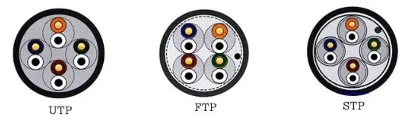

미즈구치 카츠야, 『모두의 네트워크』, 이승룡 역, 길벗(2022), 3장

# Ch3. 물리 계층: 데이터를 전기 신호로 변환하기 <!-- omit in toc -->

- [3.1. 물리 계층의 역할과 랜 카드](#31-물리-계층의-역할과-랜-카드)
  - [3.1.1. 전기 신호와 광신호](#311-전기-신호와-광신호)
  - [3.1.2. 랜 카드](#312-랜-카드)
- [3.2. 케이블의 종류와 구조](#32-케이블의-종류와-구조)
  - [3.2.1. 트위스트 페어 케이블](#321-트위스트-페어-케이블)
  - [3.2.2. 다이렉트 케이블과 크로스 케이블](#322-다이렉트-케이블과-크로스-케이블)
- [3.3. 리피터와 허브](#33-리피터와-허브)
  - [3.3.1. 리피터](#331-리피터)
  - [3.3.2. 허브](#332-허브)

OSI 1계층인 물리 계층에 대해서 학습한다.

## 3.1. 물리 계층의 역할과 랜 카드

> 물리계층은 컴퓨터와 네트워크 장비를 연결하고, 컴퓨터와 네트워크 간에 전송되는 데이터를 전기 신호로 변환하는 계층이다.

### 3.1.1. 전기 신호와 광신호

컴퓨터의 비트열 데이터는 디지털 전기 신호로 변환되어 랜선을 통해 전달된다. 또 전기 신호는 광 신호로 변환되어 광 섬유를 통해 전돨될 수 있다.

### 3.1.2. 랜 카드

> 랜카드는 컴퓨터에서 네트워크에 접속하기 위한 장치이다. 주로 컴퓨터의 마더보드에 설치되어 있으며, 이더넷 케이블(랜선) 등의 물리적인 연결을 통해 네트워크와 통신할 수 있다.

랜카드는 컴퓨터의 비트열 데이터를 전기 신호로 변환하고, 반대로 전기 신호를 비트열 데이터로 변환하는 기능을 가진다.

DAC(Digital-to-Analog Converter, 디지털 아날로그 변환기)는 0과 1로 이루어진 디지털 신호를 아날로그 신호로 변환하여 전송하고, ADC(Analog-to-Digital Converter, 아날로그-디지털 변환기)는 전기 신호를 디지털 신호로 변환한다.

## 3.2. 케이블의 종류와 구조

데이터가 흐르는 물리적인 선로인 전송매체는 유선과 무선으로 나뉘며, 유선에는 트위스트 페어 케이블(랜선)과 광케이블 등이 있고, 무선에는 라디오파, 마이크로파, 적외선 등이 있다.

### 3.2.1. 트위스트 페어 케이블

> 트위스트 페어 케이블은 **랜선**이라고도 불리며, 이름처럼 여덟 개의 선을 두 개씩 꼬아서 만든다. 전선을 꼬을 경우 전류 흐름 시 생성되는 자기장이 상쇄되어 노이즈 감소 효과를 가져온다.

트웨스트 페어 케이블은 UTP(Unshielded Twist Pair), FTP(Foil screened Twisted Pair), STP(Shielded Twist Pair)로 분류된다.

- **UTP**  
  차폐 기능이 없는 기본적인 랜선을 뜻하며, 이론상 최대 전송 전송 거리가 100m이다.

- **FTP**  
  피복 안쪽을 호일로 한 번 감싸고 그 호일 안쪽에 구리접지선을 추가한 형태이다. 이론상 최대 전송 거리가 150m이다.

- **STP**  
  FTP에 꼬여있는 구리선을 한 묶음으로 나누어 한 번 더 호일을 감싸 준 형태이다. 이론상 최대 전송 거리가 200m이다.

### 3.2.2. 다이렉트 케이블과 크로스 케이블

- **다이렉트 케이블**  
  다이렉트 케이블은 구리 선 8개를 같은 순서로 커넥터에 연결한 케이블이다. 컴퓨터와 스위치 등을 연결할 때 사용한다.

- **크로스 케이블**  
  크로스 케이블은 한쪽 커넥터의 1번과 2번에 연결되는 구리 선을 다른 쪽 커넥터의 3번과 6번에 연걸한 케이블이다. 컴퓨터와 스위치 등 연결 시, 그리고 컴퓨터 간 직접 연결 시에 사용한다.

위와 같이 두가지의 케이블이 존재하는 이유은 데이터의 송수신이 동시에 일어날 때, 데이터 충돌을 방지하기 위해서이다. 스위치나 허브 내에서도 연결된 케이블에 따라서, 케이블 순서를 한 번 떠 꼬을지 말지를 결정한다. 이에 이용되는 기술이 **auto MDIX**이다.

**auto MDIX**는 다이렉트 케이블과 크로스 케이블을 자동으로 판단하는 기능이다. 해당 기능을 가진 인터페이스(MDI-X)에는 다이렉트 케이블과 크로스 케이블의 차이를 고려하지 않아도 된다.

## 3.3. 리피터와 허브

### 3.3.1. 리피터

> 일그러진 전기신호를 복원하고 증폭하는 기능을 가진 네트워크 중계 장비이다. 다른 장비들이 해당 기능을 지원하게 되면서, 최근에는 잘 쓰이지 않는 장비이다.

### 3.3.2. 허브

> 여러 대의 컴퓨터를 포트로 연결시켜 데이터를 중개하며, 전기 신호를 정형하고 증폭하는 기능을 가진다.

허브는 **더미 허브(dummy hub)** 라고도 불린다. 특정 포트로 부터 데이터를 전달 받았을 경우, 해당 포트를 제외한 나머지 모든 포트로 데이터를 전송하기 때문이다. 이러한 불필요한 데이터 전송을 막고자 **스위치** 장비가 대안으로 쓰인다.
