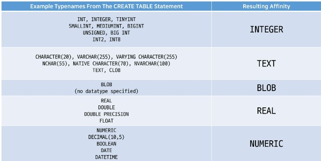

## 1. DataBase
**organized collection of data**
### 1-1. RDB
* RDB(Relational Database)
    * Managing data by dividing it into multiple tables
    * A table can reference another table with its' primary key
* RDBNS(Relational Database Management System)
    * Program for managing RDB
    * Ex. SQLite, MySQL, Oracle, ... 
### 1-2. Structure
* Schema
    * the outline of a table
    
* Table
    * data organized by field and record
    
    1) Field (column)
        * an attribute of data
    2) Record (row)
        * an record of data
    3) Prmiary Key
        * the unique field that can identify a record from the others
---
## 2. SQL
### 2-1. SQL
* SQL(Structured Query Language)
    * the programming language for managing dabtabase in RDBNS
### 2-2. Types of SQL Commands
|Type|Concept|SQL keywords|
|---|---|---|
|DDL<br>(Data Definition Language)|CUD of a table|CREATE<br>DROP<br>ALTER|
|DML<br>(Data Manipulation Language)|CRUD of records|INSERT<br>SELECT<br>UPDAE<br>DELETE|
|DCL<br>(Data Control Language)|security, restriction, authorization|GRANT<br>REVOKE<br>COMMIT<br>ROLLBACK|
### 2-3. SQL Syntax
* Statement
    * the complete code that can be excuted
    * ended with ';'
* Clause
    * Subunit of statement
* Example
 `SELECT column_name FROM table_name;`
    * One SELECT statement
    * Two clauses
        1) SELECT column_name
        2) FROM table_name
---

## 3. DDL (about TABLE)
### 3-1. CREATE TABLE
```sql
CREATE TABLE table_name (
    column_1 data_type constraints,
    column_2 data_type constraints,
    column_3 data_type constraints
);
```
* **Data Types**
    1. NULL
    2. INTEGER
    3. REAL
        * float
    4. TEXT
    5. BLOB
        * Binary Large Object
        * for img data, sound data, ...
* SQLite Datatype
    * **Dynamic Type System**
        * the datatype is determined by the saved value, when the datatype is not announced
        * For example, about the same column, if 1 is put, it becomes an integer, and if '1'is put, it becomes a string
        * ==But for **compatibility** with other programs, you should announce the datatype and follow it==
    * **Static, rigid Typing**
        * When the datatype is announce, type casting occurs automatically
        * For example, when you put '123' in INTEGER column, it's typecasted into 123
    * **Type Affinity**
        * Dividing various data types into 5 datatypes that SQLite supports
        * for **compatibility** with other RDBMS
        

* **Constraints**
    1. NOT NULL
        * NULL is not allowed
    2. UNIQUE
        * It should be unique value from othe records
    3. PRIMARY KEY
        * A column for identifying the record
        * Availabe for only INTEGER type
        * The PK column already exists as 'rowid', so the announce PK column becomes alias of orginal PKK column
    4. AUTOINCREMENT
        * not using deleted record's data again
### 3-1. ALTER TABLE
```sql
ALTER TABLE table_name RENAME TO new_table_name;
ALTER TABLE table_name RENAME COLUMN column_name TO new_column_name;
ALTER TABLE table_name ADD COLUMN column_name data_type constraints DEFAULT defalut_value;
ALTER TABLE table_name DROP COLUMN column_name;
    -- Dropping column is impossible when,
        -- Foreign Key
        -- Primary Key
        -- UNIQUE
```
### 3-2. DROP TABLE
```sql
DROP TABLE table_name
```
---
## 4. DML (about record)
* How to bring CSV file into SQLite table
    0. make mydb.sqlite3
    1. make DML.sql and register mydb.sqlite3
    2. CREATE TABLE
    3. `sqlite3 mydb.sqlite3`
    4. `.mode csv`
    5. `.import file_name.csv table_name`
### 4-1. SELECT (read records)
* SELECT
    ```sql
    SELECT * FROM table_name;
    SELECT rowid, column1, column2 FROM table_name;
    SELECT DISTINCT column1, column2 FROM table_name;
        --- after eliminating duplicated data
        --- {colun1, column2} is one element of the set
    ```
* ORDER BY
    ```sql
    SELECT column_list FROM table_name ORDER BY column1 ASC, column2 DESC;
        --- order data by column1 first
        --- and then order by column2, if the data of column1 is the same
        --- NULL is treated as the smallest value
    ```
* WHERE
    ```sql
    SELECT column_list FROM tbale_name WHERE search_condition;

    ---search_condition
    WHERE column1 = 10
    WHERE column1 > 10 AND column2 <= 200
    WHERE column2 LIKE 'Ko%'
    WHERE column3 IN (1, 2)
    WHERE column4 BETWEEN 10 AND 20
    ```
    * Comparision Operators
        * =, !=
        * \>, <, >=, <=
    * Logical Operators
        * AND, OR, NOT
    * LIKE operator
        * Not case-sensitive
        * %: 0 or more arbitrary characters
        * _: one arbirary characger
    * IN operator
        * whether the value in the list
        ```sql
        WHERE column3 IN (1, 2)
        WHERE column3 = 1 OR column3 = 2
        ```
    * BETWEEN operator
        * whether the value in the range
        ```sql
        WHERE column4 BETWEEN 10 AND 20
        WHERE column4 >= 10 AND column4 <= 20
    ```

* LIMIT
    ```sql
    SELECT column_list FROM tbale_name LIMIT row_count;
    SELECT column_list FROM tbale_name LIMIT row_count OFFSET offset_count;
    SELECT column_list FROM table_name ORDER BY column1 ASC LIMIT row_count;
    ```
    * OFFSET keyword
        ```sql
        LIMIT 10 OFFSET 10
            --- 11 ~ 20
        ```
* GROUP BY
    ```sql
    SELECT aggregate_function(column1) FROM table_name WHERE search_condition;
    SELECT column1 FROM table_name GROUP BY column2;
        -- usually column1 group by column1
    SELECT column1, aggregate_function(column2) FROM table_name GROUP BY column3;
    ```
    * Aggregate function
        * the datatype of the column should be INTEGER except COUNT()
        * AVG()
        * COUNT()
        * MAX()
        * MIN()
        * SUM()
* order of the queries
```sql
SELECT ___ FROM ___ WHERE ___ GROUP BY ___ ORDER BY ___ LIMIT ___
```
### 4-2. INSERT (create record)
```sql
INSERT INTO table_name (column_list) VALUES (value_list);
INSERT INTO table_name VALUES (value_list);
    --- when column_list is omitted, you should put all the values in order
INSERT INTO table_name VALUES 
    (value_list1),
    (value_list2),
    (value_list3),
    (value_list4);
```
### 4-3. UPDATE (update record)
```sql
UPDATE table_name
    SET column1 = value1, column2 = vlaue2
    WHERE search_conditon;
```
### 4-4. DELETE (delete record)
```sql
DELETE FROM table_name
    WHERE search_conditon;
    --- when the WHERE caluse is omitted, all the data is deleted
```