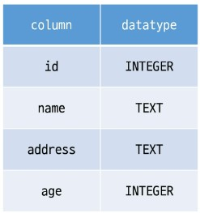
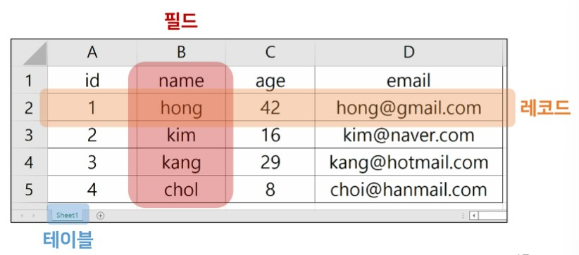
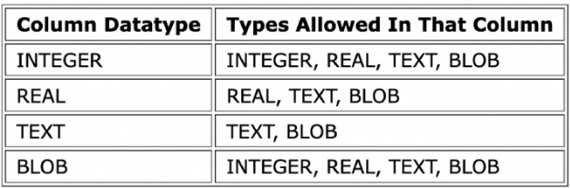
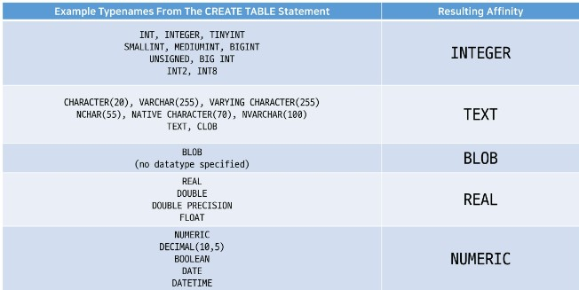

# SQLite3 SQL

## Index

- [1. Database](#1-database)
  - [1.1. RDB](#11-rdb)
  - [1.2. Structure](#12-structure)
- [2. SQL](#2-sql)
  - [2.1. SQL](#21-sql)
  - [2.2. Types of SQL Commands](#22-types-of-sql-commands)
  - [2.3. SQL Syntax](#23-sql-syntax)
  - [2.4. Import .csv to Table](#24-import-csv-to-table)
- [3. DDL](#3-ddl)
  - [3.1. CREATE TABLE](#31-create-table)
    - [3.1.1. Datatypes In sqlite3](#311-datatypes-in-sqlite3)
  - [3.2. ALTER TABLE](#32-alter-table)
  - [3.3. DROP TABLE](#33-drop-table)
- [4. DML](#4-dml)
  - [4.1. SELECT](#41-select)
  - [4.2. INSERT](#42-insert)
  - [4.3. UPDATE](#43-update)
  - [4.4. DELETE](#44-delete)

---

# 1. Database

**organized collection of data**

## 1.1. RDB

- **RDB(Relational Database)**
  - Managing data by dividing it into multiple tables
  - A table can reference another table with its' primary key
- **RDBMS(Relational Database Management System)**
  - Program for managing RDB
  - Ex. SQLite, MySQL, Oracle, ...

## 1.2. Structure

- **Schema**
  - The outline of a table  
    
- **Table**
  - The collection of data based on schema  
    
    - Field (column)
      - Attributes of data
    - Record (row)
      - Records of data
    - Prmiary Key
      - The unique field that can identify a record from the others

---

# 2. SQL

## 2.1. SQL

**Structured Query Language, the programming language for managing dabtabase in RDBMS**

## 2.2. Types of SQL Commands

|                Type                 | Concept                              | SQL keywords                          |
| :---------------------------------: | ------------------------------------ | ------------------------------------- |
|  DDL<br>(Data Definition Language)  | CUD of a table                       | CREATE<br>DROP<br>ALTER               |
| DML<br>(Data Manipulation Language) | CRUD of records                      | INSERT<br>SELECT<br>UPDAE<br>DELETE   |
|   DCL<br>(Data Control Language)    | security, restriction, authorization | GRANT<br>REVOKE<br>COMMIT<br>ROLLBACK |

## 2.3. SQL Syntax

- **Statement**
  - A complete code that can be excuted
  - Ends with ';'
- **Clause**
  - Subunit of statement

* `SELECT column_name FROM table_name;`
  - One SELECT statement
  - Two clauses
    - `SELECT column_name`
    - `FROM table_name`

## 2.4. Import .csv to Table

1. Create a table
2. `sqlite3 mydb.sqlite3`
3. `.mode csv`
4. `.import file_name table_name`

---

# 3. DDL

Data definition language deals with **table**

## 3.1. CREATE TABLE

```sql
CREATE TABLE table_name (
    column_1 data_type constraints,
    column_2 data_type constraints,
    column_3 data_type constraints
);
```

- **Data Types**
  - [SQL 데이터 타입](https://www.w3schools.com/sql/sql_datatypes.asp)

* **Constraints**

  - NOT NULL
    - NULL is not allowed
  - UNIQUE
    - Should be unique from other records' values.
  - PRIMARY KEY
    - Column identifying the record
    - Availabe for only INTEGER type columns
    - Even if the pk column is not designated, the pk column exists under the name 'rowid'.
  - AUTOINCREMENT
    - By default, the starting value for AUTOINCREMENT column is 1, and it will increment by 1 for each new record.

### 3.1.1. Datatypes In sqlite3

- **Data Type**

  - NULL
  - INTEGER
  - REAL
    - float
  - TEXT
  - BLOB
    - Binary Large Object

- **Dynamic Type System**
  - Even if you do not specify the data type for the column, the data type is determined according to the data saved
  - Therefore, about the same column, if 1 is put, it becomes an integer, and if '1'is put, it becomes a string
  - <mark>But for **compatibility** with other RDBMS</mark>, It's strongly recommend to announce the datatype.
- **Static, Rigid Typing**
  - IF the datatype is announce, type casting occurs automatically.
  - For example, when you put '123' in INTEGER column, it's typecasted into 123  
    
- **Type Affinity**
  - sqlite3 automatically recognizes various types of data as its own five data types.  
    

## 3.2. ALTER TABLE

```sql
ALTER TABLE table_name RENAME TO new_table_name;
ALTER TABLE table_name RENAME COLUMN column_name TO new_column_name;
ALTER TABLE table_name ADD COLUMN column_name data_type constraints DEFAULT defalut_value;
ALTER TABLE table_name DROP COLUMN column_name;
-- Dropping column is impossible when,
    -- Foreign Key
    -- Primary Key
    -- UNIQUE
```

## 3.3. DROP TABLE

```sql
DROP TABLE table_name
```

---

# 4. DML

Data manipulation language deals with **records**

## 4.1. SELECT

- SELECT
  ```sql
  SELECT * FROM table_name;
  SELECT rowid, column1, column2 FROM table_name;
  SELECT DISTINCT column1, column2 FROM table_name;
      --- after eliminating duplicated data
      --- {colun1, column2} is one element of the set
  ```
- ORDER BY
  ```sql
  SELECT column_list FROM table_name ORDER BY column1 ASC, column2 DESC;
      --- order data by column1 first
      --- and then order by column2, if the data of column1 is the same
      --- NULL is treated as the smallest value
  ```
- WHERE

  ```sql
  SELECT column_list FROM tbale_name WHERE search_condition;

  ---search_condition
  WHERE column1 = 10
  WHERE column1 > 10 AND column2 <= 200
  WHERE column2 LIKE 'Ko%'
  WHERE column3 IN (1, 2)
  WHERE column4 BETWEEN 10 AND 20
  ```

  - Comparision Operators
    - =, !=
    - \>, <, >=, <=
  - Logical Operators
    - AND, OR, NOT
  - LIKE operator
    - Not case-sensitive
    - %: 0 or more arbitrary characters
    - \_: one arbitrary characger
  - IN operator
    - whether the value is in the list
    ```sql
    WHERE column3 IN (1, 2)
    WHERE column3 = 1 OR column3 = 2
    ```
  - BETWEEN operator
    - whether the value is in the range
    ```sql
    WHERE column4 BETWEEN 10 AND 20
    WHERE column4 >= 10 AND column4 <= 20
    ```

- LIMIT
  ```sql
  SELECT column_list FROM tbale_name LIMIT row_count;
  SELECT column_list FROM tbale_name LIMIT row_count OFFSET offset_count;
  SELECT column_list FROM table_name ORDER BY column1 ASC LIMIT row_count;
  ```
  - OFFSET keyword
    ```sql
    LIMIT 10 OFFSET 10
        --- 11 ~ 20
    ```
- GROUP BY

  ```sql
  SELECT aggregate_function(column1) FROM table_name WHERE search_condition;
  SELECT column1 FROM table_name GROUP BY column2;
      -- usually column1 group by column1
  SELECT column1, aggregate_function(column2) FROM table_name GROUP BY column3;
  ```

  - Aggregate function  
    Datatype should be INTEGER except COUNT()
    - AVG()
    - COUNT()
    - MAX()
    - MIN()
    - SUM()

- Order of Queries

  ```sql
  SELECT ___ FROM ___ WHERE ___ GROUP BY ___ ORDER BY ___ LIMIT ___
  ```

## 4.2. INSERT

```sql
INSERT INTO table_name (column_list) VALUES (value_list);
INSERT INTO table_name VALUES (value_list);
    --- when column_list is omitted, you should put all the values in order
INSERT INTO table_name VALUES
    (value_list1),
    (value_list2),
    (value_list3),
    (value_list4);
```

## 4.3. UPDATE

```sql
UPDATE table_name
    SET column1 = value1, column2 = vlaue2
    WHERE search_conditon;
```

## 4.4. DELETE

```sql
DELETE FROM table_name
    WHERE search_conditon;
    --- when the WHERE caluse is omitted, all the data is deleted
```
