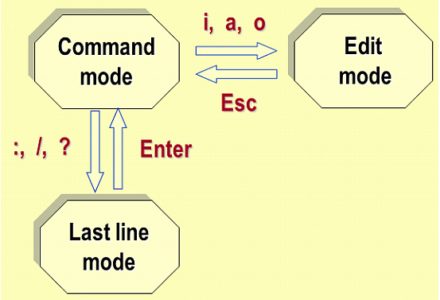
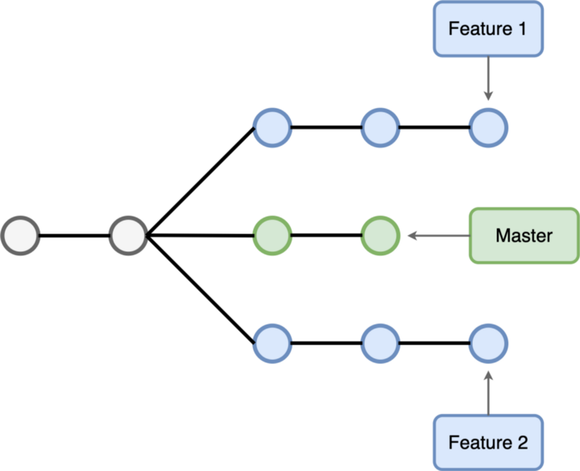
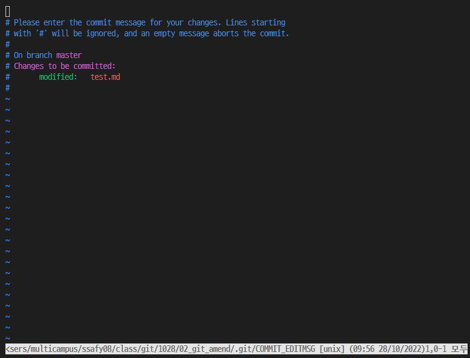
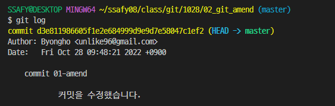
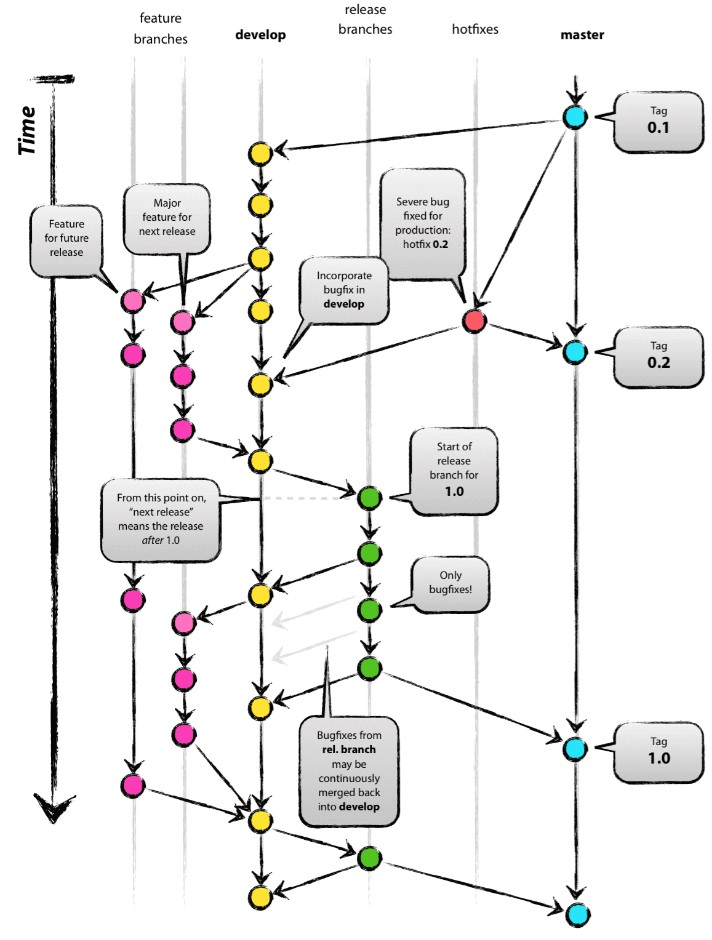
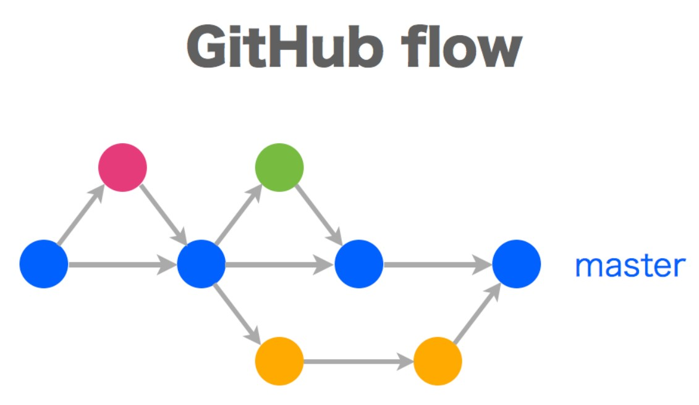

# Git

## 목차

- [1. 용어 정리](#1-용어-정리)
  - [1.1. Git](#11-git)
  - [1.2. Git Web Service](#12-git-web-service)
  - [1.3. Repository](#13-repository)
- [2. Git 기초 사용법](#2-git-기초-사용법)
  - [2.1. Git 명령어](#21-git-명령어)
  - [2.2. Git Commit Message](#22-git-commit-message)
    - [2.2.1. Commit Message Rule](#221-commit-message-rule)
    - [2.2.2. Commit Message with VI Editor](#222-commit-message-with-vi-editor)
  - [2.3. .gitignore](#23-gitignore)
  - [2.4. .gitkeep](#24-gitkeep)
- [3. Git Branch](#3-git-branch)
  - [3.1. Git Branch 명령어](#31-git-branch-명령어)
    - [3.1.1. Branch 조회](#311-branch-조회)
    - [3.1.2. Branch 생성](#312-branch-생성)
    - [3.1.3. Branch 변경](#313-branch-변경)
    - [3.1.4. Branch 삭제](#314-branch-삭제)
    - [3.1.5. Branch 병합](#315-branch-병합)
- [4. Git Undoing](#4-git-undoing)
  - [4.1. Working Directory](#41-working-directory)
  - [4.2. Staging Area](#42-staging-area)
    - [4.3. Repository](#43-repository)
- [5. Git Reset & Revert](#5-git-reset-revert)
  - [5.1. Git Reset](#51-git-reset)
  - [5.2. Git Revert](#52-git-revert)
- [6. Remote Repository (GitHub)](#6-remote-repository-github)
  - [6.1. Github merge](#61-github-merge)
  - [6.2. Open Source (Contribute)](#62-open-source-contribute)
- [7. Work Flow](#7-work-flow)
  - [7.1. Git Flow](#71-git-flow)
  - [7.2. Github Flow](#72-github-flow)
- [8. CRLF](#8-crlf)

---

# 1. 용어 정리

## 1.1. Git

**컴퓨터 파일의 변경 사항을 추적하고, 여러 명의 사용자 간의 파일 작업을 조율하기 위한 분산버전 관리 시스템.**

시스템 자체는 클라이언트-서버 시스템과 달리, 중앙 서버에 독립적으로 동작한다. 즉, 사용자 개인의 작업환경(폴더)에서 <mark>파일의 변화를 추적</mark>하는 저장소를 생성할 수 있다. commit이 이루어질 때 변경된 파일 자체가 아닌 변경된 사항만을 저장함으로써 가볍고 빠르게 버전을 관리할 수 있다.

## 1.2. Git Web Service

**git 저장소를 클라이언트-서버 모델로 지원하는 웹 서비스.**

다른 사람과의 코드 공유를 위해, git 시스템을 클라이언트-서버 구조로 네트워크와 결합한 서비스이다. 대표적으로 GitHub, GitLab, BitBucket 등이 있다.

- **GitHub**  
  MS에서 제공하는 오픈 Git 서비스로써, 전세계의 많은 개발자들이 코드공유를 위해 활발하게 사용하고 있으며
- **GitLab**  
  레포지토리의 접근 권한을 개인이 제어할 수 있어 기업에서 많이 쓰인다.

## 1.3. Repository

**git으로 버전 관리가 되는 폴더**

**local repository**란, 사용자 개인의 컴퓨터에 존재하는 repository를 말하고, **remote repository**란, git servcie 서버에 존재하는 respository를 말한다. (이 둘은 많은 경우, 서로 연동된다.)

local repository는 다음 3가지의 작업영역으로 동작한다.

- **Working Directory**
  - **사용자가 작업하는 실제 폴더**
  - 한 번도 `add`되지 않은 파일은 'Untracked'로 분류되고, 마지막 커밋으로부터 변경사항이 생긴 파일은 'Modified'로 분류된다.
- **Staging Area**
  - **<mark>한 개의 커밋</mark>으로 남길 변경사항들을 모은 영역**
  - `add`명령어로 working directory의 변경사항을 staging area에 올릴 수 있다.
  - 변경사항들이 staging area에 올라가는 것을 'staged'되었다고 표현한다.
- **Repository**
  - **.git 폴더. 커밋(버전)들이 저장되는 곳**
  - `commit`명령어로 staging area에 있는 모든 변경사항을 하나의 커밋으로 repository에 남길 수 있다.

---

# 2. Git 기초 사용법

## 2.1. Git 명령어

| CLI 명령어                                            | 의미                                                                   |
| ----------------------------------------------------- | ---------------------------------------------------------------------- |
| git init                                              | 현재 폴더에 git 시스템을 적용 == local repository를 생성함             |
| git status                                            | 레포지토리의 git 상태                                                  |
| git log                                               | 모든 커밋 내역을 출력                                                  |
| git log --oneline                                     | 모든 커밋 내역을 간단하게 출력                                         |
| git log --oneline --graph                             | 모든 커밋 내역을 간단하게 그래프 형태로 출력                           |
| git diff \<log A id> \<log B id>                      | 커밋 A -> 커밋 B의 차이점 출력                                         |
| git add \<file>                                       | 특정 파일의 변경사항을 add                                             |
| git add .                                             | 모든 파일의 변경사항을 add                                             |
| git commit -m "\{commit messagge}"                    | 간단한 메시지와 함께 현재 staged 상태를 커밋                           |
| git push origin \<local branch name>                  | remote repo에 local 브랜치와 동일한 브랜치를 생성 및 push              |
| git clone <remote repo address>                       | remote repo를 local repo로 복사                                        |
| git pull                                              | remote repo의 추가 커밋을 local repo로 복사                            |
| git remote add \<remote_repo_alias> <remote_repo_url> | 현재 로컬 repo에 연동되는 remote repo를 별칭(default: origin)으로 추가 |

## 2.2. Git Commit Message

- `git commit -m "commit_message"`  
   커밋 메시지를 간단하게 한 줄로 작성할 수 있다.

* `git commit -m`  
   <mark>vi 에디터</mark>에서 더 길고 자세한 커밋 메시지를 작성할 수 있다.

### 2.2.1. Commit Message Rule

- commit 유형 지정
  - FEAT: 새로운 기능 추가
  - FIX: 버그 수정
  - DOCS: 문서 수정
  - STYLE: 스타일 관련 수정
  - REFACOTR: 리팩토링(기능 변화 없이, 가독성 및 유지보수를 위한 수정)
  - TEST: 테스트 코드 추가
  - CHORE: 빌드 업무, 패키지 매니저 등 자잘한 수정

* 제목과 본문은 빈 행으로 분리
* 제목 행은 50자로 제한
* 제목 행의 첫 글자는 대문자로 시작
* 제목 행 끝에 마침표는 넣지 않는다
* 제목 행은 명령문으로 입력
* 본문은 72자마다 끊어서 입력
* 본문에는 어떻게 보다는 무엇과 왜를 설명

### 2.2.2. Commit Message with VI Editor



1. `git commit -m`
2. vi editor가 command mode로 열리면, `i`키를 눌러서 edit mode로 진입한다.
3. edit 모드에서 commit 메시지를 작성한다.

   ```
   <제목>
   # 빈 행으로 분리. 주석은 커밋 메시지에 포함되지 않는다.
   <본문>
   ```

4. commit 메시지를 다 작성하면 `esc`를 눌러 command mode로 돌아온다.
5. `:wq`를 입력하고 `Enter`를 눌러 커밋을 남긴다.
   - w는 저장을 의미하고, q는 에디터 종료를 의미한다.

## 2.3. .gitignore

**.gitignore에 기입된 파일들은 git이 관리하지 않는다.**

[gitignore.io](https://www.toptal.com/developers/gitignore/)에 접속하여 운영체제, 개발환경, 프로그래밍 언어 등을 입력하여 기본적인 .gitignore 파일을 작성할 수 있다.

- \<파일이름>.확장자
  - '\* 와 같은 와일드카드 사용이 가능하다
- <폴더이름>/
  - 폴더 단위로 git 반영을 무시한다.

## 2.4. .gitkeep

git은 기본적으로 폴더가 비었을 경우 해당 폴더를 관리하지 않는다. **단, .gitkeep 파일을 가진 폴더는 비어있을지라도 git이 관리한다.**

---

# 3. Git Branch

**특정 Commit을 가리키는 포인터**



**하나의 commit이 여러 개의 자식(다음)commit을 가질 수 있다.** 즉 git은 commit 내역을 트리구조처럼 쌓을 수 있다. 이는 여러 명의 개발자가 하나의 프로젝트에 대해 각기 다른 기능 개발을 가능하게 하며, 그 과정에서 메인코드를 안전하게 보호한다.

**그리고 브랜치란 뻗어 나온 가지 자체가 아닌, <mark>특정 commit을 가리키는 포인터</mark>이다.** 명령어로 포인터를 다른 commit으로 유동적으로 옮길 수 있기 때문에, 브랜치란 특정 가지에 한정되지 않는다.

**HEAD는 현재 사용자가 위치한 커밋을 가리킨다.** 보통 사용자는 브랜치를 기점으로 움직이기 때문에 HEAD는 항상 특정 브랜치에 붙어있는 것처럼 보인다. 하지만 사용자가 브랜치가 가리키지 않는 특정 커밋으로 이동하면 브랜치에서 떨어질 수도 있다.

## 3.1. Git Branch 명령어

### 3.1.1. Branch 조회

| 명령어        | 의미                           |
| ------------- | ------------------------------ |
| git branch    | local repo의 브랜치 목록 확인  |
| git branch -r | remote repo의 브랜치 목록 확인 |

### 3.1.2. Branch 생성

| 명령어                                 | 의미                                    |
| -------------------------------------- | --------------------------------------- |
| git branch \<branch_name>              | 새로운 이름의 브랜치 생성               |
| git branch \<branch_name> \<commit ID> | 특정 커밋을 기준으로 새로운 브랜치 생성 |

### 3.1.3. Branch 변경

**브랜치 변경이란, 해당 브랜치가 가리키는 커밋 상태로 working directory를 옮긴다는 의미이다.**  
<mark> 브랜치를 변경하기 전에는, 현재 폴더의 변경 사항을 먼저 커밋해야한다.</mark> 만일 특정 파일이 git으로 관리되지 않은 상태에서 `git switch`하면 브랜치를 이동했음에도 해당 파일이 작업영역에 그대로 남아있게 된다.

| 명령어                                    | 의미                                                                         |
| ----------------------------------------- | ---------------------------------------------------------------------------- |
| git switch \<branch_name>                 | 해당 브랜치로 이동                                                           |
| git switch -c \<branch_name>              | 브랜치를 새로 생성함과 동시에 해당 브랜치로 이동                             |
| git switch -c \<branch_name> \<commit ID> | 특정 커밋을 기준으로 새로운 브랜치를 새로 생성함과 동시에 해당 브랜치로 이동 |

### 3.1.4. Branch 삭제

**브랜치 삭제는 삭제하려는 브랜치가 아닌 다른 브랜치 상에서만 실행 가능하다.**

| 명령어                       | 의미                                    |
| ---------------------------- | --------------------------------------- |
| git branch -d \<branch_name> | 병합된 브랜치를 삭제                    |
| git branch -D \<branch_name> | 병합 여부와 관계없이 브랜치를 강제 삭제 |

### 3.1.5. Branch 병합

브랜치에서의 기능개발이 끝나면, 이를 메인코드를 가리키는 master 브랜치와 병합해서 개발한 기능을 실제 추가할 수 있다.

| 명령어                   | 의미                                                   |
| ------------------------ | ------------------------------------------------------ |
| git merge \<branch_name> | 현재 위치한 브랜치 포인터를, 해당 브랜치 포인터와 병합 |

**브랜치 병합은 충돌 유무에 따라 크게 2가지 방식으로 나뉜다.** 충돌이란, 병합하려는 브랜치의 커밋 히스토리가 현재 위치한 브랜치의 커밋 히스토리를 포함하지 않을 경우 발생한다.

- **fast-forward (충돌 없음)**
  현재 브랜치의 포인터를 병합하려는 브랜치 포인터 위치로 옮긴다.
- **3-way (충돌 있음)**
  개발자가 직접 개입하여 두 브랜치의 코드를 조율한 뒤, 새로운 commit을 생성해야한다.
  1. `git merge <branch_name>`
     충돌이 발생한 파일에서 직접 코드를 조율하고 저장한다.
  2. `git add` `git commit`
     조율한 코드로 새로운 커밋을 형성한다. 현재 브랜치의 포인터는 자동으로 새로운 커밋으로 이동한다.
  3. `git swtich <branch_name>`
     병합하려던 브랜치의 포인터로 이동한다.
  4. `git merge <master>`
     병합하려던 브랜치의 포인터 또한 새로 생성된(master브랜치가 가리키는) 커밋으로 이동시킨다.

---

# 4. Git Undoing

## 4.1. Working Directory

**git restore를 통해 작업영역을 되돌리면, 해당 내역을 복원할 수 없으니 주의해야한다.**  
git으로 버전관리가 되고 있는 파일만 되돌릴 수 있다.

| 명령어                      | 의미                                  |
| --------------------------- | ------------------------------------- |
| git restore \<file_name>    | 현재 위치한 commit의 상태로 파일 복원 |
| git checkout --\<file_name> | git 2.23.0 이전 version               |

## 4.2. Staging Area

| 명령어                            | 의미                    |
| --------------------------------- | ----------------------- |
| git restore --staged \<file_name> | root-commit이 있는 경우 |
| git rm --cahced \<file_name>      | root-commit이 없는 경우 |
| git reset HEAD \<file_name>       | git 2.23.0 이전 version |

### 4.3. Repository

팀 프로젝트 시, 깔끔하고 의미있는 내용만 commit으로 남기기 위해 commit 내역을 staging area로 되돌리는 경우가 종종 발생한다.

| 명령어             | 의미               |
| ------------------ | ------------------ |
| git commit --amend | 최근 commit을 수정 |

**Staging area의 상태에 따라 위 명령어는 2가지로 동작한다**

- Staging area에 새로 올라온 내용이 없으면, vi editor 창에서 직전 커밋의 메시지만 수정한다.

  - [vi editor 사용 절차](#222-commit-message-with-vi-editor)
    
    

- Staging area에 새로 올라온 내용이 있으면, 현재 staging area를 직전 커밋에 포함시킨다.

---

# 5. Git Reset & Revert

## 5.1. Git Reset

**과거의 특정 Commit 상태로 되돌아간다.**  
해당 commit부터 현재까지의 commit 내역이 모두 사라진다. 참고로 Untracked 상태의 파일들에는 적용되지 않는다.

| 명령어                           | 의미                      |
| -------------------------------- | ------------------------- |
| git reset \<option> \<commit_id> | 해당 커밋 상태로 되돌린다 |

- **Option**
  취소되는 커밋 기록들을 어떻게 남길지 선택한다.

  - **--soft**  
    파일들을 working directory와 staging area에 돌려 놓는다. (add)

  * **--mixed**  
    DEFAULT 옵션. 파일들을 working directory에 돌려 놓는다. (untracked / modified)

  * **--hard**
    <mark>파일들을 아예 삭제한다!</mark>  
    `git reflog` 명령어를 이용하면 reset하기 전의 커밋 내역을 조회할 수 있지만, 애초에 그런 일이 발생하지 않도록 주의해야 한다.

* **Commit_ID**

  - commit_id는 앞에 4개정도만 적어도 보통 식별이 가능하다.

## 5.2. Git Revert

**과거의 특정 커밋을 취소하고, 해당 커밋을 취소한다는 내용의 새로운 커밋을 생성한다.**  
단, 뒤에서부터 순차적으로 커밋을 취소하지 않는 이상, 충돌이 발생할 확률이 높기 때문에 개발자가 직접 코드를 수정해야한다.

| 명령어                                    | 의미                               |
| ----------------------------------------- | ---------------------------------- |
| git revert \<commit_A_id>                 | commit A를 취소한다                |
| git revert \<commit_A_id>..\<commit_B_id> | commit A부터 commit B까지 취소한다 |

새로운 커밋을 생성해야하기 때문에 vi 에디터 창이 뜬다. [vi editor 사용 절차](#222-commit-message-with-vi-editor)

---

# 6. Remote Repository (GitHub)

| 명령어                                                             | 의미                                                                                      |
| ------------------------------------------------------------------ | ----------------------------------------------------------------------------------------- |
| git remote add \<remote_repo_alias> \<remote_repo_url>             | 현재 로컬 repo에 연동되는 remote repo를 별칭으로 추가                                     |
| git push \<remote_repo_alias> \<branch_name>                       | remote repo에 branch를 생성 및 push                                                       |
| git push --set-upstream \<remote_repo_alias> \<remote_branch_name> | remote repo에 branch를 생성하고 push, 그리고 해당 브랜치를 기본 remote repo branch로 설정 |
| git checkout -t \<remote_branch_name>                              | remote repo에서 해당 브랜치를 동일한 이름으로 가져온다                                    |
| git checkout -b \<local_branch_name> \<remote_branch_name>         | remote repo에서 해당 브랜치를 수정한 이름으로 가져온다                                    |

## 6.1. Github merge

1. merge pull requests > new pull reqeust
2. base: master / compare: 병합하려는 브랜치

   - Able to merge, fast forward
   - Can't automatically merge, 3-way merge

3. create pull reqeust 선택 후, merge에 대한 정보 입력
4. Reviewers: 코드 리뷰어 / Assignee: 코드 작성자
   - Settings에 들어가서 review이후에 merge되도록 설정 가능
5. conversation에서 대화 형식 리뷰, files changed에서 코드에 직접 리뷰
6. Merge pull request
7. commit 내역에는 commit과 merge 두가지 내역이 동시 생성

## 6.2. Open Source (Contribute)

위와 같은 pull request 과정을 통해, 타인의 open source 코드에 기여할 수 있다. 단 당연히, 해당 repository의 관리자들의 리뷰를 거친 후, merge 여부를 결정된다.

**fork & pull model**

1. 상대 remote repo --fork--> 나의 remote repo
2. 나의 remote repo --clone--> 나의 local repo
3. 나의 local master --branch--> 나의 local branch
4. 나의 local branch --push--> 나의 remote branch
5. 나의 remote branch --merge--> 상대 remote master

---

# 7. Work Flow

**Git을 활용한 프로젝트 개발 과정에 대한 가이드라인**

## 7.1. Git Flow

git flow는 주로 기업의 대형 프로젝트에서 사용된다.


- **master**
  - 상용화된 코드가 있는 브랜치
- **develop**
  - 개발 단계의 브랜치
- **feature**
  - develop에서 세부 기능 개발을 위한 파생된 브랜치
  - 기능 개발 후 develop으로 merge
- **relaease**
  - develop에서 테스트를 위해 파생된 브랜치
  - 테스트 통과 시 master 브랜치로 merge
  - 테스트 불통과 시 develop 브랜치로 다시 merge
- **hotfix**
  - master가 브랜치에서 오류가 발생한 경우, 빠른 대처를 위해 파생된 브랜치
  - 오류 수정이 오래 걸릴 경우, master는 롤백 시키고 해당 버그를 develop브랜치에서 수정

## 7.2. Github Flow

github flow는 주로 소규모 프로젝트 개발해서 ㅍ사용된다.


- **master**
  - 메인 코드가 존재하는 브랜치
- **feature**
  - master에서 세부 기능 개발을 위한 파생된 브랜치
  - 기능 개발 후 master로 merge

---

# 8. CRLF

[OS별 crlf 설정에 관한 블로그 글](https://parkgaebung.tistory.com/70)
OS 별로 줄바꿈을 위한 이스케이프 명령어 수가 다르다.

- **Windows**: '/r'(캐리지 리턴, CR) + '/n'(줄 바꿈, LF)
- **Linux, Mac**: '/n'(줄바꿈, LF)

운영체제를 달리하며 프로젝트를 개발할 경우, 개행문자를 처리하는 방법에 대한 설정이 필요하다. 그렇지 않으면 코드 변화가 없음에도 파일들이 commit될 수 있다.

- Windows
  `git config -global core.autocrlf true`
  커밋 시 CRLF를 LF로 변환하고, 저장소에서 가져올 때는 LF를 CRLF로 변환한다.
- Linux, Mac
  `git config -global core.autocrlf true`
  커밋 시 CRLF를 LF로 변환한다.
