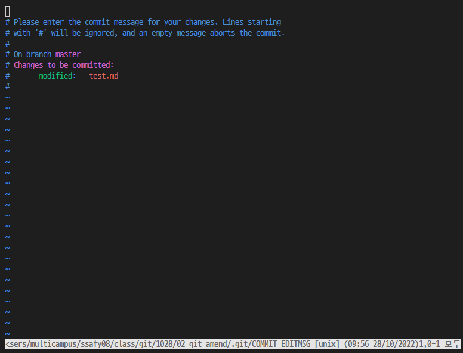
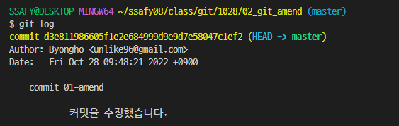

# Git

- 분산 버전 관리 프로그램
  - 분산 버전 관리 ↔ 중앙 집중식 버전 관리
- 최종 버전 + 변경사항(내용, 날짜, 인물….)
---
## Github (Gitlab, Bitbucket…)

- git기반의 저장소 서비스들
- Github은 MicroSoft의 서비스로, 전세계적 오픈 git서비스
  - **Github = Social Coding**
- Gitlab은 저장서버를 내부적으로 구축가능(보안성^)
---
## Repository

- 특정 디렉토리를 버전 관리하는 저장소 (파일이 아닌, 폴더를 기준으로 버전 관리)

  - git init 명령어로 로컬 저장소 생성할 수 있음
  - **Commit**한다 == 파일을 **특정 버전**으로 남긴다

- Commit은 Working Directory, Staging Area, Repository 3가지 영역으로 동작

  - Working Directory

     : 내가 작업하고 있는 실제 디렉토리 (del)

    - 변경사항이 생김 == modified (최초 생성 시는 untracked)

  - Staging Area

     : Commit으로 남기고 싶은 파일이 있는 곳

    - **git add** : Working directory의 파일 변경 사항을 반영
    - 변경사항을 올림 == staged
    - 

  - Repository

     : Commit들이 저장되는 곳 (.git)

    - git commit

       : 현재의 staged상태를 기록

      - 변경사항을 저장 == commited

  **명령어**

  - **git status** : git의 현재상태를 알려줌
  - **git add <file>**
  - **git add .** : 현재 디렉토리의 모든 변경 사항
  - **git commit -m “commit message”** : commit
  - **git log** : 변경 내역(이름, 이메일, 시간)
  - **git diff <log A ID> <log B ID>** : 두 로그의 다른 점, A → B

  - **git remote add origin {remote_repo_address}** : local repo를 remote repo에 연결

    - origin은 remote_repo의 닉네임

  - **git push origin master** : origin에 master branch를 push

  - **git push -u origin master** : 이후에는 git push만 사용해도 됨

  - **git clone {emote_repo_address}** : remote repo를 local repo로 복사
    
  - **git pull**  : 변경사항을 끌어옴
    - Local repo와 Remote repo가 다를 경우, conflict(merge)
    - 완성본 상태로 세이브 후, add > commit > push

---
##  Git commit시에 message 규칙
  * 
    ```python
    <제목>

    <디테일>
    ```
## .gitignore
  * ==이 파일에는 적혀진 파일들은 git에 올라가지 않음== (프라이빗한 정보)
    * 파일이름.확장자
    * 폴더이름/* : 폴더 단위로 무시. '*'은 빼도 됨
    * *.txt : 특정 확장자를 모두 무시.
  * gitignore.io

## .gitkeep
  * 해당 파일이 폴더 밑에 있을 경우, 빈 디렉토리도 그대로 업데이트
---

## TIL (Today I Learned) Project

- 매일 배운 내용을 마크다운 문서로 정리

##########################################################

git init: local repo를 만듬
git status: 이거쓰면 아래 내용들에 설명이 console창에 나옴
git log
git log --oneline
git log --onelinne --graph
git push: local repo를 원격 repo로 옮김
git branch: 브랜치 목록

1. Git undoing
  * working Directory
    * 수정한 파일 내용을 이전 커밋 상태로 되돌리기
    * git restore
  * Stage area
  * stage area에 반영된 파일을 workin gdirectory로 되돌리기
    * git rm --cached
    * git restore --staged
  * repository
    * 커밋을 완료한 파일을 staging area로 되돌리기
    * git commit --amend


1.1. git restore
working directory에서 수정한 파일을 수정 전으로 되돌리기
이미 버전관리가 되고 있는 파일만 되돌리기 가능 (한번이라도 add가 되어야함. add부터가 git이 추적하고 있는 것임)
==git restore를 통해 되돌리면, 해당 내용을 복원할 수 없으니 주의할 것==
* git restore {파일 이름}  // .을 넣으면 모든 파일
  * git 2.23.0버전 git checkout --{파일 이름}
  * checkout 기능이 여러가지가 있음. 새로 도입된 명령어

1.2.  
stage area에 반영된 파일을 working directory로 되돌리기
(root-commit이 없는 경우:한번도 commit을 안한 경우)
* root-commit이 없는 경우: git rm --cached
  * 수정하고 하려니까 아예 옵션에 안뜨네
* root-commit이 있는 경우: git restore --staged
  * git 2.23.0버전 git reset HEAD {파일 이름}

왜 이렇게 되돌리면서 해야하나??? git log를 클린하게 남기게 하기 위해서!!!
commit에는 의미있는 것만 남겨야한다!!!

1.3. repository에 있는 작업단계 되돌리기
commit을 완료한 파일을 stage area 되돌리기
git commit --amend
* stage area에 새로 올라온 내용이 없다면, 직전 커밋의 메시지만 수정
  * stage area가 비어있고, repo에서 내려서 수정해서 올리기
  * vim이라는 거, CLI상태의 메모장(문서 편집기).
    
    1. commit message를 수정하고 싶은거구나!라고 생각. -m 옵션없이 commit해도 동일한 화면이 나옴. 여러줄 커밋!!!!!!
      * i를 입력하는 순간 수정가능 상태가 됨 '끼워넣기'
      * esc를 누르면 i상태에서 나옴
      * 저장하고(w) 나가(q) / :wq
      
    2. vi {file name}
      * 이러면 vi로 문서 수정도 가능


* stage area에 새로 올라오 내용이 있다면, 직전 커밋을 덮어쓰기
  * stage area에 뭐가 있는데, repo에서 내려서 덮어쓰고 싶을 때
    * 그냥 내려온다기보다는, 그냥 추가하는 느낌이네 (이름바꿔서 말이야)
    * 이전 커밋을 이번 커밋으로 대체.

-- 이전 커밋 내ㅛㅇ을 수정하거나, 수정사항을 커밋에 추가하고 싶을 때 사용할수 있음.


2. GIT RESET/REVERT
reset은 아예 되돌림. revert는 뒤로가지만 삭제한 기록이 남음.(commit을 지우지 않음)
2.1. git reset
현재의 커밋 상태로 되돌림. ==해당 커밋 이후로 쌓였던 커밋들은 모두 사라짐==
* git reset [옵션] {커밋 ID}
  * 옵션: 어떻게 취소되는 커밋들의 기록들을 남겨줄까???
    * --soft : 
      * 되돌아간 커밋 이후의 파일들을 working directory와 staging area로 돌려 놓음.
    * --mixed : (DEFAULT)
      * 되돌아간 커밋 이후의 파일들을 working directory로 돌려 놓음.
    * --hard : 
      * 되돌아간 커밋 이후의 파일들을 working directory에 삭제 함.
      * untracked파일은 그대로 남아있음
      * git reflog 명령어를 이용하면 rese하기 전의 과거 커밋 내역을 조회 가능하고, 이 후 해당 커밋으로 reset도 가능!
  * ID
    * 앞에 4개 정도만 적어줘도 됨. git log로 확인 가능

2.1. git revert
과거를 없었던 일로 만드는 행위로, 이전 커밋을 취소한다는 새로운 커밋을 생성함!!!. 없애는게 아님
해당 커밋의 변경사항만을 저장하는 것임
* git revert {커밋 ID}
* git revert {커밋 ID, 커밋 ID}
  * vi창이 열림. 새로운 커밋창에 들어갈 메시지를 만들거이시 때문에!!!

conflict가 나는 이유. 하나의 파일에서는 충돌이 나기 쉬움. 따라서 가져야 하는 상태를 만들어줘야 함. 스스로
1.원하는 상태를 만들어줌!
2.gis status확인하면, reverting하고 있다고 나옴. > 새로운 commit을 수수로 남겨야 함. 아예 이름이 바뀌어 버리네


3. Git Branch/Merge
master라는 곳은 사실 브랜치임. 

Branch는 나뭇가지라는 뜻으로, 여러 갈래로 작업 공간을 나누어 독립적으로 작업할 수 있도록 도와주는 git 도구
merge를 하지 않는 이상 마스터에 영향을 주지않음
하나의 작업은 하나의 브랜치로 나누어 진행되므로 체계적인 개발이 가능

개괄. 

      [local]                     [remote]
[master]  [branch]   <->     [master]   [branch]

Brach는 커밋을 가리키는 일종의 포인터임. 따라서 용량소모가 매우 적음


                            b_branch_c  <- Brnach2
        branch_commit      branch_commit     branch_ commit <-  Branch1
commit <- master 
commit
commit


3.1. git branch
조회
* git branch
  로컬 저장소의 브랜치 목록 확인
* git branch -r
  원격 저장소의 브랜치 목록 확인

생성
* git branch {브랜치 이름}
  새로운 브랜치 형성
* git branch {브랜치 이름} {commit ID}
  특정 커밋을 기준으로 브래치 작성

삭제
다른 브랜치에 상에서 다른 브랜치를 지울 수 있음
* git branch -d {브랜치 이름}
  병합된 브랜치만 삭제가능
* git branch -D {브랜치 이름}
  강제 삭제


브랜치를 이동시키면 해당 브랜치의 모습대로 working directory가 변경됨!!!!!!!!!!!!!!!!!!!!!!!!
서로 다른 브랜치는 영향이 없음
dlehd
* git switch {브랜치 이름}
  다른 브랜치로 이동
* git switch -c {브랜치 이름}
  브랜치를 새로 생성 및 이동
* git switch -c {브랜치 이름} {커밋ID}
  특정 커밋 기준으로 브랜치 생성 및 이동
==switch하기 전에, 해당 브랜치의 변경 사항을 반드시 커밋해야함을 주의==
다른 브랜치에서 파일을 만들고 커밋하지 않은 상태에서 switch를 하면 브랜치를 이동했음에도 불구하고 해당 파일이 그대로 남아있게 됨.

merge한다는 말은 merge된 커밋을 모두 master가 가리킨다.


3.2. git merge
merge 하는 법!!!!
- fast-forward방식: master 브랜치의 포인터만 옮김
- 3way -> conflict가 날 것임: 새로운 commit을 남기면서 머지


git merge{합칠 브랜치 이름}
  * 병합하기 전에 브랜치를 합치려고하는 , 즉 메인 브랜치로 switch해야 함
  * fast-forward, 3-way 

3way 동작순서
1. 메인브렌치에서 git merge {합칠 브랜치 이름}
2. 가지로 넘어감
3. 그냥 바로 도 git merge{합칠 브랜치 이름}하면 fast-forward로 새로 생긴 commit으로 이동

merge conflict 충돌이 발생하면, 직접 해결해야한다. 으아아아아아아아
Accept Current Change | Accept incoming Change | Accept Both changes | compare changes
등은 VSCode 있지만 스지말자

##################################################

HEAd는 현재 브랜치를 가리키고, 각 브랜치는 자신의 최신 커밋을 가리키므로 HEAd가 현재 브랜치으 ㅣ최신 커밋을 가리킨다고 할 수 있음.
내가 특정 커밋으로 이동하면 브랜치에서 떨어질 수도 있음. 내가 곧 HEAD.

##################################################

Git Workflow 그림. 우형 기술블로그에서 도 찾을 수 있음
master : mainqmfoscl
develop : 개발단계의 브랜치
feature : 어던 긴응ㄹ 위해 가지치기하여 지지고 볶음. 끝나면 develop으로 머지
relaease : develop으로 부터 브랜치하여 테스트를 하는 브랜치. 버그가 있을 경우 develop으로 돌려보냄. 잘되면 master로 merge
  * 마스터에 머지가 잘 될 경우 클라이언트 업데이트

hotfix: 빨리 고쳐야 할것. master에서 버그가 난 경우.
  * 개발단계로 돌려야 할경우, master는 롤백 해놓고, 해당 버그를 develop단계로 보낸다;.

github flow: 소규모 개발
마스터브랜치로부터 기능개발마다 브랜치 형성후, 끝나면 머지

##################################################

remote repo에서 내가 git clone을 해오단는 것은 특정 브랜치만 가지고 오는 것!!


git.init으로 형성했다면, remote에 연결시킬 때
git remote add origin "..."

master에서 받아와서
master에서 branch1을 만들고, branch1에서 commit후
master로 돌아와서 push하면, 여전히 master만 있음

branch1으로 다시 넘어와서
* "git push"는 실은 "git push origin {local_branch}"
여기서 push origin branch1을 하면, remote에도 branch1dl 형성됨.

상대방이 브랜치를 만들어서 올림
pull requests > new pull reqeusts 
base:master < compare:local   : Able to merge나오면 forward fasting가능
create pull reqeust에다가 내가 추가한 기능을 입력
Reviewrs에 리뷰받을 사람을 추가 / Assignee: 코드를 만든 사람.   // Settings에 들어가서 review이후에 merge되도록 바굴 수 있음.
conversation은 리뷰. files changed는 코드에다가도 가능

Merge pull request
이것도 settings에서 조절가능
commit과 merge가 동시에 일어난다.


받으면 master 하나 있음


origin은 리모트를 의미
git pull origin ..
git push origin ..

set upstream을 하면
그냥 바로 git pull / git push를 할 수 있음.

##################################################
fork & pull model

open source: push는 아무나 못하고, PR으 거쳐서 선택된 사람들만 accept를 할 수 있음

기여가 너무 하고시퍼!!!!
상대 remote repo -copy-> 나의 remote repo
나의 remote repo -clone-> 나의 local repo
나의 local master -branch-> 나의 local branch
나의 local branch -push-> 나의 remote branch
나의 remote branch -merge-> 상대 remote master 