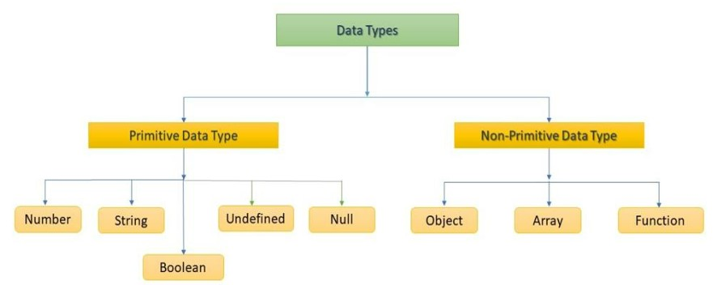

- [1. Intro](#1-intro)
  - [1.1. Reasons to Learn](#11-reasons-to-learn)
  - [1.2. The History of JavaSCript](#12-the-history-of-javascript)
  - [1.3. Excute JavaScript](#13-excute-javascript)
- [2. Basic Grammer](#2-basic-grammer)
  - [2.1. Semicolon](#21-semicolon)
  - [2.2. Indent and Code Block](#22-indent-and-code-block)
  - [2.3. Comments](#23-comments)
  - [2.4. Indentifier](#24-indentifier)
  - [2.5. Variable Declaration Keywords](#25-variable-declaration-keywords)
  - [2.6. Data Types](#26-data-types)
  - [2.7. Operators](#27-operators)
  - [2.8. Conditional Statements](#28-conditional-statements)
  - [2.9. Loop](#29-loop)
- [3. Function](#3-function)
  - [3.1. Fucntion declaration](#31-fucntion-declaration)
  - [3.2. Fucntion expression](#32-fucntion-expression)
  - [3.3. Arguments](#33-arguments)
  - [3.4. Arrow Function](#34-arrow-function)
  - [3.5. IIFE(Immediately Invoked Function Expression)](#35-iife-immediately-invoked-function-expression-)
- [4. Array](#4-array)
  - [4.1. Array](#41-array)
  - [4.2. Methods of Array (Basics)](#42-methods-of-array--basics-)
  - [4.3. Array Helper Methods (Advanced)](#43-array-helper-methods--advanced-)
- [5. Object](#5-object)
  - [5.1. Object](#51-object)
  - [5.2. ES6 Grammer about Object](#52-es6-grammer-about-object)
  - [5.3. Object and JSON](#53-object-and-json)

[MDN JavaScript Docs](https://developer.mozilla.org/ko/docs/Web/JavaScript)

## 1. Intro

### 1.1. Reasons to Learn

**The base language of the front-end web**

- the language that makes HTML documents look more dynamic
  **The language being used in various areas**
- sever programming, mobile service, block chain, etc...

### 1.2. The History of JavaSCript

- 1993, Mosaic Web Browser
  - GUI web browser
- 1994, Netscape Navigator
  - accounts for 80% of the market
- Netscape made a Script language for dynamic webpage
  - Mocha -> LiveScript -> JavaScript
- 1995, Inernet Explorer with JScript
  - JavaScript, JScript
- 1996-2000, ECMA proposed a standard of Script language
  - ECMAScript
  - MS didn't follow the standard cause its market share was high
- 2001-2004, Firefox with ActionScript3 and etc...
  - jQuery library is for transcripting the code to fit each browser engine
- 2008, Chrome with V8
  - V8 translates JavaScript fast
- 2015, ECMAScript6, the standard made with Chrome

### 1.3. Excute JavaScript

- \<script>
  ```html
  <body>
    <script>
      console.log('hello, javascript')
    </script>
  </body>
  ```
- \<script src>
  - usually it'sr written after the body tag
  ```html
  <html>
    <body>
      <script src="hello.js"></script>
    </body>
  </html>
  ```
- Web browser
  - f12 > console
- node.js
  - `node file_name.js`
  - `npm install package_name`

---

## 2. Basic Grammer

**Style Guide**
[Airbnb Style Javascript Guide](https://github.com/airbnb/javascript)

### 2.1. Semicolon

Technically, semicolons should be inserted, but ASI(Automatic Semicolon Insertion) inserts semicolons by its own.

### 2.2. Indent and Code Block

**Indent**

- Java script indents 2 spaces
  **Code Block**
- means `{}` which is used for if, for, function, and etc...

### 2.3. Comments

**One-line**

- //
  **multiple-lines**
- /\* \*/

### 2.4. Indentifier

**Indentfier**
: the variable name to distinguish variables

- starts with characters, $ or \_
- is case-sensitive (distinguishing upper and lower cases)
- starts with a lower case except Class

**Types of Notation**

- **camelCase**
  - for variables, instances, functions
- **PascalCase**
  - for Classes
- **SNAKE_CASE**
  - for constants

### 2.5. Variable Declaration Keywords

**let**

- allows re-assignment
- block scope

**const**

- block scope

**var**

- the default keyword
- allows re-declaration, re-assignment
- function scope
- wouldn't be used because of the hoisting

### 2.6. Data Types



- Non-primitive types are all Objects

**Number**
for integers and floats

- Infinity
  - a very large number
- NaN (Not a Number)
  - means that the result of the operation is incorrect
    - can't be read as a number
      - Number(undefined)
    - imaginary number
      - Math.sqrt(-1)
    - an operand is NaN
      - 7 \*\* NaN
    - can't be defined
      - 0 \* Infinity
    - containing a string for calculation which is not addition
      - 'A' \* 3

**String**
for strings

- ' and " both can be used
- two strings can be combined with '+'
- ` (template literal)
  - variable can be inserted in the string by using `${}`
    - \`My name is ${name}`
  - new lines are also allowed

**Empty Value**
There're two data types for exrpessing empty value

- **null**
  - object, **BUT IT'S PRIMITIVE DATA TYPE**
  - Develoer ==intentionally== expresses no value
- **undefined**
  - undefined
  - javascript ==automatically==
    inserts into a variable

**Boolean**

- true
- false

### 2.7. Operators

**Assignment Operator**

```javascript
let c = 0

c += 10 // 10
c -= 3 // 7
c *= 10 // 70

// not recommended
c++ // 71
c-- // 70
```

**Relational Operator**

```javascript
3 > 2 // true
3 < 2 // false

// UNICODE
'A' < 'B' // true
'Z' < 'a' // true
```

**Equality Operator**
Automatic type casting occurs, so not be used frequently

```javascript
const a = 1
const b = '1'

console.log(a == b) // true
console.log(a == true) // true
```

**Identity Operator**

```javascript
const a = 1
const b = '1'

console.log(a === b) // false
console.log(a === Number(b)) // true
```

**Logical Operator**

```javascript
true && false // false
true && true // true

false || true // true
false || false // false

!true // false
```

**Ternary Operator**

```javascript
true ? 1 : 2 // 1
false ? 1 : 2 // 2

result = Math.PI > 4 ? 'Yes' : 'No' // No
```

### 2.8. Conditional Statements

**if statement**

```javascript
const name = 'Park'

if (name == 'Kim') {
  console.log('Welcome Kim')
} else if (name == 'Lee') {
  console.log('Welcome Lee')
} else {
  console.log(`Welcome ${name}`)
}
```

**swith statement**

```javascript
const name = 'Park'

switch (name) {
  case 'Kim': {
    console.log('Welcome Kim')
    // break
  }
  case 'Park': {
    console.log('Welcome Park')
    // break
  }
  default: {
    console.log(`Welcome ${name}`)
  }
}
// Welcome Park
// Welcome Park
// the 'break' should be used appropriately
```

### 2.9. Loop

**while**

```javascript
let i = 0

while (i < 6) {
  console.log(i)
  i += 1
}
```

**for**

```javascript
// i is re-assgined, so it should be declared with 'let'
for (let i = 0; i < 6; i++) {
  console.log(i)
}
```

**for...in**

- used for Objects
- can also be used for Array, but
  dosen't guarantee to search in order

```javascript
const fruits = { a: 'appple', b: 'banana' }

for (const key in fruits) {
  console.log(key) // a, b
  console.log(fruits[key]) // apple, banana
}
```

**for...of**

- used for Array, Set, String

```javascript
const numbers = [5, 1, 4, 7]

for (const number of numbers) {
  console.log(number) // 5, 1, 4, 7
}
```

---

## 3. Function

It's the first type object which is one of reference types(non-primitive types).

### 3.1. Fucntion declaration

It's not usually used, because the hoisting occurs

```javascript
function add(num1, num2) {
  return num1 + num2
}

add(2, 7)
```

### 3.2. Fucntion expression

```javascript
const add = function (num1, num2) {
  return num1 + num2
}

add(2, 7)
```

- you can mark the name of the function, however it's not used for calling but for debugging

  ```javascript
  const add = function namedAdd(num1, num2) {
    return num1 + num2
  }

  add(2, 7)
  namedAdd(2, 7) // ReferenceError
  ```

### 3.3. Arguments

**The Number of Arguments**

```javascript
const noArgs = function () {
    return 0
}

noArgs(1, 2, 3)     // 0

const twoArgs = fucntion (arg1, arg2) {
    return [arg1, arg2]
}

twoArgs(1, 2, 4)    // [1, 2]

const threeArgs = fucntion (arg1, arg2, arg3) {
    return [arg1, arg2, arg3]
}

twoArgs(1)          // [1, undefined, undefined]
```

**Default Arguments**

```javascript
const greeting = function (name = 'Anonymous') {
  return `Hi, ${name}`
}

greeting() // Hi, Anonymous
```

**Rest Parameters**

- gets the undefined number of arguments as an array

```javascript
const restOpr = function (arg1, arg2, ...restArgs) {
  return [arg1, arg2, restArgs]
}

restArgs(1, 2, 3, 4, 5) // [1, 2, [3, 4, 5]]
restArgs(1, 2) // [1, 2, []]
```

### 3.4. Arrow Function

1. Fucntion keyword can be omitted
2. If there's only one parameter, () can be omitted
3. IF the content of the function is one-line, return and {} can be omitted

   - but if the return value is Object, {} can't be omitted or () should be added

   ```javascript
   let returnObject = () => {
     return { key: 'vluae' }
   }

   returnObject = () => ({ key: 'value' })
   ```

```javascript
const greeting = function (name) {
  return `Hi ${name}`
}

// Step 1.
const greeting = (name) => {
  return `Hi ${name}`
}

// Step 2.
const greeting = (name) => {
  return `Hi ${name}`
}

// Step 3.
const greeting = (name) => `Hi ${name}`
```

### 3.5. IIFE(Immediately Invoked Function Expression)

IIFE is excuted at the same moment when it's declared.
It can't be called again, so it's usually decalared as an anonymous function.

```javascript
;(function (num) {
  return num ** 3
})(2)(
  // 8

  (num) => num ** 3
)(2) // 8
```

---

## 4. Array

### 4.1. Array

Array contains data types in order. Each object can be reached with the index, but there isn't negative index.

```javascript
const numbers = [1, 2, 3, 4, 5]

console.log(numbers[0]) // 1
console.log(numbers[-1]) // undefined
console.log(numbers.length) // 5
console.log(nunbers[numbers.length - 1]) // 5
```

### 4.2. Methods of Array (Basics)

**reverse**

```javascript
const numbers = [1, 2, 3, 4, 5]

numbers.reverse() // [5, 4, 3, 2, 1]
```

**push, pop**

```javascript
const numbers = [1, 2, 3, 4, 5]

numbers.push(100) // [1, 2, 3, 4, 5, 100]
numbers.pop() // [1, 2, 3, 4, 5]
```

**includes**

```javascript
const numbers = [1, 2, 3, 4, 5]

result = numbers.includes(1) //  true
result = numbers.includes(100) //  false
```

**indexOf**

```javascript
const numbers = [1, 2, 3, 4, 5]

result = numbers.indexOf(3) // 2
result = numbers.indexOf(100) // -1
```

**join**

```javascript
const numbers = [1, 2, 3, 4, 5]

number.join() // 1,2,3,4,5
numbers.join('') // 12345
numbers.jojin(' ') // 1 2 3 4 5
```

### 4.3. Array Helper Methods (Advanced)

Methods below travel elements in the array, and get a function as the first parameter.
`callback(element[, index, array])`

- element: element
- index: index
- array: the array (it doesn't change during the loop)

**forEach**
travel the array inserting each element in the function

```javascript
const colors = ['R', 'G', 'B']

// 1.
printFunc = function (color) {
  console.log(color)
}
colors.forEach(printFunc)

// 2.
colors.forEach(function (color) {
  console.log(color)
})

// 3.
colors.forEach((color) => {
  return console.log(color)
})
```

**map**
travel the array inserting each element in the function, and return a list of results

```javascript
const colors = [1, 2, 3]

// 1.
const doubleFunc = function (color) {
  return number * 2
}

const doubleNumbers = numbers.map(doubleFunc)
console.log(doubleNumbers) // [2, 4, 6]

// 2.
const doubleNumbers = numbers.map(function (number) {
  return number * 2
})
console.log(doubleNumbers) // [2, 4, 6]

// 3.
const doubleNumbers = numbers.map((number) => {
  return number * 2
})
console.log(doubleNumbers) // [2, 4, 6]
```

**filter**
travel the array inserting each element in the function, and return a list of elements which result was true

```javascript
const colors = [
  { name: 'cucumber', type: 'vegetable' },
  { name: 'banana', type: 'fruit' },
  { name: 'carrot', type: 'vegetable' },
  { name: 'apple', type: 'fruit' },
]

// 1.
const fruitFilter = function (product) {
  return product.type === 'fruit'
}

const fruits = products.fitler(fruitFilter)
console.log(fruits) // [{ name: 'banana', type: 'fruit'}, { name: 'apple', type: 'fruit'}]

// 2.
const fruits = products.filter(function (product) {
  return product.type === 'fruit'
})

// 3.
const fruits = products.filter((product) => {
  return product.type === 'fruit'
})
```

**reduce**
travel the array inserting each element in the function, and return the value which the results are accumulated as.
`reduce(callback()[, initialValue])`

- If the intialValue is set, use it as the first value, else array[0] is used as the first value

```javascript
const tests = [90, 90, 80, 77]

// 1.
const sum = tests.reduce(function (total, x) {
  return total + x
}, 0) // 337

// 2.
const sum = tests.reduce((total, x) => total + x, 0)
```

**find**
return the first element which satisfies the fucntion. If there isn't at all, it returns undefined.

```javascript
const people = [
  { name: 'Tony', age: 45 },
  { name: 'Steve', age: 32 },
  { name: 'Tony', age: 40 },
]

// 1.
const people = people.find(function (person) {
  return person.name === 'Tony'
}) // { name: 'Tony', age: 45 }

// 2.
const people = people.find((person) => {
  return person.name === 'Tony'
})
```

**some**
return true if at least one of the elements satisfies the callback function

```javascript
const arr = [1, 2, 3, 4, 5]

// 1.
const result = arr.some((ele) => {
  return ele % 2 === 0
}) // true
```

**every**
return false if at least one of the elements doesn't satisfy the callback function

```javascript
const arr = [1, 2, 3, 4, 5]

// 1.
const result = arr.every((ele) => {
  return ele % 2 === 0
}) // false
```

| method   | characteristics                                |
| -------- | ---------------------------------------------- |
| for loop | approach by index<br>break,continue O          |
| for...of | approach by element<br>break,continue O        |
| forEach  | approach by element, index<br>break,continue X |

---

## 5. Object

### 5.1. Object

Object is a collection of properties expressed with pairs of key and vaule

- key
  - only string
  - ' can be omitted, if there's no space in the name
- value
  - any data type
- approaching elements
  - `object.property` or `object['property']`
  - if there's space in the property name, the former one can't be used.

```javascript
const me = {
    name: 'jack',
    phone: '01012345678',
    'samsung products': {
        buds: 'buds pro',
        galaxy: 's22',
    },
}

console.log(me.name)                        // jack
console.log(me['name'])                     // jack
console.log(me.['samsung products'])        // {buds: 'buds pro', galaxy: 's22',}
console.log(me.samsung products)            // Error
console.log(me.['samsung products'].buds)   // buds pro
```

### 5.2. ES6 Grammer about Object

**Property Initializer Shorthand**
If the name of the value varibale is the same to the name of key, it can be shortened

```javascript
const books = ['book1', 'book2']
const magazines = ['magazine1', 'magazine2']

const bookShop = {
  books,
  magazines,
}

console.log(bookShop)
// {
//     books: ['book1', 'book2']
//     magazines: ['magazine1', 'magazine2']
// }
```

**Concise Method**
the function keyword can be omitted, when the function is assgined in an Object

```javascript
const obj = {
  greeting() {
    console.log('Hi!')
  },
}

obj.greeting() // Hi!
```

**Computed Property Name**
the name of the key can be assigned dynamically

```javascript
const key = 'country'
const value = ['Korea', 'America']

const myObj = {
  [key]: value,
}

console.log(myObj) // { country: ['Korea', 'America'] }
console.log(muObj.country) //  ['Korea', 'America']
```

**Destructing Assignment**
A value of the object can be assigned to the variable which has the same name to the key

```javascript
const person = {
  name: 'Kim',
  id: 'asdf1234',
  phone: '01012345678',
}

const { name } = person
const { id } = person
const { phone } = person

const { name, id, phone } = person
```

### 5.3. Object and JSON

```javascript
const jsObject = {
  coffee: 'Americano',
  iceCream: 'Choco',
}

// Object -> JSON
const objToJson = JSON.stringify(jsObject)

console.log(objToJson) // { coffee: 'Americano', iceCream: 'Choco', }
console.log(typeof objToJson) // string

// JSON -> Object
const jsonToObj = JSON.parse(objToJson)

console.log(jsonToObj) // { coffee: 'Americano', iceCream: 'Choco', }
console.log(typeof jsonToObj) // object
```
