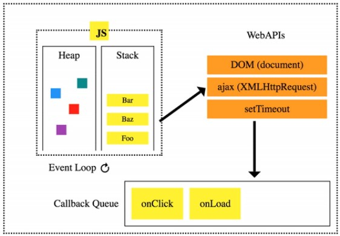

# JavaScript Asynchronous

## Index

- [1. Synchronous and Asynchronous](#1-synchronous-and-asynchronous)
  - [1.1. Asynchronous JavaScript](#11-asynchronous-javascript)
  - [1.2. JavaScript Runtime](#12-javascript-runtime)
- [2. Axios](#2-axios)
  - [2.1. The Structure of Axios](#21-the-structure-of-axios)
  - [2.2. Promise](#22-promise)
  - [2.2. Promise and Await](#22-promise-and-await)
- [3. AJAX](#3-ajax)
  - [3.1. AJAX](#31-ajax)
  - [3.2. data-\* attribute](#32-data--attribute)
  - [3.3. Example with Django](#33-example-with-django)
    - [3.3.1. Follow](#331-follow)
    - [3.3.2. Like](#332-like)

---

# 1. Synchronous and Asynchronous

**Synchronous**

- Process in order
- Wait for the response to a request.

**Asynchronous**

- Process in parallel
- Don't Wait for the response -> Better user experience

## 1.1. Asynchronous JavaScript

JavaScript is a single-thread language, but it still can handle things asynchronously.

```javascript
function slowRequest(callBack) {
  console.log('1. A long time process started')
  setTimeout(function () {
    callBack()
  }, 3000)
}

function myCallBack() {
  console.log('2. The long time process ended')
}

slowRequest(myCallBack)
console.log('3. Another short process')
// 1. A long time process started
// 3. Another short process
// 2. The long time process ended
```

## 1.2. JavaScript Runtime

The environment that helps JavaScript being asynchronous



1. All tasks are processed after entering the **Call Stack**.
2. If a long-lasting task enters the stack, it's sent to the **Web API** and processed separately.
3. Tasks that have been processed in Web API are sequentially entered into the **Task Queue**.
4. When the **Event Loop** detects that the stack is empty, it sends the oldest task in the queue to the stack.

---

# 2. Axios

**The library for asynchrnous HTTP communciation.** It can be installed with npm in node.js, and can be used with CDN in browser.

## 2.1. The Structure of Axios

```html
<script src="https://cdn.jsdelivr.net/npm/axios/dist/axios.min.js"></script>
  <script>
    axios.get('URL')
      .then(callback in case of success)
      .catch(callback in case of failure)
```

```html
<button>Cat</button></button>
  <script src="https://cdn.jsdelivr.net/npm/axios/dist/axios.min.js"></script>
  <script>
    const catImageSearchURL = 'https://api.thecatapi.com/v1/images/search'
    const btn = document.querySelector('button')

    btn.addEventListener('click', function () {
    //   axios.get(catImageSearchURL)
      axios({
        method: 'get',
        url: catImageSearchURL
      })
        .then((response) => {
          imgElem = document.createElement('img')
          imgElem.setAttribute('src', response.data[0].url)
          document.body.appendChild(imgElem)
        })
        .catch((error) => {
          console.log('Fail!')
        })
        console.log('Success!')
    })
    // Success!
    // response object

    // axios library works asynchronously
  </script>
```

## 2.2. Promise

**Promise is the object for giving order to asynchronous process. (chaining)**

- **methods**
  - `then(onFulfilled)`
    - Runs the `onFulfilled` function if the Promise is **fulfilled**
    - `onFulfilled` has one parameter, the fulfillment value.
    - Returns a promise object
  - `catch(onReject)`
    - Runs the `onReject` function if the Promise is **rejected**
    - `onReject` function has one parameter: the rejection reason.
    - Returns a promise object

```javascript
work1()
  .then((result1) => {
    // work 2
    return result2
  })
  .then((result2) => {
    // work 3
    return result3
  })
  .catch((error) => {
    // error handling
  })
```

## 2.2. Promise and Await

[Promise & Await를 활용한 4가지 비동기 함수 처리방법.md](Promise_Await.md)

---

# 3. AJAX

## 3.1. AJAX

AJAX stands for Asynchronous JavaScript And XML. In a nutshell, it is the use of the **XMLHttpRequest object to communicate with servers**. It can send and receive information in various formats, **including JSON, XML, HTML, and text files.**

## 3.2. data-\* attribute

`data-*`attribute make data can be exchanged between HTML and DOM.

```html
<div data-my-id="my-data"></div>
<script>
  const myId = event.target.dataset.myId
</script>
```

## 3.3. Example with Django

[기존 Django Template and View](../Django/08_Django_Many_to_Many.md)

csrf-token is in the hidden input tag which name is "csrfmiddlewaretoken"

### 3.3.1. Follow

```html
<div>
  팔로워 : <span id="followers-count">{{ person.followers.all|length }}</span> /
  팔로잉 : <span id="followings-count">{{ person.followings.all|length }}</span>
</div>
<div>
  <form id="follow-form" data-user-id="{{ person.pk }}">
     
    <input type="submit" value="언팔로우" />
    
    <input type="submit" value="팔로우" />
    
  </form>
  <div>
    <script src="https://cdn.jsdelivr.net/npm/axios/dist/axios.min.js"></script>
    <script>
      const form = document.querySelector('#follow-form')
      const csrftoken = document.querySelector(
        '[name=csrfmiddlewaretoken]'
      ).value

      form.addEventListener('submit', function (event) {
        event.preventDefault()

        const userId = event.target.dataset.userId

        axios({
          method: 'post',
          url: `/accounts/${userId}/follow/`,
          headers: { 'X-CSRFToken': csrftoken },
        })
          .then((response) => {
            const isFollowed = response.data.is_followed
            const followBtn = document.querySelector(
              '#follow-form > input[type=submit]'
            )
            if (isFollowed === true) {
              followBtn.value = '언팔로우'
            } else {
              followBtn.value = '팔로우'
            }

            // 팔로우, 팔로워 인원 수
            const followersCountTag = document.querySelector('#followers-count')
            const followingsCountTag =
              document.querySelector('#followings-count')
            const followersCount = response.data.followers_count
            const followingsCount = response.data.followings_count
            followersCountTag.innerText = followersCount
            followingsCountTag.innerText = followingsCount
          })
          .catch((error) => {
            console.log(error.response)
          })
      })
    </script>
  </div>
</div>
```

```python
@require_POST
def follow(request, user_pk):
    if request.user.is_authenticated:
        User = get_user_model()
        me = request.user
        you = User.objects.get(pk=user_pk)
        if me != you:
            if you.followers.filter(pk=me.pk).exists():
                you.followers.remove(me)
                is_followed = False
            else:
                you.followers.add(me)
                is_followed = True
            context = {
                'is_followed': is_followed,
                'followers_count': you.followers.count(),
                'followings_count': you.followings.count(),
            }
            return JsonResponse(context)
        return redirect('accounts:profile', you.username)
    return redirect('accounts:login')
```

### 3.3.2. Like

```html

<p>
  <b
    >작성자 :
    <a href=""
      >{{ article.user }}</a
    ></b
  >
</p>
<p>글 번호 : {{ article.pk }}</p>
<p>제목 : {{ article.title }}</p>
<p>내용 : {{ article.content }}</p>
<div>
  <form class="like-forms" data-article-id="{{ article.pk }}">
     
    <input type="submit" value="좋아요 취소" id="like-{{ article.pk }}" />
    
    <input type="submit" value="좋아요" id="like-{{ article.pk }}" />
    
  </form>
</div>
<a href="">상세 페이지</a>
<hr />


<script src="https://cdn.jsdelivr.net/npm/axios/dist/axios.min.js"></script>
<script>
  const forms = document.querySelectorAll('.like-forms')
  const csrftoken = document.querySelector(
    'input[name=csrfmiddlewaretoken]'
  ).value

  forms.forEach((form) => {
    form.addEventListener('submit', function (event) {
      event.preventDefault()

      const articleId = event.target.dataset.articleId

      axios({
        method: 'post',
        url: `http://127.0.0.1:8000/articles/${articleId}/likes/`,
        headers: { 'X-CSRFToken': csrftoken },
      })
        .then((response) => {
          const isLiked = response.data.is_liked
          const likeBtn = document.querySelector(`#like-${articleId}`)

          if (isLiked === true) {
            likeBtn.value = '좋아요 취소'
          } else {
            likeBtn.value = '좋아요'
          }
        })
        .catch((error) => {
          console.log(error.response)
        })
    })
  })
</script>
```

```python
@require_POST
def likes(request, article_pk):
    if request.user.is_authenticated:
        article = Article.objects.get(pk=article_pk)

        if article.like_users.filter(pk=request.user.pk).exists():
            article.like_users.remove(request.user)
            is_liked = False
        else:
            article.like_users.add(request.user)
            is_liked = True
        context = {
            'is_liked': is_liked,
        }
        return JsonResponse(context)
    return redirect('accounts:login')
```
