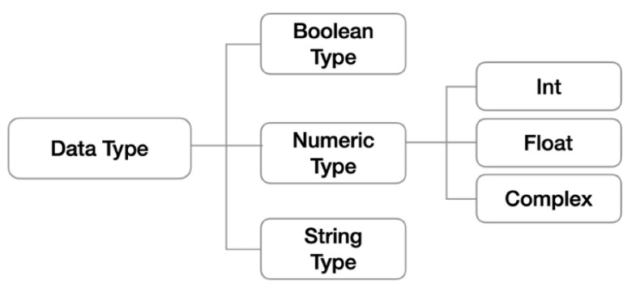
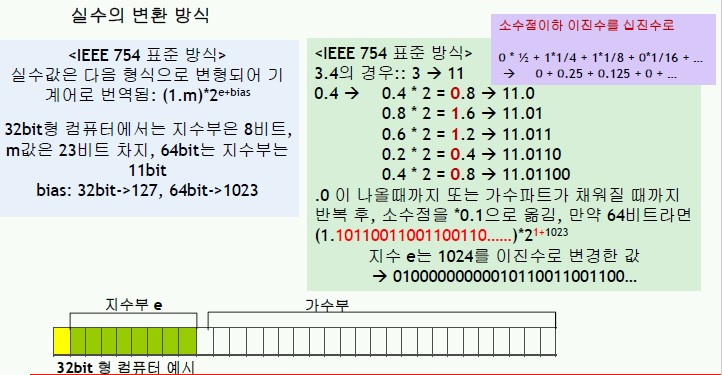
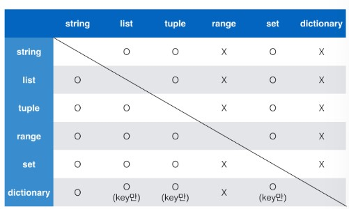

# Python Basics (Data Types & Operators)

## Index

- [1. Code Style](#1-code-style)
- [2. Variables](#2-variables)
  - [2.1. Naming Rules](#21-naming-rules)
  - [2.2. Type Hint (after python 3.5)](#22-type-hint-after-python-35)
- [3. Non-Container Data Types](#3-non-container-data-types)
  - [3.1. Boolean Type](#31-boolean-type)
  - [3.2. Numeric Type](#32-numeric-type)
  - [3.3. String Type](#33-string-type)
  - [3.4. None](#34-none)
- [4. Container Data Types](#4-container-data-types)
  - [4.1. List](#41-list)
  - [4.2. Tuple](#42-tuple)
  - [4.3. Range](#43-range)
  - [4.4. Dictionary](#44-dictionary)
  - [4.5. Set](#45-set)
  - [4.5. Typecasting table](#45-typecasting-table)
  - [4.6. Copy Mutable Data](#46-copy-mutable-data)
- [5. Operators](#5-operators)
  - [5.1. Priority of operators](#51-priority-of-operators)
  - [5.2. Arithmetic Operators](#52-arithmetic-operators)
  - [5.3. Comparison Operators](#53-comparison-operators)
  - [5.4. Logician Operators](#54-logician-operators)
    - [5.4.1. Short Circuit Evaluation](#541-short-circuit-evaluation)
  - [5.5. Membership Operators](#55-membership-operators)
  - [5.6. Bit Operators](#56-bit-operators)

---

# 1. Code Style

**[PEP8](https://www.python.org/dev/peps/pep-0008/), The style guide provided by Python**

---

# 2. Variables

**The name of data**

- Developers can handle data without memorizing memory addresses.
- Developers can intuitively understand the meaning of the data.

## 2.1. Naming Rules

- a combination of English, numbers, and '\_'
- can't start with numbers
- can't use keywords or reserved words

## 2.2. Type Hint (after python 3.5)

- Ex. `count_point: int = 10`

---

# 3. Non-Container Data Types



## 3.1. Boolean Type

- **Basics**
  - `True` `False`
  - `bool(data)`  
    Return `True` or `False` based on the data
  - `not data`  
    The opposite of the boolean result of the data
- **Characteristics**
  - immutable
  - non-iterable
- **Falsy value**
  - `0, 0.0, (), [], {}, '', None`
- **Typecasting**
  - `int(True) == 1`
  - `int(false) == 0`

## 3.2. Numeric Type

- **Characteristics**
  - immutable
  - non-iterable
- **integer**
  - Decimal numbers are the default expression
    - binary: `42 == 0b101010`
    - Octal: `42 = 0o52`
    - Hexa: `42 == 0x2a`
  - Typecasting
    ```python
    int('3') == 3
    int('3.5') == error
    int(3.5) == 3
    ```
- **float**

  - Expressions
    - 3.14
    - 314e-2

  * Python uses a floating point technique  
    

  - Floating point error

    ```python
    # use round()
    round(3.141592, 2) == 3.14

    # use sys.float_info.epsilon
    import sys
    abs(a - b) <= sys.float_info.epsilon

    # use math.isclose
    import math
    math.isclose(a, b)
    ```

  - Typecasting

    ```python
    float('3.5') == 3.5
    int('3') == 3.0
    int(3) == 3.0
    ```

## 3.3. String Type

- **Basics**
  - Expressed with '' or ""
  - **multiple lines** string data is expressed with triple quotes
- **Characteristics**
  - immutable
    - error: `(a = 'hello');  a[0]='b'`
  - Iterable
    - `for char in a:`
- **Escape sequences**
  |reserved key|meaning|
  |:---:|:---:|
  |\n|Enter|
  |\t|tab|
  |\r|carriage return|
  |\0|Null|
  |\\\\|\|
  |\\'|'|
  |\\"|"|
  |\n|Enter|
- **Typecasting**
  ```python
  s = 'string'
  print(list(s))  # ['s', 't', 'r', 'i', 'n', 'g']
  print(tuple(s)) # ('s', 't', 'r', 'i', 'n', 'g')
  print(dict(s))  # error
  print(set(s))   # {'r', 'i', 'n', 's', 'g', 't'}
  ```
- **Methods**
  |Method|description|output|change(immuatble)|
  |---|---|---|---|
  |.upper()|change to upper letter|str|X|
  |.lower()|change to upper letter|str|X|
  |.swapcase()|swap upper->lower, lower->upper|str|X|
  |.title()|change the first letter to upper|str|X|
  |.count('s', start, end)|count 's' between srint[start:end]|int|X|
  |.find('s', start, end)|find index of 's' from the left</br>return -1 when doesn't exist|int|X|
  |.rfind('s', start, end)|find index of 's' from the right</br>return -1 when doesn't exist|int|X|
  |.index('s', start, end)|find index of 's' from the left</br>error when doesn't exist|int|X|
  |.rindex('s', start, end)|find index of 's' from the right</br>error when doesn't exist|int|X|
  |.startswith('s', start, end)|whether the string starts with|Bool|X|
  |.endsswith('s', start, end)|whether the string endss with|Bool|X|
  |.strip()|remove space bf/af of the string|str|X|
  |.strip('s')|remove the chr bf/af of the string|str|X|
  |.rstrip()|remove space af of the string|str|X|
  |.lstrip()|remove space bf of the string|str|X|
  |.replace('s1','s2',[count])|replace 's1' to 's2' in the str object [count]times|str|X|
  |.split('s')|divide string by 's'|list|X|
  |.splitlines()|divide string by line|list|X|
  |.join(iterbale)|combine iterbale object with string|str|X|
  |.center(i, 'c')|center aligned with i-width filled with 'c'|str|X|
  |.ljust(i, 'c')|left aligned with i-width filled with 'c'|str|X|
  |.rjust(i, 'c')|right aligned with i-width filled with 'c'|str|X|
  |.zfill(i)|right aligned with i-width filled with '0'|str|X|

## 3.4. None

- **Basic**
  - Means that there is no value
  - use `is` instead of `==` when compared to other data

---

# 4. Container Data Types

**Can contain multiple different data types**


- **Sequence**  
  data is ordered == can use index
- **Non-Sequence**  
  data isn't ordered == can't use index

## 4.1. List

- **Basics**
  - produce
    ```python
    my_list = []
    another_list = list()
    ```
- **Characteristics**
  - Ordered
    - `my_list[0]`
  - Mutable
    - `my_list = [1, 2, 3];  list1[0]='a'`
  - Iterable
    - `for _ in my_list:`
- **Typecasting**

  ```python
  l = [1, 2, 3, 4]
  print(str(l))   # [1, 2, 3, 4]
  print(tuple(l)) # (1, 2, 3, 4)
  print(dict(l))  # error
  print(set(l))   # {1, 2, 3, 4}

  ```

- **Operators**
  ```python
  [2, 3] + [4, 5, 6] == [2, 3, 4, 5, 60]
  ['Python'] * 3 == ['Python', 'Python', 'Python']
  ```
- **Methods**
  |Method|description|output|change|
  |---|---|---|---|
  |.append(object)|add object|None|O|
  |.extend(iterbale)|add elements of an iterable</br>items in the outmost iterbale obj|None|O|
  |.clear()|clear the list|None|O|
  |.copy()|return the shallow copy|list|X|
  |.count()|number of elements|int|X|
  |.index(obj, start, end)|find index of 's' from the left</br>error when doesn't exist|int|X|
  |.insert(i, obj)|insert obj in l[i];
  if [i]is bigger than length >> insert at the last|None|O|
  |.pop(i)|pop l[i]|obj|O|
  |.remove(obj)|remove obj in l|None|O|
  |.reverse()|reverse the list|None|O|
  |.sort(reverse=False)|sor the list|None|O|

## 4.2. Tuple

- **Basics**
  ```python
  my_tuple = ()
  my_tuple_2 = 1,       # (1,)
  my_tuple_3 = 'hello', # ('hello',)
  my_tuple_3 = 1, 2, 3  # (1, 2, 3)
  another_list = tuple()
  ```
- **Characteristics**
  - Ordered
    - `my_tuple[0]`
  - Immutable
    - `my_tuple = (1, 2, 3);  my_tuple[0]='a'; # error`
    - ```python
      day_name = ('월', '화', '수')
      day_name += True, False
      >>> ('월', '화', '수', True, False) # original day_name is deleted
      ```
  - Iterable
    - `for _ in my_tuple:`
- **Typecasting**
  ```python
  t = (1, 2, 3, 4)
  print(str(t))   # (1, 2, 3, 4
  print(list(t))  # [1, 2, 3, 4]
  print(dict(t))  # error
  print(set(t))   # {1, 2, 3, 4}
  ```
- **Operators**
  ```python
  (2, 3) + (4, 5, 6) = (2, 3, 4, 5, 60)
  ('Python') * 3 = ('Python', 'Python', 'Python')
  ```
- **Methods**
  |Method|description|output|change|
  |---|---|---|---|
  |.count()|number of elements|int|X|
  |.index(obj, start, end)|find index of 's' from the left</br>error when doesn't exist|int|X|

## 4.3. Range

- **Basics**
  ```python
  range(n)        # 0 ~ (n-1) : +1
  range(n, m)     # n ~ (m-1) : +1
  range(n, m, s)  # n ~ (m-1) : +s
  ```
- **Characteristics**
  - Ordered
    - `my_range[0]`
  - Immutable
    - `my_range = range(3);  my_range[0]='a'; # error`
  - Iterable
    - `for _ in range(5):`
- **Typecasting**
  ```python
  r = (1, 5)
  print(str(t))   # (1, 2, 3, 4)
  print(list(t))  # [1, 2, 3, 4]
  print(tuple(t)) # (1, 2, 3, 4)
  print(dict(t))  # error
  print(set(t))   # {1, 2, 3, 4}
  ```

## 4.4. Dictionary

- **Basics**

  - **key**: immutable data
  - **value**: any data

  ```python
  my_dict = {}
  another_list = dict()
  ```

- **Characteristics**
  - Mutable
    - `my_dict = {'Jerry':45};  my_dict['Jerry']='a';`
  - Iterable
    - `for _ in my_dict:`
- **Typecasting**
  ```python
  d = {'name': 'ssafy', 'year': 2020}
  print(str(d))   # {'name': 'ssafy', 'year': 2020}
  print(list(d))  # ['name', 'year']
  print(tuple(d)) # ('name', 'year')
  print(set(d))   # {'name', 'year'}
  ```
- **Methods**
  |Method|description|output|change|
  |---|---|---|---|
  |.clear()|clear the dict|None|O|
  |.copy()|return the shallow copy|dict|X|
  |dict.fromkeys(iterable, value)|make dict that has itms of iterable as key|dict|X|
  |.get(key,[default=None])|get value of key;if there is no key return [default]|obj|X|
  |.items()|return [(key, items)]|dict_items|X|
  |.keys()|return [keys,]|dict_keys|X|
  |.values()|return [items,]|dict_values|X|
  |.pop(key)|pop dict(key)|obj|O|
  |.popitem()|pop the last inserted (key,value)|tuple|O|
  |.setdefault({key:value})|if alreayd exist return original dict(key)|obj or None|X|
  |.update()|update dict|None|O|
  - **update()**
    - if key is a string
      `x.update(a=900, f=60)`
    - if key is a number
      `x.update({1:900, 2:800})`

## 4.5. Set

- **Basics**
  ```python
  {1, 2, 3}
  set()       # print: set()
  ```
- **Characteristics**
  - Mutable
    - `my_set.pop()`
  - Iterable
    - `for _ in my_set:`
- **Typecasting**
  ```python
  s = {1, 2, 3, 4}
  print(str(d))   # {1, 2, 3, 4}
  print(list(d))  # [1, 2, 3, 4]
  print(tuple(d)) # (1, 2, 3, 4)
  print(dict(d))  # error
  ```
- **Methods**  
  <mark>B is an iterable object(set, tuple, list ...)</mark>
  |Method|description|output|change|
  |---|---|---|---|
  |.add(obj)|add obj|None|O|
  |.clear()|clear the set|None|O|
  |.copy()|return shallow copy|None|O|
  |A.difference(B)|return `A - B`|set|X|
  |A.difference_update(B)|`A = A - B`|None|O|
  |.discard(obj)|remove obj</br>No error even if there is no obj|None|O|
  |A.intersection(B)|return `A & B`|set|X|
  |.intersection_update()|`A = A & B`|None|O|
  |A.isdisjoint(B)|`A & B == None`|bool|X|
  |A.issubset(B)|`A & B == B`|bool|X|
  |A.issuperset(B)| `A & B == A`|bool|X|
  |.pop()|pop ==arbitary==|obj|O|
  |.remove()|remove obj</br>error when there is no obj|None|O|
  |A.symmetric_differnece(B)|return `A ^ B`|set|X|
  |A.symmetric_differnece_update(B)|`A = A ^ B`|None|O|
  |A.union(B)|return `A + B`|set|X|
  |A.update(B)|`A = A + B`|None|O|

## 4.5. Typecasting table



## 4.6. Copy Mutable Data

The mutable data type has several methods of copying.  
It's divided into three stages according to the degree of connection between the copied data and the original data.

**A is an mutable data**

1. **Not Copied**

   ```python
   B = A

   # Not copied
   B is A == True
   ```

2. **Shallow Copy**  
   The elements which depth are more than one are not copied

   ```python
   import copy

   B = copy.copy(A)

   # In the case of list
   B = A[:]
   ```

3. **Deep Copy**  
   All the elements are copied regardless of their depth

   ```python
   import copy

   B = copy.deepcopy(A)
   ```

---

# 5. Operators

## 5.1. Priority of operators


## 5.2. Arithmetic Operators

| arithmetic operator | meaning        |
| ------------------- | -------------- |
| +                   | plus           |
| -                   | minus          |
| \*                  | multiplication |
| /                   | division       |
| //                  | quotient       |
| %                   | remainder      |
| \*\*                | square         |

## 5.3. Comparison Operators

| comparision operator | meaning           |
| -------------------- | ----------------- |
| <                    | under             |
| <=                   | or less           |
| >                    | above             |
| >=                   | or more           |
| ==                   | same(value)       |
| !=                   | different(value)  |
| is                   | same(object)      |
| is not               | different(object) |

## 5.4. Logician Operators

| logician operator | meaning         |
| ----------------- | --------------- |
| and               | both True?      |
| or                | either True?    |
| not               | toggle the bool |

### 5.4.1. Short Circuit Evaluation

**returns the value that confirm the result of the logical operation**

```python
'a' and 'b'            # 'b'
'a' or 'b'             # 'a'
'a' and 'b' in 'aeiou' # False
'b' and 'a' in 'aeiou' # True
```

## 5.5. Membership Operators

**check whether the data is in an iterable data**
|membership operator|meaning|
|---|---|
|in|is in ?|
|not in|isn't in ?|

## 5.6. Bit Operators

| bit operator | meaning               |
| ------------ | --------------------- |
| &            | bit and               |
| \|           | bit or                |
| ^            | bit xor               |
| ~            | bit not               |
| <<           | move bit left == \*2  |
| >>           | move bit right == //2 |

---
