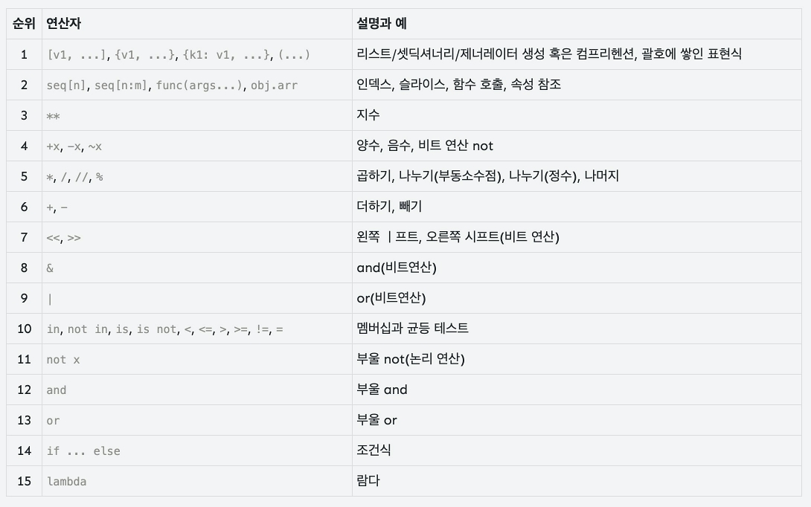

## Code Style
* Style guide provided by Python
[PEP8](https://www.python.org/dev/peps/pep-0008/)
* Use comment
  * One line: #
  * Multiple lines: ''' or """

## Variables
* for handling data with abstraction
* Naming Rules
  * englsih + _ + number
  * can't start with numbers
  * can't use keywords or reserved words 

## Operator
* Priority of operators
  

## Data Type
### Boolean
### Numeric
### String

## Container
### Tuple
### Range
### Dictionary
