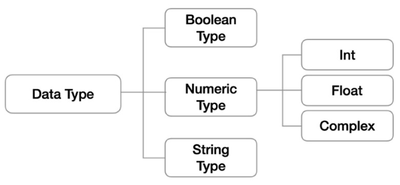
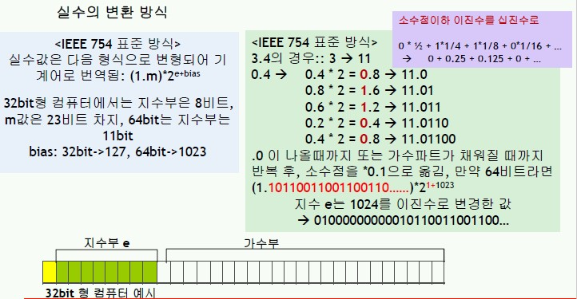
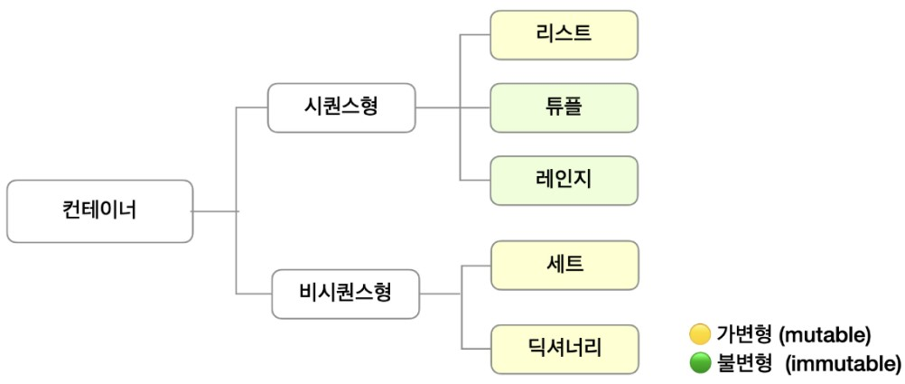
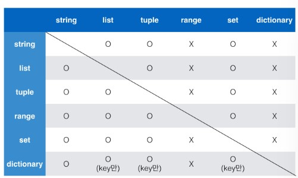
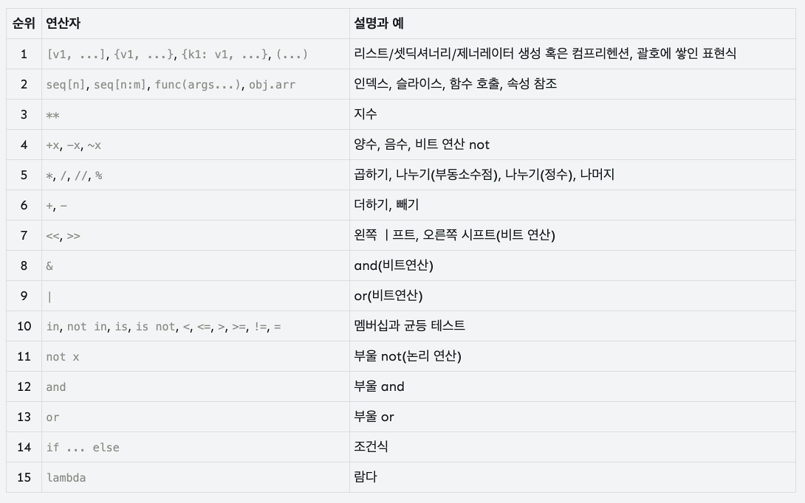

## Code Style
* Style guide provided by Python
[PEP8](https://www.python.org/dev/peps/pep-0008/)
* Use **comment**
  * One line: #
  * Multiple lines: ''' or """
---
## Variables
* for handling data with abstraction
* Naming Rules
  * englsih + _ + number
  * can't start with numbers
  * can't use keywords or reserved words 
* type hint (after python 3.5)
  * `count_point: int = 10`
---
## Data Type

### Boolean
* **Basic**
  * `True / False`
  * `bool()`
  : Confirm whether the data is True or False
  * `not`
  : the opposite boolean
* **Property**
  * immutable
  * non-iterable
* **Falsy value**
  * `0, 0.0, (), [], {}, '', None`
* **Typecasting**
  * `int(True) == 1`
  * `int(false) == 0`
### Numeric
* **Property**
  * immutable
  * non-iterable
* **integer**
  * Basically expressed with decimal
    * binary: `0b`
    * Octal: `0o`
    * Hexa: `0x`
  * Typecasting
    ```python
    int('3') == 3
    int('3.5') == error
    int(3.5) == 3
    ```
* **float**
  * Expression
    * 3.14
    * 314e-2
  * Floating point rounding error
    ```python
    # round()
    round(3.141592, 2)  # 3.14
    # import sys
    import sys
    abs(a - b) <= sys.float_info.epsilon
    # import math
    import math
    math.isclose(a, b)
    ```
  * Typecasting
    ```python
    float('3.5') == 3.5
    int('3') == 3.0
    int(3) == 3.0
    ```
  * Bit scale
    
### String
* **Basic**
  * Choose ' between '' consistently
  * Triple quotes: for **multiple lines** string data
* **Property**
  * immutable
    * error: `(a = 'hello');  a[0]='b'` 
  * Iterable
    * `for char in a:`
* **Escape sequensce**
  |reserved key|meaning|
  |:---:|:---:|
  |\n|Enter|
  |\t|tab|
  |\r|carriage return|
  |\0|Null|
  |\\|\|
  |\'|'|
  |\"|/'|
  |\n|Enter|
* **Typecasting**
  ```python
  s = 'string'
  print(list(s))  # ['s', 't', 'r', 'i', 'n', 'g']
  print(tuple(s)) # ('s', 't', 'r', 'i', 'n', 'g')
  print(dict(s))  # error
  print(set(s))   # {'r', 'i', 'n', 's', 'g', 't'}
  ```
* **Method**
  |Method|description|output|change|
  |---|---|---|---|
  |.upper()|change to upper letter|str|X|
  |.lower()|change to upper letter|str|X|
  |.swapcase()|swap upper->lower, lower->upper|str|X|
  |.title()|change the first letter to upper|str|X|
  |.count('s', start, end)|count 's' between srint[start:end]|int|X|
  |.find('s', start, end)|find index of 's' from the left</br>return -1 when doesn't exist|int|X|
  |.rfind('s', start, end)|find index of 's' from the right</br>return -1 when doesn't exist|int|X|
  |.index('s', start, end)|find index of 's' from the left</br>error when doesn't exist|int|X|
  |.rindex('s', start, end)|find index of 's' from the right</br>error when doesn't exist|int|X|
  |.startswith('s', start, end)|whether the string starts with|Bool|X|
  |.endsswith('s', start, end)|whether the string endss with|Bool|X|
  |.strip()|remove space bf/af of the string|str|X|
  |.strip('s')|remove chr bf/af of the string|str|X|
  |.rstrip()|remove space af of the string|str|X|
  |.lstrip()|remove space bf of the string|str|X|
  |.replace('s1','s2',[count])|replace 's1' to 's2' in the str object [count]times|str|X|
  |.split('s')|divide string by 's'|list|X|
  |.splitlines()|divide string by line|list|X|
  |.join(iterbale)|combine iterbale object with string|str|X|
  |.center(i, 'c')|center aligned with i-width filled with 'c'|str|X|
  |.ljust(i, 'c')|left aligned with i-width filled with 'c'|str|X|
  |.rjust(i, 'c')|right aligned with i-width filled with 'c'|str|X|
  |.zfill(i)|right aligned with i-width filled with '0'|str|X|
### None
* **Basic**
  * Means that there is no value
  * use `is` instead of `==`
---
## Container
: contain multiple different data types


**Sequence** : data is ordered == can use index
**Non-Sequence** : data isn't ordered == can't use index



### List
* **Basic**
  * produce
    ```python
    my_list = []
    another_list = list()
    ```
* **Property**
  * Ordered
    * `my_list[0]` 
  * Mutable
    * `my_list = [1, 2, 3];  list1[0]='a'` 
  * Iterable
    * `for _ in my_list:`
* **Typecasting**
  ```python
  l = [1, 2, 3, 4]
  print(str(l))   # [1, 2, 3, 4]
  print(tuple(l)) # (1, 2, 3, 4)
  print(dict(l))  # error
  print(set(l))   # {1, 2, 3, 4}

* **Operator**
  ```python
  [2, 3] + [4, 5, 6] == [2, 3, 4, 5, 60]
  ['Python'] * 3 == ['Python', 'Python', 'Python']
  ```
* **Method**
  |Method|description|output|change|
  |---|---|---|---|
  |.append(object)|add object|None|O|
  |.extend(iterbale)|add elements of an iterable</br>items in the outmost iterbale obj|None|O|
  |.clear()|clear the list|None|O|
  |.copy()|return the shallow copy|list|X|
  |.count()|number of elements|int|X|
  |.index(obj, start, end)|find index of 's' from the left</br>error when doesn't exist|int|X|
  |.insert(i, obj)|insert obj in l[i];
  if [i]is bigger than length >> insert at the last|None|O|
  |.pop(i)|pop l[i]|obj|O|
  |.remove(obj)|remove obj in l|None|O|
  |.reverse()|reverse the list|None|O|
  |.sort(reverse=False)|sor the list|None|O|


### Tuple
* produce
    ```python
    my_tuple = ()
    my_tuple_2 = 1,       # (1,)
    my_tuple_3 = 'hello', # ('hello',)
    my_tuple_3 = 1, 2, 3  # (1, 2, 3)
    another_list = tuple()
    ```
* **Property**
  * Ordered
    * `my_tuple[0]` 
  * Immutable
    * `my_tuple = (1, 2, 3);  my_tuple[0]='a'; # error` 
    *
      ```python
      day_name = ('월', '화', '수')
      day_name += True, False
      >>> ('월', '화', '수', True, False) # original day_name is deleted
      ```
  * Iterable
    * `for _ in my_tuple:`
* **Typecasting**
  ```python
  t = (1, 2, 3, 4)
  print(str(t))   # (1, 2, 3, 4
  print(list(t))  # [1, 2, 3, 4]
  print(dict(t))  # error
  print(set(t))   # {1, 2, 3, 4}
  ```
* **Operator**
  ```python
  (2, 3) + (4, 5, 6) = (2, 3, 4, 5, 60)
  ('Python') * 3 = ('Python', 'Python', 'Python')
  ```
* **Method**
  |Method|description|output|change|
  |---|---|---|---|
  |.count()|number of elements|int|X|
  |.index(obj, start, end)|find index of 's' from the left</br>error when doesn't exist|int|X|
### Range
* produce
    ```python
    range(n)        # 0 ~ (n-1) : +1
    range(n, m)     # n ~ (m-1) : +1
    range(n, m, s)  # n ~ (m-1) : +s
    ```
* **Property**
  * Ordered
    * `my_range[0]` 
  * Immutable
    * `my_range = range(3);  my_range[0]='a'; # error` 
  * Iterable
    * `for _ in range(5):`
* **Typecasting**
  ```python
  r = (1, 5)
  print(str(t))   # (1, 2, 3, 4)
  print(list(t))  # [1, 2, 3, 4]
  print(tuple(t)) # (1, 2, 3, 4)
  print(dict(t))  # error
  print(set(t))   # {1, 2, 3, 4}
  ```
### Dictionary
* **produce**
  * **key**: immutable data
  * **value**: any data
    ```python
    my_dict = {}
    another_list = dict()
    ```
* **Property**
  * Mutable
    * `my_dict = {'Jerry':45};  my_dict['Jerry']='a';` 
  * Iterable
    * `for _ in my_dict:`
* **Typecasting**
  ```python
  d = {'name': 'ssafy', 'year': 2020}
  print(str(d))   # {'name': 'ssafy', 'year': 2020}
  print(list(d))  # ['name', 'year']
  print(tuple(d)) # ('name', 'year')
  print(set(d))   # {'name', 'year'}
  ```
* **Method**
  |Method|description|output|change|
  |---|---|---|---|
  |.clear()|clear the dict|None|O|
  |.copy()|return the shallow copy|dict|X|
  |dict.fromkeys(iterable, value)|make dict that has itms of iterable as key|dict|X|
  |.get(key,[default=None])|get value of key;if there is no key return [default]|obj|X|
  |.items()|return [(key, items)]|dict_items|X|
  |.keys()|return [keys,]|dict_keys|X|
  |.values()|return [items,]|dict_values|X|
  |.pop(key)|pop dict(key)|obj|O|
  |.popitem()|pop the last inserted (key,value)|tuple|O|
  |.setdefault({key:value})|if alreayd exist return original dict(key)|obj or None|X|
  |.update()|update dict|None|O|
  * if key is string
  `x.update(a=900, f=60)`
  * if key is number
  `x.update({1:900, 2:800})`

### Set
* **produce**
    ```python
    {1, 2, 3}
    set()       # print: set()
    ```
* **Property**
  * Mutable
    * `my_set.pop()`
  * Iterable
    * `for _ in my_set:`
* **Typecasting**
  ```python
  s = {1, 2, 3, 4}
  print(str(d))   # {1, 2, 3, 4}
  print(list(d))  # [1, 2, 3, 4]
  print(tuple(d)) # (1, 2, 3, 4)
  print(dict(d))  # error
  ```
* **Method**
  |Method|description|output|change|
  |---|---|---|---|
  |.add(obj)|add obj|None|O|
  |.clear()|clear the set|None|O|
  |.copy()|return shallow copy|None|O|
  |A.difference(B)|return `A - B`|set|X|
  |A.difference_update(B)|`A = A - B`|None|O|
  |.discard(obj)|remove obj</br>No error even if there is no obj|None|O|
  |A.intersection(B)|return `A & B`|set|X|
  |.intersection_update()|`A = A & B`|None|O|
  |A.isdisjoint(B)|`A & B == None`|bool|X|
  |A.issubset(B)|`A & B == B`|bool|X|
  |A.issuperset(B)| `A & B == A`|bool|X|
  |.pop()|pop ==arbitary==|obj|O|
  |.remove()|remove obj</br>error when there is no obj|None|O|
  |A.symmetric_differnece(B)|return `A ^ B`|set|X|
  |A.symmetric_differnece_update(B)|`A = A ^ B`|None|O|
  |A.union(B)|return `A + B`|set|X|
  |A.update(B)|`A = A + B`|None|O|
  ==B is an iterable object(set, tuple, list ...)==
---
## Operator
### Priority of operators
  
### Arithmetic
|arithmetic operator|meaning|
|---|---|
|+|plus|
|-|minus|
|*|multiplication|
|/|division|
|//|quotient|
|%|remainder|
|**|square|
* `quotient, remainder = divmod(5,2) # (5//2, 5%2)`
### Comparison
|comparision operator|meaning|
|---|---|
|<|under|
|<=|or less|
|>|above|
|>=|or more|
|==|same(value)|
|!=|different(value)|
|is|same(object)|
|is not|different(object)|
### Logician
|logician operator|meaning|
|---|---|
|and|both True?|
|or|either True?|
|not|swap the bool|
* **short circuit evaluation**
: return the value that confirm the result
  * Ex
  ```python
  'a' and 'b'            # 'b'
  'a' or 'b'             # 'a'
  'a' and 'b' in 'aeiou' # False
  'b' and 'a' in 'aeiou' # True
  ```
### Membership
: check whether the data is in a **iterable 
data** 
|membership operator|meaning|
|---|---|
|in|is in?|
|not in|isn't in?|

### Bit
|bit operator|meaning|
|---|---|
|&|bit and|
|\||bit or|
|^|bit xor|
|~|bit not|
|<<|move bit left == *2|
|>>|move bit right == //2|
---
### Copy
1. b = a # both are linked to the same object
2. b = a[:] # shallow copy. only works in the 1st dimension
3. b = copy.copy() # same as number 2
4. b = copy.deepcopy() 