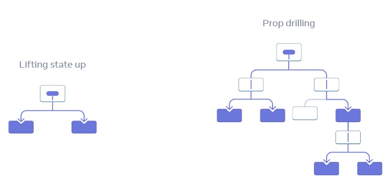

# React Context API <!-- omit in toc -->

- [1. Context](#1-context)
  - [1.1. Props와 비교](#11-props와-비교)
  - [1.2. 사용 예시](#12-사용-예시)
- [2. useReducer](#2-usereducer)
  - [1.1. 개념](#11-개념)
  - [1.2. 예시 (원시 타입)](#12-예시-원시-타입)
  - [1.3. 예시(참조타입)](#13-예시참조타입)

# 1. Context

컨텍스트를 사용하면 요소가 하위 트리 전체에 데이터를 제공할 수 있다.

## 1.1. Props와 비교



- **장점**  
  Context를 사용하면 서로 다른 컴포넌트 간 데이터를 공유하기 위해 기존의 passing props과정을 간략화할 수 있다. 더이상 data를 lifting up 하거난 props drilling할 필요가 없다.
- **단점**  
  Context의 state가 바뀌면 하위 트리가 모두 재렌더링 된다. 이러한 렌더링 이슈를 해결하기 위해 `React.memo`등의 방법을 사용할 수 있다.

## 1.2. 사용 예시

- **Context 생성**

  ```js
  import { createContext } from 'react'

  // createContext의 전달 인자는 초깃값으로, 해당 context를 통해 내려주는 값이 없을 경우에 초깃값이 공유된다
  export const ThemeContext = createContext(false)
  ```

- **Context Provider**

  ```js
  import React, { useState } from 'react'
  import { ThemeContext } from './context/ThemeContext'

  function App() {
    const [isDark, setIsDark] = useState(false)

    return (
      <ThemeContext.Provider value={{ isDark, setIsDark }}>
        <Page />
      </ThemeContext.Provider>
    )
  }
  ```

- **Context 사용**

  ```js
  import React, { useContext } from 'react'
  import { ThemeContext } from './context/ThemeContext'

  function Page() {
    const { isDark, setIsDark } = useContext(ThemeContext)

    return <div>Page</div>
  }
  ```

# 2. useReducer

useReducer는 state의 수정을 reducer로 제한한다. 따라서 복잡한 구조의 데이터를 관리하기에 적합하다. 무분별한 state수정을 방지하기 때문이다.

## 1.1. 개념

- **State** : 데이터의 상태
- **Reducer** : State를 업데이트 하는 함수. 이전 상태와 액션(action)을 인자로 받아 새로운 상태를 반환한다.
- **Dispatch** : Action을 발생시키는 함수. Action을 인자로 받아 Reducer에게 상태 변경을 요청한다.
- **Action** : type 속성과 같은 상태 변경을 위한 필수 정보를 가진다.

## 1.2. 예시 (원시 타입)

```js
import React, { useState, useReducer } from 'react'

// 리듀서 작성 (state, action)
// state의 업데이트를 제한
// 반환값으로 state를 업데이트
const reducer = (state, action) => {
  switch (action.type) {
    case 'deposit':
      return state + action.payload
    case 'withdraw':
      return state - action.payload
    default:
      return state
  }
}

function App() {
  const [amount, setAmount] = useState(0)

  // reducer로 상태가 변경되는 balance 데이터
  // reducer를 발동시키는 dispatch 함수
  const [balance, dispatch] = useReducer(reducer, 0) // reducer, 초깃값

  function deposit() {
    dispatch({ type: 'deposit', payload: number }) // action은 reducer 발동을 위한 필수 정보를 포함한다.
  }

  function withdraw() {
    dispatch({ type: 'withdraw', payload: number }) // action은 reducer 발동을 위한 필수 정보를 포함한다.
  }

  return (
    <div>
      <p>{balance}원</p>
      <input
        type="number"
        value={number}
        onChange={(e) => setAmount(e.target.value)}
        step="1000"
      />
      <button onClick={deposit}>예금</button>
      <button onClick={withdraw}>출금</button>
    </div>
  )
}
```

## 1.3. 예시(참조타입)

```js
import React, { useState, useReducer } from 'react'

// 리듀서 작성 (state, action)
// state의 업데이트를 제한
// 반환값으로 state를 업데이트
const reducer = (state, action) => {
  switch (action.type) {
    case 'add-student':
      const newStudent = {
        id:Date.now(),
        name: action.payload.name;
        isHere: false;
      }
      return {
        count : state.count + 1,
        students: [...state.students, newStudent]
      }
    case 'delete-student':
      return {
        count : state.count - 1,
        students: state.students.filter(
            (student) => student.id !== action.payload.id
        )
      }
    case 'mark-student':
      return return {
        count : state.count,
        students: state.students.map( student => {
          if (student.id === action.payload.id) {
            return {...student, isHere: !student.isHere}
          }
          return student
        })
      }
    default:
      return state
  }
}

function App() {
  const [name, setName] = useState('')

  // reducer로 상태가 변경되는 balance 데이터
  // reducer를 발동시키는 dispatch 함수
  const [studentsInfo, dispatch] = useReducer(reducer, {
    count: 0;
    students: [];
  }) // reducer, 초깃값

  function addStudent() {
    dispatch({ type: 'add-student', payload: name }) // action은 reducer 발동을 위한 필수 정보를 포함한다.
  }

  function deleteStudent() {
    dispatch({ type: 'delete-student', payload: id })
  }

  function markStudent() {
    dispatch({ type: 'mark-student', payload: id })
  }

  return (
    <div>
      <p>{studentsInfo.count}명</p>
      <input
        type="text"
        value={name}
        onChange={(e) => setAmount(e.target.value)}
      />
    </div>
  )
}

```
