# AWS 기초<!-- omit in toc -->

AWS 계정을 만들고, EC2를 생성 및 설정하는 기초적인 방법을 정리한 문서이다.

## Index<!-- omit in toc -->

- [1. AWS](#1-aws)
  - [1.1. root 계정](#11-root-계정)
  - [1.2. IAM 계정](#12-iam-계정)
- [2. EC2](#2-ec2)
  - [2.1. EC2 생성](#21-ec2-생성)
  - [2.2. .ssh key](#22-ssh-key)
  - [2.3. connect](#23-connect)
- [3. 도메인 연동](#3-도메인-연동)
  - [3.1. Gabia](#31-gabia)
  - [3.2. Elastic IP](#32-elastic-ip)
  - [3.3. Route53](#33-route53)
- [4. https](#4-https)
  - [4.1. Nginx 설치](#41-nginx-설치)
  - [4.2. configuration 파일](#42-configuration-파일)
  - [4.3. certbot](#43-certbot)

# 1. AWS

AWS 회원가입은 알아서 하자.

## 1.1. root 계정

처음 AWS에 회원가입한 이메일 아이디는 root 계정으로 구분된다. root 계정은 이름에서 알 수 있듯이 계정에 관한 모든 권한을 다 가지고 있다. 따라서 root 계정에는 여러가지 보안 인증을 추가할 수 있는데, 그 중 가장 기본적으로 권장되는 것이 MFA(Multi Factor Authentication)이다. 마치 우리 은행이나 게임의 OTP처럼 일회성 비밀번호를 실시간으로 발급하여 보안을 높이는 방법이다.

1.  **Google Authenticator 다운**

    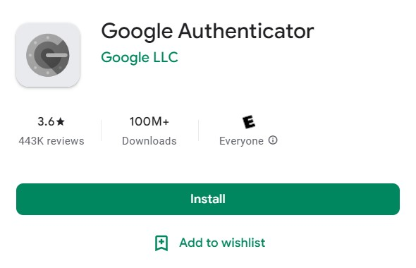

    핸드폰으로 MFA를 진행하기 위해서는 앱스토어에서 Goolge Authenticator를 다운받는다.

2.  **Assign MFA 화면 진입**

    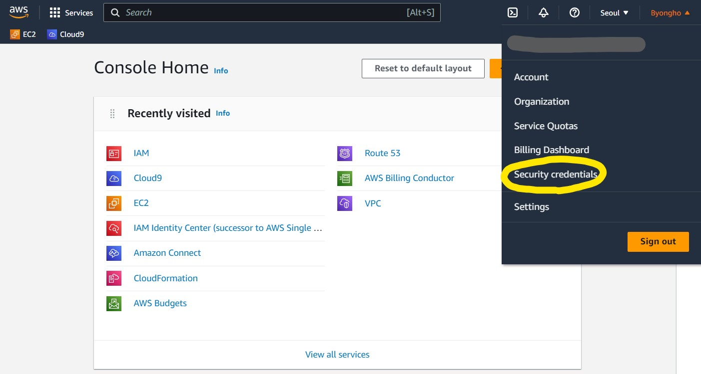

    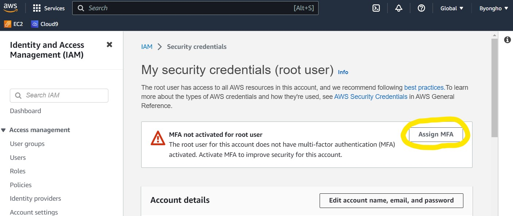

    위의 사진처럼 버튼을 클릭해서 MFA설정 창으로 진입한다.

3.  **Select MFA Device**

    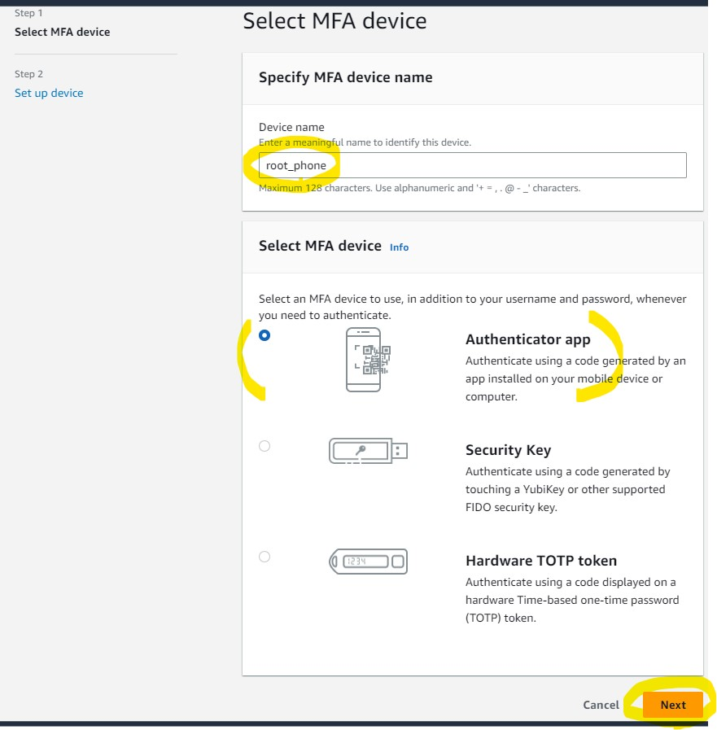

    - **Device name**  
      설명으로는 device를 식별할 수 있는 이름을 적으라고 되어있는데, 문제는 똑같은 이름이 핸드폰 화면 상에서도 뜬다는 것이다. 이게 왜 문제나면, 밑에서 IAM 계정에 대해서도 MFA를 적용할텐데 두 개 다 "my_phone"이런 식으로 이름을 설정하게 되면, 나중에 핸드폰에서 MFA 코드를 입력해야할 때 어떤게 무슨 계정인지 알 수가 없다. 그래서 **꼭 계정을 식별할 수 있는 이름을 추가**하길 추천한다.
    - **Select MFA device**  
      핸드폰으로 진행할 경우, Authenticator app을 선택한다.

4.  **Set up Device**

    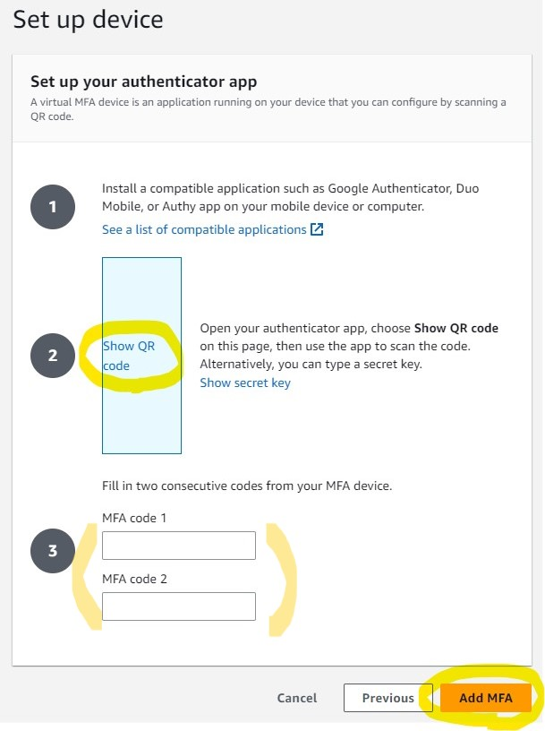

    - **Show QR Code**  
      해당 버튼을 클릭했을 때 나오는 QR코드를 다운받은 Authenticator App으로 찍어 계정을 등록한다.
    - **MFA Code**  
      계정을 등록하면 app상에 곧바로 MFA code가 나온다. 두 번 연속되어 나오는 코드를 순서대로 입력한다.

위와 같은 절차로 루트 계정에 대한 MFA를 등록되면, 앞으로 로그인할 때는 이메일과 비밀번호 뿐 아니라 항상 MFA 코드를 입력해야한다. 즉 핸드폰이 있어야 루트 계정으로 로그인할 수 있다.

## 1.2. IAM 계정

위와 같이 루트 계정에 대해 MFA를 추가하는 것만으로도 충분하지 않다. 말한 것처럼 루트 계정은 너무 많은 권한을 가지고 있기 때문에 이를 사용하는 것은 최대한 지양해야한다.

대신 권한이 제한된 IAM 계정을 생성하고 이를 사용한다. 이 방식을 통해, 하나의 AWS 계정으로 권한이 다른 여러 사용자를 생성할 수 있다.

1.  **AWS IAM 계정 생성 진입**

    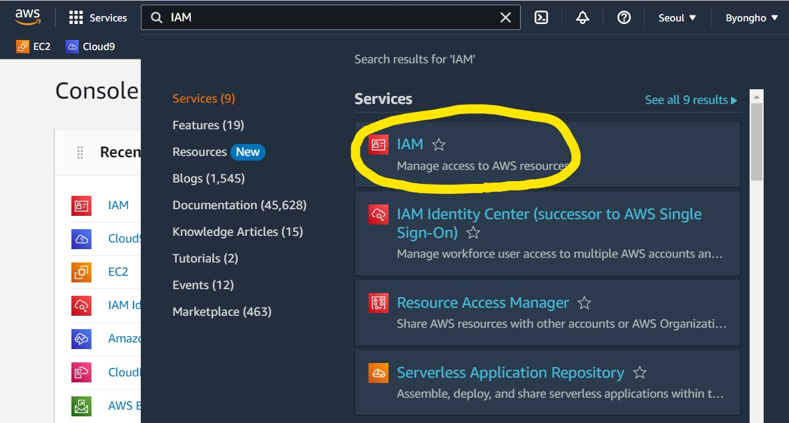

    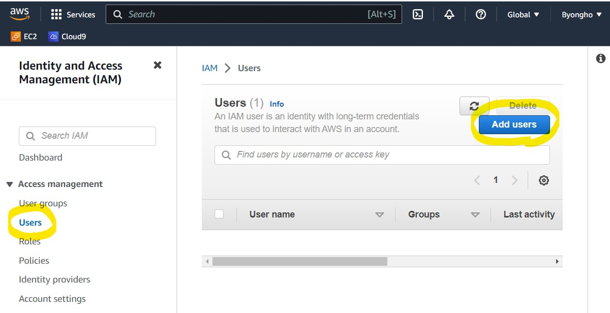

    루트 계정으로 로그인 한 뒤, 위의 그림을 따라 IAM 계정 생성 화면에 진입한다.

2.  **Specify user details**

    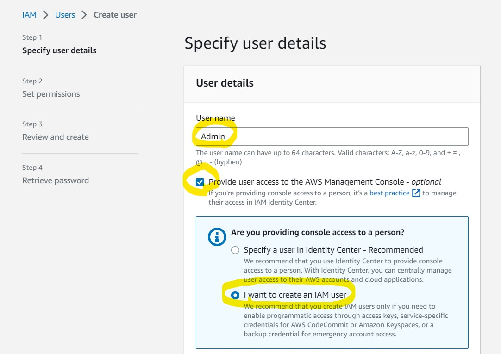

    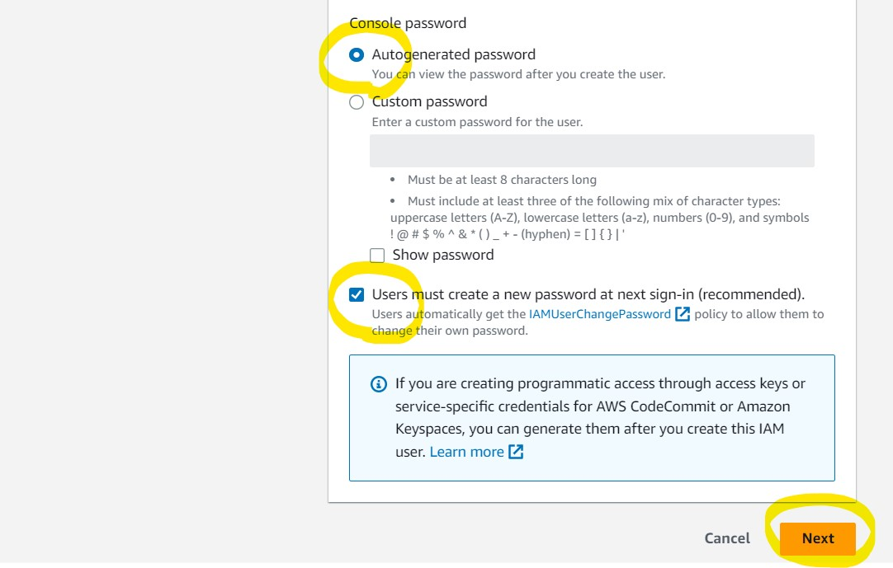

    - **User Name**  
      IAM 계정의 이름을 설정한다.
    - **Provide user access to the AWS Management Console**  
      지금처럼 웹페이지를 통해 AWS 관리화면에 진입하도록 할 지 설정하는 항목이다. 우리는 현재 자기 자신이 사용할 계정을 만드는 것이므로, 이 후 사용의 편의를 위해 체크하자.
    - **I want to create an IAM user**  
      Identity Center을 이용해 계정의 콘솔 접근 권한을 관리하라고 하는데, 역시 우리는 개인용 계정이기 때문에 그냥 바로 IAM user를 써도 크게 상관없을 것이다.
    - **Autogenerated password**  
      말 그대로 비밀번호를 임의 문자열로 자동 생성해준다.
    - **Users must create a new password at next sign-in**  
      이 항목을 체크하면, 첫 로그인 시 비밀번호를 한 번 반드시 수정해야 한다.

3.  **Specify user details**

    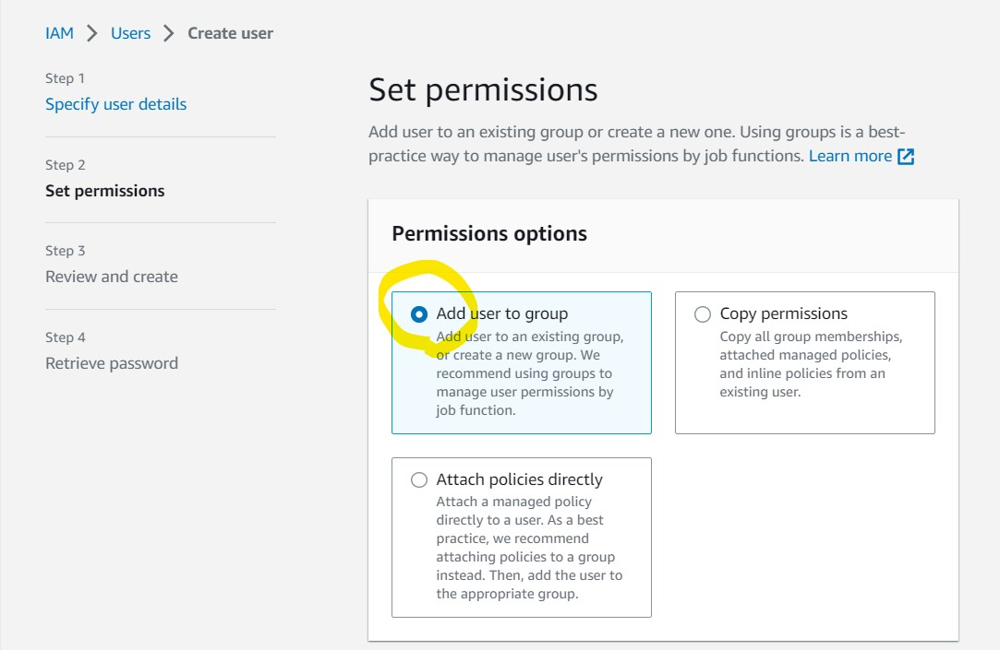

    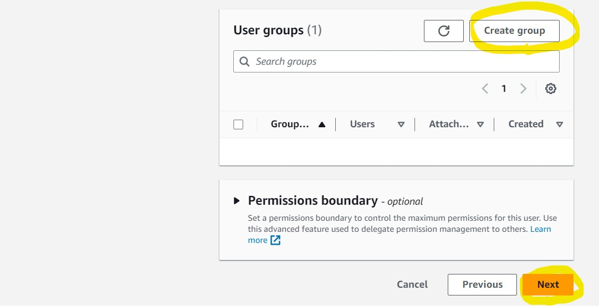

    권한을 부여하는 방법은 여러가지이다. 나는 권한 그룹을 만들고, 해당 그룹에 계정을 추가하는 방식을 사용했다.

    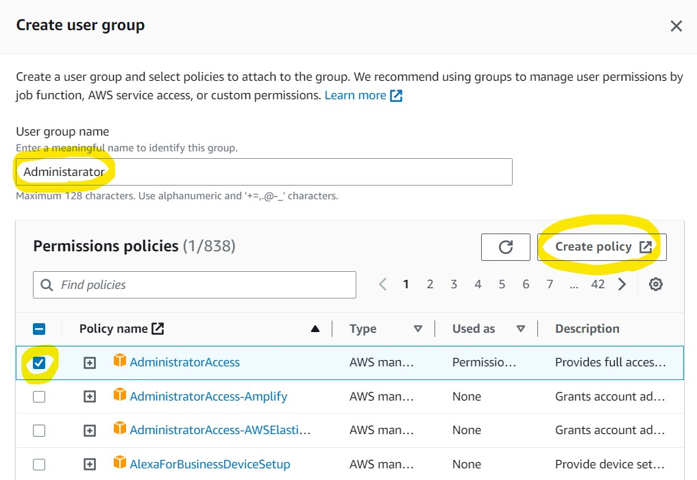

    권한 그룹의 이름을 설정하고, 해당 그룹에 추가할 권한(policy)를 설정한다. 각 policy가 구체적으로 어떤 권한을 가지고 있는지는 링크를 통해 들어가서 확인할 수 있다

    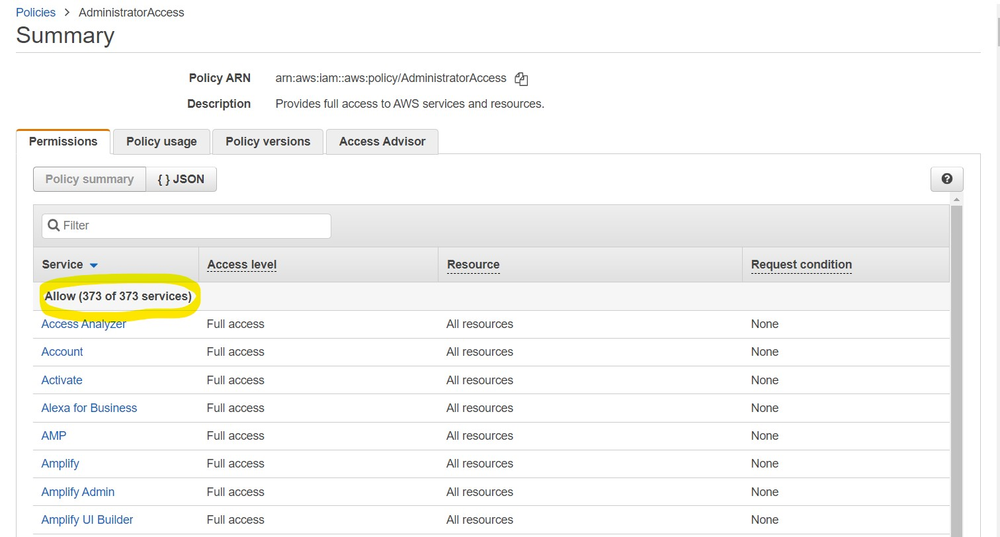

    예를 들어 AdministratorAccess는 373개의 권한 중 373개의 권한을 가지고 있다. 나도 이번에 문서 정리하면서 알았다....;; 이럴거면 IAM 계정을 만드는게 큰 의미가 없는 것 같다.

    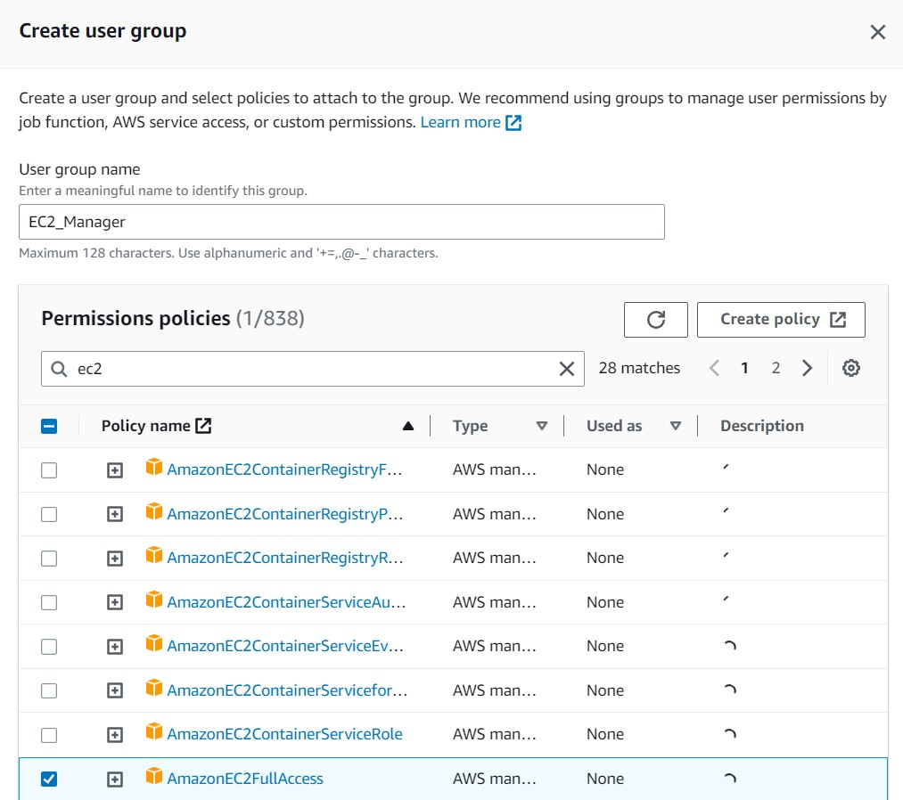

    그래서 급하게 나는 EC2권한만을 가진 보안그룹과 IAM 계정을 추가 생성했다.

4.  **Retrieve and Create**

    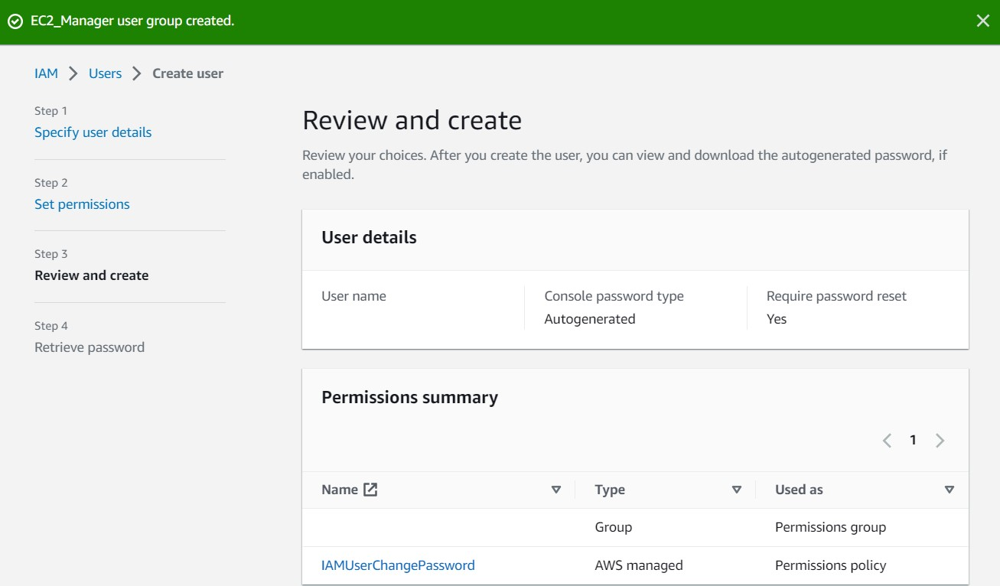

    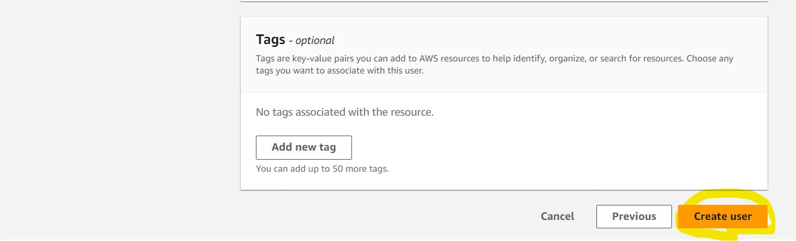

    작성 내용을 확인하고 IAM 계정을 생성한다.  
    보면 IAMUserChangePassword라는 권한이 추가된 것을 볼 수 있는데, 이는 아까 2번 항목에서 IAM 유저가 첫 로그인 시 비밀번호를 수정하도록 하면서 자동 추가된 권한이다.

5.  **Retrieve Password**

    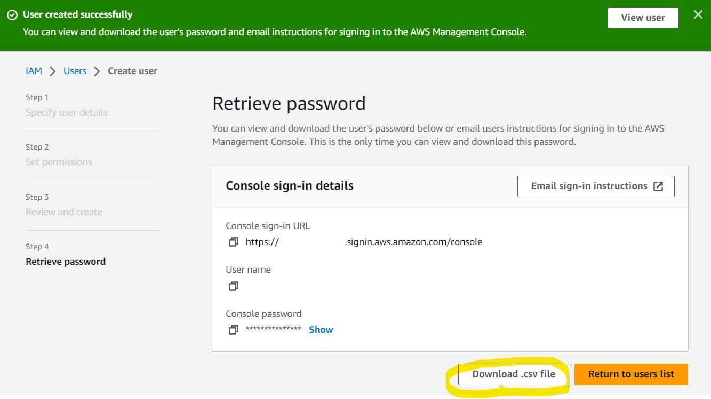

    꼭 Download .csv file를 눌러서 다운받자. 해당 파일에 계정의 아이디와 비밀번호 정보가 있다.

    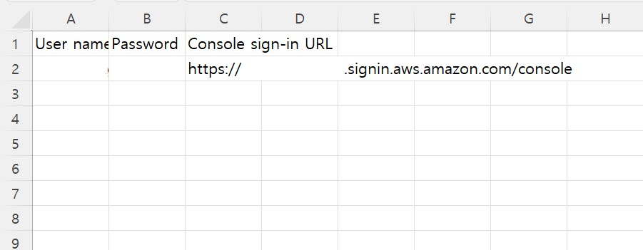

    - **User name**  
      IAM 계정 생성 시, 지정한 사용자 이름이다.
    - **Password**  
      IAM 계정에 대한 비밀번호이다.
    - **Console sign-in URL**
      12자리 숫자의 IAM Acoount ID를 포함하는 로그인 url이다.

6.  **IAM 로그인**

    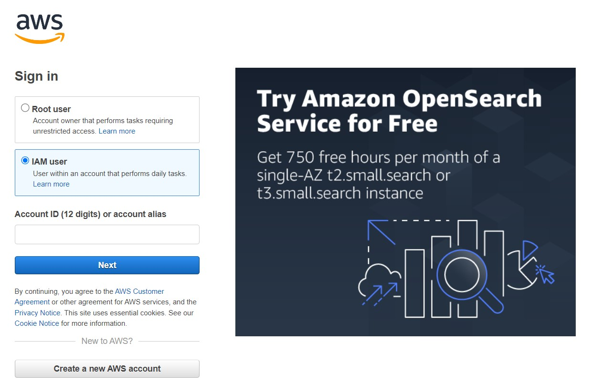

    로그인 화면에서 IAM user항목을 클릭했을 때 나오는 화면에 아까 다운받은 .csv파일에 있는 12자리 숫자 Account ID를 입력한다.

    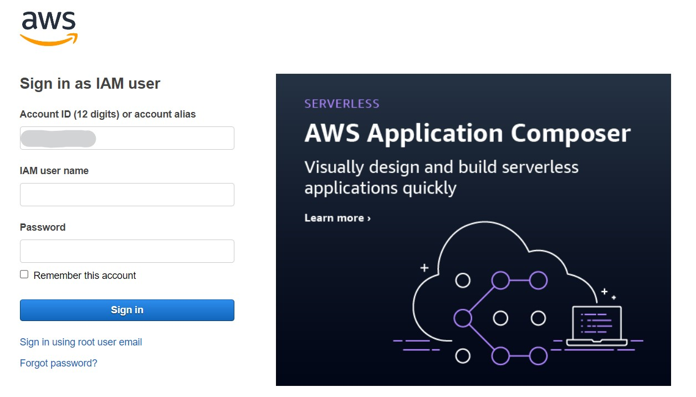

    이어 나오는 화면에서도 아까 다운받은 .csv파일에 있는 user name과 password를 입력한다.

    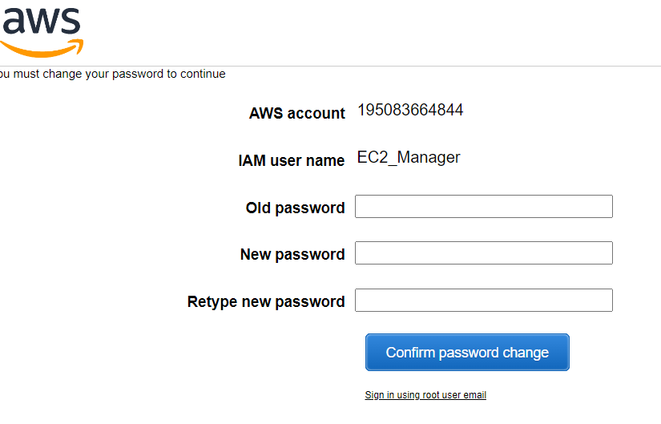

    비밀번호를 원하는 내용으로 수정하고, .csv파일도 업데이트 하는 것을 추천한다. 나는 나도 기억할 수 없는 더 긴 난수 문자열로 만든 다음에 .csv파일을 로컬 컴퓨터에 저장해서 사용한다.

    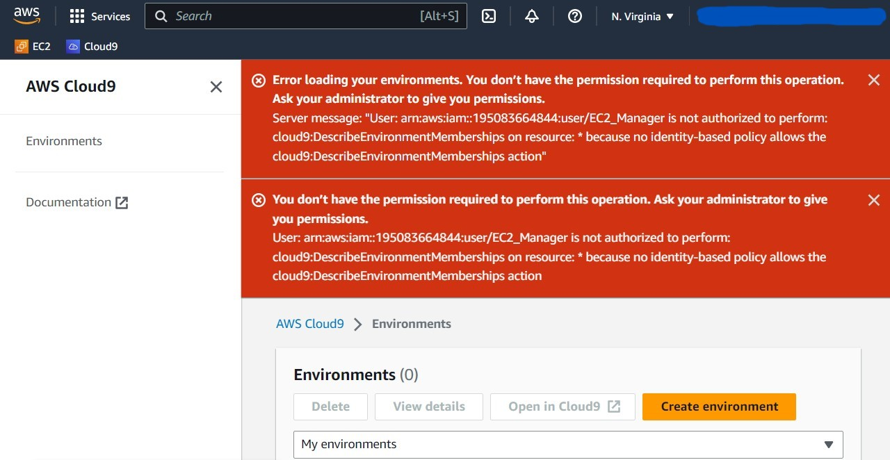

    IAM 계정으로 로그인하 뒤, 권한이 없는 서비스를 이용하려고 하면 위와같이 에러창이 나타난다.

7.  **IAM 로그인**

    IAM 계정에도 역시 MFA기능을 추가할 것을 권장한다. [루트 계정과 동일한 방법](#11-root-계정)으로 진행하면 되고, 만일 IAM 계정이 스스로 MFA기능을 추가할 권한이 없을 경우에는, 루트 계정과 같이 다른 계정에 MFA기능을 부여할 수 있는 권한을 가진 계정으로 접속해서 추가해준다.

# 2. EC2

## 2.1. EC2 생성

## 2.2. .ssh key

## 2.3. connect

# 3. 도메인 연동

## 3.1. Gabia

## 3.2. Elastic IP

## 3.3. Route53

# 4. https

## 4.1. Nginx 설치

## 4.2. configuration 파일

## 4.3. certbot
