# AWS 기초<!-- omit in toc -->

AWS 계정을 만들고, EC2를 생성 및 설정하는 기초적인 방법을 정리한 문서이다.

## Index<!-- omit in toc -->

- [1. AWS](#1-aws)
  - [1.1. root 계정](#11-root-계정)
  - [1.2. IAM 계정](#12-iam-계정)
- [2. EC2](#2-ec2)
  - [2.1. EC2 생성](#21-ec2-생성)
  - [2.2. Inbound Rule](#22-inbound-rule)
  - [2.3. ssh connect](#23-ssh-connect)
- [3. 도메인 연동](#3-도메인-연동)
  - [3.1. Elastic IP](#31-elastic-ip)
  - [3.2. Gabia](#32-gabia)
- [4. https](#4-https)
  - [4.1. Nginx](#41-nginx)
  - [4.2. certbot](#42-certbot)

# 1. AWS

AWS 회원가입은 알아서 하자.

## 1.1. root 계정

처음 AWS에 회원가입한 이메일 아이디는 root 계정으로 구분된다. root 계정은 이름에서 알 수 있듯이 계정에 관한 모든 권한을 다 가지고 있다. 따라서 root 계정에는 여러가지 보안 인증을 추가할 수 있는데, 그 중 가장 기본적으로 권장되는 것이 MFA(Multi Factor Authentication)이다. 마치 우리 은행이나 게임의 OTP처럼 일회성 비밀번호를 실시간으로 발급하여 보안을 높이는 방법이다.

1.  **Google Authenticator 다운**

    

    핸드폰으로 MFA를 진행하기 위해서는 앱스토어에서 Goolge Authenticator를 다운받는다.

2.  **Assign MFA 화면 진입**

    

    

    위의 사진처럼 버튼을 클릭해서 MFA설정 창으로 진입한다.

3.  **Select MFA Device**

    

    - **Device name**  
      설명으로는 device를 식별할 수 있는 이름을 적으라고 되어있는데, 문제는 똑같은 이름이 핸드폰 화면 상에서도 뜬다는 것이다. 이게 왜 문제나면, 밑에서 IAM 계정에 대해서도 MFA를 적용할텐데 두 개 다 "my_phone"이런 식으로 이름을 설정하게 되면, 나중에 핸드폰에서 MFA 코드를 입력해야할 때 어떤게 무슨 계정인지 알 수가 없다. 그래서 **꼭 계정을 식별할 수 있는 이름을 추가**하길 추천한다.
    - **Select MFA device**  
      핸드폰으로 진행할 경우, Authenticator app을 선택한다.

4.  **Set up Device**

    

    - **Show QR Code**  
      해당 버튼을 클릭했을 때 나오는 QR코드를 다운받은 Authenticator App으로 찍어 계정을 등록한다.
    - **MFA Code**  
      계정을 등록하면 app상에 곧바로 MFA code가 나온다. 두 번 연속되어 나오는 코드를 순서대로 입력한다.

위와 같은 절차로 루트 계정에 대한 MFA를 등록되면, 앞으로 로그인할 때는 이메일과 비밀번호 뿐 아니라 항상 MFA 코드를 입력해야한다. 즉 핸드폰이 있어야 루트 계정으로 로그인할 수 있다.

## 1.2. IAM 계정

위와 같이 루트 계정에 대해 MFA를 추가하는 것만으로도 충분하지 않다. 말한 것처럼 루트 계정은 너무 많은 권한을 가지고 있기 때문에 이를 사용하는 것은 최대한 지양해야한다.

대신 권한이 제한된 IAM 계정을 생성하고 이를 사용한다. 이 방식을 통해, 하나의 AWS 계정으로 권한이 다른 여러 사용자를 생성할 수 있다.

1.  **AWS IAM 계정 생성 진입**

    

    

    루트 계정으로 로그인 한 뒤, 위의 그림을 따라 IAM 계정 생성 화면에 진입한다.

2.  **Specify user details**

    

    

    - **User Name**  
      IAM 계정의 이름을 설정한다.
    - **Provide user access to the AWS Management Console**  
      지금처럼 웹페이지를 통해 AWS 관리화면에 진입하도록 할 지 설정하는 항목이다. 우리는 현재 자기 자신이 사용할 계정을 만드는 것이므로, 이 후 사용의 편의를 위해 체크하자.
    - **I want to create an IAM user**  
      Identity Center을 이용해 계정의 콘솔 접근 권한을 관리하라고 하는데, 역시 우리는 개인용 계정이기 때문에 그냥 바로 IAM user를 써도 크게 상관없을 것이다.
    - **Autogenerated password**  
      말 그대로 비밀번호를 임의 문자열로 자동 생성해준다.
    - **Users must create a new password at next sign-in**  
      이 항목을 체크하면, 첫 로그인 시 비밀번호를 한 번 반드시 수정해야 한다.

3.  **Specify user details**

    

    

    권한을 부여하는 방법은 여러가지이다. 나는 권한 그룹을 만들고, 해당 그룹에 계정을 추가하는 방식을 사용했다.

    

    권한 그룹의 이름을 설정하고, 해당 그룹에 추가할 권한(policy)를 설정한다. 각 policy가 구체적으로 어떤 권한을 가지고 있는지는 링크를 통해 들어가서 확인할 수 있다

    

    예를 들어 AdministratorAccess는 373개의 권한 중 373개의 권한을 가지고 있다. 나도 이번에 문서 정리하면서 알았다....;; 이럴거면 IAM 계정을 만드는게 큰 의미가 없는 것 같다.

    

    그래서 급하게 나는 EC2권한만을 가진 보안그룹과 IAM 계정을 추가 생성했다.

4.  **Retrieve and Create**

    

    

    작성 내용을 확인하고 IAM 계정을 생성한다.  
    보면 IAMUserChangePassword라는 권한이 추가된 것을 볼 수 있는데, 이는 아까 2번 항목에서 IAM 유저가 첫 로그인 시 비밀번호를 수정하도록 하면서 자동 추가된 권한이다.

5.  **Retrieve Password**

    

    꼭 Download .csv file를 눌러서 다운받자. 해당 파일에 계정의 아이디와 비밀번호 정보가 있다.

    

    - **User name**  
      IAM 계정 생성 시, 지정한 사용자 이름이다.
    - **Password**  
      IAM 계정에 대한 비밀번호이다.
    - **Console sign-in URL**
      12자리 숫자의 IAM Acoount ID를 포함하는 로그인 url이다.

6.  **IAM 로그인**

    

    로그인 화면에서 IAM user항목을 클릭했을 때 나오는 화면에 아까 다운받은 .csv파일에 있는 12자리 숫자 Account ID를 입력한다.

    

    이어 나오는 화면에서도 아까 다운받은 .csv파일에 있는 user name과 password를 입력한다.

    

    비밀번호를 원하는 내용으로 수정하고, .csv파일도 업데이트 하는 것을 추천한다. 나는 나도 기억할 수 없는 더 긴 난수 문자열로 만든 다음에 .csv파일을 로컬 컴퓨터에 저장해서 사용한다.

    

    IAM 계정으로 로그인하 뒤, 권한이 없는 서비스를 이용하려고 하면 위와같이 에러창이 나타난다.

7.  **IAM 로그인**

    IAM 계정에도 역시 MFA기능을 추가할 것을 권장한다. [루트 계정과 동일한 방법](#11-root-계정)으로 진행하면 되고, 만일 IAM 계정이 스스로 MFA기능을 추가할 권한이 없을 경우에는, 루트 계정과 같이 다른 계정에 MFA기능을 부여할 수 있는 권한을 가진 계정으로 접속해서 추가해준다.

# 2. EC2

EC2란 AWS의 컴퓨팅 자원을 이용하는 IaaS 클라우드 서비스이다. EC2는 사용자가 선택한 운영 체제에서 실행되au, CPU, 메모리, 스토리지 및 네트워크 용량 등을 선택할 수 있다.

## 2.1. EC2 생성

1.  **EC2 생성화면 진입**

    

    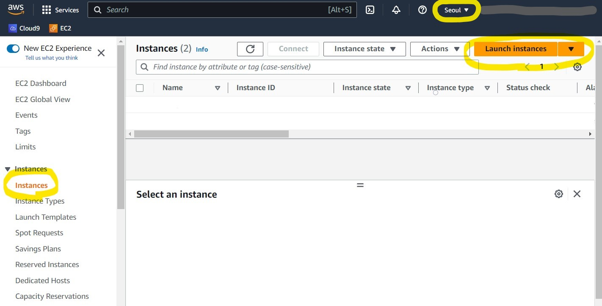

    위와 같은 절차로 EC2를 생성하는 화면에 들어간다. **인스턴스 생성 전, 상단의 지역을 반드시 확인하자!**

1.  **EC2 생성**

    

    

    

    - **Name**  
      생성할 EC2 instance의 이름을 기입한다.
    - **OS**  
      EC2의 운영체제를 선택한다. Amazon Linux와 Ubuntu모두 Linux를 기반으로 한 운영체제이다. 이 둘 간에는 지원하는 서비스, 그리고 약간의 명령어 차이가 있다. 이 문서에서는 Ubuntu로 선택하고 진행한다.
    - **Amazon Machine Image**  
      EC2의 vCPU수, 메모리, 네트워크 용량 그리고 **가격**이 결정되는 중요한 항목이다! Free tier을 사용하고 싶으면, Free tier eligible 항목을 꼭 확인하자.  
      요금은 [여기](https://aws.amazon.com/ko/ec2/pricing/on-demand/)서 확인할 수 있다. 표시되는 요금에 24\*30 을 곱해서 대략적인 한달 요금을 예측할 수 있다.
    - **Key pair**  
      EC2 인스턴스에 연결시킬 Key를 고른다. 인스턴스에 접속하는 편리한 수단이 되기 때문에 생성하는 것을 추천하며, 개인적으로 기존의 Key 보다는 각 인스턴스마다 각각 생성해서 쓴다.(Create new key pair)

    

    - **Key pair name**  
      생성할 키 페어의 이름을 기입한다.
    - **Key pair type**  
      Key에 사용되는 암호화 방식을 결정한다. 둘 다 공개키 암호화 알고리즘이다. RSA는 가장 대표적인 공개키 암호화 알고리즘이고, ED25519는 비교적 최근에 개발된 알고리즘이라고 한다. ED25519가 암호화/복호화 속도가 좀 더 빠르지만 사용범위가 RSA에 비해 작은 듯 하다.
    - **Private key file format**  
      key 파일의 포맷을 설정한다. 일반적으로 .pem는 Linux의 SSH 클라이언트 용으로, .ppk는 Windows의 SSH 클라이언트 용으로 사용된다고 한다.

    Create key pair 버튼을 누르면 자동적으로 key가 다운로드 된다. **이를 잘 보관해 두자!**

    

    - **Firewall (security group)**  
      방화벽 관련 보안 그룹을 설정해야 한다. 잘 모르겠으면 그냥 Create security group을 선택한다.
    - **Allow SSH traffic from**  
      방금 위에서 발급 받은 key 페어로 EC2에 접속하도록 하기 위해서는 체크해야 한다. 보안 상의 이슈로 접근 가능 IP주소를 Anywhere로 설정하지 말라지만, 나는 언제 어디서 EC2에 접속해야할지 모른다는 불안감에 그냥 Anywhere로 설정했다.

    

    - **Configure storage**  
      정확히 어떤 storage용량을 말하는지 잘 모르겠다. [info 링크](https://docs.aws.amazon.com/AWSEC2/latest/UserGuide/Storage.html?icmpid=docs_ec2_console)를 타고 들어가면 EFS, EBS, S3에 대한 설명이 나오는데, 이들 간의 용량이 어떻게 분배되는지, 또 어떻게 분배할 수 있을지를 모르겠다.  
      다만 나중에 수정하려고 했을 때 용량 증가는 가능해도 감소는 안되었다.

    

    마지막으로 Summary를 확인하고 Launch instance 버튼을 누르면 EC2 인스턴스가 생성된다.

## 2.2. Inbound Rule

인바운드 규칙은 인스턴스로 들어오는 네트워크 트래픽을 제어한다. 반대로 아웃바운드 규칙은 인스턴스에서 외부로 나가는 네트워크 트래픽을 제어한다. EC2의 특정 포트로 접근하기 위해서는 이 인바운드 규칙을 편집해야 한다.

1.  **EC2 인스턴스 ID 클릭**

    

2.  **Security 탭의 Security groups 클릭**

    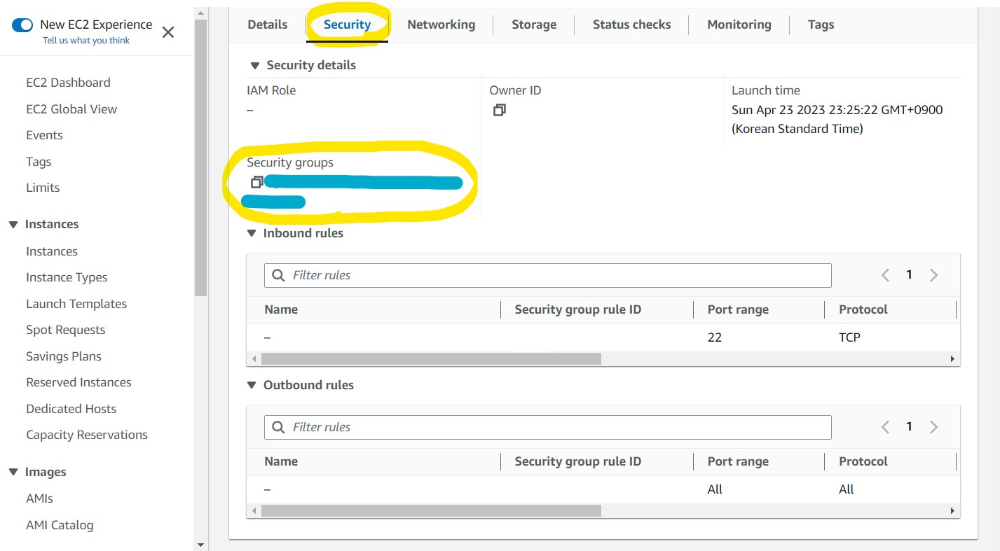

3.  **Inbound rules 탭의 Edit inbound rules 클릭**

    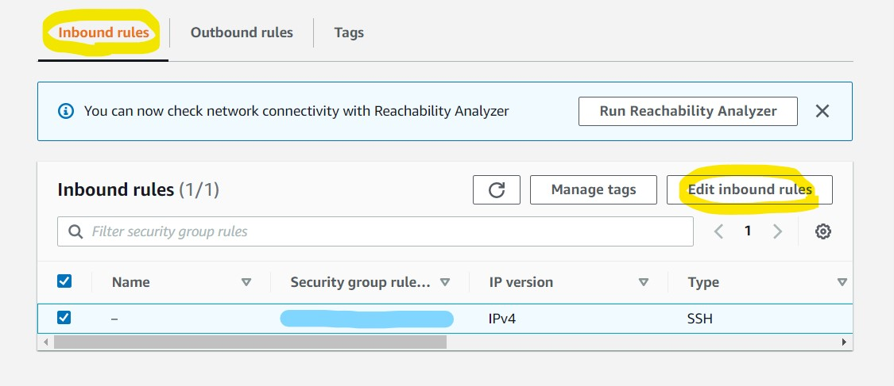

4.  **규칙 편집**

    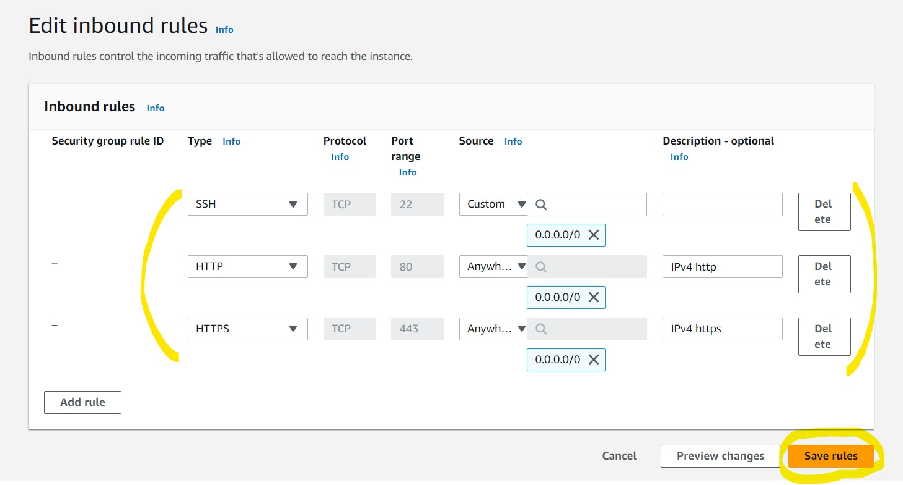

    프로젝트에 맞게 인바운드 규칙을 편집하고 저장한다. 위 규칙을 설명하면 아래와 같다.

    - **SSH**  
      22번 포트의 ssh 클라이언트에 접근하기 위한 규칙이다. **이 규칙이 있어야 .pem 키로 EC2에 로그인할 수 있다.**
    - **HTTP**  
      80번 포트로 http 프로토콜을 통해 접근하기 위한 규칙이다.
    - **HTTPS**  
      443번 포트로 https 프로토콜을 통해 접근하기 위한 규칙이다.

## 2.3. ssh connect

발급 받은 .pem key를 이용해서 ssh 클라이언트를 통해 EC2에 접속해본다. 참고로 EC2에 접속하는 방법은 이외에도 다양하다.

1.  **EC2 인스턴스 ID 클릭**

    

    EC2 인스턴스의 ID를 클릭해 들어간다.

2.  **Connect 클릭**

    

3.  **EC2 Instance Connect**

    

    EC2 Instance Connect 항목을 통해, AWS Console 웹페이지에서도 EC2 Instance에 접속할 수 있다. 우측 하단의 Connect 버튼만 누르면 된다. 하지만 개인적으로 사용했을 때, 갑자기 튕기는 등 사용성이 좋지 않았다.

4.  **SSH client**

    

    - **Example**  
      해당 항목의 코드를 복사한다. 예시 코드인 이유는 해당 코드에는 사용자 이름이 기본값(ubuntu)로 주어지기 때문이다. 나중에 다른 사용자로 로그인하고 싶으면, 해당 값을 수정한다.

5.  **Bash shell**

    

    Bash shell을 열어 방금 복사한 코드를 붙여넣는다. 해당 컴퓨터에서 처음 접속하거나 IP주소가 변경되었을 경우에는 위의 화면처럼 질문이 나타나는데, 간단하게 말해 공개 키를 검증하는 과정이라고 생각하면 된다. 솔직히 나도 잘 모르겠다. yes라고 입력한다.

    

    위와 같이 화면이 나타나면 EC2 내부에 진입한 것이다! `exit`명령어를 입력해서 나올 수 있다.

# 3. 도메인 연동

AWS에서 Elastic IP를 할당받아 EC2에 연결하고, 해당 IP를 가비아에서 산 도메인의 DNS 레코드에 등록한다. 아래는 관련된 용어 설명이다.

- **Hosted Zone**  
  호스트 영역은 특정 도메인 이름에 대한 DNS 레코드 집합을 관리한다.
- **DNS Record**  
  도메인 이름을 IP 주소와 연결하는 데 사용되는 데이터 항목으로 다양한 유형이 있다.

  - **A 레코드**  
    도메인 이름을 IPv4 주소와 연결한다.
  - **CNAME 레코드**  
    도메인 이름을 다른 호스트 이름으로 매핑한다. 예를 들어, www.example.com의 CNAME 레코드를 webserver.example.com으로 매핑하면, www.example.com로도 webserver.example.com에 접속할 수 있습니다.
  - **NS 레코드**  
    도메인 이름의 DNS 서버를 나타내며 이를 사용하여 도메인 이름을 IP 주소로 변환한다.

## 3.1. Elastic IP

1.  **Elastic IP 할당 페이지 진입**

    

2.  **Elastic IP 할당**

    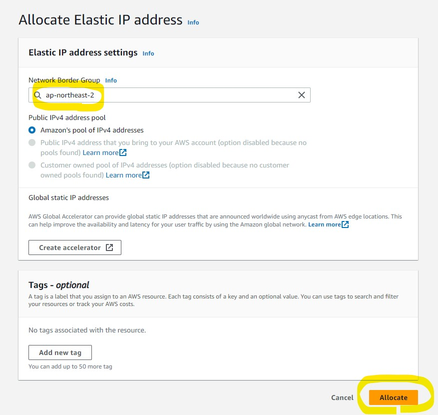

    - **Network Border Group**  
      자신이 서비스하려는 지역을 선택한다. 서울은 ap-northeast-2이다.

3.  **EC2 연동 페이지 진입**

    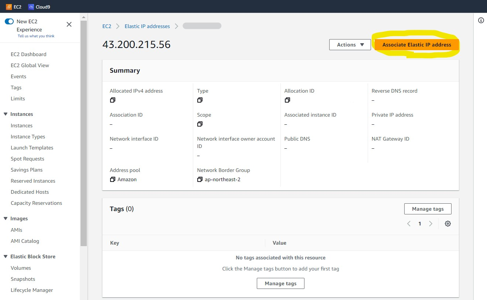

4.  **EC2 선택**

    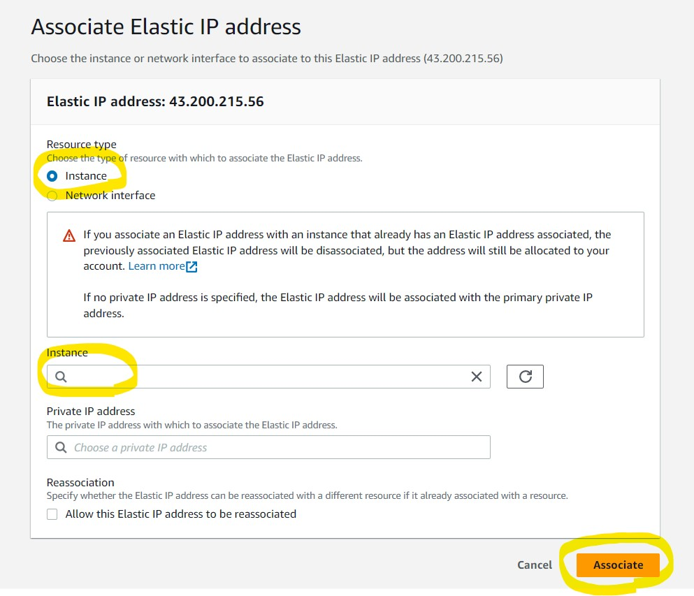

    - **Resource typw**  
      Instance를 선택해 특정 인스턴스에 IP를 할당한다.
    - **Instance**  
      연동하려는 실제 인스턴스를 선택한다.

## 3.2. Gabia

1.  **도메인 이름 선택**

    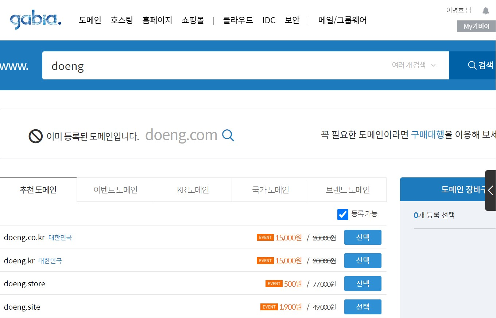

2.  **서비스 신청**

    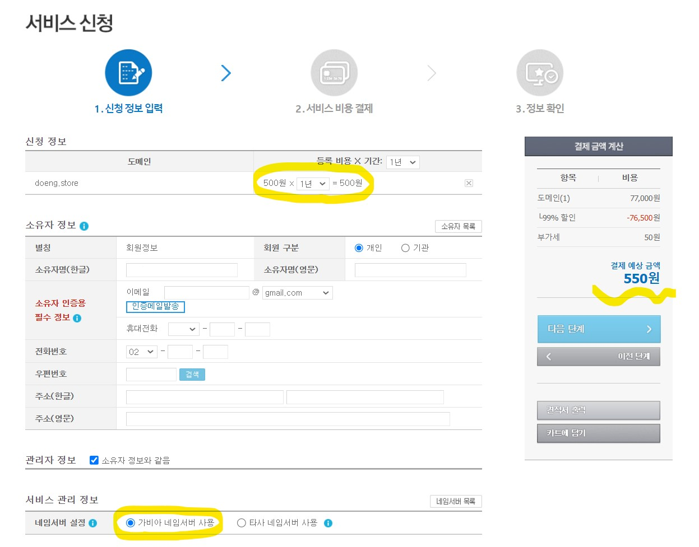

    - **신청정보**  
      실제 처음 화면에서 나온 가격으로 결제하려면, **3년으로 선택되어 있는 기간을 1년으로 바꿔야 한다.**
    - **서비스 관리 정보**  
      따로 네임서버가 없으면 가비아 네임서버를 이용하자. 만일 Route53의 호스트 존을 연결하고 싶다면, '타사 네임서버 사용'을 클릭하고 Route53에서 생성한 NS 레코드를 나중에 설정페이지에서 등록한다.

3.  **My가비아에서 도메인 선택**

    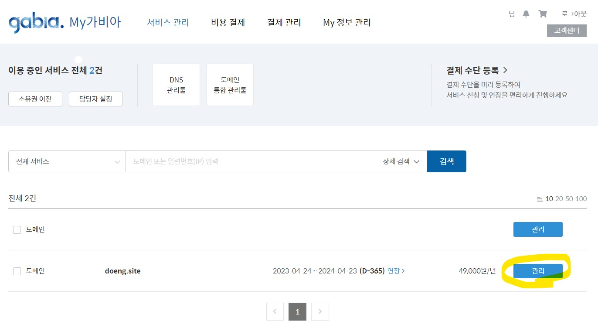

4.  **네임서버 확인 후 도메인 연결 선택**

    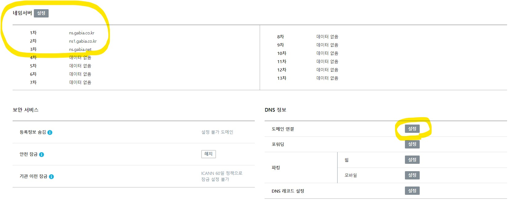

    - **네임서버**  
      도메인 신청화면에서 가비아 네임서버를 선택했을 경우, 네임서버가 기본으로 등록되어 있는지 확인한다.

5.  **도메인 선택**

    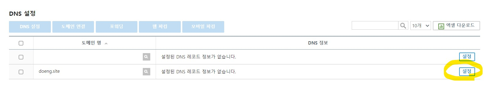

6.  **레코드 수정 선택**

    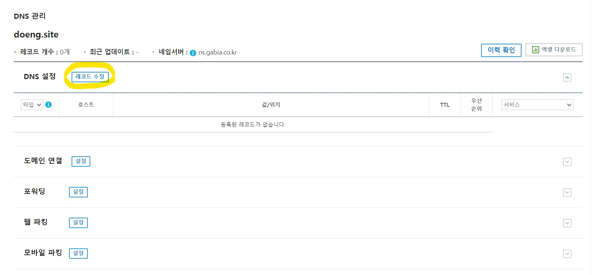

7.  **레코드 입력**

    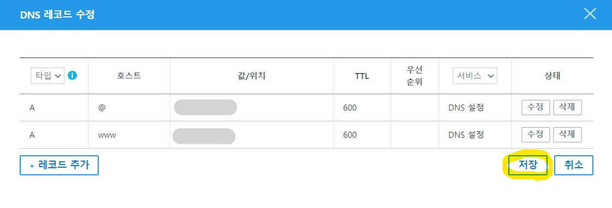

    A타입의 DNS 레코드를 선택하고, 할당받은 EC2의 Elastic IP를 입력한다. 호스트는 기본적으로 @을 넣고, 다른 호스트를 추가하고 싶을 경우 원하는대로 추가하면 된다.

# 4. https

http요청을 https로 리다이렉트 시켜 사이트가 https 프로토콜을 위에서 동작시키기 위해 Nginx와 certbot을 사용한다.

## 4.1. Nginx

Nginx는 Apache보다 빠른 성능으로 최근 각광받고 있는 웹서버이다. Nginx는 하나의 프로세스가 이벤트 기반으로 요청을 비동기식으로 처리하는 반면, Apache는 하나의 프로세스가 하나의 요청을 담당~~하~~했기 때문이다. Apache도 최근 이벤트 기반 아키텍처를 도입했지만 여전히 전체적인 성능은 Nginx가 앞선다.

1. **Nginx와 vim 설치**

   ```bash
   sudo apt update
   sudo apt install nginx vim
   ```

   nginx와 vim(문서 편집기)를 설치한다.

2. **Nginx 설정파일 생성**

   ```bash
   sudo vi /etc/nginx/sites-available/{설정파일 이름}
   ```

   `/etc/nginx/sites-available` 경로에 아래와 같은 예시의 nginx 설정파일을 작성한다. 개인적으로 설정파일 이름은 **사이트 이름**으로 설정하는 걸 추천한다.

   ```c
   server {
        listen 80;
        server_name {서버IP주소};

        location /static/ {
                alias {정적파일 위치};
        }

        location / {
                include proxy_params;
                proxy_pass http://127.0.0.1:8000;
        }
   }
   ```

3. **Nginx 설정파일 등록**

   ```bash
   # 소프트 링크 생성
   sudo ln -s /etc/nginx/sites-available/{설정파일 이름} /etc/nginx/sites-enabled

   # 소프트 링크 해제
   sudo rm /etc/nginx/sites-enabled/{설정파일 이름}
   ```

   `/etc/nginx/sites-available`에 생성된 파일은 실제 `/etc/nginx/sites-enabled`에 로드되어야 동작한다. 이를 위해 [소프트 링크](https://github.com/Byongho96/TIL/blob/master/Tools/Linux.md#5-%EB%A7%81%ED%81%AC)를 생성한다.

4. **Nginx 재시작**
   ```bash
   sudo systemctl restart nginx
   systemctl status nginx.service
   ```
   수정한 설정파일을 반영하기 위해 nginx를 재시작한다.

## 4.2. certbot

[letsencrypt](https://github.com/Byongho96/TIL/blob/master/Tools/Nginx.md#5-feature)는 SSL 인증서를 제공하는 무료 인증 기관이며, [certbot 공식문서](https://certbot.eff.org/)은 Let's Encrypt 인증서를 자동으로 발급하고 갱신하는데 사용되는 오픈 소스 도구이다.

[certbot 공식문서](https://certbot.eff.org/)에서 본인이 사용할 웹서버와 EC2환경을 선택한 뒤, 따라 설치하는 것을 권장한다. 아래는 2023.04.24 기준 [Nginx, Ubunt20 설정](https://certbot.eff.org/instructions?ws=nginx&os=ubuntufocal)을 따라 설치한 내용이다.

1. **snapd 설치**  
   snapd는 리눅스의 패키지 관리자 중 하나이다. 우분투는 기본적으로 snapd가 설치되어 있지만, 혹시라도 설치되어 있지 않을 경우 [이 문서](https://snapcraft.io/docs/installing-snap-on-ubuntu)를 참고한다.

2. **snapd 최신 버전 확인**

   ```bash
   sudo snap install core; sudo snap refresh cores
   ```

   위 명령어를 실행시켜 현재 snapd가 최신버전을 따르도록 한다.

3. **다른 패키지를 통한 certbot 설치 내역 삭제**  
   혹시라도 다른 패키지로 certbot을 설치한 적이 있다면, 명령어 실행 시 충돌을 방지하기 위해 삭제해야한다.  
   `sudo apt-get remove certbot`, `sudo dnf remove certbot`, `sudo yum remove certbot`

4. **certbot 설치**

   ```bash
   sudo snap install --classic certbot
   ```

5. **certbot 명령어 활성화**

   ```bash
   sudo ln -s /snap/bin/certbot /usr/bin/certbot
   ```

   위 명령어를 통해 certbot 명령어를 활성화 시킨다.

6. **certbot 실행**

   ```bash
   sudo certbot --nginx
   ```

   위 명령어를 실행하면

   - ssl인증서가 발급될 뿐 아니라,
   - 기본 nginx 설정파일이 http를 https로 리다이렉트로 되도록 자동 수정되며
   - ssl인증서가 만료 전에 자동 갱신되는 작업이 cronjob에 등록된다.

   만일 위와 같은 추가작업을 원하지 않고, 인증서가 발급받기를 원한다면 아래처럼 `certonly`를 추가한다.

   ```bash
   sudo certbot certonly --nginx
   ```

7. **요청 응답**
