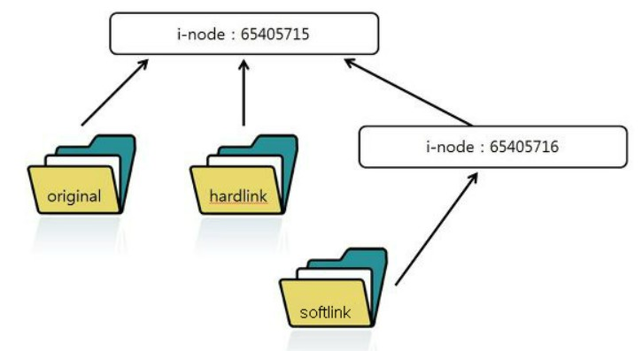

# Linux <!-- omit from toc -->

- [1. ps](#1-ps)
  - [1.1. 용어](#11-용어)
  - [1.2. 명령어](#12-명령어)
- [2. systemctl](#2-systemctl)
  - [2.1. systemd](#21-systemd)
  - [2.2 .service](#22-service)
  - [2.3. 명령어](#23-명령어)
- [3. ln](#3-ln)
  - [3.1. 용어](#31-용어)
  - [3.2. 명령어](#32-명령어)

# 1. ps

## 1.1. 용어

- **UID**  
  User ID. 사용자 ID
- **PID**  
  Process ID. 운영체제에서 프로세스를 식별하기 위한 ID
- **PPID**  
  Parent Process ID. 부모 프로세스의 PID
- **PGID**  
  Process Group ID. 1개 이상의 프로세스의 그룹을 식별하기 위한 ID
- **SID**  
  Session ID. 1개 이상의 프로세스의 그룹의 묶음을 식별하기 위한 ID

## 1.2. 명령어

ps 명령어 입력 시 나오는 테이블의 항목에 대한 세부내용은 다음과 같다

| 칼럼  | 설명                                   |
| ----- | -------------------------------------- |
| C     | CPU 사용량(%)                          |
| TTY   | 프로세스를 시작한 터미널               |
| RSS   | 메모리 사용량                          |
| TIME  | 프로세스 총 가동시간                   |
| STIME | 프로세스 시작시간                      |
| CMD   | 해당 프로세스를 시작하는데 쓰인 명령어 |

| 명령어                                          | 설명                                                               |
| ----------------------------------------------- | ------------------------------------------------------------------ |
| ps                                              | 현재 사용자가 실행 중인 프로세스                                   |
| ps -e                                           | 모든 사용자가 실행 중인 프로세스                                   |
| ps -f                                           | 프로세스 상세정보 출력                                             |
| ps -p [PID]                                     | 특정 프로세스 정보 출력                                            |
| ps -u [UID]                                     | 특정 사용자가 실행 중인 프로세스 정보 출력                         |
| ps -H                                           | 인덴트로 부모 자식 관계 시각화                                     |
| ps -ef \| grep [keyword1] \| grep -v [keyword2] | CMD에 keyword1을 포함하고 keyword2를 포함하지 않은 프로세스 필터링 |

# 2. systemctl

## 2.1. systemd

## 2.2 .service

## 2.3. 명령어

| 명령어                              | 설명                         |
| ----------------------------------- | ---------------------------- |
| systemctl start [service-name]      | 서비스 시작                  |
| systemctl stop [service-name]       | 서비스 중지                  |
| systemctl restart [service-name]    | 서비스 재시작                |
| systemctl enable [service-name]     | 부팅 시 서비스 자동시작      |
| systemctl disable [service-name]    | 부팅 시 서비스 자동시작 해제 |
| systemctl list-units --type=service | 서비스 목록 확인             |
| journalctl -u [service-name]        | 서비스 로그 기록 확인        |

# 3. ln

## 3.1. 용어

- **i-node**
  파일을 식별하는 고유번호
  ls명령어 사용 시 -i 옵션으로 확인 가능하다.

* **Hard Link**  
  동일한 i-node를 가리키는 파일을 하나 복사한다. 동일한 i-node를 가리키기 때문에 어느 파일을 수정하든지 모든 파일에 대해 동일하게 수정이 일어난다.
  하지만 하나의 파일을 삭제 하더라도 다른 파일에 영향을 끼치지는 않는다.
* **Soft Link**  
  다른 i-node를 가리키는 파일을 복사한다. 그러나 생성된 복사본의 i-node가 원본의 i-node를 가리킨다.
  하드 링크와 마찬가지로 어느 파일을 수정하든지 모든 파일에 대해 동일하게 수정이 일어난다. 그러나 원본 파일이 삭제될 경우 소프트링크는 더 이상 이용할 수 없다.

## 3.2. 명령어

| 명령어                                     | 설명             |
| ------------------------------------------ | ---------------- |
| ln [soure-path(name)] [dest-path(name)]    | 하드 링크 생성   |
| ln -s [soure-path(name)] [dest-path(name)] | 소프트 링크 생성 |
| rm [dest-path(name)]                       | 링크 삭제        |
