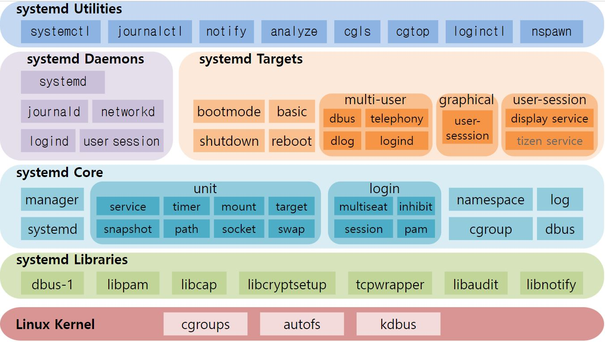

# Linux <!-- omit from toc -->

- [1. 기본](#1-기본)
  - [1.1. 기본 명령어](#11-기본-명령어)
  - [1.2 변수](#12-변수)
  - [1.3. 조건문](#13-조건문)
  - [1.4. 반복문](#14-반복문)
- [1. ps](#1-ps)
  - [1.1. 용어](#11-용어)
  - [1.2. 명령어](#12-명령어)
- [2. systemctl](#2-systemctl)
  - [2.1. systemd](#21-systemd)
  - [2.2. daemon](#22-daemon)
  - [2.2 .service](#22-service)
  - [2.3. 명령어](#23-명령어)
- [3. ln](#3-ln)
  - [3.1. 용어](#31-용어)
  - [3.2. 명령어](#32-명령어)
- [4. curl](#4-curl)
- [5. echo](#5-echo)

# 1. 기본

## 1.1. 기본 명령어

| 명령어                         | 설명                   | 예시                      |
| ------------------------------ | ---------------------- | ------------------------- |
| pwd                            | 현재 디렉토리          |                           |
| cd                             | 경로 이동              |                           |
| ls                             | 디렉토리 목록          |                           |
| cp                             | 파일 복사              | cp file1 file1_cp         |
| cp -r                          | 디렉토리 복사          | cp -r dir1 dir1_cp        |
| mv                             | 파일/디렉토리 이동     | mv file1 dir1/            |
| mkdir                          | 디렉토리 생성          | mkdir dir1                |
| touch                          | 파일 생성              | mkdir file1               |
| rm                             | 파일 삭제              | rm file                   |
| rm -r                          | 디렉토리 삭제          | rm -r dir1                |
| rm -r                          | 디렉토리 삭제          | rm -r dir1                |
| cat                            | 파일 출력              | cat file1                 |
| cat >                          | 파일 병합              | cat file1 file2 > file1_2 |
| head                           | 파일 상단 10줄 출력    | head file1                |
| head -[num]                    | 파일 상단 [num]줄 출력 | head -3 file              |
| tail                           | 파일 하단 10줄 출력    | tail file1                |
| tail -[num]                    | 파일 하단 [num]줄 출력 | tail -3 file              |
| find [검색경로] -nmae [파일명] | 파일/디렉토리 찾기     | find ./ -name '\*.jpg'    |

## 1.2 변수

## 1.3. 조건문

## 1.4. 반복문

# 1. ps

## 1.1. 용어

- **UID**  
  User ID. 사용자 ID
- **PID**  
  Process ID. 운영체제에서 프로세스를 식별하기 위한 ID
- **PPID**  
  Parent Process ID. 부모 프로세스의 PID
- **PGID**  
  Process Group ID. 1개 이상의 프로세스의 그룹을 식별하기 위한 ID
- **SID**  
  Session ID. 1개 이상의 프로세스의 그룹의 묶음을 식별하기 위한 ID

## 1.2. 명령어

ps 명령어 입력 시 나오는 테이블의 항목에 대한 세부내용은 다음과 같다

| 칼럼  | 설명                                   |
| ----- | -------------------------------------- |
| C     | CPU 사용량(%)                          |
| TTY   | 프로세스를 시작한 터미널               |
| RSS   | 메모리 사용량                          |
| TIME  | 프로세스 총 가동시간                   |
| STIME | 프로세스 시작시간                      |
| CMD   | 해당 프로세스를 시작하는데 쓰인 명령어 |

| 명령어                                          | 설명                                                               |
| ----------------------------------------------- | ------------------------------------------------------------------ |
| ps                                              | 현재 사용자가 실행 중인 프로세스                                   |
| ps -e                                           | 모든 사용자가 실행 중인 프로세스                                   |
| ps -f                                           | 프로세스 상세정보 출력                                             |
| ps -p [PID]                                     | 특정 프로세스 정보 출력                                            |
| ps -u [UID]                                     | 특정 사용자가 실행 중인 프로세스 정보 출력                         |
| ps -H                                           | 인덴트로 부모 자식 관계 시각화                                     |
| ps -ef \| grep [keyword1] \| grep -v [keyword2] | CMD에 keyword1을 포함하고 keyword2를 포함하지 않은 프로세스 필터링 |

# 2. systemctl

## 2.1. systemd

systemd는 Linux 운영체제의 시스템 서비스(데몬)를 동작 원리와 관계없이 일관된 인터페이스를 제공한다. 여러 개의 서비스를 병렬적으로 수행할 수 있기 때문에 확장성에 용이하고, 사용자에 따라 프로세스를 구분하여 관리할 수 있다. 또한 서비스 간 의존성 추적, 로그 기록 관리 등의 기능을 통해 트러블 슈팅을 쉽게 해결할 수 있다.



<!-- ### 2.1.1. systemd components

systemd는 여러 컴포넌트로 이루어져 있으며, 다음과 같은 구조를 가지고 있다.


- **systemd init system**
  서비스 및 프로세스 관리를 담당합니다. 기존의 SysV init 시스템을 대체하고 시스템 서비스를 보다 현대적이고 유연하게 관리할 수 있는 방법을 제공합니다. 선언적 구성 형식을 사용하여 서비스, 대상 및 기타 시스템 구성 요소를 정의합니다.
- **systemd service manager**
  서비스 관리자는 시스템 서비스를 시작, 중지 및 관리할 책임이 있습니다. 서비스를 관리하기 위한 표준 인터페이스를 제공하고 소켓 활성화, 프로세스 추적 및 서비스 종속성과 같은 고급 기능을 지원합니다.
- **systemd journal**
  저널은 시스템 로그 및 기타 진단 정보를 저장하는 중앙 로그 저장소입니다. 이진 형식을 사용하여 로그를 저장하고 구조화된 로깅, 로그 순환 및 로그 필터링과 같은 고급 기능을 제공합니다.제공합니다. 선언적 구성 형식을 사용하여 서비스, 대상 및 기타 시스템 구성 요소를 정의합니다.
- **systemd units**
  단위는 systemd의 구성 요소이며 서비스, 장치 및 소켓과 같은 시스템 리소스를 나타냅니다. 각 장치에는 속성 및 종속성을 정의하는 고유한 이름과 구성 파일이 있습니다.
- **systemd targets**
  대상은 다중 사용자 또는 그래픽 사용자 인터페이스(GUI) 모드와 같이 시스템의 작동 모드를 정의하는 미리 정의된 상태입니다. 이들은 단위를 함께 그룹화하고 시작 또는 중지할 순서를 정의합니다.
- **systemd libraries**
  Systemd는 systemd 인프라와 통합하는 데 사용할 수 있는 라이브러리 세트를 제공합니다. 이러한 라이브러리는 서비스 시작 및 중지, 네트워크 소켓 관리 및 기타 시스템 관련 작업을 위한 표준화된 인터페이스를 제공합니다.

### 2.1.2. systemd directories

/etc/systemd/system/: This directory contains system-wide unit files and configuration files that define system services and other resources. These files are typically customized by the system administrator to configure system behavior.

/run/systemd/system/: This directory contains runtime unit files and other resources that are created and managed by systemd at runtime. These files are typically created when the system boots up and are removed when the system shuts down.

/usr/lib/systemd/: This directory contains system libraries and other resources that are used by systemd and its components.

/usr/share/systemd/: This directory contains documentation files and other resources that provide information about systemd and its components.

/var/lib/systemd/: This directory contains state files and other resources that are used by systemd to track system state and configuration changes. -->

## 2.2. daemon

데몬이란 시스템 서비스라고도 불리며, 사용자와의 상화작용 없이 컴퓨터 백그라운드에서 돌아가는 프로글메을 말한다. 보통 시스템(컴퓨터)가 켜짐과 동시에 자동으로 시작된다. 리눅스 운영체제에서 데몬은 systemd에 의해서 관리된다.

데몬은 사용자 레벨에서 접근할 수 없는 기능들을 동작시키는데 유용하다. 예를 들어 웹 서버, 데이터 서버 등의 다른 프로그램을 동작시키거나 하드웨어 디바이스와 상호작용할 때 쓰인다.

## 2.2 .service

.service 파일은 unit 설정 파일이라고 불리며, 리눅스 운영체제에서 systemd가 관리할 시스템 서비스를 정의한다. `/etc/systemd/system` 디렉토리에 .service 파일을 위치시키면 systemd가 해당 서비스를 설정파일에 따라 관리하기 시작한다.

기본적으로 systemd 서비스의 이름은 /etc/systemd/system 디렉토리에 있는 장치 파일명으로 결정된다. (서비스 이름은 `systemctl`커맨드 사용 시, .service 확장파일을 확장자명 없이 지칭할 수 있는 별칭을 의미한다.) 필요에 따라서 [INSTALL] 섹션에 Aias 옵션을 통해 서비스 이름을 설정파일과 다르게 설정할 수 있다.

하나의 서비스는 하나 이상의 프로세스를 생성하며, 그 중 메인 프로세스가 해당 서비스와 직접적인 연결관계를 가진다.

```c
[UNIT]
Description
// 서비스 설명으로, 서비스의 로그에 기록된다.

After
// 본 서비스 이전에 실행해야 할 서비스

Before
// 본 서비스 이후에 실행해야 할 서비스

Requires
// 본 서비스와 반드시 함께 실행해야 할 서비스

Wants
// 본 서비스와 함께 실행할 서비스 (실행되지 않더라도 본서비스는 실행됨)

[SERVICE]
Type
// 서비스의 시작 유형을 지정한다. [simple | forking | oneshot | dbus | notify | idle]
// simple : deafult값. systemd가 서비스에 대해 장기간 실행을 기대하는 메인 프로세스를 생성한다. -> 프로세스 종료 시 실패로 간주한다.
// forking : systemd가 생성한 메인 프로세스는 자식 프로세스를 fork하고, 메인 프로세스 자격을 넘겨 준뒤 종료된다. 자식 프로세스의 PID를 PIDFlie옵션에 정의된 경로에 저장한다.
// oneshot : systemd가 서비스에 대해 단기간 실행을 기대하는 메인 프로세스를 생성한다. -> 프로세스 완료 시 성공으로 간주하고, 장기간 구동 시 실패로 간주한다.
// dbus : D-Bus 서비스(프로세스간 통신)임을 명시한다.
// notify : 프로세스가 요청을 수락할 준비가 되었을 때, systemd에 알람을 보낸다. -> 데이터베이스 서버와 같이 시작하는데 시간이 걸리는 서비스에 유용하다.

Environment
//서비스에 사용할 환경 변수를 선언한다.
EnvironmentFile
//서비스의 환경설정을 파일을 지정한다.

ExecStartPre
ExecStart
ExecStartPost
ExecStop
ExecStopPost
// 각각의 상황에 맞는 명령어 혹은 명령어를 지정한다.
// Ex 1.
// ExecStart=/usr/bin/python3 /path/to/script.py
// Ex 2.
// ExecStart=/bin/bash /path/to/script.sh
// Ex 3.
// ExecStart=/bin/bash /path/to/script.sh arg1 arg2

KillMode
// 프로세스가 어떻게 중지 되는지 결정 [control-group|process|none]
// control-group : 해당 서비스가 포함된 그룹의 모든 서비스를 중지 시킨다.
// process : 해당 서비스의 메인 프로세스만 중지 시킨다.
// none : defualt값. 아무런 행동도 하지 않는다.

PIDFile
// 서비스가 자신의 pid를 기록한다. (Type=forking 옵션과 함께 자주 사용된다.)
// PIDFILE = /var/run/myservice.pid

Restart
// 서비스 종료 시, 재시작 설정	[no | on-success | on-failure | on-watchdog | on-abort | always ]
// no: defualt 값.
// on-success: 프로세스가 성공적으로 종료(status가 0) 시 재시작
// on-failure: 프로세스가 실패(status가 0이 아님) 시 재시작
// always: 무조건 재시작

RestartSec
// 서비스 재시작까지 대기하는 시간. 기본값 100ms

User
// 해당 서비스를 실행할 주체를 설정. (서비스 실행과 관련된 권한을 가지고 있어야 한다.)
// default 값 root. 보안상의 이유로 추천하지 않는다.

Group
// User가 포함된 그룹을 지정.
// default 값 primary group of the user.

[INSTALL]
WantedBy
// Wants의 반대 관계를 명시한다.

Also
// 함께 enable, disable할 serivce들을 지정.

Alias
// service의 별칭 설정.
```

## 2.3. 명령어

| 명령어                              | 설명                         |
| ----------------------------------- | ---------------------------- |
| systemctl daemon-reload             | systemd 서비스 업데이트      |
| systemctl start [service-name]      | 서비스 시작                  |
| systemctl stop [service-name]       | 서비스 중지                  |
| systemctl restart [service-name]    | 서비스 재시작                |
| systemctl enable [service-name]     | 부팅 시 서비스 자동시작      |
| systemctl disable [service-name]    | 부팅 시 서비스 자동시작 해제 |
| systemctl list-units --type=service | 서비스 목록 확인             |
| journalctl -u [service-name]        | 서비스 로그 기록 확인        |

# 3. ln

## 3.1. 용어


- **i-node**
  파일을 식별하는 고유번호
  ls명령어 사용 시 -i 옵션으로 확인 가능하다.

* **Hard Link**  
  동일한 i-node를 가리키는 파일을 하나 복사한다. 동일한 i-node를 가리키기 때문에 어느 파일을 수정하든지 모든 파일에 대해 동일하게 수정이 일어난다.
  하지만 하나의 파일을 삭제 하더라도 다른 파일에 영향을 끼치지는 않는다.
* **Soft Link**  
  다른 i-node를 가리키는 파일을 복사한다. 그러나 생성된 복사본의 i-node가 원본의 i-node를 가리킨다.
  하드 링크와 마찬가지로 어느 파일을 수정하든지 모든 파일에 대해 동일하게 수정이 일어난다. 그러나 원본 파일이 삭제될 경우 소프트링크는 더 이상 이용할 수 없다.

## 3.2. 명령어

| 명령어                                     | 설명             |
| ------------------------------------------ | ---------------- |
| ln [soure-path(name)] [dest-path(name)]    | 하드 링크 생성   |
| ln -s [soure-path(name)] [dest-path(name)] | 소프트 링크 생성 |
| rm [dest-path(name)]                       | 링크 삭제        |

# 4. curl

# 5. echo
