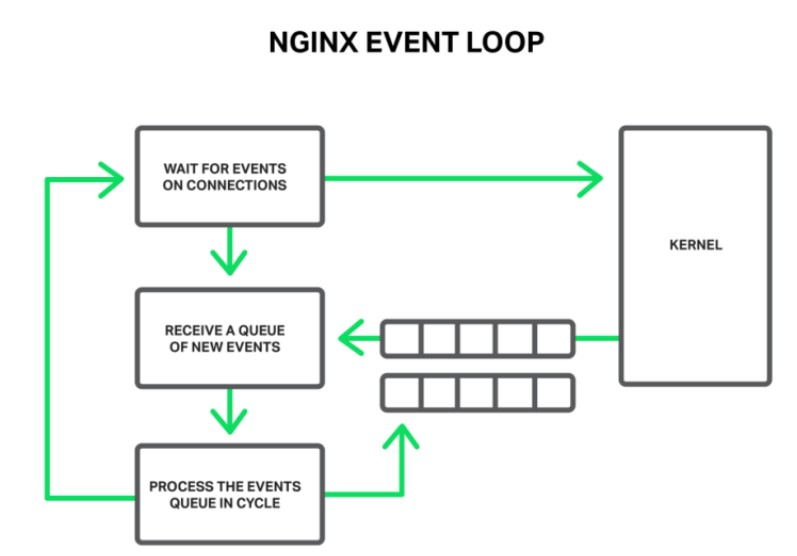

# Nginx

# 1. 개요

Nginx는 오픈 소스 **웹 서버(Web server)** 프로그램이다. 따라서 정적 파일 요청을 수행할 수 있을 뿐 아니라, 동적 요청에 대해서도 많은 트래픽을 효율적으로 처리함으로써 웹 어플리케이션 서버(WAS)에 과부하를 줄여준다.

Nginx는 대표적으로 리버스 프록시(reverse proxy), 로드 밸런서(load balancer), HTTP 캐싱(HTTP cahce) 기능을 수행할 수 있다. 이러한 기능등을 백서버의 안정성과 확장성을 가져다준다.

- **리버스 프록시(reverse proxy)**  
  클라이언트 요청을 대신 받아 내부 서버로 전달해주는 것을 말한다. 따라서 Nginx에 SSL 인증서를 적용함으로써 Nginx가 수신 SSL 연결을 처리/해독하고 프록시 서버의 응답을 암호화하도록 할 수 있다.

- **로드 밸런싱(load balancing)**
  클라이언트의 요청을 여러 개의 내부 서버에 분산하여 프록싱할 수 있다. 이를 통해 하나의 서버가 과부하되는 것을 방지할 수 있다.

- **HTTP 캐싱(HTTP Chacing)**
  프록시 서버의 응답에서 수신한 콘텐츠를 메모리에 캐싱함으로써, 이후 동일 요청에 대해 프록시 서버에 연결할 필요 없이 빠르게 응답할 수 있다.

## 1.1. Event-driven

Nginx가 Apache와의 차이점이자 강점은 event-driven 웹 서버라는 것이다.

먼저 기존 Apache의 경우, 하나의 요청에 대해 하나의 프로세스가 연결된다(1:1). 따라서 커넥션이 증가함에 따라 운용되는 프로세스 수가 증가하기 때문에 메모리 부족 현상이 일어나기 쉽다.

반면 **Nginx는 하나의 프로세스가 여러개의 요청을 처리할 수 있다(1:N).** Nginx는 요청을 하나의 event로 간주하고 이를 event loop가 관리하도록 한다. 요청이 들어오는 대로 event loop는 요청을 queue에 추가하고 순서대로 처리한다. 만일 특정 요청을 수행하는데 오랜 시간이 걸릴 경우 이를 Thread pool에 넘김으로써 비동기적으로 진행시키고, 그 사이에 다른 요청들을 수행한다.



위의 내용은 **브라우저의 event loop와도 매우 유사하게 동작한다.**

- 다만 브라우저는 사용자 입력에 대한 이벤트를 처리하는데 초점을 맞추고, Nginx는 네트워크 I/O동작을 처리하는데 초점을 맞춘다.
- 또한 브라우저는 단일 스레드만을 가지고 실행되지만, Nginx는 하나의 Master Process가 여러개의 Worker Process(Thread)를 생성할 수 있다.

## 1.2. Nginx 설치

아래 명령어는 리눅스 기반으로 작성되었다.

1. **Package 업데이트**
   ```bash
   sudo apt-get update
   ```
2. **Nginx 설치**
   ```bash
   sudo apt-get install nginx
   ```
3. **Nginx 설치 확인**
   ```bash
   sudo nginx -v
   ```

# 2. 폴더구조

Nginx는 설치되었을 때 기본적으로 다음과 같은 폴더 구조를 가진다.
[폴더 구조 설명 github](https://github.com/h5bp/server-configs-nginx)

```bash
nginx/
├── conf.d/
│   ├── default.conf
│   └── templates/
├── h5bp/
│   ├── basic.conf
│   ├── location/
│   └── .../
├── custom.d/
│   └── .../
├── mime.types
└── nginx.conf
```

## 2.1. nginx.conf

Nginx의 메인(최상단) 설정 파일이다. 아래 요약된 설정파일을 보면 하단에 `include /etc/nginx/conf.d/*.conf;`명령어가 있는 것을 볼 수 있다.
해당 명령어로 인해서 **conf.d/ 폴더 하위에 있는 `*.conf` nginx 설정파일들은 모두 http 블록 다이렉티브 안에 선언된다.**

```c
user www-data;
worker_processes auto;
pid /run/nginx.pid;
include /etc/nginx/modules-enabled/*.conf;

events {
        worker_connections 768;
        # multi_accept on;
}

http {

        ##
        # Basic Settings
        ##

        sendfile on;
        tcp_nopush on;
        tcp_nodelay on;
        keepalive_timeout 65;
        types_hash_max_size 2048;
        # server_tokens off;

        ...

        ##
        # Virtual Host Configs
        ##

        include /etc/nginx/conf.d/*.conf;
        include /etc/nginx/sites-enabled/*;
}

```

# 3. Directives

[Nginx 공식문서 주요 module Directvie](https://nginx.org/en/docs/http/ngx_http_core_module.html)

커맨드창 `nginx -t` 명령어를 통해 nginx 문법을 검사할 수 있다.

## 3.1. Block Directive

- **http block**
  http 프로토콜 내에서 동작함을 정의한다. 따라서 http 프로토콜 요청으로 동작하는 웹 서버 관련 설정은 모두 http 블록 안에서 정의된다.
  앞서 말한 `include /etc/nginx/conf.d/*.conf;` 또한 http 블록 내에서 선언되었기 때문에 `conf.d` 폴더 내의 설정파일들은 모두 http 프로토콜로 동작함을 전제한다.
- **server block**
  서버 기능을 설정하는 블록으로 어떤 도메인과 port로 요청을 받을지 결정한다.

  ```c
  server {
          listen  82;  // 포트 번호
          server_name "helloworld.com";  // 도메인
          // return을 따로 설정하지 않을 경우, nginx 자체 기본 html파일이 리턴된다.
  }
  ```

  위 코드에서 실제 호스트의 도메인이 아닌 이름으로 server_name을 설정하면, DNS에 도메인가 호스트가 매핑되어있지 않기 때문에 요청이 가지 않는 것이 당연하다

  ```c
  127.0.0.1 localhost
  127.0.0.1 helloworld.com

  # The following lines are desirable for IPv6 capable hosts
  ::1 ip6-localhost ip6-loopback
  fe00::0 ip6-localnet
  ff00::0 ip6-mcastprefix
  ff02::1 ip6-allnodes
  ff02::2 ip6-allrouters
  ff02::3 ip6-allhosts
  ```

  다만, local환경에서 요청을 보낼 경우, 위처럼 `/etc/hosts` 파일에 도메인과 ip주소를 매핑함으로써 DNS서버 앞단에서 도메인에 대한 ip주소를 임의 설정할 수 있다.

- **location block**
  사용자 요청에 대해 엔드포인트 별로 설정할 수 있다. 기본적으로 prefix 규칙을 따르지만, `=`연산자를 붙여서 엔드포인트가 완전히 일치할 경우만 정의해줄 수 있다.

  ```c
  server {
  	  listen  82;
          server_name "helloworld.com";

          location / {
              return 200 "hello world";
          }
          location /a/ {
              return 200 "hello world-a";
          }
          locatioin /b {
              return 200 "hello world-b";
          }
          location = /c/ {
              return 200 "hello world-c";
          }
  }
  ```

  위와 같이 설정하였을 때, curl요청에 대한 응답 예시이다.

  ```bash
  curl helloworld.com:82/
      hello world

  curl helloworld.com:82/a
      hello world

  curl helloworld.com:82/a/
      hello world-a

  curl helloworld.com:82/b
      hello world-b

  curl helloworld.com:82/c/
      hello world-c

  curl helloworld.com:82/c/c
      NotFound
  ```

## 3.2. Simple Directvie

- **root**
  **요청에 대해 root 폴더 경로를 지정**한다.
  아래 설정에서는 `/i/top.gif` 요청에 대해 `/data/w3/i/top.gif` 파일이 리턴된다.
  ```c
  location /i/ {
  	  root /data/w3;  // 상대경로와 절대경로 모두 사용 가
  }
  ```
- **index**
  **요청된 경로에 대한 기본 파일**을 지정한다. 따라서 요청에 특정 파일이 명시되지 않아도 기본 파일을 반환한다.
  여러개의 파일을 지정할 수 있으며 nginx는 순서대로 읽는다.
  ```c
  location / {
      index index.$geo.html index.html;
  }
  ```
- **try files**
  **사용자 요청에 대한 (동적인)기본 파일을 지정한다.** 사용자의 요청에 대한 파일을 동적으로 찾고, 모두 존재하지 않을 시 기본파일로 리다이렉트 할수 있다.
  ```c
  location / {
      try_files $uri $uri/ /index.html;
  }
  ```
  1. 요청된 URL에 대한 정적 파일 찾기 (**`$uri`**)
  2. 요청된 URL에 대한 디렉토리 찾기 (**`$uri/`**)
  3. **`/index.html`** 참조하기

# 4. Variable

[Nginx 공식문서 Embedded Variables](https://nginx.org/en/docs/http/ngx_http_core_module.html#variables)
Nginx는 설정 파일에서 사용할 수 있는 기본 변수들을 제공한다.

- **$uri**
  현재 요청된 URI를 저장한다.
  ```c
  http://example.com/about
  => /about
  ```
- **$request_uri**
  HTTP 요청 URI와 쿼리 문자열을 포함한 전체 요청 URI를 저장한다.
  ```c
  http://example.com/about?foo=bar
  => /about?foo=bar
  ```
- **$host**
  요청에 대한 호스트(도메인)이름을 저장한다.
  ```c
  http://www.example.com/
  => www.example.com
  ```
- **$server_name**
  server_name으로 지정된 값을 저장한다.
  ```c
  server {
  				server_name example.com
  }
  => example.com
  ```

# 5. feature

## 5.1. ssl certificate

- **Nginx 중지**
  인증서를 발급 받기 위해서는 nginx를 중지하여 port가 점유되지 않은 상태로 만들어야 한다.
  ```bash
  sudo systemctl stop nginx
  ```
- **letsencrypt 설치**
  ```bash
  sudo apt-get install letsencrypt
  ```
- **ssl 인증서 발급**
  ```bash
  sudo letsencrypt certonly --standalone -d [도메인주소]
  ```
- **ssl 인증서 확인**
  ```bash
  sudo cd /etc/letsencrypt/live/[도메인]
  ```
- **ssl 인증서 nginx 적용**

  ```bash
  cd /etc/nginx/conf.d
  sudo vim [파일명].conf
  ```

  [How to Set Up SSL with NGINX](https://www.youtube.com/watch?v=X3Pr5VATOyA)

  ```bash
  server {
  	listen 80;
  	server_name [도메인 네임];
  	return 301 https://$server_name$request_uri;
  }

  server {
  	listen 443 ssl;
  	server_name [도메인 네임];

  	ssl_certificate /etc/nginx/ssl/example.crt;
  	ssl_certification_key /etc/nginx/ssl/example.key;

  	location / {
  		...
  	}
  }
  ```

## 5.2. reverse proxy

```c
server {
    listen 80;
    server_name my_website.com;

    location / {
        proxy_pass http://10.0.0.1:8080;
        proxy_set_header Host $host;
        proxy_set_header X-Real-IP $remote_addr;
    }
}
```

- **server block**  
  포트 80에서 my_website.com 도메인을 수신하는 서버 블록을 정의한다.
- **location block**  
  '/' 로 모든 엔드포인트에 대해 설정한다.
- **proxy_pass**  
  10.0.0.1:8000 으로 서버로 요청을 프록시합니다.
- **proxy_set_header**  
  나가는 요청의 호스트 및 X-Real-IP 헤더를 설정한다. $remote_addr는 클라이언트 주소를 의미한다. 이를 통해 요청이 백엔드 서버로 올바르게 라우팅되고 올바른 클라이언트 IP 주소가 기록되도록 할 수 있다.

## 5.3. load balancing

```c
http {
    upstream my_backend {
        server 10.0.0.1:8080;
        server 10.0.0.2:8080;
        server 10.0.0.3:8080;
    }

    server {
        listen 80;
        server_name my_website.com;

        location / {
            proxy_pass http://my_backend;
            proxy_set_header Host $host;
            proxy_set_header X-Real-IP $remote_addr;
        }
    }
}
```

- **upstream block**  
  upstream 블록을 my_backend라고 이름 짓고, Nginx가 요청을 밸런싱할 서버를 담는다.

- **proxy_pass**  
  proxy_pass 디렉티브를 사용하여 my_backend 업스트림을 프록싱할 대상으로 지정한다.

- **proxy_set_header**  
  나가는 요청의 호스트 및 X-Real-IP 헤더를 설정한다. $remote_addr는 클라이언트 주소를 의미한다.

위 예시에서 Nginx는 라운드 로빈 방식으로 요청을 3개의 백엔드 서버에 밸런싱하여, 각 서버는 동일한 양의 수신 트래픽을 나눠가진다.

## 5.4. HTTP caching

[http proxy module](http://nginx.org/en/docs/http/ngx_http_proxy_module.html#proxy_cache)

HTTP Caching은 cache key를 이용해서 이뤄진다. cache key는 HTTP 요청 method, URI, header등을 조합해서 만들 수 있다.

```c
http {
    proxy_cache_path /var/cache/nginx levels=1:2 keys_zone=my_cache:10m inactive=60m;
    proxy_cache_key "$scheme$request_method$host$request_uri";

    server {
        listen 80;
        server_name my_website.com;

        location / {
            proxy_cache my_cache;
            proxy_cache_valid 200 60m;
            proxy_cache_valid 404 1m;
            proxy_cache_bypass $http_pragma;
            proxy_cache_revalidate on;
            proxy_set_header Host $host;
            proxy_set_header X-Real-IP $remote_addr;
            proxy_pass http://10.0.0.1:8080;
        }
    }
}
```

- **proxy_cache_path**
  HTTP 캐시의 위치 설정.
  캐시 경로는 /var/cache/nginx이고,
  level=1:2는 캐싱 경로의 하위 디렉토리 크기를 결정한다.
  또한 my_cache라는 10MB의 크기를 가진 공유 메모리 영역을 만든다.
  마지막으로 캐싱된 항목은 60분까지 접근 되지 않아도 캐시에 저장된다.

- **proxy_cache_key**
  $scheme(http/https), $request_method(요청 메소드), $host(호스트), $request_uri(URI)를 조합하여 캐시 키를 생성한다.

- **proxy_cache**
  캐싱에 사용되는 공유 메모리 영역을 정의한다.

- **proxy_cache_valid**
  응답을 캐싱할 기간을 설정한다.
  상태 코드가 200인 성공 응답은 60분 동안, 상태 코드가 404인 실패 응답은 1분 동안 저장한다.

- **proxy_cache_bypass**
  캐시에서 응답을 가져오지 않는 조건을 정의한다.
