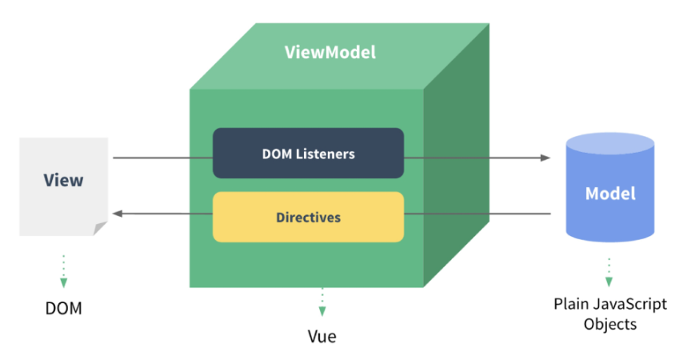
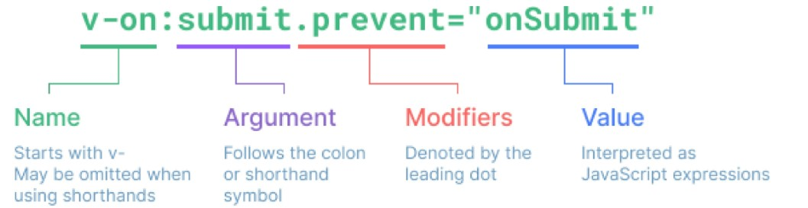

# 1. Intro

## 1.1. What is Front-end Development?

Making user interface with a single-page application.

### 1.1.1. SPA(Single Page Appplication)

The web page or the web app which receives only one HTML file from a server and responds to multilple user requests.

**How?**  
By using CSR(Client Side Rendering) method.

### 1.1.2. SSR(Server Side Rendering)

A server renders html documents and send it to the client.

**Characteristics**

- Traffic is easy to be overloaded, cause a whole html document should be sended everytime when the page is refreshed.

### 1.1.3. CSR(Client Side Rendering)

**Procedure**

1. Client(Browser) receives only one html file at first and re-rendering the html with JavScript
2. Required data is requested to the server through AJAX, and the server responses with JSON
3. JSON data is processed with JavaScript at the client side

**Characteristics**

- The initial operation takes a longer time.
- It's not preferable for SEO(Search Engine Optimization)

## 1.2. What is Front-end Framework?

Tool for easily working with HTML, CSS and JavaScript. If you use front-end framework, it's much **easier to manage the data** and construct reactive pages.

It's not necessary to use front-end framework, but it's strongly recommended for higher productivity and collaboration.

### 1.2.1. Vue

**Developer: Evan You**

- Bachelor of arts / Master of Design Technology
- former Angular developer in Google
- Presented Vue in 2014

**Characteristics**

- Easy to be learned because of its simple structure
- Easy to learn other front-end frameworks because they're similar

### 1.2.2. How to start Vue?

It's recommended to use Vue2 so far, because the new version is not being used widely yet.

- **CDN**

  - Paste the script below before the main \<script> code. [Vue2 CDN Link](https://v2.vuejs.org/v2/guide/)
  - <mark>We will learn the basics of Vue with this method in this chapter.</mark>

    ```html
    <script src="https://cdn.jsdelivr.net/npm/vue@2/dist/vue.js"></script>
    ```

* **`npm install`**
  - You can make a Vue project and write the code according to the format.
  - This method will be discussed in the next chapter.

# 2. Vue Instance

## 2.1. MVVM Pattern



### 2.1.1. Model

It indicates **JavaScript Object.** Cosidering that JavaScript Objects will be converted to JSON file and sent to the server. Model can be considered as data in DB.

### 2.1.2. View

It indicates **DOM.** Cosidering that The DOM is the same as the html document. View can be considered as HTML document.

### 2.1.3. View Model

It indicates **Vue instance.** Vue instance is made from Vue class which contains a variety of methods defined by Vue.

**Roles**  
Intermediates between view and model by **being attached to an element in DOM** and **cotaining JS code in the instance.**

**Code Example**

```html
<body>
  <div id="app">
    <p id="name">name : {{ message }}</p>
    <input id="inputName" type="text" v-model="message" />
  </div>

  <script src="https://cdn.jsdelivr.net/npm/vue@2/dist/vue.js"></script>
  <script>
    // Vue instance
    const app = new Vue({
      // add this object to the #app element
      el: "#app",
      // JavaScript Syntax
      data: {
        message: "Hello, Vue!",
      },
      methods: {
        arrowBye: () => {
          this.message = "Arrow Function?"
          console.log(this)
        },
      },
    })
    vm.message = "Hello," // available
  </script>
</body>
```

## 2.2. Vue Instance Attributes

**Example Code**

```js
const app = new Vue({
  el: "#app",
  data: {
    number: 0,
    number1: 100,
    number2: 100,
  },
  computed: {
    add_computed: function () {
      return this.number1 + this.number2
    },
  },
  methods: {
    add_method: function () {
      return this.number1 + this.number2
    },
    watch: {
      number: function (val, oldVal) {
        console.log(val, oldVal)
      },
    },
  },
})
```

### 2.2.1. **el**

- The Vue instance will be attached(mounted) to the element selected as the value of 'el' key
- The Vue instance is only effective with the selected element

### 2.2.2. **data**

- The elements of the 'data' attribute act like instance varibles
- Data can be rendered with '{{}}' in the view
- The elements of the 'data' object can be accessed through `vueInstance(this).$data.key`, and **it can be shortened as `vueInstance(this).key`**

### 2.2.3. **computed**

- The function elements in the 'computed' also act like instance vairiables
- But it's different from 'data' in that it stores the return value of the function which processes the original data
- It's also different from methods, cause it only excutes the function when the related data is changed

### 2.2.4. **methods**

- The elements of the 'methods' attribute act like instance methods.
- <mark>Methods must not be declared as arrwo function!</mark> If then `this` in the mehtod whill indicates window, but not vueInstance.
- As a matter of fact, all the fucntions in the methods exists right under the vue instance, so **`this` in the methods indicates the vue instance.**

### 2.2.5. **watch**

- The elements of the 'methods' attribute are functions which detect a change of a certain data.
- The name of the key should be same to the detecting data
- The function gets two parameters automatically. The first value is the changed value, and the second value is the previous value.
- The function can be replaced with a vue method by allocating the name of the method as a string to `handler` key's value.
- `deep: true`is for detecting elements of Array or Object.

  ```js
  const app = new Vue({
    el: "#app",
    data: {
      number: 0,
      name: "",
      myObj: { completed: true },
    },
    methods: {
      nameChange: function () {
        console.log("name is changed")
      },

      itemChange: function () {
        this.myObj.completed = !this.myObj.completed
      },
    },
    watch: {
      number: function (val, oldVal) {
        console.log(val, oldVal)
      },

      name: {
        handler: "nameChange",
      },

      myObj: {
        handler: function (val) {
          console.log(val)
        },
        deep: true,
      },
    },
  })
  ```

### 2.2.6. **filters**

- Methods that gets the data before `|` as the parameter in JavaScript expression(interpolation or v-bind). It can be used consecutively.

  ```js
  <div id="app">
    <p>{{ numbers | getOddNums | getUnderTenNums }}</p>
  </div>

  <script src="https://cdn.jsdelivr.net/npm/vue@2/dist/vue.js"></script>
  <script>
    const app = new Vue({
      el: '#app',
      data: {
        numbers: [1, 2, 3, 4, 5, 6, 7, 8, 9, 10, 11, 12, 13, 14, 15],
      },
      filters: {
        getOddNums: function (nums) {
          const oddNums = nums.filter((num) => {
            return num % 2
          })
          return oddNums
        },

        getUnderTenNums: function (nums) {
          const underTen = nums.filter((num) => {
            return num < 10
          })
          return underTen
        }
      }
    })
  </script>
  ```

## 2.3. Template Syntax

How to bind DOM to Vue instance

### 2.3.1. Declarative Rendering

The part written with '{{ }}' is binded with data in the vue instance. JavaScript can be used in the area.

**Example Code**

```html
<div id="app">
  <p>{{ msg }}</p>
  <p>{{ msg.split('').reverse().join('') }}</p>
</div>

<script src="https://cdn.jsdelivr.net/npm/vue@2/dist/vue.js"></script>
<script>
  const app = new Vue({
    el: "#app",
    data: {
      msg: "Text interpolation",
    },
  })
</script>
```

### 2.3.2. Raw HTML

If you want to a string as HTML syntax, 'v-html' directive can be one of solutions. But It **MUST NOT** be used contents which users input or provide.
<mark>[XSS attack](http://blog.plura.io/?p=7614)</mark>

**Example Code**

```html
<div id="app">
  <p>
    HTML msg:
    <span v-html="rawHTML"></span>
  </p>
</div>

<script src="https://cdn.jsdelivr.net/npm/vue@2/dist/vue.js"></script>
<script>
  const app = new Vue({
    el: "#app",
    data: {
      rawHTML: '<span style="color: red;">Red Letters</span>',
    },
  })
</script>
```

# 3. Vue Directives

  
The attributes which starts with 'v-' get **JavaScript expression** as the value. The role of the directive is that what to do reactively when the expression value changes.

## 3.1. v-text

It functions similar to template interpolation '{{ }}'

**Example Code**

```html
<body>
  <div id="app">
    <!-- <h3>{{ myNum }}</h3> -->
    <h3 v-text="myNum"></h3>
  </div>

  <script src="https://cdn.jsdelivr.net/npm/vue@2.7.13/dist/vue.js"></script>
  <script>
    new Vue({
      el: "#app",
      data: {
        myNum: 0,
      },
    })
  </script>
</body>
```

## 3.2. v-show & v-if

### 3.2.1. v-show

**Expensive initial load. Cheap toggle.**  
Toggle the value of 'display' attribute of the element according to the value of JavaScript expression (Boolean). It still can be found in DOM.

- True: none;
- False: original_value;

### 3.2.2. v-if

**Cheap initial load. Expensive toggle.**  
If the the value of JavaScript expression is false, the element is not be rendered at all.

**Example Code**

```html
<div id="app3">
  <p v-show="isActive">v_show</p></p>
  <p v-if="isActive">v_if</p>
</div>

<script src="https://cdn.jsdelivr.net/npm/vue@2/dist/vue.js"></script>
<script>
  // v-show && v-if
  const app3 = new Vue({
    el: '#app3',
    data: {
      isActive: false,
    },
  })
</script>
```

## 3.3. v-for

The JavaScript format looks like this: `for .. in ..`

**:key**
It's the attribute which should be added with v-for directive.
The key of each element must be **distinguishable from other elements.** It's also recommended to use **the value that each element actually contains**, not such like the index value.

**Example Code**

```html
<div id="app">
  <h2>String</h2>
  <div v-for="char in myStr">{{ char }}</div>
  <div v-for="(char, index) in myStr" :key="index">
    <p>{{ index }}th character '{{ char }}'</p>
  </div>

  <h2>Array</h2>
  <div v-for="(item, index) in myArr" :key="`ssafy-${index}`">
    <p>{{ index }}th item {{ item }}</p>
  </div>

  <div v-for="(item, index) in myArr2" :key="`arry-${index}`">
    <p>{{ index }}th item</p>
    <p>{{ item.name }}</p>
  </div>

  <h2>Object</h2>
  <div v-for="value in myObj">
    <p>{{ value }}</p>
  </div>

  <div v-for="(value, key) in myObj" :key="key">
    <p>{{ key }} : {{ value }}</p>
  </div>
</div>

<script src="https://cdn.jsdelivr.net/npm/vue@2/dist/vue.js"></script>
<script>
  const app = new Vue({
    el: "#app",
    data: {
      // 1. String
      myStr: "Hello, World!",

      // 2-1. Array
      myArr: ["python", "django", "vue.js"],

      // 2-2. Array with Object
      myArr2: [
        { id: 1, name: "python", completed: true },
        { id: 2, name: "django", completed: true },
        { id: 3, name: "vue.js", completed: false },
      ],

      // 3. Object
      myObj: {
        name: "harry",
        age: 27,
      },
    },
  })
</script>
```

## 3.4. v-on

Its function is similar to `addEventListener()`. The JavaScript expression function is excuted when the event corresponding to the argument occurs. The callback function also gets the `event` as the first parameter.
**It can be abbreviated to '@'.**

**Example Code**

```html
<div id="app">
  <button v-on:click="number++">increase Number</button>
  <p>{{ number }}</p>

  <button @click="checkActive(isActive)">check isActive</button>
</div>

<script src="https://cdn.jsdelivr.net/npm/vue@2/dist/vue.js"></script>
<script>
  const app = new Vue({
    el: "#app",
    data: {
      number: 0,
      isActive: false,
    },
    methods: {
      toggleActive: function () {
        this.isActive = !this.isActive
      },

      checkActive: function (check) {
        console.log(check)
      },
    },
  })
</script>
```

## 3.5. v-bind

It binds the basic **html attributes** to **Vue data**. **It can be abbreviated to ':'.**

### 3.5.1. :class

- **Conditional Biding**

  - {'className': 'jsExpression'}

- **Multiple Binding**
  - ['jsExpression', 'jsExpression', 'jsExpression', ...]

**Example Code**

```html
<div id="app2">
  <a v-bind:href="url">Go To GOOGLE</a>

  <p :class="redTextClass">Red Letter</p>
  <p :class="{ 'red-text': true }">Red Letter</p>

  <p v-bind:class="[redTextClass, borderBlack]">Red Letter in a Black Box</p>

  <p :class="theme">Mode</p>
  <button @click="darkModeToggle">dark Mode {{ isActive }}</button>
</div>

<script src="https://cdn.jsdelivr.net/npm/vue@2/dist/vue.js"></script>
<script>
  const app2 = new Vue({
    el: "#app2",
    data: {
      url: "https://www.google.com/",
      redTextClass: "red-text",
      borderBlack: "border-black",
      isActive: true,
      theme: "dark-mode",
    },
    methods: {
      darkModeToggle() {
        this.isActive = !this.isActive
        if (this.isActive) {
          this.theme = "dark-mode"
        } else {
          this.theme = "white-mode"
        }
      },
    },
  })
</script>

<style>
  .red-text {
    color: red;
  }
  .border-black {
    border: solid 1px black;
  }

  .dark-mode {
    color: white;
    background-color: black;
  }

  .white-mode {
    color: black;
    background-color: white;
  }
</style>
```

## 3.6. v-model

<mark>Bidirectional Binding.</mark> If the user inputs value, the data is applied to the binded data, and vice versa.

**Limitation**  
In the case of combinatorial characters, the results are reflected only when one character is completed.

**Example Code**

```html
<div id="app">
  <h2>2. Input <-> Data</h2>
  <h3>{{ myMessage2 }}</h3>
  <input v-model="myMessage2" type="text" />
  <hr />
</div>

<script src="https://cdn.jsdelivr.net/npm/vue@2/dist/vue.js"></script>
<script>
  const app = new Vue({
    el: "#app",
    data: {
      myMessage2: "",
    },
  })
</script>
```
