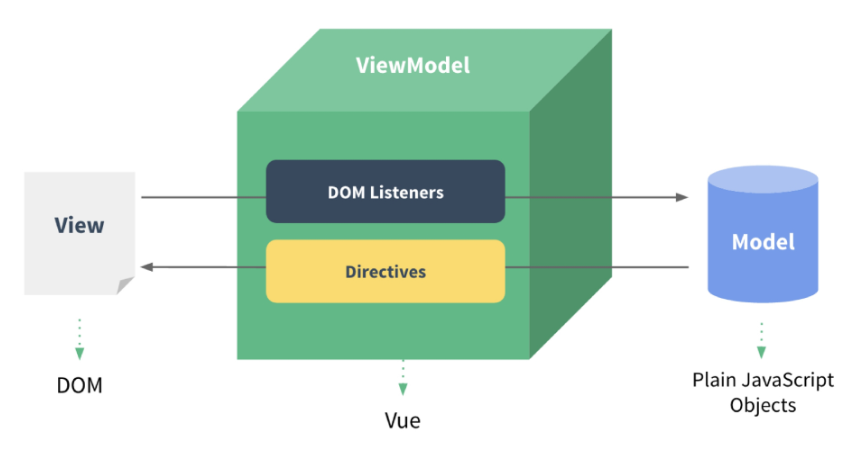

# 1. Intro

## 1.1. What is Front-end Development?

Making user interface with a single-page application.

### 1.1.1. SPA(Single Page Appplication)

The web page or the web app which receives only one HTML file from a server and responds to multilple user requests.

**How?**
By using CSR(Client Side Rendering) method.

### 1.1.2. SSR(Server Side Rendering)

A server renders html documents and send it to the client.

**Characteristics**

- Traffic is easy to be overloaded, cause a whole html document should be sended everytime when the page is refreshed.

### 1.1.3. CSR(Client Side Rendering)

**Procedure**

- Client(Browser) receives only one html file at first and re-rendering the html with JavScript
- Required data is requested to the server through AJAX, and the server responses with JSON
- JSON data is processed with JavaScript at the client side

**Characteristics**

- The initial operation takes a longer time.
- It's not preferable for SEO(Search Engine Optimization)

## 1.2. What is Front-end Framework?

Tool for easily working with HTML, CSS and JavaScript. If you use front-end framework, it's much **easier to manage the data** and construct reactive pages.

It's not necessary to use front-end framework, but it's strongly recommended for higher productivity and collaboration.

### 1.2.1. Vue

**Developer: Evan You**

- Bachelor of arts / Master of Design Technology
- former Angular developer in Google
- Presented Vue in 2014

**Characteristics**

- Easy to be learned because of its simple structure
- Easy to learn other front-end frameworks because they're similar

### 1.2.2. How to start Vue?

It's recommended to use Vue2 so far, because the new version is not being used widely yet.

**CDN**

- Paste the script below before the main \<script> code. [Vue2 CDN Link](https://v2.vuejs.org/v2/guide/)
- <mark>We will learn the basics of Vue with this method in this chapter.</mark>
  ```html
  <script src="https://cdn.jsdelivr.net/npm/vue@2/dist/vue.js"></script>
  ```

**`npm install`**

- You can make a Vue project and write the code according to the format.
- This method will be discussed in the next chapter.

# 2. Vue Instance

## 2.1. MVVM Pattern



### 2.1.1. Model

It indicates **JavaScript Object.** Cosidering that JavaScript Objects will be converted to JSON file and sent to the server. Model can be considered as data in DB.

### 2.1.2. View

It indicates **DOM.** Cosidering that The DOM is the same as the html document. View can be considered as HTML document.

### 2.1.3. View Model

It indicates **Vue instance.** Vue instance is made from Vue class which contains a variety of methods defined by Vue.

**Roles**

- Intermediates between view and model by **being attached to an element in DOM** and **cotaining JS code in the instance.**

**Code Example**

```html
<body>
  <div id="app">
    <p id="name">name : {{ message }}</p>
    <input id="inputName" type="text" v-model="message" />
  </div>

  <script src="https://cdn.jsdelivr.net/npm/vue@2/dist/vue.js"></script>
  <script>
    // Vue instance
    const app = new Vue({
      // add this object to the #app element
      el: "#app",
      // JavaScript Syntax
      data: {
        message: "Hello, Vue!",
      },
      methods: {
        arrowBye: () => {
          this.message = "Arrow Function?"
          console.log(this)
        },
      },
    })
    vm.message = "Hello," // available
  </script>
</body>
```

## 2.2. Vue Instance Attributes

```js
const app = new Vue({
  el: "#app",
  data: {
    number1: 100,
    number2: 100,
  },
  computed: {
    add_computed: function () {
      return this.number1 + this.number2
    },
  },
  methods: {
    add_method: function () {
      return this.number1 + this.number2
    },
  },
})
```

### 2.2.1. **el**

- The Vue instance will be attached(mounted) to the element selected as the value of 'el' key
- The Vue instance is only effective with the selected element

### 2.2.2. **data**

- The elements of the 'data' attribute act like instance varibles
- Data can be rendered with '{{}}' in the view
- The elements of the 'data' object can be accessed through `vueInstance(this).$data.key`, and **it can be shortened as `vueInstance(this).key`**

### 2.2.3. **computed**

- The function elements in the 'computed' also act like instance vairiables
- But it's different from 'data' in that it stores the return value of the function which processes the original data
- It's also different from methods, cause it only excutes the function when the related data is changed

### 2.2.4. **methods**

- The elements of the 'methods' attribute act like instance methods.
- <mark>Methods must not be declared as arrwo function!</mark> If then `this` in the mehtod whill indicates window, but not vueInstance.

## 2.3. Template Syntax

How to bind DOM to Vue instance

### 2.3.1. Declarative Rendering

The part written with '{{ }}' is binded with data in the vue instance. JavaScript can be used in the area.

```html
<div id="app">
  <p>{{ msg }}</p>
  <p>{{ msg.split('').reverse().join('') }}</p>
</div>

<script src="https://cdn.jsdelivr.net/npm/vue@2/dist/vue.js"></script>
<script>
  const app = new Vue({
    el: "#app",
    data: {
      msg: "Text interpolation",
    },
  })
</script>
```

### 2.3.2. Raw HTML

If you want to a string as HTML syntax. You should use 'v-html' directive

```html
<div id="app">
  <p>
    HTML msg:
    <span v-html="rawHTML"></span>
  </p>
</div>

<script src="https://cdn.jsdelivr.net/npm/vue@2/dist/vue.js"></script>
<script>
  const app = new Vue({
    el: "#app",
    data: {
      rawHTML: '<span style="color: red;">Red Letters</span>',
    },
  })
</script>
```

# 3. Directives

## 2.2. Declarative Rendering

Vue 객체
미리 정의 된 속성과 메소드를 이용

Vue instace를 만들 대는 하나의 객체를 집어 넣는다.

선언적 렌더링: 아예 html에다가 데이터를 집어 넣음

```html
<body>
  d
  <div id="app">
    {{ message + ' Byongho'}}
    <!--  JS문법의 영역이다. -->
  </div>

  <script src="https://cdn.jsdelivr.net/npm/vue@2.7.13/dist/vue.js"></script>
  <script>
    const vm = new Vue({
      el: "#app", // 나 여기에 인스턴스를 붙일 꺼고, 그 요소에서는 메소드를 사용가능하다.
      data: {
        // 자기가 가지고 있는 데이터를 미리 정의하고, Vue가 이를 감지해서 DOM에 반영
        message: "Hello, vue!",
      },
    })
    vm.message = "Hello," // 바로 반영
  </script>
</body>
```

# Vue Directives

디렉티브: vue가 가진 기능을 사용하겠금 하는 속성!
v-text

```html
<body>
  <div id="app">
    <!-- <h3>{{ myNum }}</h3> -->
    <h3 v-text="myNum"></h3>
  </div>

  <script src="https://cdn.jsdelivr.net/npm/vue@2.7.13/dist/vue.js"></script>
  <script>
    new Vue({
      el: "#app",
      data: {
        myNum: 0,
      },
    })
  </script>
</body>
```

coumputed

```html
<body>
  <div id="app">
    <h3>금액: {{money}}</h3>
    <h3>포인트: {{point}}</h3>
  </div>

  <script src="https://cdn.jsdelivr.net/npm/vue@2.7.13/dist/vue.js"></script>
  <script>
    new Vue({
      el: "#app",
      data: {
        money: 50000,
        ratio: 0.05,
        // point: this.money * this.ratio  // Nan. data가 변경될 때마다, 새롭게 계산되어 재정의 되어야 할 경우 v-computed속성을 사용한다.
      },
      computed: {
        // 확장된 데이터라고 생각!! 함수나 메소드보다는
        // point: function() {
        //   return this.money * this.ratio
        // }
        point() {
          return this.money * this.ratio
        },
      },
    })
  </script>
</body>
```

v-on: === @

```html
<body>
  <div id="app">
    <button id="myBtn">Click me</button>
    <p id="myElem">0</p>
  </div>

  <script>
    // Vanilla JS
    const myBtn = document.querySelector("#myBtn")
    const myElem = document.querySelector("#myElem")
    let value = parseInt(myElem.innerText) // it was 0, not {{ myNum }}

    myBtn.addEventListener("click", function (event) {
      value += 1
      myElem.innerText = value
    })
  </script>
</body>
```

```html
<body>
  <div id="app">
    <button id="myBtn" v-on:click="plusNum">Click me</button>
    <p id="myElem">{{ myNum }}</p>
  </div>

  <script src="https://cdn.jsdelivr.net/npm/vue@2.7.13/dist/vue.js"></script>

  <script>
    // Vue.js
    const vm = new Vue({
      el: "#app",
      data: {
        myNum: 0,
      },
      methods: {
        // plusNum: function() {
        //   this.myNum += 1
        // }
        plusNum() {
          this.myNum += 1
        },

        // plusNum: () => {
        //   this.myNum += 1
        // }
        // 이거 안됨. arrow function을 쓰면 메서드가 정의된 곳의 하나 상위의 객체를 가리킨다.
        // 근데 하나 상위의 객체가 Vue 아냐? function일때 methods인거고

        // 우리는 Vue라는 인스턴스가 어더한 구조를 가지고 있는지 살펴보아야 한다.
        // 콘솔창에서 찍어보면 모든 나란히 병렬적으로 vue인스턴스에 바로 붙는다.
        // 즉 구조상으로 plusNum은 바로 vue객체 안쪽에 있음.
        // 그래서 다들 메서드 정의 시에는 화살표 함수 쓰지 말라고 하는 것!
      },
    })
    console.log(vm)
  </script>
</body>
```

v-bind: === :
속성을 바인드 하고 싶을 때

```html
<style>
  #before {
    background-color: greenyellow;
  }
  #after {
    background-color: yellow;
  }
</style>

<body>
  <div id="app">
    <p id="`${elemId}`" @click="clicked">Click me</p>
  </div>

  <script src="https://cdn.jsdelivr.net/npm/vue@2.7.13/dist/vue.js"></script>

  <script>
    // Vue.js
    new Vue({
      el: "#app",
      data: {
        elemId: "before",
      },
      methods: {
        clicked() {
          this.elemId = "after"
        },
      },
    })
  </script>
</body>
```

```html
<style>
  #before {
    background-color: greenyellow;
  }
  #after {
    background-color: yellow;
  }
</style>

<body>
  <div id="app">
    <p :id="elemId" @click="clicked">Click me</p>
  </div>

  <script src="https://cdn.jsdelivr.net/npm/vue@2.7.13/dist/vue.js"></script>

  <script>
    // Vue.js
    new Vue({
      el: "#app",
      data: {
        elemId: "before",
      },
      methods: {
        clicked() {
          this.elemId = "after"
        },
      },
    })
  </script>
</body>
```

```html
<style>
  .errorColor {
    color: tomato;
  }
</style>

<body>
  <div id="app">
    <h3 :class="errorText">ERROR</h3>
  </div>

  <script src="https://cdn.jsdelivr.net/npm/vue@2.7.13/dist/vue.js"></script>

  <script>
    new Vue({
      el: "#app",
      data: {
        isError: false,
      },
      computed: {
        errorText() {
          return this.isError ? "errorColor" : null
        },
      },
    })
  </script>
</body>
```

v-if:
조건에 따라 태그를 조작
data or computed의 값

```html
<body>
  <div id="app">
    <div v-if="seen">Wait a second, please</div>
    <div v-else=>Welcome!</div>

    <div v-if="member === 'Kim'">Wait a second, please</div>
    <div v-else-if="member === 'harry'">Welcome!</div>
    <div v-else>Who's this?</div>
  </div>

  <script src="https://cdn.jsdelivr.net/npm/vue@2.7.13/dist/vue.js"></script>

  <script>
    new Vue({
      el: '#app',
      data: {
        seen: true,
        member: 'harry',
      }
    })
  </script>
</body>
```

v-show:
요소가 dom에 있지만 style="display: none" 처리된다.\

```html
<body>
  <div id="app">
    <div v-if="seen">being seen</div>
    <div v-show="seen">being seen</div>
  </div>

  <script src="https://cdn.jsdelivr.net/npm/vue@2.7.13/dist/vue.js"></script>

  <script>
    new Vue({
      el: "#app",
      data: {
        seen: false,
      },
    })
  </script>
</body>
```

v-model
사용자의 input값이 data를 바꿈 -> 바뀐 데이터가 dom에 적용
또한, 연결된 data값의 변경이 input의 value를 바꿈. 3가지가 바인딩(input - data - dom)

```html
<body>
  <div id="app">
    <input type="text" @input="inputFunc" />
    <p>{{message}}</p>
  </div>

  <script src="https://cdn.jsdelivr.net/npm/vue@2.7.13/dist/vue.js"></script>

  <script>
    new Vue({
      el: "#app",
      data: {
        message: "",
      },
      methods: {
        inputFunc(event) {
          // event발생시 event객체를 콜백함수의 첫번째 인자로 받음. event 안써도 되기는 하네
          console.log(event)
          this.message = event.target.value
        },
      },
    })
  </script>
</body>
```

```html
<body>
  <div id="app">
    <input v-model="message" />
    <p>{{message}}</p>
  </div>

  <script src="https://cdn.jsdelivr.net/npm/vue@2.7.13/dist/vue.js"></script>

  <script>
    new Vue({
      el: "#app",
      data: {
        message: "",
      },
    })
  </script>
</body>
```

watch
data만 감시하고 coupted는 못받네
언제씀??? 두개는 상호호환가능.
couputed는 데이터의 가공
watch는 변경될 때 실행해야하는 무거운 작업

```html
<body>
  <div id="app">
    <h1>{{num}}</h1>
    <h1>{{doubleNum}}</h1>
    <button @click="plus">+</button>
  </div>

  <script src="https://cdn.jsdelivr.net/npm/vue@2.7.13/dist/vue.js"></script>

  <script>
    new Vue({
      el: "#app",
      data: {
        num: 0,
      },
      computed: {
        doubleNum() {
          return this.num * 2
        },
      },
      methods: {
        plus() {
          this.num++
        },
      },
      watch: {
        num(newValue, oldValue) {
          console.log(oldValue, newValue)
        },
        // doubleNum(newValue, oldValue) {
        //   console.log(oldValue, newValue)
        // }
      },
    })
  </script>
</body>
```

v-for

```html
<body>
  <div id="app">
    <ul>
      <li v-for="fruit in fruits">{{ fruit }}</li>
    </ul>
    <ul>
      <li v-for="(fruit, index) in fruits">{{ index }} - {{ fruit }}</li>
    </ul>
    <ul>
      <li v-for="(todo, index) in todos">
        {{ index + 1 }} - {{ todo.context }}
      </li>
    </ul>

    <ul>
      <li v-for="todo in todos" v-if="!todo.completed">{{ todo.context }}</li>
    </ul>
    <!-- Not Recommended -->
    <!--
      v-for가 v-if보다 먼저 실행되야함. vue3부터 근데 v-if가 우선순위가 높아짐.
      그래서 두개로 나눠서 하기를 추천
    -->
    <ul>
      <template v-for="todo in todos">
        <li v-if="!todo.completed">{{ todo.context }}</li>
      </template>
    </ul>
    <!-- template속성은 실제 DOM에서 표시되지는 않음 -->
  </div>

  <script src="https://cdn.jsdelivr.net/npm/vue@2.7.13/dist/vue.js"></script>

  <script>
    new Vue({
      el: "#app",
      data: {
        fruits: ["apple", "banana", "coconut"],
        todos: [
          { id: 1, context: "todo1", completed: false },
          { id: 2, context: "todo2", completed: true },
          { id: 3, context: "todo3", completed: false },
        ],
      },
    })
  </script>
</body>
```

돔의 변경 사항을 추적할 때, key가 정해져있으면 훨신 빨리 추적한다.

```html
<body>
  <div id="app">
    <ul>
      <template v-for="(todo,idx) in todos" :key="`todo-${idx}`">
        <li v-if="!todo.completed">{{ todo.context }}</li>
      </template>
    </ul>
    <!-- template속성은 실제 DOM에서 표시되지는 않음 -->
  </div>

  <script src="https://cdn.jsdelivr.net/npm/vue@2.7.13/dist/vue.js"></script>

  <script>
    new Vue({
      el: "#app",
      data: {
        fruits: ["apple", "banana", "coconut"],
        todos: [
          { id: 1, context: "todo1", completed: false },
          { id: 2, context: "todo2", completed: true },
          { id: 3, context: "todo3", completed: false },
        ],
      },
    })
  </script>
</body>
```
