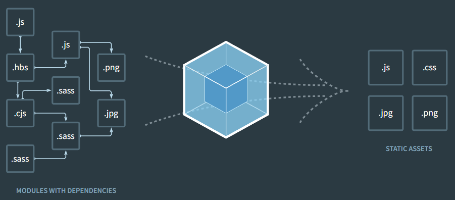
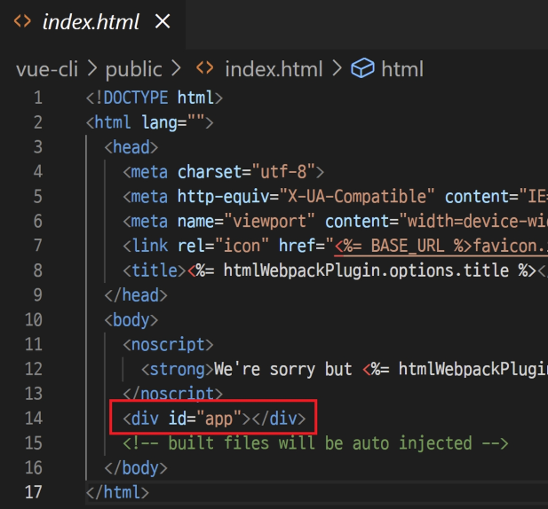
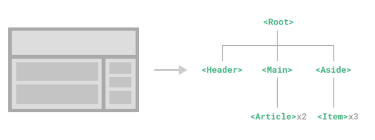
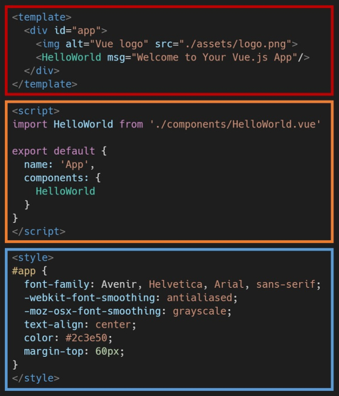

# 1. Vue CLI

## 1.1. Node.js

JavaScript was the language for browser, but Node.js, the runtime environment based on Chrome V9, makes it possible to run JavaScript outside the browser.

### 1.1.1. Runtime Environment

[What is runtime environment?](https://www.underthehoodlearning.com/what-is-runtime-environment/)
The virtual machine environment(software platform) on which codes are excuted, so that the code can run regardless of the OS type.

### 1.1.2. NPM(Node Package Manager)

The default pacakage manger of JavaScript. Package manager helps the developers intall external libraries and manages the packages installed.
In the case of Vue, when the new package is installed through npm, it's automatically registered at ['package-lock.json'](#135-package-lockjson)

## 1.2. Vue CLI

The CLI (@vue/cli) provides the vue command in your terminal. It provides the ability to quickly scaffold a new project via vue create. You can also manage your projects using a graphical user interface via vue ui.

### 1.2.1. Vue CLI Start

**Install**  
`npm install -g @vue/cli`

**Create a project**  
`vue create my-project`  
The project folder is created as a local repository. However, if the project is created in a local repository, the .git/ will not be created.

**Select preset**  
`Default ([Vue 2] babel, eslint)` is recommended

**Change directory to the project folder**  
`cd {folder_name}/`

**Run the server**  
`npm run serve`

## 1.3 Sturctue of the Vue Project

### 1.3.1. node_modules/

The collection of modules for running node.js environment. The folder is too heavy to be updated on git, so automatically created .gitignore file contains 'node_modules/'.

Then how can we create the same environment when we pull the project from git? There is a ['package-lock.json'](#135-package-lockjson) file which functions similar to Python's requirements.txt.

- **Webpack**

    
  a static moudle bundler, which is for solving dependency issues with modules. It analyzes the modules and converts them into several static files.

### 1.3.2. public/

- **favicon.ico**  
  The image source for the favicon

- **index.html**  
  The basic html file of the Vue project. It's connected to the App.vue

  

### 1.3.3. src/

- **assets/**  
  The directory for storing static assets such as image files

- **components/**  
  The directory for storing sub-components of the App.vue

- **App.vue**  
  The top-level component

- **main.js**  
  The entry point where the webpack starts its process. It also connects the index.html to the App.vue.

### 1.3.4. babel.config.js

JavaScript compiler which transform ES6+ codes into ES5 codes.

**Why?**  
JavaScript has developed through a complicated history, so sometimes it does not work per browser even if it follows the latest syntax. Therefore, it was decided to translate the latest code into old code that works anywhere.

### 1.3.5. package-lock.json

It is automatically generated for any operations where npm modifies either the node_modules tree, or package.json. It describes the exact tree that was generated, such that subsequent installs are able to generate identical trees, regardless of intermediate dependency updates.

**This file is needed to create an accurate runtime environment.** If there's 'package-lock.json', `npm install` cmd install it instead of 'package.json'

### 1.3.6. package.json

It has infromation about config settings such as a dependencies list.

# 2. Single File Component

## 2.1. Component

Divided pieces of UI which are independent and reusable. A web page is made with components nested in a tree structure.



## 2.2. SFC

One .vue file is one component, and one vue instance is in one component. Therefore one .vue file has one vue instance. It's called SFC(Single File Component)

## 2.3. Vue Component

### 2.3.1. Structure of Vue component



- **html**
  - A body part of the html doc
- **script**
  - JavaScript code area
  - Where the vue instance is defined. There is no need to create a Vue object using the `new` keyword because it's SFC.
- **style**
  - CSS code area

### 2.3.2. Making a Vue Component

**Procedure**

1. Create a component(.vue) in 'src/components/' directory naming with PascalCase
   [SFC component naming guide](https://v2.vuejs.org/v2/style-guide/?redirect=true#Single-file-component-filename-casing-strongly-recommended)
2. Add `name` attribute to the instance.
   `{ name: '{file_name}'}`
3. Add a element in the template tag.

**Example Code**

```html
// MyComponent.vue
<template>
  <div>
    <h1>This is my component</h1>
  </div>
</template>

<script>
  import MyComponentItem from "@/components/MyComponentItem"

  export default {
    name: "MyComponent",
  }
</script>

<style></style>
```

### 2.3.3. Importing a Vue Component

**Proceduree**

1. `import {instance_name} from '{directory}'`
   1-1. {instance_name} is the name value which was defined in the instance
   1-2. '@' points 'src/' in diretory path

2. Add the imported instance in the `components` attribute

3. Use the component in the template as a element

**Example Code**

```html
// App.vue
<template>
  <div id="app">
    
    <!-- 3. 보여주기 -->
    <MyComponent />
  </div>
</template>

<script>
  // 1. 불러오기
  import HelloWorld from "./components/HelloWorld.vue"

  export default {
    name: "App",
    components: {
      // 2. 등록하기
      HelloWorld,
    },
  }
</script>
```

# 3. Pass Props & Emit Events

## 3.1. Pass Props

All props form a one-way-down binding <mark>between the child property and the parent one.</mark> when the parent property updates, it will flow down to the child, but not the other way around. This prevents child components from accidentally mutating the parent's state, which can make your app's data flow harder to understand. So you should not attempt to mutate a prop inside a child component. If you do, Vue will warn you in the console.

### 3.1.1. Procedures of Passing Props

1. Add a attribute to the component tag.  
   1-1. Name the attribute with kebab-case  
   1-2. The value of the attribute should be the data to be sent down.  
   1-3. v-bind can be applied to the attribute

   ```html
   // Parent.vue
   <template>
     <div id="app">
       <h1>This is the parent component</h1>
       <!-- 1. Add a attribute -->
       <MyChild static-prop="This is a prop" />
     </div>
   </template>
   ```

2. Add the prop to the sub component instance

   2-1. The name of the prop is the conversion of kebab-case property name to PascalCase

   2-2. [Mark the data type](https://vuejs.org/guide/components/props.html#runtime-type-checks)

3. Use the prop like data(declarative rendering)

   ```html
   // MyChild.vue
   <template>
     <div>
       <h1>This is a child component</h1>
       <!-- 3. Use the prop -->
       <p>{{ staticProp }}</p>
     </div>
   </template>

   <script>
     export default {
       name: "MyChild",
       // 2. Add the prop
       props: {
         staticProps: String,
       },
     }
   </script>
   ```

## 3.2. Emit Events

Technically, Vue doesn't support passing data from a child component to the parent component. Therefore, an indirect method transferring data as arguments of a callback function should be used.

### 3.2.1. Procedures of Emmitting Events

1. Use [$emit](https://vuejs.org/api/component-instance.html#emit) method of the vue instance <code>\$emit({event_name}: string, ...args: any[]): void</code>

   1-1. Name the {event_name} with kebab-case cause it's gonna be used in the html context of the parent component

   1-2. Enter the data to be pssed from the second argument.

   ```html
   // MyChild.vue
   <script>
     export default {
       ...
       data: function() {
         return {
           childData: null,
         }
       }
       methods: {
         childToParent: function () {
           // 1. use the $emit method
           this.$emit('child-to-parent', this.childData)
         },
       },
     }
   </script>
   ```

2. Add event listener(v-on) to the sub-component tag.

   2-1. The event name was defined in the sub-component's $emit method.

   2-2. Input the callback function as the value

   ```html
   // Parent.vue
   <template>
     <div>
       <h1>This is the parent component</h1>
       <!-- 2. Add an event listener -->
       <MyChild @child-to-parent="getData">
     </div>
   </template>
   ```

3. The callback function defined in `methods` gets the data passed as its parameters

   ```html
   // Parent.vue
   <script>
     import MyChild from "./components/MyChild.vue"

     export default {
       name: "Parent",
       // 3. Define the callback function
       methods: {
         getData(data) {
           console.log(data)
         },
       },
     }
   </script>
   ```
