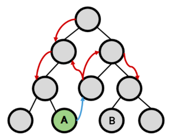
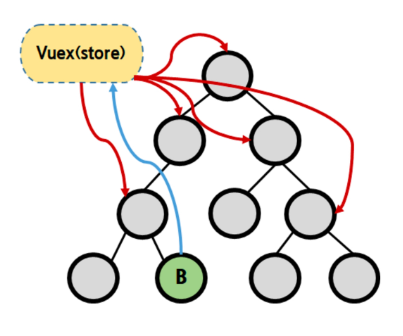
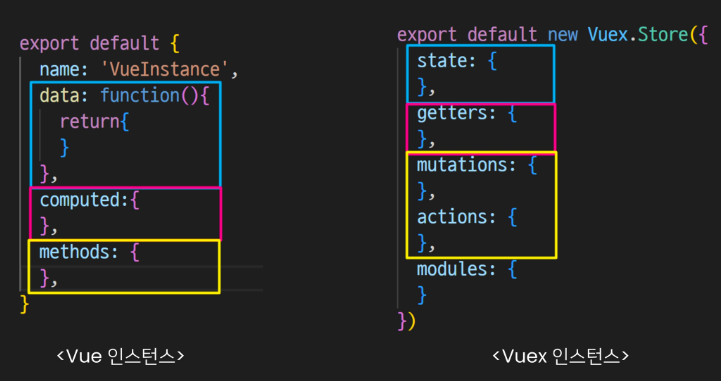
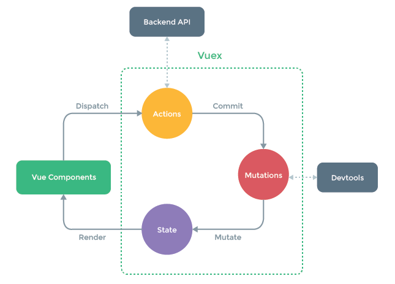
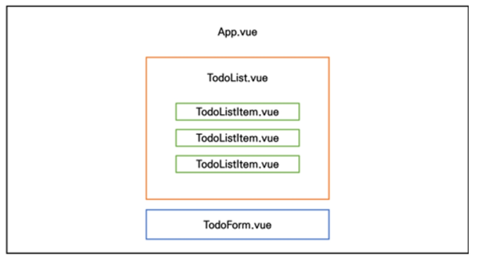

# 1. Vuex

## 1.1. Stage Management

**What is state?**  
State is <mark>the current data</makr>

**What is state management?**  
Sharing the same data state between multiple independent components

### 1.1.1. Limitations of Pass Props & Emit Events

  
If the depth of the tree is deep, transferring data form to another which is not the parent or a child.

### 1.1.2. Centralized Store

  
The central storage can be accessed by a node regardless of its depth to obtain or change data. It's preferable for a big or complicated project.

**Vuex**  
Vuex is the central storage of Vue. It also has rules that allow data to change only in predictable ways, therefore it can effectively manage the state.

## 1.2. Start Vuex

### 1.2.1. CLI Procedures

```
vue create {folder_name}    // Create a Vue project

cd {folder_name}            // Change directory to the created folder

vue add vuex                // Apply Vuex to the Vue project
```

### 1.2.2. Strcuture of Vuex Instance

If you follow the [commands above](#121-cli-procedures), `src/store/index.js` will be newly created. 'index.js' contains a Vuex instance which looks similar to Vue instance.



- **state**
  - corresponds to the **data** in the Vue instance.
  - There's dat which is manged in the centralized storage.
  - It can be accessed from othe components by `vueInstance.$store.state`
- **getters**
  - corresponds to the **computed** in the Vue instance.
  - It also chaches the processed data.
  - All the functions in the mutations get `state`, `getter` as the first two arguments.
- **mutations**
  - corresponds to the **methods** in the Vue instance, and it only **0can change the state.**
  - To specify the moment when the state is changed, all the functions in the mutations should be **synchronous**.
  - All the functions in the mutations get `state` as the first argument.
  - It can be called through `vuexInstance.commit()` method.
- **actions**
  - corresponds to the **methods** in the Vue instance, and it **should not change the state.**
  - A function in the actions can contain **asynchronous** process. If it calls a function in the mutations to change the state.
  - All the functions in the actions get `context` as the first argument.
    It can be called through `vuexInstance.dispatch()` method.

### 1.2.3. Data Flow through Vuex



- **Manipulating the state**

  - component -> (actions) -> mutations -> state

- **Using the state**
  - state -> (getters) -> component

## 1.3. Practice Vuex

**index.js**

```js
export default new Vuex.Store({
  state: {
    message: 'message in store',
  },
  getters: {
    messageLength(state) {
      return state.message.length
    },
  },
  mutations: {
    CHANGE_MESSAGE(state, message) {
      state.message = message
    },
  },
  actions: {
    changeMessage(context, message) {
      context.commit('CHANGE_MESSAGE', message)
    },
  },
  modules: {},
})
```

**App.vue**

```html
<template>
  <div id="app">
    <h1>{{ message }}</h1>
    <h3>message length: {{ messageLength }}</h3>
    <input
      type="text"
      @keyup.enter="changeMessage"
      v-model="inputData"
    />
  </div>
</template>

<script>
  export default {
    name: 'App',
    data() {
      return {
        inputData: null,
      }
    },
    computed: {
      message() {
        return this.$store.state.message
      },
      messageLength() {
        return this.$store.getters.messageLength
      },
    },
    methods: {
      changeMessage() {
        const newMessage = this.inputData
        this.$store.dispatch('changeMessage', newMessage)
        this.inputData = null
      },
    },
  }
</script>
```

# 2. Lifecycle Hooks

## 2.1. Lifecycle Hooks

There are several points which can be specified in the lifecyle of a Vue instance. It's possible to automatically execute a preset logic at each point.


- **create**  
  The point when the Vue instance is created

- **mount**  
  The point when the Vue instance is linked to the DOM

- **update**  
  The point when the DOM is updated

- **destroy**  
  The point when the Vue instance is destroyed

**Example code**

```js
export default {
  ...
  beforeCreate() {
    console.log('beforeCreate')
  },
  created() {
    console.log('created')
  },
  beforeMount() {
    console.log('beforeMount')
  },
  mounted() {
    console.log('mounted')
  },
}
```

# 3. Todo List CRUD Practice with Vuex

## 3.1. Local Storage

**[Local Stoarge and Session Storage](https://www.daleseo.com/js-web-storage/)**  
A browser storage where data is saved in key-value form. The key is used for distinguising the data source, and the value is sotred as **JSON string**. This sotorage is maintained until it is intentionally deleted.

- F12 -> Application -> Storage -> Local Storage

### 3.1.1. Window.localStorage

The object which has mehtods for manipulating local sotrage.

**localStorage.setItem(key: string, value: string)**  
Store the value in the local storage with the key.  
To change JS object into JSON, you can use `JSON.stringfy()`

**localStorage.getItem(key: string)**  
Get the value of the key from the local storage.  
To change JSON into JS object, you can use `JSON.parse()`

### 3.1.2. vuex-persistedstate

The library which has function for automatically storing and reloading Vuex state.

**Install**  
`npm i vuex-persistedstate`

**Apply**

```js
// index.js
import createPersistedState from 'vuex-persistedstate'

Vue.use(Vuex)

export default new Vuex.STore({
  plugins: [createPersistedState()],
})
```

## 3.2. Code



### 3.2.1. index.js

```js
import Vue from 'vue'
import Vuex from 'vuex'
import createPersistedState from 'vuex-persistedstate'

Vue.use(Vuex)

export default new Vuex.Store({
  plugins: [createPersistedState()],
  state: {
    todos: [],
  },
  getters: {
    allTodosCount(state) {
      return state.todos.length
    },
    // The number of completed todoItems
    completedTodosCount(state) {
      const completedTodos = state.todos.filter((todo) => {
        return todo.isCompleted === true
      })
      return completedTodos.length
    },
    // The number of uncompleted todoItems
    unCompletedTodosCount(state, getters) {
      return getters.allTodosCount - getters.completedTodosCount
    },
  },
  mutations: {
    CREATE_TODO(state, todoItem) {
      state.todos.push(todoItem)
    },
    DELETE_TODO(state, todoItem) {
      const index = state.todos.indexOf(todoItem)
      state.todos.splice(index, 1)
    },
    // Change isCompleted attribute of todoItem
    UPDATE_TODO_STATUS(state, todoItem) {
      console.log(todoItem)
      state.todos = state.todos.map((todo) => {
        if (todo === todoItem) {
          todo.isCompleted = !todo.isCompleted
        }
        return todo
      })
    },
    // // createPersistedState() replaced this function.
    // LOAD_TODOS(state) {
    //   const localStorageTodos = localStorage.getItem('todos')
    //   const parsedTodos = JSON.parse(localStorageTodos)
    //   state.todos = parsedTodos
    // },
  },
  actions: {
    createTodo(context, todoTitle) {
      const todoItem = {
        title: todoTitle,
        isCompleted: false,
      }
      context.commit('CREATE_TODO', todoItem)
      // context.dispatch('saveTodosToLocalStorage')
    },
    deleteTodo(context, todoItem) {
      context.commit('DELETE_TODO', todoItem)
      // context.dispatch('saveTodosToLocalStorage')
    },
    updateTodoStatus(context, todoItem) {
      context.commit('UPDATE_TODO_STATUS', todoItem)
      // context.dispatch('saveTodosToLocalStorage')
    },
    // // createPersistedState() replaced this function.
    // saveTodosToLocalStorage(context) {
    //   const jsonTodos = JSON.stringify(context.state.todos)
    //   localStorage.setItem('todos', jsonTodos)
    // },

    // // createPersistedState() replaced this function.
    // loadTodos(context) {
    //   context.commit('LOAD_TODOS')
    // }
  },
  modules: {},
})
```

### 3.2.2. App.vue

```html
<template>
  <div id="app">
    <h1>Todo List</h1>
    <h2>Number of All Todos: {{ allTodosCount }}</h2>
    <h2>Number of Completed Todos: {{ completedTodosCount }}</h2>
    <h2>Number of Uncompleted Todos: {{ unCompletedTodosCount }}</h2>
    <TodoList />
    <TodoForm />
    <!-- <button @click="loadTodos">Reload Todo List</button> -->
  </div>
</template>

<script>
  import TodoList from '@/components/TodoList'
  import TodoForm from '@/components/TodoForm'

  export default {
    name: 'App',
    components: {
      TodoList,
      TodoForm,
    },
    computed: {
      allTodosCount() {
        return this.$store.getters.allTodosCount
      },
      completedTodosCount() {
        return this.$store.getters.completedTodosCount
      },
      unCompletedTodosCount() {
        return this.$store.getters.unCompletedTodosCount
      },
    },
    methods: {
      loadTodos() {
        this.$store.dispatch('loadTodos')
      },
    },
  }
</script>

<style>
  #app {
    font-family: Avenir, Helvetica, Arial, sans-serif;
    -webkit-font-smoothing: antialiased;
    -moz-osx-font-smoothing: grayscale;
    text-align: center;
    color: #2c3e50;
    margin-top: 60px;
  }
</style>
```

### 3.2.3. TodoForm.vue

```html
<template>
  <div>
    <input
      type="text"
      v-model.trim="todoTitle"
      @keyup.enter="createTodo"
    />
  </div>
</template>

<script>
  export default {
    name: 'TodoForm',
    data() {
      return {
        todoTitle: null,
      }
    },
    methods: {
      createTodo() {
        if (this.todoTitle) {
          this.$store.dispatch('createTodo', this.todoTitle)
        }
        this.todoTitle = null
      },
    },
  }
</script>
```

### 3.2.3. TodoList.vue

```html
<template>
  <div>
    <TodoListItem
      v-for="(todo, index) in todos"
      :key="index"
      :todo="todo"
    />
  </div>
</template>

<script>
  import TodoListItem from '@/components/TodoListItem'

  export default {
    name: 'TodoList',
    components: {
      TodoListItem,
    },
    computed: {
      todos() {
        return this.$store.state.todos
      },
    },
  }
</script>

<style></style>
```

### 3.2.3. TodoListItem.vue

```html
<template>
  <div>
    <span
      @click="updateTodoStatus"
      :class="{ 'is-completed': todo.isCompleted }"
    >
      {{ todo.title }}
    </span>
    <button @click="deleteTodo">Delete</button>
  </div>
</template>

<script>
  export default {
    name: 'TodoListItem',
    props: {
      todo: Object,
    },
    methods: {
      deleteTodo() {
        this.$store.dispatch('deleteTodo', this.todo)
        // this.$store.commit('DELETE_TODO', this.todo)
      },
      updateTodoStatus() {
        this.$store.dispatch('updateTodoStatus', this.todo)
      },
    },
  }
</script>

<style>
  .is-completed {
    text-decoration: line-through;
  }
</style>
```
