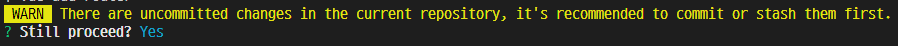

# 1. Vue Router

## 1.1. Routing

Originally, routing is the process of **selecting the best path** to send communication data within a network

**Routing in web service**  
Routing or router in web development is a <mark>mechanism where HTTP requests are routed to the suitable code</mark> that handles them.

### 1.1.1. Routing in SSR

The server executes the code only for valid url requests, and responds to the completed HTML as needed.

### 1.1.2. Routing in CSR / SPA

After the server provides only one HTML, JavaScript sends AJAX the request. Therefore, there is **only one server-side url requesting HTML documents.**

**Why should url be changed?**  
Technically, there is no problem with the operation, but there are the following inconveniences.

- There is no information about the current redering status of the page.
  - Return to the default page for the first time when page refreshes
  - Only the default page can be shared through link
- Browser's Backward feature is not available

## 1.2. Vue Router

It's the tool providing **url routing feature on the SPA**, so that SPA works like MPA(Multiple Page Application)

### 1.2.1. Vue Router Start

```
vue create {folder_name}    // Create a Vue project

cd {folder_name}            // Change directory to the created folder

vue add router              // Apply Vue router to the Vue project
```

**Alert**

-   
  Just recommend you to commit before processing
- 

# 2. Navigation Guard

## 2.1. Global Guard

## 2.2. Component Guard

## 2.3. 404 Not Found

# 2. Practice

## 3.1. Index

## 3.2. Index

## 3.3. Index

## 3.4. Index
