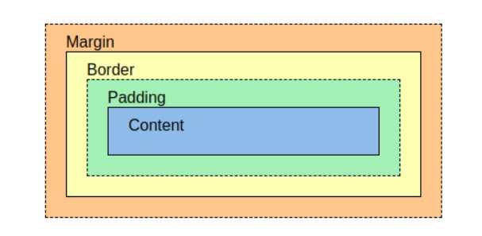

# CSS Basics

## Index

- [1. CSS](#1-css)
  - [1.1. Cascading Style Sheet](#11-cascading-style-sheet)
  - [1.2. How To Add CSS](#12-how-to-add-css)
  - [1.3. Inheritance](#13-inheritance)
    - [1.3.1. inherit](#131-inherit)
- [2. Selector](#2-selector)
  - [2.1. Basic Selector](#21-basic-selector)
  - [2.2. Pseudo Classes Selector](#22-pseudo-classes-selector)
    - [2.2.1. Link Pseudo Classes](#221-link-pseudo-classes)
    - [2.2.2. Structural Pseudo Classes](#222-structural-pseudo-classes)
  - [2.3. Combinator](#23-combinator)
- [3. Unit](#3-unit)
- [4. Box model](#4-box-model)
  - [4.1. Box Sizing](#41-box-sizing)
  - [4.2. outline](#42-outline)
- [5. Display](#5-display)
- [6. Position](#6-position)

---

# 1. CSS

```css
h1 /*selector*/ {
  /*declaration*/
  font-size:/*property*/ 15px; /*value*/
}
```

## 1.1. Cascading Style Sheet

**Cascading Style Sheets**. When a selector matches an element, the property value from the origin **with the highest precedence** gets applied, even if the selector from a lower precedence origin or layer has greater specificity.

- **Cascading Order**
  1. !important
  2. inline
  3. id
  4. class
  5. type
  6. the order of the code

## 1.2. How To Add CSS

- **Inline CSS**

  - An inline style is used to apply a unique style for a single element.

    ```html
    <p style="color:red;">This is a paragraph.</p>
    ```

- **Internal CSS**

  - The internal style is defined inside the \<style> element, inside the head section.

    ```html
    <!DOCTYPE html>
    <html>
      <head>
        <style>
          p {
            color: red;
          }
        </style>
      </head>
      <body>
        <p>This is a paragraph.</p>
      </body>
    </html>
    ```

- **External CSS**
  - Each HTML page must include a reference to the external style sheet file inside the <link> element, inside the head section.
    ```html
    <!DOCTYPE html>
    <html>
      <head>
        <link rel="stylesheet" href="mystyle.css" />
      </head>
      <body>
        <h1>This is a heading</h1>
        <p>This is a paragraph.</p>
      </body>
    </html>
    ```

## 1.3. Inheritance

[상속 여부를 정리한 블로그 글](https://poiemaweb.com/css3-inheritance-cascading)

- **Inherited Properties**

  - Which by default are set to the computed value of the parent element
  - Usually about text
    - font, color, text-align, opacity, line-height, ...

- **Non-inherited Properties**
  - which by default are set to initial value of the property
  - Usually about Box
    - display, width, height, margin, padding, border, ...

### 1.3.1. inherit

The **inherit keyword** specifies that a property should inherit its value from its parent element.

- Set the text-color for \<span> elements to blue, except those inside elements with class="extra"

  ```css
  span {
    color: blue;
  }

  .extra span {
    color: inherit;
  }
  ```

---

# 2. Selector

[Selector를 정리한 블로그 글](https://www.nextree.co.kr/p8468/)

## 2.1. Basic Selector

- **Universal Selector**
  - `*`
  - All the elements
- **Type Selector**
  - `typeName, typeName, ...`
  - Specific element
- **Class Selector**
  - `.className`
  - The elements have the class
- **Id Selector**
  - `#idName`
  - The element has the id
- **Attribute Selector**

  | Pattern        | Description                                   |
  | -------------- | --------------------------------------------- | --------------------------------------------------------- |
  | E[attr]        | elements have 'attr'                          |
  | E[attr="val"]  | elements which 'attr' value is 'val'          |
  | E[attr~="val"] | elements which 'attr' value contains ' val '  |
  | E[attr^="val"] | elements which 'attr' value starts with 'val' |
  | E[attr$="val"] | elements which 'attr' value ends with 'val'   |
  | E[attr*="val"] | elements which 'attr' value contains 'val'    |
  | E[attr]        | ="val"]                                       | elements which 'attr' value is 'val' or starts with 'val' |

## 2.2. Pseudo Classes Selector

[Pseudo Classes Mozilla](https://developer.mozilla.org/ko/docs/Web/CSS/Pseudo-classes)

### 2.2.1. Link Pseudo Classes

| Pattern   | Description                                          |
| --------- | ---------------------------------------------------- |
| E:link    | elements have not visited yet                        |
| E:visited | elements have visted                                 |
| E:active  | elements being clicked or being pressed with 'Enter' |
| E:hover   | elements being hovered                               |
| E:focus   | elements being foucsed                               |

### 2.2.2. Structural Pseudo Classes

- **nth-child()**
  - among its siblings
- **nth-of-type()**
  - among its the same type siblings

| Pattern             | Description                                                                                   |
| ------------------- | --------------------------------------------------------------------------------------------- |
| E:first-child       | The element E which is the first child among its siblings                                     |
| E:last-child        | The element E which is the last child among its siblings                                      |
| E:nth-child(N)      | The element E which is the Nth child among its siblings                                       |
| E:nth-last-child(N) | The element E which is the Nth element among its siblings counting fron the end               |
| E:nth-child(odd)    | The elements E which are odd elements among its siblings                                      |
| E:nth-child(even)   | The elements E which are even elements among its siblings                                     |
| E:nth-child(An+B)   | The elements E which are (An+B) elements among its siblings                                   |
| E:only-child        | The element E which is the only child                                                         |
| E:first-of-type     | The first E element among its sliblings                                                       |
| E:last-of-type      | The last E element among its sliblings                                                        |
| E:only-of-type      | The E element which is the only E element among its sliblings                                 |
| E:nth-of-type       | The E element which is the Nth element among its the same type siblings                       |
| E:nth-last-of-type  | The E element which is the Nth element among its the same type siblings counting from the end |

## 2.3. Combinator

| Name                        | Pattern | Description                                                                       |
| --------------------------- | ------- | --------------------------------------------------------------------------------- |
| Descendant Combinator       | A B     | the second selector are selected if they have an s element matching the first     |
| Child Combinator            | A>B     | the second selector that are the direct children of elements matched by the first |
| General Sibling Combinator  | A~B     | the second element, that follows the first element as a sibling                   |
| Adjacent Sibling Combinator | A+B     | the second element, that immediately follows the first element as a sibling       |

---

# 3. Unit

| Unit | Description                                           |
| ---- | ----------------------------------------------------- |
| px   | Pixel                                                 |
| %    | Percentage of parent properties                       |
| vw   | Percentage of viewport width                          |
| vh   | Percentage of viewport height                         |
| em   | Ratio for its font size                               |
| rem  | Ratio for the root element's font size (default 16px) |

---

# 4. Box model



## 4.1. Box Sizing

- **content-box**
  - This is the **initial and default value** as specified by the CSS standard. The width and height properties include the content, but does not include the padding, border, or margin.
- **border-box**
  - The width and height properties include the content, padding, and border, but do not include the margin.

```css
.border-box {
  box-sizing: border-box;
}
```

## 4.2. outline

**An outline is a line that is drawn around elements, outside the borders,** to make the element "stand out".

Outline differs from borders! Unlike border, the outline is drawn outside the element's border, and may overlap other content. Also, the outline is NOT a part of the element's dimensions; the element's total width and height is not affected by the width of the outline.

---

# 5. Display

- **inline**
  - Take up space as much space as content
  - **Unable**: width, height, line-change
  - **Able**: margin-start, end / padding-right, left
  - Elements: div / li / p / hr / form ...
- **block**
  - Take up a row of space (Margin takes up the remaining space)
  - **Able**: width, height, margin, padding
  - Elements: span / a / img / input / label
- **inline-block**
  - Block element that takes up space as much space as content
  - **Able**: width, height, margin, padding
- **none**
  - Browser does not rendering the element

---

# 6. Position

[CSS Position Mozilla](https://developer.mozilla.org/en-US/docs/Web/CSS/position#types_of_positioning)

- **static**
  - The default value
- **relative**
  - Takes up the space on its original position
  - Apply the offset(top, right, bottom, and left) based on original position.
  ```css
  .relatvie {
    position: relative;
    top: 100px;
    left: 100px;
  }
  ```
- **absolute**
  - Dosen't take up the space
  - Apply the offset(top, right, bottom, and left) based on the nearest **positioned ancestor**. Without such an element, the **body(browser)** becomes the reference point.
    - A positioned element is anything except static.
- **fixed**
  - Dosen't take up the space.
  - Apply the offset(top, right, bottom, and left) based on the body tag.
- **sticky**
  - Takes up the space on its original position
  - The element is positioned according to the normal flow of the document, and then offset(top, right, bottom, and left) relative to its nearest scrolling ancestor
