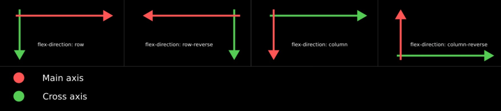
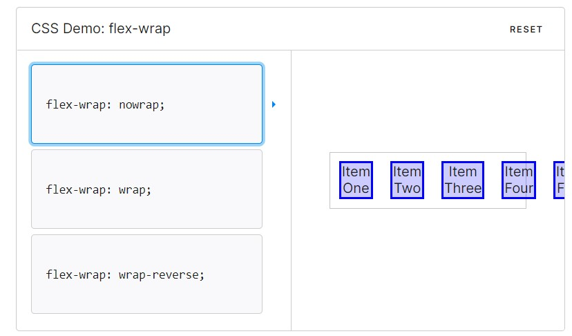
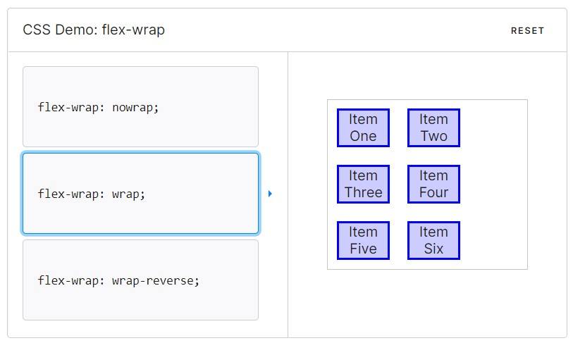
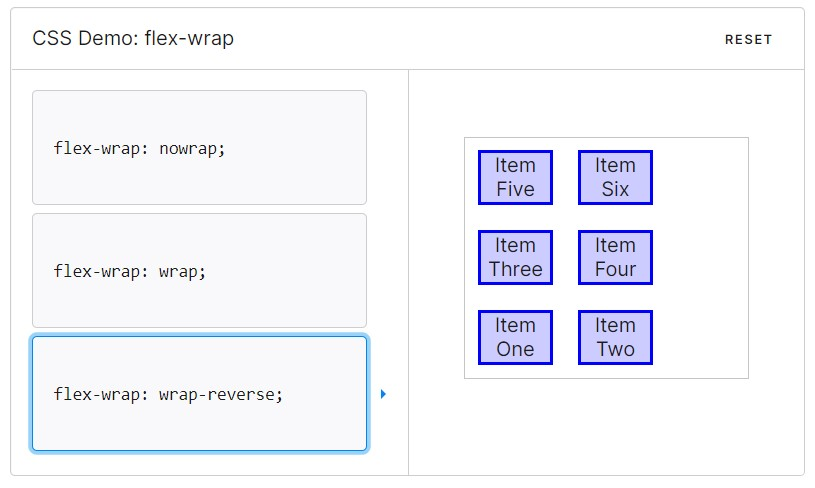
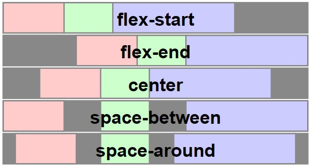
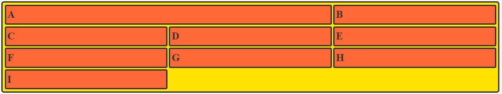
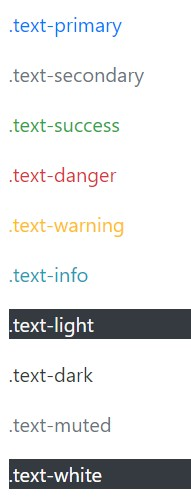

# 1. Float
: move to z=1 dimension, and work as in-line block
: BUT inline elements surround the floated elements
: Other block elements acts as the floated elements are gone
```css
.float {
    float: left;
    float: right;
    float: none;
}
```
---

# 2. Flexbox
## 2-1. Composition
* **axis**
    * main axis
    * cross axis
* **element**
    * Flex container
    * Flex item
## 2-2. Declaration
* apply `display: flex` on the flex container
    ```css
    .container {
        display: flex;
        display: inline-flex;
    }
    ```
    * `inline-flex` makes **the container** ==act like inline-block==
* all the elements take up the space ==as big as their contents==
* the height of elements are set ==as the longest one==
## 2-3. flex-direction
 ```css
    .container {
        display: flex;
        flex-direction: row; /*default*/
        flex-direction: row-reverse;
        flex-direction: column;
        flex-direction: column-reverse;
    }
```

## 2-4. flex-wrap
 ```css
    .container {
        display: flex;
        flex-wrap: nowrap;  /*default*/
        flex-wrap: wrap;
        flex-wrap: wrap-reverse;
    }
```



## 2-5. flex-flow
* flex-flow = flex-direction + flex-wrap
    ```css
    .container {
        flex-flow: row nowrap;
    }
    ```
## 2-6. Assign space
* **justify-contet** (main axis)
* **align-content** (cross axis)
    * flex-start: start of the axis
    * flex-end: end of the axis
    * center: center of the axis
    * space-between: assign the same space between elements
    * space-around: assign the same space around elements
    * space-evenly: assign the same space between and end of elements
    
## 2-6. align-items
**align according to ==cross axis==**
* **align-items** (all the items)
* **align-self** (each item)
    * stretch: strech all the items as long as the container's height
    * flex-start: start of the cross axis
    * flex-end: end of the cross axis
    * center: center of the cross axis
    * baseline: align as texts' baselines are at the same height 
## 2-6. etc
* **flex-grow**
    * distribute the remaining space
    ```css
    .item:nth-child(1){flex-grow:1}
    .item:nth-child(2){flex-grow:1}
    .item:nth-child(3){flex-grow:0}
    .item:nth-child(4){flex-grow:2}
    /* the remaining area is distributed in ration of 1:1:0:2*/
    ```
* **order**
    * align elements according to its order
    * if the order value is not assigned, ==default = 0==
    * if the order valuse is the same,
    ==according to its' code order==
---
# 3. Grid
## 3-1. Declaration
* the conatainer should be decided
    ```css
    .container {
        display: grid;
        display: inline-grid;
    }
    ```
## 3-2. Define shape
* **grid-template-rows**
    ```css
    .container {
        grid-template-columns: 200px 200px 500px;
        /* grid-template-columns: 1fr 1fr 1fr */
        /* grid-template-columns: repeat(3, 1fr) */
        /* grid-template-columns: 200px 1fr */
        /* grid-template-columns: 100px 200px auto */
        grid-auto-rows: minmax(100px, auto);
        /* automatically add rows */
    }
    ```
* **grid-template-columns**
    ```css
    .container {
        grid-template-rows: 200px 200px 500px;
        /* grid-template-rows: 1fr 1fr 1fr */
        /* grid-template-rows: repeat(3, 1fr) */
        /* grid-template-rows: 200px 1fr */
        /* grid-template-rows: 100px 200px auto */
    }
    ```
* **grid-column, grid-row**
    ```css
        .item:nth-child(1) {
            grid-column: 1 / 3;
            grid-row: 1 / 2;
            /* grid-column-start: 1;
            grid-column-end: 3;
            grid-row-start: 1;
            grid-row-end: 2; */
            /* grid-column: 1 / span 2;
            grid-row: 1 / span 1; */
        }
    ```
    
## 3-3. Align items
**items are aligned in their cell position**
* **align-items**(vertical axis)
* **justify-items**(horizontal axis)
    * stretch
    * start
    * center
    * end
## 3-4. Align content
**all the items are aligned in the container area**
* **align-content**(vertical axis)
* **justify-content**(horizontal axis)
    * stretch
    * start
    * center
    * end
## 3-5. Align self
**each item is aligned in their cell position**
* **align-self**(vertical axis)
* **justify-self**(horizontal axis)
    * stretch
    * start
    * center
    * end
---
# 4. Bootstrap
**the colleoction of css class selectors**
## 4-1. CDN
**Content Delivery Network**
* Deliver the data from the nearest server from the end-user
* You can include bootstrap via CDN
## 4-2. Spacing
**{property}{sides}-{size}**
* **property**
    * **m** - for margin
    * **p** - for padding
* **sides**
    * **t** - for top
    * **b** - for bottom
    * **s** - for start
    * **e** - for end
    * **x** - for start and end
    * **y** - for top and end
    * **_** - for 4 sides
* **size**
    * **0** - for 0
    * **1** - for 0.25 * rem = 4px
    * **2** - for 0.5  * rem = 8px
    * **3** - for 1.0  * rem = 16px
    * **4** - for 1.5  * rem = 24px
    * **5** - for 3.0  * rem = 48px
    * **auto** - for auto

## 4-3. color

## 4-4. text
* **align**
    * text-start
    * text-center
    * text-end
    * text-justify
    * text-nowrap (at the container)
* **font-weight**
    * fw-bold
    * fw-normal
    * fw-light
    * fst-italic
## 4-5. display
* d-inline
* d-inline-block
* d-block
* d-none
## 4-6. position
* position-static
* position-relative
* position-absolute
* position-fixed
* position-sticky
* fixed-top, fixed-bottom
* sticky-top
## 4-7. flex
## 4-8. grid
---
## Buttons
type = 
---
row
col
row-cols
## navbar
navbar, navbar-expand-lg
container-fluid
navbar-brand
navbar-toggler
data-bs-toggle
data-bs-target
aria-controls
aria-expanded
aria-label
navbar-toggler-icon
navbar-collase
collapse
nav-item
nav-link
active
aria-current
## carousel
data-bs-ride
## modal
fade
## grid
row-cols-
g-
row parent
//row를 한개만 지정하는 이유