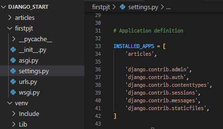
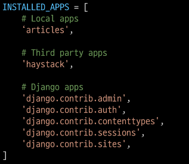
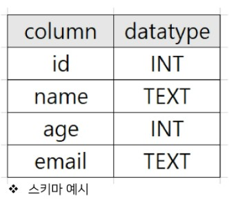
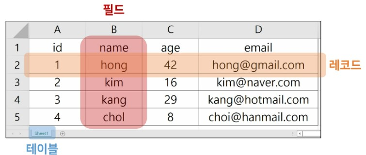
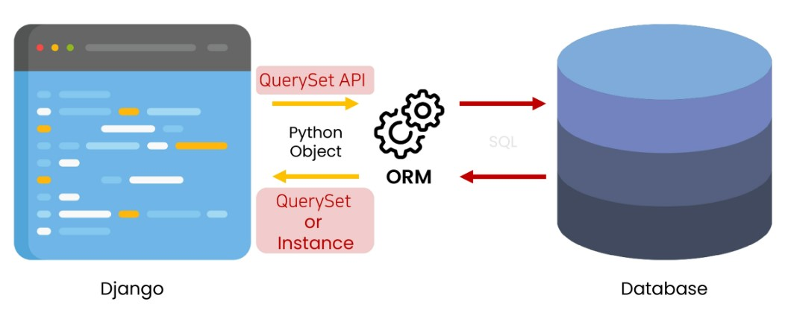

## 1. Django
### 1-1. Framework
* collection of codes for developing specific service
  * to use the framework, we have to follow the rules made by the producer
  * similar to library but more larger and detailed
### 1-2. Django
* Dynamic Web framework made with Pyton
  * especially for back-end
* Dynamic web page
  * preprocessing the data(ex.html) according to the users' requests


## 2. MTV Design Pattern
### 2-1. Design Pattern
* generalized method used frequently
  * Improving work efficiency
  * Ex. Client-Server structure
### 2-2. MTV Design Pattern
* MTV: a slightly modified form of MVC design pattern
* MVC(Mode-View-Controlloer)
  * Model: about data structure and managing database
  * View: about layout on screen
  * Controlloer: about Intermediating user, mode and view

  |MVC|MTV|
  |---|---|
  |Model|Model|
  |View|Template|
  |Controller|View|

## 3. Django Settings
1. venv

* LTS(Long Term Support)
  * software version which supported by the producer for the long term period
2. **Initiate a project**
  * `django-admin startproject firstpjt`
    * ./firstpjt/firstpjt/
    * ./firstpjt/manage.py
  * `django-admin startproject firstpjt .`
    * ./firstpjt/
    * ./manage.py
3. **Run the server**
  * `python manage.py runserver`
4. **Make application**
  * One project can have several apps(functions)
  * `python manage.py startapp articles`
  * To register the app to the project
    
  * ==Must make the project -> register the project==
  * ==Registering order==
    


## 4. Project Structure
* manage.py
  * 장고프로젝트와 상호작용하는 cmd 유틸리티
* db.sqlite3
  * 데이터베이스
* folder/\_\_pycache\_\_
  * 임시파일
* folder/\_\_init\_\_
  * 현재폴더가 파이썬 패키지임을 명시
* folder/asgi
  * Asynchoronous Server Gateway Interface
  * 비동기식 웹서버와의 연결 및 소통을 도움
* folder/wsgi
  * Web Server Gateway Interface
  * 웹서버와의 연결 및 소통을 도움
* folder/urls.py
  * url에 다른 처리, view와의 연결을 지정
* folder/settings.py
  * Django 포르젝트의 설정

## 5. App Structure
* migrations/
  * 변경사항이 저장됨
* admin.py
  * 관리자용 페이지 설정
* apps.py
  * 앱의 정보가 작성된 곳(별도추가 코드 X)
* models.py
  * model을 정의하는 곳
* tests.py
  * 프로젝트를 테스트하는 코드 작성
* veiws.py
  * view함수들이 정의됨

## 6. Request and Get
URL -> View -> Template
### 6-1. render()
* render(request, template_name, context)
  * request: the requesting objec to get the response
  * template_name: the **name** of the tempalte or the **path** of the template
    * setting.py > 56th line
      * `Templates[]`: the path to find the templates
        * `'DIRS':[]`: the user desginated path
        * `'App_DIRS': True`: templates folder in the app
  * context: data transferred to the template(dynamic web page)
* \<a> tag in html
  * <a href="/greeting/">to the /greeting/</a> 
    * front /
      * indicating this is the start of the URL
        * ..../greeting/
      * if it's not there, it means add greeting/ to the current URL
    * back /
      * indicating this a directory
      * trailing slash
      * Thesedays, this's optional but Django choosed to add it
        * settings.trailing slash == True

## 7. Django Template
for dynamic web pate
### 7-1. DTL(Django Template Language)
* built-in django template language used in HTML
* similar to Python; but it's not Python
* DTL Syntax
  * Variable
  * Filters
  * Tags
  * Comments
### 7-2. Variables
* views.py
  * `context = {'variable_name': 'data'}`
  * `render(request, template_name, context)`
* .html
  * {{variables_name}}
### 7-3. Filters
* revise the data with built-in template filters
* .html
  * {{variables_name|filter}}
### 7-4. Tags
* Implementing controll statements in html
### 7-5. Inheritacne
* **inherit base templates** and **insert** new info **in the block**
  ```django
    위에 주석도 있으면 안됨 

  
    <h1>I chose to eat {{pick}} which has {{pick|length}} alphabets</h1>
    <p>among '{{foods|join:", "}}'</p>

    <h3>Menu</h3>
    <ul>
      
        <li>{{food}}</li>
      
    </ul>
    <a href="/index/">to the /index/</a>
  
  ```
* referring templates which is out of the app


## 8. Sending and Retrieving the data(Client & Server)

### 8-1. Sending thd data(Client)
* HTML `<form>` attributes
  * action
    * where to send
    * URL
  * method
    * how to send
    * GET or POST
      * GET is for reading the data -> query string is exposed in url
      * POST is for modifying the database
* Sending data in json form {key:value}
  * **key == name**
  * **value == input**
* example
```django
<!-- catch.html -->

  <form action = "#" method = "GET">
    <label for="message">message</label>
    <input type="text" id="message" name="message">
    <input type="submit">
  </form> 


```

### 8-2. Retrieving the data(Server)
* the receiving functions
  * Ex. `data = request.GET.get('message')`
* django variable in html
  * {{key}}
```python
# http://127.0.0.1:8000/catch/?message=데이터
def catch(request):
  print(request) # <WSGIRequest: GET '/catch/?message=%EB%8D%B0%EC%9D%B4%ED%84%B0%21'>
  # UTF-8 한글 인코딩 3byte 마지막 %21 == '!'
  print(type(request)) # <class 'django.core.handlers.wsgi.WSGIReqeust'>
  print(request.GET) # <QueryDict: {'message': ['데이터']}>
  print(reqeust.GET.get('message')) # '데이터'

```
* example
```python
def catch(request):
  message = request.GET.get('message')
  context = {
    'message': message,
  }
  return render(request, 'catch.html', context)
```
```django
<!-- catch.html -->

  <h2>I got {{message}}</h2>  


```

## 9. Variable routing
* Using **part of url** as **variable**
* announcement
  * <type:variable_name>
  * types
    * str: default
    * int
    * slug
    * uuid
    * path
* example
```python
# urls.py
urlpatterns = [
  paht('hello/<str:name>/', views.hello),
]
```
```python
# views.py
def hello(reqeust, name):
  context = {
    'name': name,
  }
  return render(request, 'hello.html', context)
```
```python
# hello.html
<h1>Hello {{name}}!</h1>
```

## 10. App URL mapping
* The URL received by the project is classified according to the app(the part before the first trailing slash)
* example
```python
# projcet/urls.py
from django.contrib import admin
from dajngo.urls import path, include

urlpatterns = [
  path('admin/', admin.stie.urls),
  path('app1/', inlcude(app1.urls)),
  path('app2/', inlcude(app2.urls)),
]
```
```python
# app1/urls.py
from dajngo.urls import path
from . import views

urlpatterns = [
  path('index/', views.index) # http://127.0.0.1:8000/app1/index/
]
```

## 11. Namespace
### 11-1. URL namespace
* naming the path() in the urls.py
```python
# app1/urls.py
from dajngo.urls import path
from . import views

urlpatterns = [
  path('index/', views.index, name='index'),
  path('greeting/', views.greeting, name='greeting'),
  path('throw/', views.throw, name='throw'),
]
```
```django
<!-- catch.html -->

  <form action = "" method = "GET">
    <label for="message">message</label>
    <input type="text" id="message" name="message">
    <input type="submit">
  </form> 


```
### 11-2. App namespace
* adding the app_name to the urls, so that you can use the same url name in different apps
```python
# app1/urls.py
from dajngo.urls import path
from . import views

app_name = 'app1'
urlpatterns = [
  path('index/', views.index, name='index'),
  path('greeting/', views.greeting, name='greeting'),
  path('throw/', views.throw, name='throw'),
]
```
```django
<!-- catch.html -->

  <form action = "" method = "GET">
    <label for="message">message</label>
    <input type="text" id="message" name="message">
    <input type="submit">
  </form> 


```

### 11-3. Template namespace
* Django find templates according to the order in the settings.py.INSTALLED_APPS
* Sandwich structure
  * app/templates/app/html.html
```python
# articles/views.py
return render(request, 'articles/index.html')
```
## 12. Database
### 12-1. Term
* Schema
  * structure of the table
    
* Table
  * field
    * attributes(column)
  * record
    * data(row)
  
* PK(Primary Key)
  * the unique fields that distinguish a record from others
* Query
  * cmd for accessing the data
## 13. Model
### 13-1. Definition
* Layout of the database
* Django access to the data through Model
* User can define the fields and attributes of the model
### 13-2. models.py
**Schema of the data**
```python
# app/model.py
from django.db import models

# Article inherits model.Model
class Article(models.Model):
    title = models.CharField(max_length=10)
    content = models.TextField()
```
### 13-3. Migrations
* `python manage.py makemigrations`
  * make blueprints of DB
* `python manage.py migrate`
  * make a DB from the blueprint
* `python manage.py showmigrations`
  * if there's[X], it means migrate is completed
* `python manage.py sqlmigrate [app_name] [migration.file_name]`
  * show sql query of the migration file

### 13-4. ORM(Object-Relational-Mapping)
**programming that translate data between diffrent OOP**
* Users can manage data through python not using SQL
### 13-5. modiefying models.py
1. revise the model
2. makemigrations
  * Django require us to set the default for previous data
    * 1)django will recommend default field
    * 2)put default field in the model by my self
3. migrate
---
## 14. QuerySet.API
* API produced by Django which help us to manage the data
* **Model_class.objects.query_API**
  * objects
    * inteface for the DB query

---
## 15. Admin Site
**page for administrator provided by Django**
* make admin account
  1. `python manage.py createsuperuser`
    * email is optional
* Access to the admin page
  * /admin/
* Register model into admin.py
  ```python
  # articles/admin.py
  from django.contrib import admin
  from .models import Article

  admin.site.register(Article)
  ```