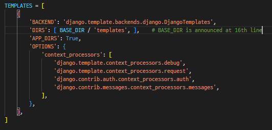

동적웹페이지
정적웹페이지


## 2. MTV Design Pattern
### 2-1. Design Pattern
* generalized method used frequently
  * Improving work efficiency
  * Ex. Client-Server structure
### 2-2. MTV Design Pattern
* MTV: a slightly modified form of MVC design pattern
* MVC(Mode-View-Controlloer)
  * Model: about data structure and managing database
  * View: about layout on screen
  * Controlloer: about Intermediating user, mode and view

  |MVC|MTV|
  |---|---|
  |Model|Model|
  |View|Template|
  |Controller|View|

## 3. Django Settings
1. venv

* LTS(Long Term Support)
  * software version which supported by the producer for the long term period
2. **Initiate a project**
  * `django-admin startproject firstpjt`
    * ./firstpjt/firstpjt/
    * ./firstpjt/manage.py
  * `django-admin startproject firstpjt .`
    * ./firstpjt/
    * ./manage.py
3. **Run the server**
  * `python manage.py runserver`
4. **Make application**
  * One project can have several apps(functions)
  * `python manage.py startapp articles`
  * To register the app to the project
    
  * ==Must make the project -> register the project==
  * ==Registering order==
    


## 4. Project Structure
* manage.py
  * 장고프로젝트와 상호작용하는 cmd 유틸리티
* db.sqlite3
  * 데이터베이스
* folder/\_\_pycache\_\_
  * 임시파일
* folder/\_\_init\_\_
  * 현재폴더가 파이썬 패키지임을 명시
* folder/asgi
  * Asynchoronous Server Gateway Interface
  * 비동기식 웹서버와의 연결 및 소통을 도움
* folder/wsgi
  * Web Server Gateway Interface
  * 웹서버와의 연결 및 소통을 도움
* folder/urls.py
  * url에 다른 처리, view와의 연결을 지정
* folder/settings.py
  * Django 포르젝트의 설정

## 5. App Structure
* migrations/
  * 변경사항이 저장됨
* admin.py
  * 관리자용 페이지 설정
* apps.py
  * 앱의 정보가 작성된 곳(별도추가 코드 X)
* models.py
  * model을 정의하는 곳
* tests.py
  * 프로젝트를 테스트하는 코드 작성
* veiws.py
  * view함수들이 정의됨

## 6. Request and Get
URL -> View -> Template
### 6-1. render()
* render(request, template_name, context)
  * request: the requesting objec to get the response
  * template_name: the **name** of the tempalte or the **path** of the template
    * setting.py > 56th line
      * `Templates[]`: the path to find the templates
        * `'DIRS':[]`: the user desginated path
        * `'App_DIRS': True`: templates folder in the app
  * context: data transferred to the template(dynamic web page)
* \<a> tag in html
  * <a href="/greeting/">to the /greeting/</a> 
    * front /
      * indicating this is the start of the URL
        * ..../greeting/
      * if it's not there, it means add greeting/ to the current URL
    * back /
      * indicating this a directory
      * trailing slash
      * Thesedays, this's optional but Django choosed to add it
        * settings.trailing slash == True

## 7. Django Template
for dynamic web pate
### 7-1. DTL(Django Template Language)
* built-in django template language used in HTML
* similar to Python; but it's not Python
* DTL Syntax
  * Variable
  * Filters
  * Tags
  * Comments
### 7-2. Viarable
* views.py
  * `context = {'variable_name': 'data'}`
  * `render(request, template_name, context)`
* .html
  * {{variables_name}}
### 7-3. Filters
* revise the data with built-in template filters
* .html
  * {{variables_name|filter}}
### 7-4. Tags
* Implementing controll statements in html
### 7-5. Inheritacne
* **inherit base templates** and **insert** new info **in the block**
  ```django
    위에 주석도 있으면 안됨 

  
    <h1>I chose to eat {{pick}} which has {{pick|length}} alphabets</h1>
    <p>among '{{foods|join:", "}}'</p>

    <h3>Menu</h3>
    <ul>
      
        <li>{{food}}</li>
      
    </ul>
    <a href="/index/">to the /index/</a>
  
  ```
* referring templates which is out of the app


## 8. Sending and Retrieving the data(Client & Server)
* HTML form's attributes
  * action
    * where to send
    * URL
  * method
    * how to send
    * GET or POST

* Send data in json form {name:input}
* the receiving function should get the data
  * Ex. `data = request.GET.get('message')` in view.py

## 9. Variable routing

## 10. 
1. urls
app_names=""
url(name="")
나중에
a href="">to the /dinner/</a> 

2. templates탐색
샌드위치 구조
앱 > templates > 앱 이름 그대로