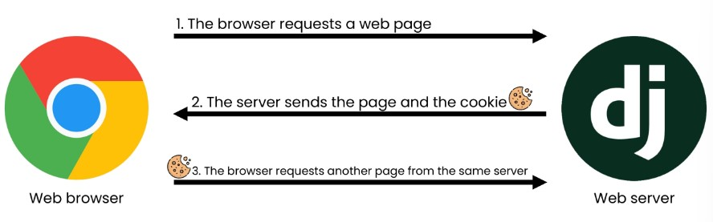

## 1. Outline
* Athentification ans Authorization
    * Check who the user is
    * Authorize the user properly
* accoounts app
    * recommend to name the app 'accounts'

---
## 2. Custom User Model
### 2-1. User Model
* class that has fields related to authentification process
* proudced by Django

### 2-2. Custom User Model
* override the basic User Model
* so that the developer can easily customize the model
* **IT SHOULD BE DONE BEFORE MIGRATION**
    * If you have to
        1. delete migrations files except __init__.py
        2. delete db.sqlite2
        3. makemigrations -> mgirate
```python
# accounts/models.py
from djagno.contrib.auth.models import AbstarctUser

class User(AbstractUser):
    pass
```
```python
# settings.py

# the vairable 'AUTH_USER_MODEL' is announced in global_settings.py whih settings.py inherited
AUTH_USER_MODEL = 'accounts.User'   # default = 'auth.User'
```
```python
# accounts/admin.py
from .models import User

# It should be registered to the admin site as same as the other models
admin.site.register(User, UserAdmin)
```
 ```python
# articles/admin.py
from django.contrib import admin
from .models import Article

admin.site.register(Article)
```
### 2-3. DB
    * accounts.user table

---
## 3. HTTP Cookies
### 3-1. Cookie
* little data for memorizing the user's inforamtions relative to the server

* usage
    * session management(session id)
    * Personalization
    * Tracking
* lifetime of cookie
    * session cookie
        * until current session
    * persistent cookies
        * according to 'expires' or 'MAX-AGE' attributes

### 3-2. Session in Django
* Django save the session info in the **django_session** tabele

---
## 4. Authentification in Web Requests
### 4-0. {{user}}
* context.user
    ``` python
    # settings.py

    TEMPLATES = [
    {
        'BACKEND': 'django.template.backends.django.DjangoTemplates',
        'DIRS': [BASE_DIR / 'templates',],
        'APP_DIRS': True,
        'OPTIONS': {
            'context_processors': [
                'django.template.context_processors.debug',
                'django.template.context_processors.request',
                # this one
                'django.contrib.auth.context_processors.auth',
                'django.contrib.messages.context_processors.messages',
            ],
        },
    },
    ```
    * When the user is not logined yet
        * AnonymousUser
### 4-1. Session(django_session)
* Create
    * Login
        * AuthentificaitonForm
            * built-in form for login
            * username and password
        * login(request, user, backend=None)
        * get_user
            * an instacne method of AuthentificaitonFrom
            * return the user instance when it's valid
* Delete
    * Logout
        * logout(request)
            1. delete session data in the DB
            2. delete session id in the client
### 4-2. User(accounts.user)
* Create
    * Signup
        * UserCreationForm
            * It should be overrided with accounts.User
            ```python
            # accounts/forms.py

            from django.contrib.auth import get_user_model
            from django.contrib.auth.forms import UserCreationForm

            class CustomUserCreationFrom(UserCreationForm):

                class Meta(UserCreationForm.Meta):
                    model = get_ser_model()
            ```
* Update
    * info
        * UserChangeForm
            * It should be overrided with accounts.User
            ```python
            # accounts/forms.py

            from django.contrib.auth import get_user_model
            from django.contrib.auth.forms import UserChangeForm

            class CustomUserCreationFrom(UserCreationForm):

                class Meta(UserChangeForm.Meta):
                    model = get_ser_model()
                    # limit the infro which the user can change by its own
                    fields = ('email', 'first_name', 'last_name')
            ```
    * password
        * PasswordChangeForm(user)
        * update_session_auth_hash(request, user)
* Delete
    * Withdrawl

### 4-3. Limitting access to logged in users
* user.is_authenticated
    * example in acrticle app
    ```python
    # articles.views.py
    # 로그인 된 사용자는 또다시 로그인 못하도록
    def login(request):
        if request.user.is_authenticated:
            return redirect('articles:index')
    ```
* @login_required
    * example1 in acrticle app
    ```python
    # articles.views.py
    from django.contrib.auth.decorators import login_required

    @login_required
    @request_http_methods(['GET', 'POST'])
    def create(request):
        pass

    # /accounts/create/로 강제 접속 시 해당 url이 next 쿼리로 저장
    # /accounts/login/?next=/accounts/create/
    ```
    ```python
    def login(request):
    if request.user.is_authenticated:
        return redirect('articles:index')

    if request.method == 'POST':
        form = AuthenticationForm(request, request.POST)
        if form.is_valid():
            auth_login(request, form.get_user())
            # next 쿼리가 있으면, 바로 그곳으로 redirect 시킴
            return redirect(request.GET.get('next') or 'articles:index')
    else:
        form = AuthenticationForm()
    context = {
        'form': form,
    }
    return render(request, 'accounts/login.html', context)
    ```
    ```django
    <h1>Login</h1>
    <!--
    자기 자신의 주소로 요청을 보내서 next쿼리를 유지시켜 줌
    -->
    <form action="" method="POST">
        
        {{ form.as_p }}
        <input type="submit">
    </form>
    ```
    * example2 in acrticle app
    ```python
    # 아래를 위의 예시처럼 next쿼리를 다루더라도
    # GET으로 next쿼리를 처리하는 과정에서 @request_POST를 넘지 못함
    @login_required
    @request_POST
    def delete(request):
        article = Article.objects.get(pk=pk)
        article.delete()
        return redirect('articles:index')
    ```
    ```python
    @request_POST
    def delete(request):
        if request.user.is_authenticated:
            article = Article.objects.get(pk=pk)
            article.delete()
            return redirect('articles:index')
    ```
---
## 5. Authentification in Web Requests(Python)
### 5-1. Session(django_session)
* Create 
    * Login
        * urls.py
        ```python
        # accoutns/urls.py

        app_name =  `accounts'
        urlpatterns = [
            path('login/', views.login, name='login'),
        ]
        ```
        * views.py
        ```python
        from django.contrib.auth.forms import AuthentifcationFrom
        from django.contrib.auth import login as auth_login

        def login(request):
            if request.method  == 'POST':
                form = AuthentificationForm(request, request.POST)
                # 쿠키를 보내기 위해서 request를 같이 넣어줌
                if form.is_valid()
                    auth_login(request, form.get_user())
                    return redirect('articles:index')
            else:
                form = AuthentificationForm()
            context = {
                'form': form
            }
            return render(request, 'accounts/login.html', context)
        ```
        * login.html
        ```django
        <h1>Login</h1>
        <form action="" method="POST">
            
            {{ form.as_p }}
            <input type="submit">
        </form>
        ```
* Delete
    * Logout
        * urls.py
        ```python
        # accoutns/urls.py

        app_name =  `accounts'
        urlpatterns = [
            path('logout/', views.logout, name='logout'),
        ]
        ```
        * views.py
        ```python
        from django.contrib.auth import logout as auth_logout

        def logout(request):
            auth_logout(request)
            return redirect('articles:index')
        ```
### 5-2. User(accounts.user)
* Create
    * Signup
        * urls.py
        ```python
        # accoutns/urls.py

        app_name =  `accounts'
        urlpatterns = [
            path('signup/', views.signup, name='signup'),
        ]
        ```
        * views.py
        ```python
        from .forms import CustomUserCreationForm

        def login(request):
            if request.method  == 'POST':
                form = CustomUserCreationFrom(request.POST)
                if form.is_valid():
                    # 곧바로 회원가입
                    # save가 로그인 후 user을 반환
                    user = form.save()
                    auth_login(reqeust, user)
                    return redirect('articles:index')
            else:
                form = CustomUserCreationForm()
            context = {
                'form': form
            }
            return render(request, 'accounts/signup.html', context)
        ```
        * login.html
        ```django
        <h1>Signup</h1>
        <form action="" method="POST">
            
            {{ form.as_p }}
            <input type="submit">
        </form>
        ```
* Update
    * info
        * urls.py
        ```python
        # accoutns/urls.py

        app_name =  `accounts'
        urlpatterns = [
            path('update/', views.update, name='update'),
        ]
        ```
        * views.py
        ```python
        from .forms import CustomUserChangeForm

        def update(request):
            if request.method  == 'POST':
                form = CustomUserChangeForm(request.POST, instance=request.user)
                if form.is_valid():
                    form.save()
                    return redirect('articles:index')
            else:
                form = CustomUserChangeForm(instance=request.user)
            context = {
                'form': form
            }
            return render(request, 'accounts/update.html', context)
        ```
        * login.html
        ```django
        <h1>ChangeInfo</h1>
        <form action="" method="POST">
            
            {{ form.as_p }}
            <input type="submit">
        </form>
        ```
    * password
        * urls.py
        ```python
        # accoutns/urls.py

        app_name =  `accounts'
        urlpatterns = [
            path('password/', views.chage_password, name='change_password'),
        ]
        ```
        * views.py
        ```python
        from django.contrib.auth.forms import PasswordChangeForm
        from django.contrib.auth import update_session_auth_hash

        def update(request):
            if request.method  == 'POST':
                form = PasswrodChangeForm(request.user, request.POST)
                if form.is_valid():
                    form.save()
                    # 비밀변경 후 변경 된 사용자 객체와 세션을 적절하게 업데이트 해줌
                    update_session_auth_hash(request, form.user)
                    return redirect('articles:index')
            else:
                form = PAsswordChangeForm(request.user)
            context = {
                'form': form
            }
            return render(request, 'accounts/change_password.html', context)
        ```
        * login.html
        ```django
        <h1>Change Password</h1>
        <form action="" method="POST">
            
            {{ form.as_p }}
            <input type="submit">
        </form>
        ```
* Delete
    * Withdrawl
        * urls.py
        ```python
        # accoutns/urls.py

        app_name =  `accounts'
        urlpatterns = [
            path('delete/', views.delete, name='delete'),
        ]
        ```
        * views.py
        ```python
        def delete(request):
            # 탈퇴 후 로그아웃
            # 로그아웃 후 탈퇴 시, 요청 객체 정보가 사라져서 탈퇴할 수 없음
            request.user.delete()
            auth_logout(request)
            return redirect('articles:index')
        ```
        * login.html
        ```django
        <h1>Signup</h1>
        <form action="" method="POST">
            
            {{ form.as_p }}
            <input type="submit">
        </form>
        ```
### 5-3. Base.html
<div class="container">
    
      <h3>{{ user }}</h3>
      <form action="" method="POST">
        
        <input type="submit" value="Logout">
      </form>
      <form action="" method="POST">
        
        <input type="submit" value="회원탈퇴">
      </form>
      <a href="">회원정보수정</a>
    
      <a href="">Login</a>
      <a href="">Signup</a>
    
    <hr>
    
    
</div>