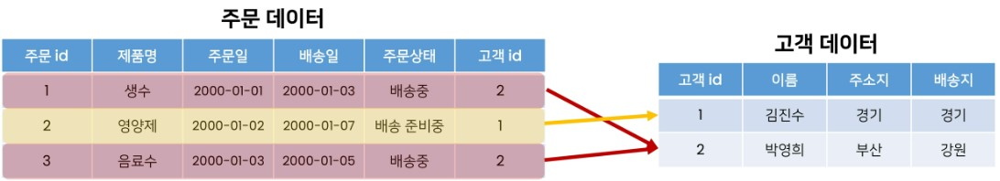

## 1. Many-to-one relationships
* A table's more than zero records reference the other table's one record

### 1-1. Foreign Key
* The foreign key should be unique value like PK
* Referential Integrity should be protected when the relation is announced

## 2. Comment : Article (N:1)
* models.py
    ```python
    # articles/models.py
    class Article(models.Model):
        title = models.CharField(max_length=10)
        content = models.TextField()
        created_at = models.DateTimeField(auto_now_add=True)
        updated_at = models.DateTimeField(auto_now=True)


    class Comment(models.Model):
        article = models.ForeignKey(Article, on_delete=models.CASCADE, releated_name='comments')
        content = models.CharField(max_length=200)
        created_at = models.DateTimeField(auto_now_add=True)
        updated_at = models.DateTimeField(auto_now=True)
    ```
    ```python
    # articles/admin.py
    from .models import Article, Comment
    
    admin.site.register(Article)
    admin.site.register(Comment)
    ```

    * on_delete
        * Referential Integrity: what to do when the parent instance is deleted
        * CASCADE
            * the child instance is also deleted
        * PROTECT
            * can't delete the parent instance
        * SET_NULL
        * SET_DEFAULT
    * related_name
        * set the alias of the manager fo dereferencing  
        * default value == 'ChildModelName_set'
* forms.py
    ```python
    # articles/forms.py
    class CommentForm(forms.ModelForm):
    
    class Meta:
        model = Comment
        exclude = ('article',)
    ```
* create
    * urls.py
        ```python
        # articles/urls.py
        urlpatterns = [
            ...,
            path('<int:pk>/comments/', views.comments_create, name='comments_create'),
        ]
        ```
    * views.py
        ```python
        # articles/views.py
        def comments_create(request, pk):
            article = Article.objects.get(pk=pk)
            comment_form = CommentForm(request.POST)
            if comment_form.is_valid():
                comment = comment_form.save(commit=False)
                comment.accounts = article
                comment.save()
            return redirect('movies:detail', pk)
        ```
    * detail.html
        ```html
        <!-- articles/detail.html -->
        <form action="  " method="POST">
            
            {{ comment_form }}
            <input type="submit">
        </form>
        ```
* read
    * views.py
        ```python
        # articles/views.py
        def detail(request, pk):
            article = Article.objects.get(pk=pk)
            comment_form = CommentForm()
            # 역참조 manager 사용
            # related_name 미선언 시, comment_set
            comments = article.comments.all()
            context = {
                'movie': movie,,
                'comment_form': comment_form,
                'comments': comments
            }
            return render(request, 'articles/detail.html', context)
        ```
    * detail.html
        ```html
        <h4>댓글 목록</h4>
        <ul>
            
                <li>{{ comment.content }}</li>
            
        </ul>
        ```
* delete
    * urls.py
        ```python
        # articles/urls.py
        urlpatterns = [
            ...,
            path('<int:article_pk>/comments/<int:comment_pk>', views.comments_delete, name='comments_delete'),
        ]
        ```
    * views.py
        ```python
        # articles/views.py
        def comments_delete(request, article_pk, comment_pk):
            comment = Comment.objects.get(pk=comment_pk)
            comment.delete()
            return redirect('articles:detail', article_pk)
        ```
    * detail.html
        ```html
        <h4>댓글 목록</h4>
        <ul>
            
                <li>
                    {{ comment.content }}
                    <form action="  " method="POST">
                        
                        <input type="submit" value="DELETE">
                    </form>
                </li>
            
        </ul>
        ```
## 2. Article : User (N:1)
* How to reference User model
    1. settings.AUTH_USER_MODEL
        * only in models.py
        * `from django.conf import settings`
    2. get_user_model()
* models.py
    ```python
    # articles/models.py
    from django.conf import settings

    class Movie(models.Model):
    user = models.ForeignKey(settings.AUTH_USER_MODEL, on_delete=models.CASCADE)
    ```
* forms.py
    ```python
    # articles/forms.py
    class ArticleForm(forms.ModelForm):
    
    class Meta:
        model = Comment
        exclude = ('user',)
    ```
* create
    * views.py
        ```python
        # articles/views.py
        
        @login_required  
        @require_http_methods(['GET', 'POST'])
        def create(request):
            if request.method == 'POST':
                form = ArticleForm(request.POST)
                if form.is_valid():
                    article = form.save(commit=False)
                    article.user = request.user
                    article.save()
                    return redirect('movies:detail', article.pk)
            else:
                form = ArticleForm()
            context = {
                'form': form,
            }
            return render(request, 'articles/create.html', context)
        ```
* read
    * detail.html
        ```html
        
            <h1>DETAIL</h1>
            <h2>{{ article.pk }}번째 글입니다.</h2>
            <hr>
            <p>작성자 : {{ article.user }}</p>
            <p>제목 : {{ article.title }}</p>
            <p>내용 : {{ article.content }}</p>
            <p>작성 시각 : {{ article.created_at }}</p>
            <p>수정 시각 : {{ article.updated_at }}</p>
            <hr>
        
        ```

* update
    * views.py
        ```python
        @login_required
        @require_http_methods(['GET', 'POST'])
        def update(request, pk):
            article = article.objects.get(pk=pk)
            if request.user == article.user:
                if request.method == 'POST':
                    form = ArticleForm(request.POST, instance=article)
                    if form.is_valid():
                        form.save()
                        return redirect('articles:detail', pk)
                else:
                    form = ArticleForm(instance=article)
                context = {
                    'article': article,
                    'form': form
                }
                return render(request, 'articles/update.html', context)
            return HttpResponse(status=403)
        ```
    * detail.html
        ```html
        
            <a href="">UPDATE</a>
            <form action="" method="POST">
                
                <input type="submit" value="DELETE">
            </form>
        
        ```

* delete
    * views.py
        ```python
        # articles/views.py
        
        @require_POST
        def delete(request, pk):
            article = Article.objects.get(pk=pk)
            if request.user.is_authenticated:
                if request.user == article.user:
                    article.delete()
                    return redirect('articles:index')
                return HttpResponse(status=403) # 권한없음
            return redirect('accounts:login')
        ```
    * detail.html
        ```html
        
            <a href="">UPDATE</a>
            <form action="" method="POST">
                
                <input type="submit" value="DELETE">
            </form>
        
        ```
## 3. Comment : User (N:1)
* models.py
    ```python
    # articles/models.py
    class Comment(models.Model):
        article = models.ForeignKey(Article, on_delete=models.CASCADE, releated_name='comments'),
        user = mmodels.ForeignKey(settings.AUTH_USER_MODEL, on_delete=models.CASCADE)
    ```
* forms.py
    ```python
    # articles/forms.py
    class CommentForm(forms.ModelForm):
    
    class Meta:
        model = Comment
        exclude = ('article', 'user',)
    ```
* create
    * views.py
        ```python
        # articles/views.py
        def comments_create(request, pk):
            article = Article.objects.get(pk=pk)
            comment_form = CommentForm(request.POST)
            if comment_form.is_valid():
                comment = comment_form.save(commit=False)
                comment.accounts = article
                comment.user = request.user
                comment.save()
            return redirect('movies:detail', pk)
        ```
* read
    * detail.html
        ```html
        <h4>댓글 목록</h4>
        <ul>
            
                <li>{{ comment.user }}: {{ comment.content }}</li>
            
        </ul>
        ```
* delete
    * views.py
        ```python
        # articles/views.py
        def comments_delete(request, article_pk, comment_pk):
            comment = Comment.objects.get(pk=comment_pk)
            if request.user == comment.user:
                comment.delete()
            return redirect('articles:detail', article_pk)
        ```
    * detail.html
        ```html
        <h4>댓글 목록</h4>
        <ul>
            
                <li>
                    {{ comment.user }}: {{ comment.content }}
                    
                        <form action="  " method="POST">
                            
                            <input type="submit" value="DELETE">
                        </form>
                    
                </li>
            
        </ul>
        ```