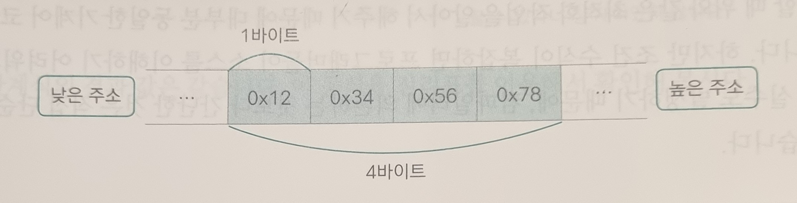
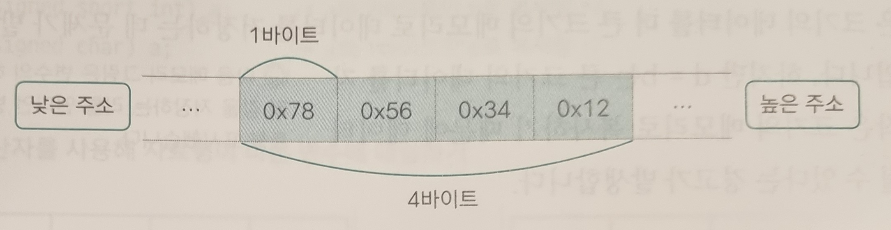

## 1. Bit operation
* the order of the bits is counted from the **left** starting with **zero**
### 1-1. Bit operator
|A|B|A&B|A\|B|A^B|~A|
|---|---|---|---|---|---|
|0|0|0|0|0|1|
|0|1|0|1|1|1|
|1|0|0|1|1|0|
|1|1|1|1|0|0|
### 1-2. Shift operator
* <<
    * Move the bits to the left one by one
    * num << 2 == num * 2
    * Application
        * 1 << n
            * the number of power sets of a set of n elements
            * 2 ** n
        * i & (1 << j)
            * whether the nth bit of i is 1
* \>>
    * Move the bits to the right one by one
    * num << 2 == num // 2

## 2. Endianness
* How consecutive bytes are stored in memory
* OS usually store the data from lower memory address to higher one
### 2-1. Big-endian
* the larger digits saved first

### 2-2. Little-endian
* chosen by the most OS
* the smaller digits saved first

## 4. Float
### 4-1. floating point

* exponent: the poistion of a decimal point
    * 32bit: 8 bit
        * bias: 127
    * 64bit: 11 bit
        * bias: 1023
* mantissa: effective digits
    * 32bit: 23 bit
    * 64bit : 52 bit
* Example
    * 12.35
        * 1100.0101100110011
            * 0.35 * 2 = 0.7
            * 0.7 * 2 = 1.4
            * 0.4 * 2 = 0.8
            * 0.8 * 2 = 1.6
            * 0.6 * 2 = 1.2
            * 0.2 * 2 = 0.4
            * 0.4 * 2 = 0.8
        * 1.1000101100110011
            * exponent
                * 2**3 + 127 = 130 = 10000010
        * 0 | 10000010 | 10001011001100110011001