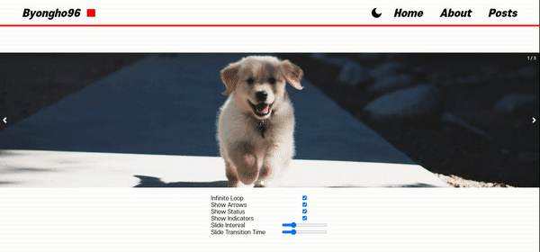

# 1. 목표

## 1.1. react-responsive-carousel

오늘은 'npm react carousel'을 구글링하면 제일 상단에 나오는 [react-responsive-carousel](https://www.npmjs.com/package/react-responsive-carousel)과 유사하게 동작하는 리액트 컴포넌트를 만들어 볼 것이다.



## 1.2. props 설정

오늘 만들 Type 컴포넌트는 다음과 같은 prop을 받는다. 전부 다 react-responsive-carousel에서 베껴온 것들이다.  
꽤 많아보이지만, 실제 라이브리가 받는 prop의 1/4정도 밖에 안된다;;

```js
type Props = {
  autoPlay?: boolean // 자동 재생 여부
  width?: string // 캐러셀 너비
  showArrows?: boolean // 호버 시 화살표 여부
  showStatus?: boolean //   우측 상단의 현재 요소의 인덱스 표시
  showIndicators?: boolean // 하단의 점 모양으로 선택된 요소 표시
  selectedItem?: number // 처음띄울 요소 인덱스
  interval?: number // 슬라이드 시간 간격 (ms)
  transitionTime?: number // 전환 시간(ms)
  infiniteLoop?: boolean // 무한 반복 영부
  children?: React.ReactNode
}
```

# 2. 전체 코드

[Github 소스코드](https://github.com/Byongho96/TIL/tree/master/src/pages/demo/2d-carousel)

항상 리액트 컴포넌트로 만들 때는, 동적인 prop에 따라 재렌더링을 고려해야한다는 점이 재밌고도 어렵다.  
아무튼 최대한 심플하게 로직을 짜보려고 했다. 스와이프 기능을 제외하면, 하나의 `useEffect`만으로 메인로직이 동작한다.

코드를 짜면서 새로 배운 내용이 3가지있다.

- **children의 갯수**

  - 원래는 React의 [Children API](https://react.dev/reference/react/Children)를 사용했는데, 이 글을 쓰려고 공식문서에 들어가보니까 Legacy APIs로 분류되어 사용을 권하지 않았다.
    > Using Children is uncommon and can lead to fragile code. See common alternatives.
  - 그래서 새로 알아본 것이 TypeScript의 **assertion**을 이용한 방법이다.
    ```js
    (children as React.ReactNode[]).lengths
    ```
    assertion을 사용하는게 꺼림직하긴 하지만, 캐러셀 특징 상 children이 `React.ReactNode[]`로 치환될 수 없다면, prop 자체가 잘못 내려온 것이기 때문에 괘찮을 것 같다.

- **정수배열 생성**

  - <mark>타입스크립트를 만족하면서 의미없는 길이 배열</mark>을 생성하는 법을 새로 찾아야 했다.  
    그렇게 알게된 것이 [Array.from()](https://developer.mozilla.org/en-US/docs/Web/JavaScript/Reference/Global_Objects/Array/from#using_arrow_functions_and_array.from)이다.
    ```js
    Array.from({ length: 5 }, (v, i) => i)
    // [0, 1, 2, 3, 4]
    ```

- **swipe 기능**

  - 모바일에서 스와이프 기능을 구현하기 위해, `touchstart`와 `touchend`이벤트를 이용했다.  
    [이 블로그](https://chicpro.dev/javascript%EB%A5%BC-%EC%9D%B4%EC%9A%A9%ED%95%B4-%EC%A2%8C%EC%9A%B0-swipe-%EB%B0%A9%ED%96%A5-%EC%95%8C%EC%95%84%EB%82%B4%EA%B8%B0/)의 글을 참조했다.

```js
import React, { useEffect, useMemo, useRef, useState, Children } from 'react'
import './style.scss'
import CircleIcon from '@assets/svgs/circle.svg' // 따로 svg 파일 준비
import LeftIcon from '@assets/svgs/left.svg'
import RightIcon from '@assets/svgs/right.svg'

type Props = {
  autoPlay?: boolean // 자동 재생 여부
  width?: string // 캐러셀 너비
  showArrows?: boolean // 호버 시 화살표 여부
  showStatus?: boolean //   우측 상단의 현재 요소의 인덱스 표시
  showIndicators?: boolean // 하단의 점 모양으로 선택된 요소 표시
  selectedItem?: number // 처음띄울 요소 인덱스
  interval?: number // 슬라이드 시간 간격 (ms)
  transitionTime?: number // 전환 시간(ms)
  infiniteLoop?: boolean // 무한 반복 영부
  children?: React.ReactNode
}

const Carousel: React.FC<Props> = ({
  autoPlay = true,
  width = '100%',
  showArrows = true,
  showStatus = true,
  showIndicators = true,
  selectedItem = 0,
  interval = 2000,
  transitionTime = 300,
  infiniteLoop = true,
  children,
}) => {
  const containerRef = useRef<HTMLDivElement>(null)
  const frameRef = useRef<HTMLDivElement>(null)
  const [index, setIndex] = useState(selectedItem) // 현재 선택된 인덱스

  // 슬라이드의 갯수 (children의 길이)
  const length = useMemo(() => {
    return (children as React.ReactNode[]).length
  }, [children])

  // 다음 슬라이드로 이동하는 함수
  const slideNext = function () {
    setIndex((index) => (index + 1 > length - 1 ? 0 : index + 1))
  }

  // 이전 슬라이드로 이동하는 함수
  const slidePrev = function () {
    setIndex((index) => (index - 1 < 0 ? length - 1 : index - 1))
  }

  // 자동 플레이를 위한 인터벌 함수
  useEffect(() => {
    if (!autoPlay) return // 자동플레이가 아닐 경우, 실행 안함

    const container = containerRef.current
    const frame = frameRef.current

    if (
      !(container instanceof HTMLDivElement) ||
      !(frame instanceof HTMLDivElement)
    )
      return

    let containerWidth = 0 // 부모 컨테이너 너비

    // 부모 컨테이너 너비 설정 & 프레임 초기 위치 설정 (화면 리사이즈마다 실행)
    const init = function () {
      containerWidth = container.offsetWidth
      frame.style.transform = `translateX(-${containerWidth * index}px)`
    }

    // 슬라이드 메인 함수
    const slide = function () {
      let tmp_index = index + 1
      // 마지막 슬라이드일 경우,
      if (tmp_index > length - 1) {
        if (!infiniteLoop) clearInterval(intervalId) // 무한 반복이 아니면 종료
        else tmp_index = 0 // 무한 반복이면 다시 처음으로
      }
      frame.style.transform = `translateX(-${containerWidth * tmp_index}px)`
      setIndex(tmp_index)
    }

    init() // 초기화
    const intervalId = setInterval(slide, interval) // 인터벌 등록
    window.addEventListener('resize', init) // 이벤트 리스너

    return () => {
      // 클린업
      clearInterval(intervalId)
      window.removeEventListener('resize', init)
    }
  }, [autoPlay, interval, infiniteLoop, index, length])

  // 모바일 동작을 위한 swipe 이벤트 리스너
  useEffect(() => {
    const container = containerRef.current
    if (!(container instanceof HTMLDivElement)) return

    // 터치 시작 위치
    const touchStartInfo = {
      x: 0,
      y: 0,
    }

    // 터시 시작 시, 터치 시작 위치 기록
    const touchStart = function (event: TouchEvent) {
      const touch = event.touches[0]
      touchStartInfo.x = touch.clientX
      touchStartInfo.y = touch.clientY
    }

    // 터치 종료 시, 터지 종료에 따라 동작
    const touchEnd = function (event: TouchEvent) {
      if (event.touches.length === 0) {
        const touch = event.changedTouches[event.changedTouches.length - 1] // 마지막 터치 위치
        const touchoffsetX = touch.clientX - touchStartInfo.x
        const touchoffsetY = touch.clientY - touchStartInfo.y

        // 가로로 80px이상 && 세로로 20px 이하 이동 시, 터치로 인식
        if (Math.abs(touchoffsetX) >= 80 && Math.abs(touchoffsetY) <= 20) {
          if (touchoffsetX < 0)
            setIndex((index) => (index + 1 > length - 1 ? 0 : index + 1))
          // 왼쪽으로 슬라이드
          else setIndex((index) => (index - 1 < 0 ? length - 1 : index - 1)) // 오른쪽으로 슬라이드
        }
      }
    }

    // 이벤트 리스너 달기
    container.addEventListener('touchstart', touchStart)
    container.addEventListener('touchend', touchEnd)

    return () => {
      // 클린업
      container.removeEventListener('touchstart', touchStart)
      container.removeEventListener('touchend', touchEnd)
    }
  }, [length])

  return (
    <div className="carousel-2d" ref={containerRef} style={{ width: width }}>
      <div
        className="carousel-2d__frame"
        ref={frameRef}
        style={{ transition: `transform ${transitionTime}ms ease-in-out` }}
      >
        {children}
      </div>
      {showArrows && (
        <>
          <div className="carousel-2d__left" onClick={slidePrev}>
            <LeftIcon />
          </div>
          <div className="carousel-2d__right" onClick={slideNext}>
            <RightIcon />
          </div>
        </>
      )}
      {showStatus && (
        <div className="carousel-2d__status">{`${index + 1} / ${length}`}</div>
      )}
      {showIndicators && (
        <CarouselIndicator
          length={length}
          selectedIdx={index}
          onClick={(idx: number) => setIndex(idx)}
        />
      )}
    </div>
  )
}

interface CarouselIndicatorProps {
  length: number
  selectedIdx: number
  onClick: (n: number) => void
}

// https://developer.mozilla.org/en-US/docs/Web/JavaScript/Reference/Global_Objects/Array/from
// 특정길이의 연속적인 정수 배열을 만드는 방법
// Array.from({ length: 5 }, (v, i) => i);
// [0, 1, 2, 3, 4]

const CarouselIndicator: React.FC<CarouselIndicatorProps> = ({
  length,
  selectedIdx,
  onClick,
}) => {
  return (
    <ul className="carousel-2d__indicator">
      {Array.from({ length }, (_, idx) => (
        <li
          key={idx}
          className={`carousel-2d__indicator__circle ${
            idx === selectedIdx ? 'active' : ''
          }`}
          onClick={() => onClick(idx)}
        >
          <CircleIcon />
        </li>
      ))}
    </ul>
  )
}

```

```css
.carousel-2d {
  position: relative;
  overflow: hidden;
}

.carousel-2d__frame {
  display: flex;
  align-items: center;
  flex: nowrap;
}

.carousel-2d__frame > * {
  min-width: 100%;
}

.carousel-2d__left {
  display: flex;
  align-items: center;
  position: absolute;
  top: 0;
  bottom: 0;
  left: 0;
  padding: 0.2vw;
  background-color: rgba(250, 235, 215, 0);
}

.carousel-2d__right {
  display: flex;
  align-items: center;
  position: absolute;
  top: 0;
  bottom: 0;
  right: 0;
  padding: 0.2vw;
  background-color: rgba(0, 0, 0, 0);
}

.carousel-2d__left path,
.carousel-2d__right path {
  stroke: white;
  fill: white;
}

.carousel-2d__left:hover,
.carousel-2d__right:hover {
  background-color: rgba(0, 0, 0, 0.236);
  cursor: pointer;
}

.carousel-2d__status {
  position: absolute;
  top: 10px;
  right: 10px;
  color: white;
}

.carousel-2d__indicator {
  display: flex;
  align-items: center;
  justify-content: center;
  gap: 10px;
  position: absolute;
  bottom: 5px;
  left: 0;
  right: 0;
}

.carousel-2d__indicator__circle svg {
  width: 10px;
  height: 10px;
  cursor: pointer;
}

.carousel-2d__indicator__circle path {
  fill: rgba(255, 255, 255, 0.342);
  stroke: rgba(255, 255, 255, 0.342);
}

.carousel-2d__indicator__circle.active path {
  fill: rgb(255, 255, 255);
  stroke: rgb(255, 255, 255);
}
```

# 3. 사용 예시

다음과 같이 부모 컴포넌트에서, 완성된 컴포넌트를 `children`으로 내려주기만 하면 된다.

[애니매이션 라이브 페이지로 이동!](https://byongho96.github.io/TIL/demo/2d-carousel/)


```js
import React from 'react'
import './style.css'
import Carousel from './Carousel.tsx'

const App: React.FC = () => {
  return (
    <div className="carousel-2d-page">
      <Carousel>
        <div className="carousel-2d-page__item">
          
        </div>
        <div className="carousel-2d-page__item">
          
        </div>
        <div className="carousel-2d-page__item">
          
        </div>
      </Carousel>
    </div>
  )
}

export default App
```

```css
.carousel-2d-page {
  display: flex;
  align-items: center;
}

.carousel-2d-page__item {
  display: flex;
  align-items: center;
  justify-self: center;
  overflow: hidden;
  position: relative;
  height: 25vw;
  min-height: 500px;
}

.carousel-2d-page__item img {
  min-width: 100%;
  min-height: 100%;
  object-fit: cover;
  object-position: center;
}
```

# 4. 참고

- [CHICPRO: JavaScript를 이용해 좌우 swipe 방향 알아내기](https://chicpro.dev/javascript%EB%A5%BC-%EC%9D%B4%EC%9A%A9%ED%95%B4-%EC%A2%8C%EC%9A%B0-swipe-%EB%B0%A9%ED%96%A5-%EC%95%8C%EC%95%84%EB%82%B4%EA%B8%B0/)
