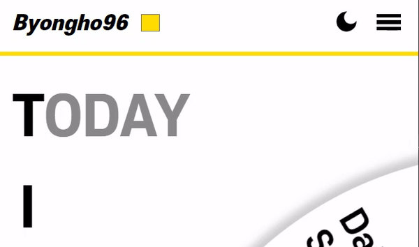
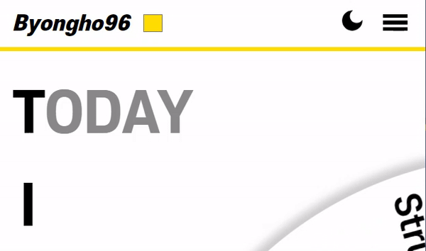
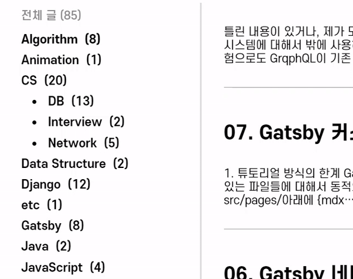

# 1. 사건의 발단

CSS를 하다보면 종종 개빡치는 일이 생기기 마련이다.  
빡침의 이유도 가지 각색인데, 오늘 다루고자 하는 주제는 '이게 안된다고?'하는 느낌이다.

바로 CSS에서 height를 `0`에서 `auto`로 바뀔 때 애니메이션이 먹지 않는 것이다.  
다음과 같이 아주 간단한 예시코드를 작성해볼 수 있다. 사용자가 클릭하면 `.navbar__menu`태그에 `.open`클래스가 토글된다는 자바스크립트 코드는 착한 사람한테만 보인다.

```html
<!-- .open 클래스가 토글된다 -->
<ul className="navbar__menu">
  <li>
    <a to="/"> Home </a>
  </li>
  <li>
    <a to="/about"> About </a>
  </li>
  <li>
    <a to="/posts"> Posts </a>
  </li>
</ul>
```

```scss
.navbar__menu {
  display: flex;
  flex-direction: column;
  align-items: center;
  gap: 0.2rem;
}

.navbar__menu li {
  height: 0;
  opacity: 0;
  transition: height 0.2s ease-in-out, opacity 0.2s ease-in-out;
}

.navbar__menu.open li {
  height: auto;
  opacity: 1;
}
```

설레는 마음으로 코드를 돌려보며 아래처럼 동작한다.



# 2. grid-template-rows

그러던 중 `grid-template-rows`라는 구원투수를 알게 되었다.  
`grid-template-rows`에 값을 **적절하게** 입력하면, 우리가 바라는 height 애니메이션을 구현할 수 있다.

**적절하게**라는 표현이 애매한걸 알지만 어쩔 수 없다. height 0 to auto가 예상한대로 동작하지 않았듯이, grid-template-rows의 값도 예상처럼 동작하지 않는다.

## 2.1. 고정된 갯수의 리스트

현재 네비게이션 바의 리스트 갯수가 3개이므로 `grid-template-rows: repeat(3, 0fr);`로 설정한다. 즉, 3개의 `li`요소는 높이(rows)가 0이 된다.

단 `li`의 높이가 0이라도, `li`안에 있는 콘텐츠(`a`)가 overflow된 채로 보여진다. 따라서 아예 렌더링되지 않도록 `overflow: hidden;`을 설정해준다.

그리고 네비게이션바가 토글되었을 때, `grid-template-rows: repeat(3, 1fr);`로 설정한다. 이는 3개의 요소를 모두 **동일한 높이(1:1:1)**로 만들겠다는 의미이다. 그 높이는 **요소 중 가장 큰 높이**로 결정된다. <mark>따라서 지금 말하는 방식은 모든 요소가 동일한 높이를 가져야한다.</mark>

```html
<!-- .open 클래스가 토글된다 -->
<ul className="navbar__menu">
  <li>
    <a to="/"> Home </a>
  </li>
  <li>
    <a to="/about"> About </a>
  </li>
  <li>
    <a to="/posts"> Posts </a>
  </li>
</ul>
```

```css
.navbar__menu {
  display: grid;
  grid-template-rows: repeat(3, 0fr);
  transition: grid-template-rows 0.2s ease-in-out;
}

.navbar__menu.open {
  grid-template-rows: repeat(3, 1fr);
}

.navbar__menu li {
  overflow: hidden;
}
```

결과는 아래와 같이 잘 동작한다.



## 2.2. 임의 갯수의 리스트

위의 방식에 따르면, `repeat(요소의 갯수, fr)`형식으로 입력해야 한다. 그런데 리스트의 갯수를 고정할 수 없다면 어떻게 해야할까?

참고로 요소의 갯수에 `auto-fit`, `auto-fill` 등을 넣어도 모두 소용없다...

가장 쉬운 방법은 그냥 자바스크립트로 요소의 갯수를 전달해주면 된다.

```js
const menuArr = []
const navbarMenu = document.querySelector('.navbar__menu')
navbarMenu.style.setProperty('--menu-count', menuArr.length.toString())
```

```css
.navbar__menu {
  display: grid;
  grid-template-rows: repeat(var(--menu-count), 0fr);
  transition: grid-template-rows 0.2s ease-in-out;
}

.navbar__menu.open {
  grid-template-rows: repeat(var(--menu-count), 1fr);
}

.navbar__menu li {
  overflow: hidden;
}
```

네비게이션바는 아니지만, 위와 같이 자바스크립트에서 CSS 속성을 추가해주는 방식으로, 카테고리 바의 height 애니메이션을 구현했다.



## 2.3. 서로 다른 높이의 리스트

이 부분은 대략적으로만 설명하고 넘어가려고 한다.

내가 생각해낸 방법은, 결국 각 리스트마다 별개의 grid 레이아웃을 설정하는 것이다. 다음과 같이 각 리스트마다 `.wrapper`클래스를 가진 요소로 감싸고, 해당 요소마다 `grid`를 적용하는 것이다.

```html
<!-- .open 클래스가 토글된다 -->
<ul className="navbar__menu">
  <li className="wrapper">
    <div>
      <a to="/">
        Home Home Home Home Home Home Home Home Home Home Home Home ...
      </a>
    </div>
  </li>
  <li className="wrapper">
    <div>
      <a to="/about"> About </a>
    </div>
  </li>
  <li className="wrapper">
    <div>
      <a to="/posts"> Posts Posts Posts ... </a>
    </div>
  </li>
</ul>
```

```css
.navbar__menu .wrapper {
  display: grid;
  grid-template-rows: 0fr;
  transition: grid-template-rows 0.2s ease-in-out;
}
.navbar__menu.open .wrapper {
  grid-template-rows: 1fr;
}
.navbar__menu li {
  overflow: hidden;
}
```

# 3. 참고

- [YouTube: The simple trick to transition from height 0 to auto with CSS](https://www.youtube.com/watch?v=B_n4YONte5A&t=75s)
- [YouTube: This CSS Trick Makes Impossible Animations Possible](https://www.youtube.com/shorts/3gNOoYzarNo)
