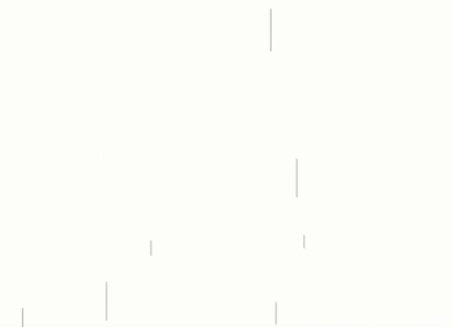

# 1. 목표

["YouTube: 자바스크립트 Canvas로 비내리는 인터렉티브한 배경 만들기 튜토리얼, 맛있는 코딩"](https://www.youtube.com/watch?v=o9DWbtkQ5g8) 를 따라잡고, Prop을 받아 커스텀할 수 있는 리액트 컴포넌트로 만드는게 목표다.

다음과 같은 Prop을 받아 리액트 컴포넌트를 커스텀할 수 있도록 할 것이다.

```js
type Props = {
  amount?: number   // 빗줄기 갯수: 1 ~ 100
  speed?: number    // 빗줄기 속도: 1 ~ 50
  color?: string    // 빗줄기 색깔
  isThunder?: boolean   // 천둥 여부
  thunderRate?: number  // 천둥 빈도: 0 ~ 1
}
```

# 2. 리액트 코드

강의의 자바스크립트 코드를, 정말 약간만 커스텀해서 리액트 컴포넌트로 바꿨다.  
특별하고 짚고 싶은 부분이 2개가 있다.

- **useEffect**  
  Prop에 따라 렌더링이 다시 일어나야했기 때문에 `useEffect`문에 실행함수를 넣어주고, 적절하게 클린업 함수를 추가해주었다.

- **바람**  
  [강의](https://www.youtube.com/watch?v=o9DWbtkQ5g8)의 9:58를 보면, 마우스 위치에 따른 바람 효과를 주고자 다음과 같이 코드를 작성한다.

  ```js
  this.velocity.x += mouse.isActive
    ? randomBetween(-1, 1) + (-innerWidth / 2 + mouse.x)
    : randomBetween(-1, 1)
  ```

  근데 위와 같이 코드를 작성하면, `velocity.x`가 계속해서 랜덤하게 바뀌기 때문에 빗줄기가 마치 지렁이처럼 꿈틀거린다.

  

  그래서 나는 처음할당 된`velocity.x`(`dx`)를 랜덤하게 재할당 하지 않고, `wind`변수를 추가로 만들어 적절한 위치에 추가했다. 그 결과 빗줄기가 아래처럼 깔끔하게 떨어진다.

  

```js
import React, { useEffect, useRef } from 'react'

type Props = {
  amount?: number
  speed?: number
  color?: string
  isThunder?: boolean
  thunderRate?: number
}

const RainingCanvas: React.FC<Props> = ({
  amount = 30,
  speed = 15,
  color = '#ffffff',
  isThunder = true,
  thunderRate = 0.1,
  containerRef = null,
}) => {
  const canvasRef = useRef<HTMLCanvasElement>(null)

  // Prop 범위 제한
  useEffect(() => {
    // amount 제한 1 ~ 100
    if (amount <= 0 || 100 < amount) {
      throw new Error(
        'amount is out of range, It should be greater than 0 and less than 100'
      )
    }
    // speed 제한 1 ~ 50
    if (speed <= 0 || 50 < speed) {
      throw new Error(
        'speed is out of range, It should be greater than 0 and less than 50'
      )
    }
    // thunderRate 제한 0~1
    if (thunderRate <= 0 || 1 < thunderRate) {
      throw new Error(
        'thunderRate is out of range, It should be greater than 0 and less than 1'
      )
    }
  }, [amount, speed, thunderRate])

  useEffect(() => {
    const canvas = canvasRef.current
    const ctx = canvas.getContext('2d')
    const mouse = { x: 0, y: 0, isActive: false } // 마우스 정보
    let rainDropArray = [] // 빗줄기 인스턴스를 담는 배열
    let rainSplashArray = [] // 튀기는 빗방울 인스턴스름 담는 배열
    let thunder = null
    if (isThunder) {
      thunder = new Thunder()
    }

    // canvas 초기화 함수
    function init() {
      rainDropArray = []
      rainSplashArray = []

      // containerRef에 따라 캔버스 크기 조절
      console.log(canvas?.parentElement)
      const innerWidth = canvas?.parentElement?.clientWidth
      const innerHeight = canvas?.parentElement?.clientHeight
      canvas.width = innerWidth
      canvas.height = innerHeight

      // 캔버스 크기에 따라 빗줄기 갯수 설정
      const total = Math.floor((innerWidth * innerHeight * amount) / 400000)
      // 빗줄기 생성
      for (let i = 0; i < total; i++) {
        const x = Math.random() * innerWidth
        const y = Math.random() * innerHeight
        const dx = Math.random() * 0.1 - 0.05
        const dy = Math.random() * 5 + parseInt(speed) // 왜인지 parseInt가 없으면 오류가 남...
        rainDropArray.push(new RainDrop(x, y, dx, dy, color, rainSplashArray))
      }
    }

    // cavnas 렌더링(애니메이션) 함수
    let requestAnimationId = null
    function render() {
      ctx.clearRect(0, 0, canvas.width, canvas.height)
      // 빗줄기 애니메이션
      const wind = mouse.isActive ? (mouse.x - ctx.canvas.width / 2) / 80 : 0 // 마우스 위치에 따른 바람
      rainDropArray.forEach((rainDrop) => {
        rainDrop.animate(ctx, wind)
      })
      // 튀기는 빗방울 애니메이션
      rainSplashArray.forEach((rainSplash, idx) => {
        rainSplash.animate(ctx)
        if (rainSplash.y > canvas.height) {
          rainSplashArray.splice(idx, 1) // 튀기는 물방울은 1회성으로 제거
        }
      })
      // 천둥 애니메이션
      if (thunder) {
        if (Math.random() < thunderRate * 0.05) {
          thunder.opacity = 0.3
        }
        thunder.animate(ctx)
      }
      requestAnimationId = window.requestAnimationFrame(render) // requestAnmiationFrame
    }

    init() // 초기화
    render() // 애니메이션 시작

    // 화면 리사이즈 시, 초기화 함수 동작
    window.addEventListener('resize', init)

    // 캔버스에 마우스 관련 이벤트리스너 등록 => mouse 객체 업데이트
    function setMouseActive() {
      mouse.isActive = true
    }
    function setMouseInactive() {
      mouse.isActive = false
    }
    function setMousePosition(e) {
      mouse.x = e.clientX
      mouse.y = e.clientY
    }
    canvas.addEventListener('mouseenter', setMouseActive)
    canvas.addEventListener('mouseleave', setMouseInactive)
    canvas.addEventListener('mousemove', setMousePosition)

    return () => {
      window.cancelAnimationFrame(requestAnimationId)
      window.removeEventListener('resize', init)
      canvas.removeEventListener('mouseenter', setMouseActive)
      canvas.removeEventListener('mouseleave', setMouseInactive)
      canvas.removeEventListener('mousemove', setMousePosition)
    }
  }, [color, amount, speed, isThunder, thunderRate, containerRef])

  return <canvas ref={canvasRef} />
}

export default RainingCanvas

// 떨어지는 빗방울
class RainDrop {
  // 생성자 (위치 좌표, 이동 속도)
  constructor(x, y, dx, dy, color, splashArray) {
    this.x = x
    this.y = y
    this.dx = dx
    this.dy = dy
    this.wind = 0
    this.color = color
    this.splashArray = splashArray
  }

  // 빗줄기 그리기
  draw(ctx) {
    const { x, y, dx, dy, wind, color } = this
    ctx.beginPath()
    ctx.moveTo(x, y)
    ctx.lineTo(x + dx + wind, y + 1.5 * dy)
    ctx.strokeStyle = color
    ctx.lineWidth = 1
    ctx.stroke()
  }

  // 튀기는 물방울 생성
  splash() {
    const { x, y, dx, dy, color, splashArray } = this
    for (let i = 0; i < 3; i++) {
      const splash_dx = Math.random() * 6 + dx - 1 // 물방울의 x축 속도
      const splash_dy = Math.random() * 0.7 - dy * 0.24 // 물방울의 y축 속도
      splashArray.push(new RainSplash(x, y, splash_dx, splash_dy, color))
    }
  }

  // 빗줄기 이동
  animate(ctx, wind = 0) {
    // 빗줄기가 캔버스 아래로 내려가면, 다시 위로 이동
    if (this.y > ctx.canvas.height) {
      this.splash()
      this.x = Math.random() * ctx.canvas.width * 1.4 - ctx.canvas.width * 0.2 // 적당히 캔버스의 너비를 초과하게
      this.y = -50 // 적당히 캔버스 위
    }
    this.wind = wind
    this.x += this.dx + wind
    this.y += this.dy
    this.draw(ctx)
  }
}

// 빗방울 떨어졌을 때 튀기는 물방울
class RainSplash {
  // 생성자 (위치 좌표, 이동 속도)
  constructor(x, y, dx, dy, color) {
    this.x = x
    this.y = y
    this.dx = dx
    this.dy = dy
    this.color = color
    this.GRAVITY = 1.5 // MAGIC_NUMBER: 중력가속도
  }

  // 물방울(동그라미) 그리기
  draw(ctx) {
    const { x, y, color } = this
    const radius = Math.random() * 0.5 + 0.85
    ctx.beginPath()
    ctx.arc(x, y, radius, 0, Math.PI * 2) // 원 그리기 arc(x, y, radius, startAngle, endAngle)
    ctx.fillStyle = color
    ctx.fill()
  }

  // 물방울 애니메이션 (포물선 형태로 올라갔다가 떨어짐)
  animate(ctx) {
    this.x += this.dx
    this.y += this.dy
    this.dy += this.GRAVITY // 중력 가속도
    this.draw(ctx)
  }
}

class Thunder {
  // 생성자
  constructor() {
    this.opacity = 0
  }

  // 천둥 그리기
  draw(ctx) {
    const gradient = ctx.createLinearGradient(0, 0, 0, ctx.canvas.height) // gradient 좌표정보 (시작 x, 시작 y, 끝 x, 끝 y)
    gradient.addColorStop(0, `rgba(180, 190, 255, ${this.opacity})`) // 시작 색상 (offset, color)
    gradient.addColorStop(1, `rgba(0, 0, 0, 0)`) // 끝 색상(offset, color)
    ctx.fillStyle = gradient
    ctx.fillRect(0, 0, ctx.canvas.width, ctx.canvas.height)
  }

  // 천둥 애니메이션
  animate(ctx) {
    if (this.opacity < 0) return
    this.opacity -= 0.003
    this.draw(ctx)
  }
}
```

# 3. 사용 예시

[애니메이션 라이브 페이지로!](https://byongho96.github.io/TIL/404/)

Context API를 이용해 `theme`을 관리하는 상황에서, 아래와 같이 `theme`에 따라 동적으로 prop을 내려줄 수도 있다.

```js
import React, { useContext } from 'react'
import RainingCanvas from './ RainingCanvas.tsx'
import { ThemeContext } from '@contexts/theme-context'

const App: React.FC = () => {
  const { theme } = useContext(ThemeContext)

  // theme에 따라 비의 색깔과 천둥 여부 결정
  const { color, isThunder } = useMemo(() => {
    let color = '#eeeeeeaa'
    let isThunder = true
    if (theme === 'light') {
      color = '#888888aa'
      isThunder = false
    }
    return { color, isThunder }
  }, [theme])

  return (
    <RainingCanvas
      color={color}
      isThunder={isThunder}
      amount={amount}
      speed={speed}
      thunderRate={thunderRate}
    />
  )
}

export default App
```

[애니메이션 라이브 페이지로 이동!](https://byongho96.github.io/TIL/404/)
