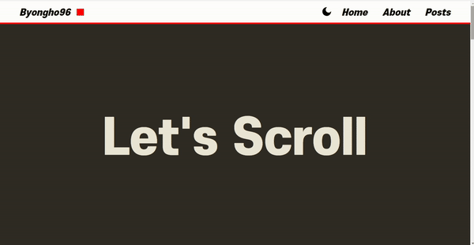
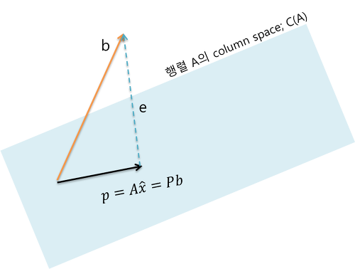

# 1. 목표

["YouTube: 자바스크립트로 11분만에 카드 스크롤 애니메이션 마스터하기, 맛있는 코딩"](https://www.youtube.com/watch?v=337HnOk13zc&t=619s) 를 따라잡고, 이를 커스텀할 수 있는 리액트 컴포넌트로 만드는게 목표다.



안타깝지만 나는 저 강의를 11분 만에 따라잡지 못했다.  
영상을 보면 `transform-style: preserve-3d`나 `backface-visibility: hidden;`와 같은 해괴망측한 CSS 속성이 나오는데, 그건 [이 영상](https://www.youtube.com/watch?v=FeJEEE3zc4U)에 잘 정리되어 있다.

# 2. CSS 속성

## 2.1. transform-style

**3D 변환을 적용할 때, <mark>자식 요소</mark>들이 어떻게 처리될지를 설정한다.**

- **flat**  
  기본값이다.  
  자식 요소들은 3D 공간 내에서, 부모 요소에 투영(projection)되어 처리된다.  
  선형대수를 배운 사람들은 선형대수의 projection을, 아니면 중고등 교과과정에서 수선을 그리는 걸 생각하면 된다.

  

- **preserve-3d**  
  자식 요소들이 3D 공간 내에서, 3D 공간감을 그대로 가지고 처리된다.  
  직관적으로 생각하는 3D깊이와 원금감을 가지고 동작한다.

말로 설명하는 것보다 [이 영상](https://www.youtube.com/watch?v=FeJEEE3zc4U)의 "7:24 ~ 11:40"를 보면 딱 이해간다.

## 2.2. backface-visibility

**요소의 뒷면이 화면에 보이는지 여부를 지정한다.** 이 때 뒷면이라는 것은 `rotateY()`나 `translateZ()`와 같은 3D transform에 의해 결정된다. `z-index` 2D를 기반으로 동작하는 값이기 때문에 영향끼치지 않는다.

- **visible**  
  기본값이다.  
  visible을 설정하면 요소의 뒷면이 화면에 보이게 된다.

- **hidden**  
  hidden을 설정하면 요소의 뒷면이 화면에 보이지 않는다. 3D 변환을 사용하여 요소를 회전시키거나 뒷면을 가려야 할 때 유용하게 쓰일 수 있다.

# 3. 전체 코드

## 3.1. 리액트 컴포넌트

[Github 소스코드](https://github.com/Byongho96/TIL/tree/master/src/pages/demo/scroll-3d-card)

YouTube 영상을 그대로 리액트 컴포넌트로 바꾸었다.

그 과정에서 추가된 기능이 2개가 있다.

- **동적인 카드 갯수**  
  `cardTexts`의 길이에 따라 결정되는, 카드 갯수를 1~4개까지 동적으로 생성할 수 있게했다.

  - `cardTexts`의 길이가 4를 초과할 시 에러 발생
  - `cardTexts`의 길이에 따라, `.scroll-3d-card__card-frame`에서 사용할 `--card-gap` CSS 변수를 할당

- **네비게이션과 푸터 크기 고려**  
  내 웹사이트에는 네비게이션바와 푸터가 있다. 따라서 스크롤 처음과 마지막에 나오는 `.scroll-3d-card__start`과 `.scroll-3d-card__end`의 높이를 단순히 100vh로 설정하지 않고, 각각에서 네비게이션의 높이와 푸터의 높이를 빼주었다.

  - `resize`이벤트 발생 시, `--navbar-height`와 `--footer-height` CSS 변수를 재계산

```js
import React, { useEffect, useRef } from 'react'
import './style.scss'

type Props = {
  backgroundText?: string
  cardTexts?: string[]
  primaryColor?: string
  secondaryColor?: sgring
}

const Scroll3DCard: React.FC<Props> = ({
  backgroundText = 'Type Your Text',
  cardTexts = ['Text1', 'Text2', 'Text3', 'Text4'],
  primaryColor = 'beige',
  secondaryColor = 'black',
}) => {
  const containerRef = useRef<HTMLDivElement>(null)
  const mainContentRef = useRef<HTMLDivElement>(null)
  const stickyRef = useRef<HTMLDivElement>(null)

  // cardTexts 배열 4개 제한
  useEffect(() => {
    const container = containerRef.current
    const length = cardTexts.length

    // 4개를 초과할 경우 에러 발생
    if (length > 4) {
      throw new Error(
        'cardTexts length is out of range, It should be less than 5'
      )
    }

    // 카드 갯수에 따라 동적으로 gap 설정
    switch (length) {
      case 1:
        container.style.setProperty('--card-gap', '0')
        break
      case 2:
        container.style.setProperty('--card-gap', '20%')
        break
      case 3:
        container.style.setProperty('--card-gap', '11%')
        break
      case 4:
        container.style.setProperty('--card-gap', '1.33%')
        break
    }
  }, [cardTexts.length])

  // 메인컬러, 서브컬러 할당
  useEffect(() => {
    const container = containerRef.current

    if (!(container instanceof HTMLDivElement)) return

    container.style.setProperty('--primary-color', primaryColor)
    container.style.setProperty('--secondary-color', secondaryColor)
  }, [primaryColor, secondaryColor])

  // 메인 함수
  useEffect(() => {
    const container = containerRef.current // 가장 바깥의 컨테이너, css 변수를 담는 용도
    const background = mainContentRef.current
    const sticky = stickyRef.current
    const cards = sticky.querySelectorAll('.scroll-3d-card__card')

    if (
      !(container instanceof HTMLDivElement) ||
      !(background instanceof HTMLDivElement) ||
      !(sticky instanceof HTMLDivElement)
    )
      return

    const length = cards.length

    let start = 0 // 애니메이션 시작 시, 스크롤 위치
    let end = 0 // 애니메이션 끝날 시, 스크롤 위치
    let step = 0 // 애니메이션 구분 최소 단위

    // 초기화 함수, 화면 리사이즈마다 동작
    const init = function () {
      start = background.offsetTop
      end = background.offsetTop + background.offsetHeight - sticky.offsetHeight
      step = (end - start) / (length * 2)

      // 추가한 커스텀 로직: 네비게이션 바의 크기를 CSS에 전달 -> start화면 높이 조정
      const navbar = document.querySelector('.navbar')
      const navbarHeight: number =
        navbar instanceof HTMLElement ? navbar.offsetHeight : 0
      container.style.setProperty(
        '--navbar-height',
        navbarHeight.toString() + 'px'
      )

      // 추가한 커스텀 로직: 푸터 바의 크기를 CSS에 전달 -> end화면 높이 조정
      const footer = document.querySelector('.footer')
      const footerHeight: number =
        footer instanceof HTMLElement ? footer.offsetHeight : 0
      container.style.setProperty(
        '--footer-height',
        footerHeight.toString() + 'px'
      )
    }

    // 애니메이션 함수
    const animate = function () {
      const scrollTop = window.scrollY
      cards.forEach((card: HTMLElement, i) => {
        const movePoint = start + step * i // 카드 이동 시작 시점, 스크롤 위치
        const flipPoint = movePoint + step * length // 카드 플립 시작 시점, 스크롤 위치
        const endPoint = flipPoint + step // 카드 애니메이션 종료 시점, 스크롤 위치

        // 스크롤 위치에 따라 각 카드마다 애니메이션
        if (scrollTop < movePoint) {
          card.style.transform = `
              translateX(100vw)
              rotateY(180deg)
            `
        } else if (scrollTop < flipPoint) {
          card.style.transform = `
              translateX(${
                100 + ((scrollTop - movePoint) / (endPoint - movePoint)) * -100
              }vw)
              rotateY(180deg)
            `
        } else if (scrollTop < endPoint) {
          card.style.transform = `
              translateX(${
                100 + ((scrollTop - movePoint) / (endPoint - movePoint)) * -100
              }vw)
              rotateY(${
                180 + (-(scrollTop - flipPoint) / (endPoint - flipPoint)) * 180
              }deg)
            `
        } else {
          card.style.transform = `
              translateX(0vw)
              rotateY(0deg)
            `
        }
      })
    }

    init() // 초기화

    window.addEventListener('scroll', animate)
    window.addEventListener('resize', init)

    return () => {
      window.removeEventListener('scroll', animate)
      window.removeEventListener('resize', init)
    }
  }, [])

  return (
    <div ref={containerRef}>
      <div className="scroll-3d-card__start">Let's Scroll</div>
      <div className="scroll-3d-card__main-content" ref={mainContentRef}>
        <div className="scroll-3d-card--sticky" ref={stickyRef}>
          {backgroundText}
          <div className="scroll-3d-card__card-frame ">
            {cardTexts.map((text) => (
              <div className="scroll-3d-card__card">
                <div className="scroll-3d-card__card--front">{text}</div>
                <div className="scroll-3d-card__card--back"></div>
              </div>
            ))}
          </div>
        </div>
      </div>
      <div className="scroll-3d-card__end">The End</div>
    </div>
  )
}

export default Scroll3DCard
```

## 3.2. CSS 코드

```css
.scroll-3d-card__start,
.scroll-3d-card__end {
  display: flex;
  align-items: center;
  justify-content: center;
  width: 100%;
  height: calc(100vh - var(--navbar-height));
  background-color: var(--secondary-color);
  color: var(--primary-color);
  font-size: 10vw;
  font-weight: 800;
  text-align: center;
}

.scroll-3d-card__start {
  height: calc(100vh - var(--navbar-height));
}

.scroll-3d-card__end {
  height: calc(100vh - var(--footer-height));
}

.scroll-3d-card__main-content {
  width: 100%;
  height: 500vh;
  background-color: var(--primary-color);
  color: var(--secondary-color);
  font-size: 10vw;
  font-weight: 800;
  text-align: center;
}

.scroll-3d-card--sticky {
  display: flex;
  align-items: center;
  justify-content: center;
  overflow: hidden;
  position: sticky;
  top: 0;
  height: 100vh;
}

.scroll-3d-card__card-frame {
  position: absolute;
  width: 95vw;
  height: 30vw;
  display: flex;
  align-items: center;
  justify-content: center;
  gap: var(--card-gap); // 카드 갯수에 따라 동적으로 설정되는 gap
}

.scroll-3d-card__card {
  display: flex;
  align-items: center;
  justify-content: center;
  position: relative;
  width: 24%;
  height: 100%;
  font-size: 5vw;
  transform-style: preserve-3d; // 안의 컨텐츠가 3d 디멘션을 유지하도록 함
  transform: translateX(100vw) rotateY(180deg);
}

.scroll-3d-card__card--front,
.scroll-3d-card__card--back {
  position: absolute;
  width: 100%;
  height: 100%;
  border-radius: 1vw;
  box-shadow: 0px 0px 15px rgba(0, 0, 0, 0.15);
  backface-visibility: hidden; // 카드의 반대편이 안보이도록
}

.scroll-3d-card__card--front {
  background-color: #fffff9;
  font-size: 0.5em;
  display: flex;
  align-items: center;
  justify-content: center;
  text-align: center;
}

.scroll-3d-card__card--back {
  background: linear-gradient(
    180deg,
    var(--secondary-color) 33.3%,
    var(--primary-color) 33.3% 66.6%,
    var(--secondary-color) 66.6% 100%
  );
  background-blend-mode: darken;
  transform: rotateY(180deg);
}

.scroll-3d-card__card--back::after {
  content: '';
  position: absolute;
  width: 100%;
  height: 100%;
  border-radius: 1vw;
  background-color: #00000020;
}
```

# 4. 사용 예시

[애니메이션 라이브 페이지로!](https://byongho96.github.io/TIL/demo/scroll-3d-card/)


```js
import * as React from 'react'
import Scroll3DCard from './Scroll3DCard.tsx'

const App: React.FC = () => {
  return (
    <Scroll3DCard
      backgroundText="My Bucket List"
      cardTexts={[
        'Sky Diving',
        'Korean Airline First Class',
        'Milky Way',
        'Nobel Prize',
      ]}
      primaryColor="#e9e6d5"
      secondaryColor="#2f2c25"
    />
  )
}

export default App
```

# 5. 참고

- [YouTube: 자바스크립트로 11분만에 카드 스크롤 애니메이션 마스터하기, 맛있는 코딩](https://www.youtube.com/watch?v=337HnOk13zc&t=619s)
- [YouTube: Create a 3D flipping animation with HTML and CSS, Kevin Powell](https://www.youtube.com/watch?v=FeJEEE3zc4U)
