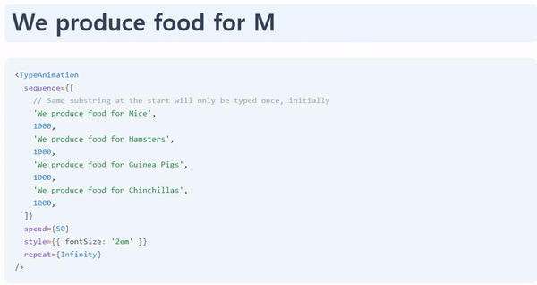

# 1. 목표

## 1.1. react-type-animation

구글링하면 [react-type-animation](https://www.npmjs.com/package/react-type-animation)라는 리액트용 타이핑 애니메이션 라이브러리가 바로 나온다. **이 라이브러리와 유사하게 동작하는 리액트 컴포넌트**를 만드는 것이 오늘의 목표다.



## 1.2. props 설정

오늘 만들 Type 컴포넌트는 다음과 같은 prop을 받는다.

```js
type Props = {
  phrases: string[] // 순서대로 타이핑 할 문구 리스트
  speed?: number // 타이핑 속도
  style?: object // 인라인 스타일 객체
  pause?: number // 한 개의 텍스트가 완성되고, 다음 텍스트가 타이핑 되기 전 대기시간
  isInfinite?: boolean // 타이핑 무한 반복 여부
}

```

# 2. 전체 코드

타이핑 애니메이션을 구현하기 위해서 JS와 CSS를 모두 사용했다. 특별하게 설명하고 싶은 부분이 2개 있다.

- **`element.textContext`**

  - `useState`를 사용하는 것은 추천하지 않는다. `setState`자체가 비동기적이어서 그런지, 속도가 아주 빨라지면 철자 오류가 발생했다.
  - `element.innerText`가 공백을 인식하지 못해서 `textContext`를 사용했다.

- **CSS 가상선택자**
  - YouTube강의를 보면 `border-right`요소로 커서를 구현하는 경우가 있다. 하지만 그럴 경우, 코드가 2줄 이상이 되면 요소 전체의 오른쪽에 커서 크게 생기는 오류가 발생했다. 또한 `font`와 `border`설정을 맞춰줘야하는 번거로움이 있다.
  - 가상선택자로 `'|'`라는 문자를 표시하면 위의 문제를 모두 해결할 수 있다.

```js
import React, { useRef, useState, useEffect } from 'react'
import './style.scss'

type Props = {
  phrases: string[] // 순서대로 타이핑 할 문구 리스트
  speed?: number // 타이핑 속도
  style?: object // 인라인 스타일 객체
  pause?: number // 한 개의 텍스트가 완성되고, 다음 텍스트가 타이핑 되기 전 대기시간
  isInfinite?: boolean // 타이핑 무한 반복 여부
}

const TypeAnimation: React.FC<Props> = ({
  phrases,
  speed = 5,
  style = {},
  pause = 2000, // 기본 대기 시간 2초
  isInfinite = false,
}) => {
  const textElementRef = useRef<HTMLSpanElement>(null)

  useEffect(() => {
    const textElement = textElementRef.current // 타이핑을 입력한 타겟 Element

    if (!textElement) return

    let phraseIdx = 0 // 현재 타이핑하는 문구의 인덱스
    let charIdx = 0 // 현재 타이핑하는 글자 인덱스
    let interval = null // setInterval을 담을 변수

    // 2. 타이핑 메인 함수
    function typeText() {
      textElement.style.setProperty('--cursor-opacity', 1) // 타이핑 하는 동안은 커서 깜빡이지 않도록
      const currentPhrase = phrases[phraseIdx] // 현재 타이핑하는 문구

      // 현재 문구 타이핑이 안 끝났을 경우
      if (charIdx < currentPhrase.length) {
        textElement.textContent += currentPhrase[charIdx++] // innerText 대신 textContent 사용해야 공백을 담을 수 있음
        return
      }
      // 현재 문구가 마지막 문구가 아닐 경우
      if (phraseIdx < phrases.length - 1) {
        phraseIdx++ // 다음 문구로 이동
        charIdx = 0 // 첫 번째 글자로 이동
        retypeAfterPause()
        return
      }
      // 무한 반복이 설정되어 있을 경우
      if (isInfinite) {
        phraseIdx = 0 // 처음 문구로 이동
        charIdx = 0 // 첫 번재 글자로 이동
        retypeAfterPause()
        return
      }
      // 타이핑 종료
      textElement.style.setProperty('--cursor-opacity', 0) // 타이핑 종료 후 커서 깜빡이도록
      interval && clearInterval(interval)
    }

    // 3. 일시 정지 후, 문구 초기화한 뒤 타이핑 재시작하는 함수
    function retypeAfterPause() {
      textElement.style.setProperty('--cursor-opacity', 0) // 이리 정지하는 동안 커서 깜빡이도록
      interval && clearInterval(interval) // 기존 setInterval 제거

      // pause 이 후, setInterval 재시작
      setTimeout(() => {
        textElement.innerText = '' // 문구 초기화
        interval = setInterval(typeText, 1000 / speed)
      }, pause)
    }

    // 1. setInterval로 타이핑 시작
    interval = setInterval(typeText, 1000 / speed)

    // clear 함수
    return () => {
      interval && clearInterval(interval)
    }
  }, [phrases, speed, pause, isInfinite])

  return (
    <span
      ref={textElementRef}
      className="type-animation-text"
      style={style}></span>
  )
}

export default TypeAnimation

```

```scss
.type-animation-text {
  // 가상 선택자로 커서 생성
  &::after {
    content: '|';
    opacity: 1;
    animation: blink 1s steps(1, end) infinite;
  }
}

// 커서가 깜빡이는 애니메이션
// js에서 전달받은 값에 따라 깝빡임 여부 결정
@keyframes blink {
  50% {
    opacity: var(--cursor-opacity);
  }
}
```

# 3. 사용 예시

[애니매이션 라이브 페이지로 이동!](https://byongho96.github.io/TIL/demo/type-animation/)


```js
import * as React from 'react'
import TypeAnimation from './TypeAnimation.tsx'

const App: React.FC = () => {
  return (
    <div>
      <TypeAnimation
        phrases={['I love chicken', 'Do you like chicken?', 'Of course!!!']}
        speed={7}
        style={{
          color: 'gray',
          fontSize: '8vw',
          fontWeight: 'bold',
          textAlign: 'center',
        }}
        pause={2000}
        isInfinite={true}
      />
    </div>
  )
}

export default App
```
