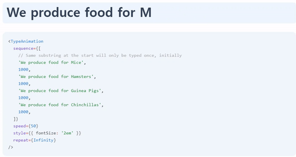

# 1. 목표

## 1.1. react-type-animation

구글링하면 [react-type-animation](https://www.npmjs.com/package/react-type-animation)라는 리액트용 타이핑 애니메이션 라이브러리가 바로 나온다. **이 라이브러리와 유사하게 동작하는 리액트 컴포넌트**를 만드는 것이 오늘의 목표다.



## 1.2. props 설정

오늘 만들 Type 컴포넌트는 다음과 같은 prop을 받는다.

```js
type Props = {
  phrases: string[]    // 순서대로 타이핑 할 문구 리스트
  speed: number      // 타이핑 속도
  pause?: number     // 한 개의 텍스트가 완성되고, 다음 텍스트가 타이핑 되기 전 대기시간
  isInfinite?: boolean  // 타이핑 무한 반복 여부
}
```

# 2. 전체 코드

```js
import React, { useRef, useEffect } from 'react'
import 'style.scss'

const Typing: React.FC<Props> = ({
  phrases,
  speed,
  pause = 2000, // 기본 대기 시간 2초
  isInfinite = false,
}) => {
  const [text, setText] = useState('')
  const textElementRef = useRef < HTMLSpanElement > null
  const phraseIdx = useRef < number > 0 // 현재 문구의 위치
  const charIdx = useRef < number > 0
  const interval = useRef < NodeJS.Timeout > null

  // 타이핑 함수
  function typeText() {
    const currentPhrase = phrases[phraseIdx.current]

    // 현재 문구 타이핑이 안 끝났을 경우
    if (charIdx.current < currentPhrase.length) {
      setCurrentText((text) => text + currentPhrase[charIdx.current++]) // 다음 글자 타이핑
      return
    }
    // 현재 문구가 마지막 문구가 아닐 경우
    if (phraseIdx.current < phrases.length - 1) {
      phraseIdx.current++ // 다음 문구로 이동
      charIdx.current = 0 // 첫 번째 글자로 이동
      retypeAfterPause()
      return
    }
    // 무한 반복이 설정되어 있을 경우
    if (isInfinite) {
      phraseIdx.current = 0 // 처음 문구로 이동
      stringIdx.current = 0 // 첫 번재 글자로 이동
      retypeAfterPause()
      return
    }
    // 타이핑 종료
    interval && clearInterval(interval)
  }

  // 일시 정지 후, 문구 초기화 한 다음에 타이핑 재시작
  function retypeAfterPause() {
    interval && clearInterval(interval) // 기존 setInterval 제거

    // pause 시간 이 후, setInterval 재설정
    setTimeout(() => {
      setCurrentText('') // 문구 초기화
      interval.current = setInterval(typeText, 1000 / speed)
    }, pause)
  }

  // useEffect로 mount 이 후, 타이핑 함수 interval 시작
  useEffect(() => {
    const textElement = textElementRef.current
    if (textElement) {
      interval.current = setInterval(typeText, 1000 / speed)
    }

    // clear
    return () => {
      interval && clearInterval(interval)
    }
  }, [phrases, speed, pause, isInfinite])

  return <span ref={textElementRef} className={typingText}></span>
}

export default Typing
```

```scss
.typing-text {
  padding: 0 0.1em 0 0; // 오른쪽 커서와의 거리

  // 가상 선택자로 커서 생성
  &::after {
    content: '|';
    opacity: 1;
    animation: blink 1s steps(1, end) infinite;
  }
}

// 깜빡거리는 애니메이션
@keyframes blink {
  50% {
    opacity: 0;
  }
}
```

# 3. 사용 예시
