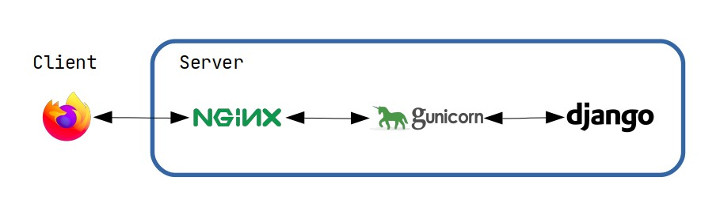

# 1. 웹 어플리케이션 서버

웹 어플리케이션을 실행하기 위해서는 WAS(웹 어플리케이션 서버)가 필요하다. 여러 소스코드 파일을 단순히 뭉쳐 놓는다고 백서버가 구동하는 것은 아니다. 무엇인가가 이 소스코드를 OS 위에서 실행시키고, 한걸음 더 나아가 클라이언트의 요청을 받아 프로세스에 전달해주어야 한다. 여기서 WAS가 바로 무엇인가에 해당한다.

Spring Boot에서는 Apache Tomcat이 기본으로 쓰이고 있고, Django는 개발환경에서는 `python manage.py runserver`명령어로 개발서버를 제공하지만, 배포환경에서는 서비스에 적합한 WAS를 선택해야한다. Python기반의 프레임워크는 표준화된 인터페이스(WSGI, ASGI)를 따르기 때문에 이러한 자유로운 선택이 가능하다. 한마디로 WAS 와 Python 어플리케이션이 인터페이스(WSGI, ASGI)를 경계로 독립적이다.

# 2. WSGI vs ASGI

WSGI 와 ASGI모두 Python기반의 프레임워크는 표준화된 인터페이스이다. WSGI(Web Server Gateway Interface)는 2003년에 발표되었습니다. WSGI는 Python 웹 애플리케이션과 웹 서버 간의 표준화된 인터페이스를 제공하여 서로 다른 웹 프레임워크와 웹 서버가 호환되도록 하는 데 사용됩니다.

ASGI(Asynchronous Server Gateway Interface)는 WSGI의 한계를 극복하고 비동기식 웹 애플리케이션을 위해 개발되었습니다. ASGI는 2015년에 공식적으로 발표되었습니다. 이 인터페이스는 비동기식 작업을 처리하고 WebSocket과 같은 웹 소켓 프로토콜을 지원하는 등의 기능을 제공하여

## 2.1. WSGI

하나의 프로세스가 하나의 요청을 처리한다.

## 2.2. ASGI

이벤트 기반 루프

# 3. 더 알아보기

## 3.1. Python GIL 이슈

한가지 더 고려해야할 것이 이싿. 무조건적이라고 Python의 비동기 작업의 성능이 좋은 것은 아니다. CPU Bound작업일 경우 비동기 요청으로 인한 좋은 일이 없다

왜 유독 Python에만 GIL이 구현되어있는지는 모르겠다. 찾아보면 객체 Garbage Colleotor를 위한 Reference Conting때문이라고 하는데, 이거는 모든 언어가 다 마찬가지이지 않나?

아무튼 Python협회도 GIL을 없애는 것을 5개년 계획처럼 잡고 실시할 예정이라고 한다

## 3.2. Sprintg Boot vs Django
