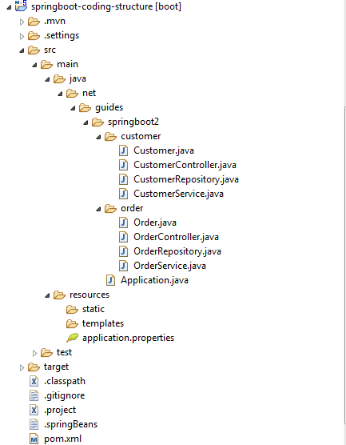
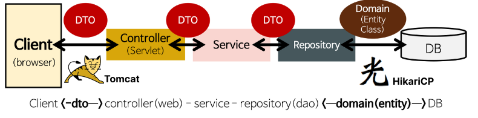
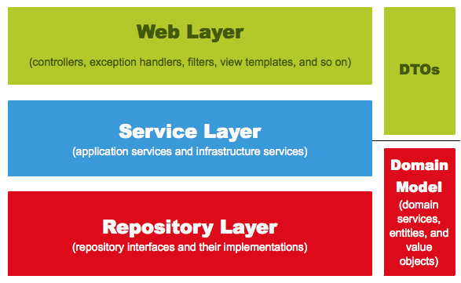

> 프론트엔드 개발자로써 SpringBoot가 어떻게 돌아가는지 알고 싶어서, SpringBoot 프로젝트 구조를 정리한 문서이다.
> 참여했던 지난 프로젝트들을 참고했고, Java 친구 개발자의 도움을 받았다.
> Thanks to. [췐쓰희](https://velog.io/@chancehee)

# 1. 개요

Java기반의 프레임워크인 SpringBoot는 좋게 말하면 체계적이고, 나쁘게 말하면 복잡하다.  
따라서 먼저 대략적인 개요를 파악하는 것이, 세세한 부분을 이해하는데도 큰 도움이 될 것이다.

## 1.1. SpringBoot 기본 구조

개인적으로 Java 프로젝트를 열면, 아래 그림처럼 깊은 디렉토리 Depth에 지레 겁을 먹었다.

근데 저 깊은 Depth는 그저 내 자바 소스코드를 다른 자바 패키지와 구별하기 위함이다.
그래서 아래 그림에서 `java / net / guides / springboo2`의 폴더들을 그냥 장황한 이름을 가진 하나의 `java_net_guides_springboo2`폴더라고 생각하면, 심리적 부담감이 덜해진다.



- **src/**  
  빌드 설정 등을 제외하고는, 거의 대부분의 개발이 `src`폴더 내에서 이뤄진다.

- **src/main/**  
  프로젝트를 빌드 했을 때, `.jar` 파일에 포함되는 코드이다. (JAR파일은 그냥 빌드 결과물이다.)
  쉽게 말해 어플리케이션을 서버로 실행했을 때, 실제로 사용되는 소스코드와 리소스가 있는 곳이다.
  대응되는 디렉토리로 `src/test/`가 있다.

- **src/main/java/**  
  자바 소스코드가 저장되는 곳이다.

  - **Application.java 파일**  
    정확히 말하면 `{프로젝트명}Application.java` 로 자동 생성된다.  
    <mark>프로젝트의 엔트리 포인트(시작점)을 담당한다.</mark>
    대충 아래처럼 생겼는데, 저 `@SpringBootApplication` 어노테이션이 SpringBoot 어플리케이션의 기본 설정을 자동 제공한다.

    ```java
    import org.springframework.boot.SpringApplication;
    import org.springframework.boot.autoconfigure.SpringBootApplication;

    @SpringBootApplication
    public class Application {

        public static void main(String[] args) {
            SpringApplication.run(Application.class, args);
        }
    }
    ```

- **src/main/resources/**  
  자바 소스코드가 아닌 파일들이 저장되는 곳이다.  
  설정파일(`.xml`, `.properties`)이나 정적파일( `.html` ,`.css`, `.js`)이 그 예이다.  
  (원래 SpringBoot는 풀스택을 지원하는 프레임워크이다.)

- **src/test**  
  테스트 코드 및 테스트를 위한 추가 리소스가 저장되는 곳이다.  
  따라서 빌드 시에, 최종적으로 JAR 파일에 포함되지 않는다.

## 1.2. SpringBoot 요청 처리 과정

SpringBoot가 백엔드 프레임워크로써 동작한다고 할 때, 클라이언트 요청을 다음과 같은 과정으로 처리한다.



- **Controller**  
  클라이언트의 요청 유효성을 검증한 뒤, 적절한 Service를 호출한다. 그리고 그 결과를 다시 응답 형태로 가공하여 클라이언트에 반환한다.  
  웹 애플리케이션의 엔드포인트로써 사용자 인터페이스와 상호작용한다.

- **Service**  
  핵심 로직이 구현되는 부분이다.
  Controller로부터 받은 데이터를 검증한 뒤, 여러 개의 Repository를 조합하여 복잡한 데이터 조작을 수행한다.
  그 외에도 트랜잭션을 관리하거나 데이터를 캐싱하는 등 여러 핵심 기능이 있다.

- **Repository**  
  데이터에 접근하고 조작하는 역할을 담당한다.  
  한 마디로 데이터베이스와 상호작하며 데이터를 CRUD하는 기능이 구현된다.

Spring은 사용자 요청을 처리하는 데 있어, 여러 개의 레이어를 두고 역할을 분리했다. 이를 통해 코드의 유지보수성을 높일 수 있다.
Controller, Service, Repository가 Spring의 3 개 레이어를 대표하는 파일이다.



## 1.3. 계층형 구조 & 도메인형 구조

**`src/main/java/` 내부를 어떻게 구성하는지**에 따라 **계층형**과 **도메인형**으로 나눌 수 있다.

- **계층형 구조**
  **Spring 레이어의 관점에서 디렉토리를 구분하는 것이 계층형 구조이다.**

  ```
    controller
      ⎿ ProductController
      ⎿ MemberController
      ⎿ CartController

    service
      ⎿ ProductService
      ⎿ MemberService
      ⎿ CartService

    repository
      ⎿ ProductRespository
      ⎿ MemberRespository
      ⎿ CartRespository

    dao
      ⎿ Product
      ⎿ Member
      ⎿ Cart
  ```

- **도메인형 구조**

  **엔터티(Entity)를 기준으로 디렉토리를 구분하는 것이 도멩ㄴ형 구조이다.**

  ```
  product
    ⎿ controller
    ⎿ service
    ⎿ dao
    ⎿ dto

  member
    ⎿ controller
    ⎿ service
    ⎿ dao
    ⎿ dto

  cart
    ⎿ controller
    ⎿ service
    ⎿ dao
    ⎿ dto
  ```

# 2. DTO

**Controller에서 클랑이언트의 요청을 Java 객체 형태로 받기 위해서 DTO를 사용한다.**
DTO가 없다해서 Controller가 사용자 요청을 못받는 것은 아니다. 하지만 서버 단에서 미리 필요한 필드값을 지정할 수 있고, 손쉽게 Java 객체로 변환할 수 있는 등의 장점이 많기 때문에 보통 DTO를 사용한다.

DTO로 지정한 필드 외의 추가 필드가 있을 경우, 해당 필드는 무시되고  
반대로 지정한 필드의 값이 들어오지 않는 경우, 해당 필드는 초깃값 혹은 null로 들어온다.  
필요에 따라서 데이터 형식이 맞지 않을 시, 예외를 발생시킬 수도 있다.

아래는 간단하게 정말 간단하게 `username`과 `password`만을 가진 MemberDTO에 대한 예시이다. 각 어노테이션에 대한 설명은 하단 어노테이션 항목에 정리했다.

```java
import lombok.NoArgsConstructor;
import lombok.AllArgsConstructor;
import lombok.Data;

@NoArgsConstructor
@AllArgsConstructor
@Data
public class MemberDto {
  String username;
  String password;
}
```

# 3. Controller

아래는 회원가입에 대한 Controller 예시 로직이다.  
구체적인 로직은 프로젝트마다 다를 수 있다. 예를 들어 예외처리도 아래와 같이 Controller마다 명시하지 않고, `@RestControllerAdvice` 클래스와 `@ExceptionHandler`메소드를 가진 전역적인 예외처리 클래스를 만들고, Service 단에서 처리할 수도 있다.

눈여겨봐야할 점은 다음과 같다.

- **@RestController**  
  @RestController는 @Controller와 @ResponseBody 어노테이션을 결합한 것이다.  
  이 어노테이션을 적용하면, Spring이 해당 클래스를 컨트롤러로 인식하여 HTTP 요청에 대한 처리를 수행하고, HTTP 응답을 자동으로 JSON 식으로 변환하여 반환한다.
- **@RequestMapping**  
  @RequestMapping 어노테이션은 요청 URL 경로와 컨트롤러의 메서드를 매핑하는 역할을 한다.
- **@PostMapping**  
  이름에서 짐작할 수 있는 것처럼, URL 경로와 HTTP메소드를 결합하여 메서드를 매핑하는 역할을 한다.
  이 외에도 @GetMapping, @PutMapping, @DeleteMapping 이 있다.
- **MemberDto**  
  앞서 만든 Dto를 이용해서 클라이언트의 요청을 Java 객체 형태로 받아 처리한다.
- **MemberService**  
  컨트롤러는 사용자 요청을 받은 뒤, 실제 비즈니스 로직을 처리하기 위해 Service를 호출한다. 그리고 그 결과에 따라 응답을 생성하여 반환한다.

```java
@RestController
@RequestMapping("/users")
@RequiredArgsConstructor
public class MemberController {

  private final MemberService memberService;

  @PostMapping("/signup")
  public ResponseEntity<String> signUp(@RequestBody MemberDto memberDto) {
    try {
      memberService.signUp(memberDto);
      return ResponseEntity.ok("회원가입이 완료되었습니다.");
    } catch (Exception e) {
      return ResponseEntity.status(HttpStatus.INTERNAL_SERVER_ERROR).body("회원가입에 실패했습니다.");
    }
  }
}
```

# 4. Service

## 4.1. Service

보통 프로젝트를 보면 `Service.java`와 `ServiceImpl.java`이 한 쌍으로 존재한다.
**`Service.java`은 서비스 인터페이스로써, 서비스 클래스의 추상화된 메소드를 선언하는 역할이고,**  
**실제 비즈니스 로직(메소드)은 `ServiceImpl.java`에서 구현된다.**

이와 같이 파일을 분리하는 이유는 인터페이스를 바탕으로 여러 개의 구현체를 자유롭게 확장할 수 있고.  
더 나아가, 인터페이스와 구현 클래스를 사용하여 의존성 주입(Dependency Injection)을 적용할 수 있어 코드의 확장성과 유연성을 높일 수 있기 때문이다.

```java
public interface MemberService {

  public String signUp(MemberDto memberDto);

}
```

## 4.2. ServiceImpl

`ServiceImpl`은 `Service`에 대한 실제 비즈니스 로직을 구현한다.

아래 코드를 보면, MyBatis를 이용하는 경우와 JPA를 이용하는 경우를 나눠서 코드를 작성했다.

**MyBatis**를 이용하는 경우 DTO를 그대로 전달할 수 있고, 최종적으로 `Mapper.xml`
파일이 DTO를 해석할 수 있다.

**JPA**를 이용하는 경우 DTO를 테이블과 1:1 관계로 설계된 Entity 객체 형태로 형변화 해줘야 한다.

```java
@Service
@RequiredArgsConstructor
public class MemberServiceImpl implements MemberService {

  private final MemberRepository memberRepository;

  // MyBatis
  @Transactional
  public void signUp(MemberDto memberDto) {
    memberRepository.insertMember(memberDto);
  }

  // JPA
  @Transactional
  public void signUp(MemberDto memberDto) {
    // MemberDto -> MemberEntity 변환
    MemberEntity member = new MemberEntity();
    member.setUsername(memberDto.getUsername());
    member.setPassword(memberDto.getPassword())

    // JPA 내장 메소드를 통한 레코드 저장
    memberRepository.save(member);
  }
}
```

# 5. Repository

Repository는 Spring이 어떤 프레임워크로 DB와 상호작용하느냐에 따라 다르게 설계될 수 있다.

대표적으로 MyBatis와 JPA 프레임워크가 있고, 간단한게 비교분석하면 다음과 같다.

- **MyBatis**

  - 개발자가 직접 SQL 쿼리를 작성하고 이를 메소드와 매핑한다.
  - 직접 SQL을 작성하므로 세밀한 제어가 가능하며, 복잡한 쿼리와 성능 최적화에 유리하다.
  - 하지만 같은 이유로 보다 많은 개발 작업과 유지보수 비용이 필요하다.

- **JPA (Java Persistence API)**
  - 정해진 작명법에 맞춰 메소드를 작성하면, JPA가 SQL을 대신 생성한다.
  - 객체 지향적인 개발에 용이하며, 생산성을 향상시킬 수 있다.
  - 하지만 SQL의 세부적인 제어가 어렵다.

## 5.1. MyBatis

MyBatis는 직접 SQL 쿼리문을 작성할 **`Mapper.xml`파일**, `Mapper.xml`의 쿼리를 Java 메소드로 매핑시켜 구현할 `Mapper.java`인터페이스 파일이 필요하다.

`Repository.java`는 계층의 통일성을 위해 생성해줄 수도 있고, 아니면 `Mapper.java`를 `ServiceImpl`에서 바로 주입해 사용할 수도 있다.

- **Mapper.xml**

  ```xml
  <?xml version="1.0" encoding="UTF-8" ?>
  <!DOCTYPE mapper PUBLIC "-//mybatis.org//DTD Mapper 3.0//EN"
        "http://mybatis.org/dtd/mybatis-3-mapper.dtd">
  <mapper namespace="{패키지 명}.MemberMapper">

    <insert id="insertUser" parameterType="{패키지 명}.MemberDto">
        INSERT INTO users (username, password)
        VALUES (#{username}, #{password})
    </insert>

  </mapper>
  ```

  - `namespace`에는, 해당 xml파일을 Java메소드로 매핑시킬 인터페이스를 입력해준다.
  - `parameterType`에는, 해당 xml 파일이 전달받는 인자의 타입을 입력해준다. 위에까지의 예시에 따르면 DTO클래스이다.

- **Mapper.java**

  **메소드의 이름은 xml파일의 `id`와 동일해야 한다.**

  ```java
  @Mapper
  public interface MemberMapper {

    public void insertUser(MemberDto memberDto);

  }
  ```

- **Repository.java**

  ```java
  @Repository
  @RequiredArgsConstructor
  public class MemberRepository {

      private final MemberMapper memberMapper;

      public void insertUser(MemberDto memberDto) {
          MemberMapper.insertUser(memberDto);
      }
  }
  ```

## 5.2. JPA

JPA는 데이터베이스 테이블과 1:1 매핑된 Entity 객체를 바탕으로 동작한다.

따라서 `Entity.java`파일과, JPA의 메소드를 구현할 `Repository.java`파일이 필요하다.

- **Entity.java**

  ```java
  @Entity
  @Table(name = "members")  // 테이블 이름을 명시적으로 지정. 없을 경우 클래스 이름을 따름
  @Data
  @NoArgsConstructor
  @AllArgsConstructor
  public class MemberEntity {
      @Id
      @GeneratedValue(strategy = GenerationType.IDENTITY)
      private Long id;
      @Column(nullable = false)
      private String username;
      @Column(nullable = false)
      private String password;
  }
  ```

- **Repository.java**

  JPA는 편리한 기능을 위해 내재된 기능이 많다. 따라서 JPA를 제대로 활용하기 위해서는 별도의 학습이 필요하다.

  다음은 username을 기반으로 레코드를 조회하는 메소드 선언의 예시이다.

  ```java
  import org.springframework.data.jpa.repository.JpaRepository;

  @Repository
  public interface UserRepository extends JpaRepository<User, Long> {
      Optional<User> findByUsername(String username);
  }
  ```

# 6. 주요 어노테이션

## 6.1. @Getter / @Setter

`@Getter`와 `@Setter`는 Lombok 어노테이션으로, 자동으로 필드에 대한 Getter와 Setter 메소드를 생성해준다

```java
import lombok.Getter;
import lombok.Setter;

@Getter
@Setter
public class Person {
    private String name;
    private int age;
    private String address;
}

public class Main {
    public static void main(String[] args) {
        Person person = new Person();

        person.setName("John Doe");
        person.setAge(25);
        person.setAddress("123 Main St");

        System.out.println("Name: " + person.getName());  // Name: John Doe
        System.out.println("Age: " + person.getAge());  // Age: 25
        System.out.println("Address: " + person.getAddress()); // Address: 123 Main St
    }
}
```

## 6.2. @Builder

`@Builder`는 Lombok 어노테이션으로, 빌더 패턴으로 객체를 생성할 수 있게한다.  
빌더 패턴은 가독성 높은 방식으로 객체를 생성하는 방식이다.

```java
import lombok.Builder;
import lombok.Getter;
import lombok.Setter;

@Getter
@Setter
@Builder
public class Person {
    private String name;
    private int age;
    private String address;
}

public class Main {
    public static void main(String[] args) {
        // 빌더 패턴
        Person person = Person.builder()
                .name("John Doe")
                .age(25)
                .address("123 Main St")
                .build();

        System.out.println(person.toString()); // Person(name=John Doe, age=25, address=123 Main St)
    }
}
```

## 6.3. @NoArgsConstructor / @AllArgsConstructor

`@NoArgsConstructor`는 매개변수가 없는 기본 생성자를 자동 생성한다.
`@AllArgsConstructor`는 모든 필드를 인자로 받는 생성자를 자동 생성한다.

```java
import lombok.NoArgsConstructor;
import lombok.AllArgsConstructor;

@NoArgsConstructor
@AllArgsConstructor
public class Person {
    private String name;
    private int age;
    private String address;
}

public class Main {
    public static void main(String[] args) {
        // 기본 생성자로 객체 생성
        Person person1 = new Person();

        // 모든 필드를 인자로 받는 생성자로 객체 생성
        Person person2 = new Person("John Doe", 25, "123 Main St");
    }
}
```

## 6.4. @RequiredArgsConstructor

`@RequiredArgsConstructor`는 final로 선언된 필드에 대한 생성자를 자동으로 생성한다.

**SpringBoot는 생성자 인자와 해당 타입의 빈(Bean)을 자동으로 연결해주는 기능을 제공**하기 때문에,
<mark>SpringBoot의 관점에서 `@RequiredArgsConstructor`를 통한 생성자 주입은 곧 의존성 주입</mark>s으로 이어진다.

앞 서 Controller, Service, Repository 클래스에 모두 `@RequiredArgsConstructor`어노테이션을 사용한 이유가 바로 이것이다.

```java
@RestController
@RequestMapping("/users")
@RequiredArgsConstructor
public class MemberController {

  private final MemberService memberService;

  ...
}
```

## 6.5. @Data

`@Data`는 Lombok 어노테이션으로, `@Getter`, `@Setter`, `@ToString`, `@EqualsAndHashCode`, `@NoArgsConstructor`, `@AllArgsConstructor`, `@RequiredArgsConstructor` 등을 한 번에 포함한다.

@Data를 사용하면 클래스에 필드에 대한 Getter, Setter, toString(), equals(), hashCode() 등의 메소드가 자동 생성된다.

```java
import lombok.Data;

@Data
public class Person {
    private String name;
    private int age;
    private String address;
}

public class Main {
    public static void main(String[] args) {
        Person person1 = new Person();
        person1.setName("John Doe");
        person1.setAge(25);
        person1.setAddress("123 Main St");

        Person person2 = new Person();
        person2.setName("John Doe");
        person2.setAge(25);
        person2.setAddress("123 Main St");

        // toString() 메소드 호출
        System.out.println(person1.toString()); // 출력: Person(name=John Doe, age=25, address=123 Main St)

        // equals() 메소드 호출. 객체의 필드값 비교
        System.out.println(person1.equals(person2)); // 출력: true

        // hashCode() 메소드 호출
        System.out.println(person1.hashCode()); // 출력: 객체의 해시 코드(식별자) 값
    }
}
```

# 7. 참조

- [Standard Project Structure for Spring Boot Projects](https://www.javaguides.net/2019/01/standard-project-structure-for-spring-boot-projects.html)
- [[Spring] 스프링 MVC 프로젝트 기본구조와 동작 순서](https://hpark3.tistory.com/28)
- [Spring Guide - Directory 패키지 구조 가이드](https://cheese10yun.github.io/spring-guide-directory/)
- [Spring boot 패키지 구조](https://velog.io/@sunil1369/Spring-boot-%ED%8C%A8%ED%82%A4%EC%A7%80-%EA%B5%AC%EC%A1%B0)
