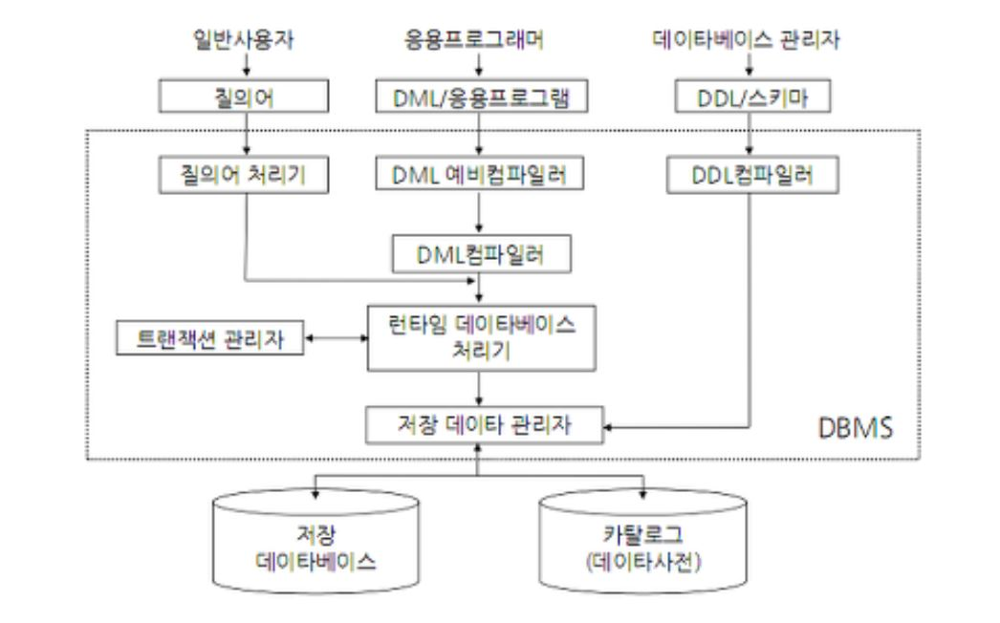

김연희, 『데이터베이스 개론』, 한빛아카데미(2022.07.20), Chpater 03

# Ch3. 데이터베이스 시스템<!-- omit in toc -->

- [3.1. 데이터베이스 시스템의 정의](#31-데이터베이스-시스템의-정의)
- [3.2. 데이터베이스의 구조](#32-데이터베이스의-구조)
  - [3.2.1. 스키마](#321-스키마)
  - [3.2.2. 3단계 데이터베이스 구조](#322-3단계-데이터베이스-구조)
  - [3.2.3. 데이터 독립성](#323-데이터-독립성)
  - [3.2.4. 데이터 사전](#324-데이터-사전)
- [3.3. 데이터베이스 사용자](#33-데이터베이스-사용자)
  - [3.3.1. 데이터베이스 관리자](#331-데이터베이스-관리자)
  - [3.3.2. 응용 프로그래머](#332-응용-프로그래머)
  - [3.3.3. 최종 사용자](#333-최종-사용자)
- [3.4. 데이터 언어](#34-데이터-언어)
  - [3.4.1. 데이터 정의어(DDL)](#341-데이터-정의어ddl)
  - [3.4.2. 데이터 조작어(DML)](#342-데이터-조작어dml)
  - [3.4.3. 데이터 제어어(DCL)](#343-데이터-제어어dcl)
- [3.5. 데이터베이스 관리 시스템의 구성](#35-데이터베이스-관리-시스템의-구성)
  - [3.5.1. 질의 처리기](#351-질의-처리기)
  - [3.5.2. 저장 데이터 관리자](#352-저장-데이터-관리자)

데이터베이스, 데이터베이스 관리 시스템 개념을 바탕으로 데이터베이스 시스템에 관해 알아본다.

## 3.1. 데이터베이스 시스템의 정의

> 데이터베이스에 데이터를 저장하고, 저장된 데이터를 관리하여 조직에 필요한 정보를 생성해주는 시스템.

- **용어 구분**
  - **데이터베이스**  
    데이터를 저장해두는 곳
  - **데이터베이스 관리 시스템(DBMS)**  
    데이터베이스에 저장된 데이터를 관리해주는 프로그램
  - **데이터베이스 시스템**  
    데이터베이스와 데이터베이스 관리 시스템을 이용해 조직에 필요한 정보르르 제공해주는 전체 시스템. 데이터베이스와 DBMS외에도 데이터언어(SQL)과 데이터 처리 연산을 담당하는 컴퓨터 등으로 구성된다.

## 3.2. 데이터베이스의 구조

### 3.2.1. 스키마

> 데이터베이스에 저장되는 데이터 구조와 제약조건을 정의한 것

### 3.2.2. 3단계 데이터베이스 구조

미국의 표준화 기관인 ANSI/SPARC에서는 데이터베이스의 복잡한 내부 구조를 감추고 일반 사용자가 데이터베이스를 쉽게 이해하고 이용할 수 있도록, 단계별로 추상화한 3단계 데이터베이스 구조를 제안한다.

- **외부 단계**  
  개별 사용자의 관점에서 데이터베이스를 표현한다.  
  외부 스키마: 각 사용자의 요구에 맞춰 데이터베이스 구조의 일부분을 표현.

- **개념 단계**  
  조직 전체의 관점에서 데이터베이스를 표현한다.  
  개념 스키마: 전체 데이터베이스의 구조와 상호 관계, 그리고 데이터에 대한 보안 정책이나 접근권한의 정보도 포함.

- **내부 단계**  
  저장장치의 관점에서 데이터베이스를 표현한다.  
  내부 스키마: 데이터베이스가 실제 저장장치에 저장되는 방법을 정의한 것. 개념 스키마에 대한 물리적인 저장구조.

### 3.2.3. 데이터 독립성

외부 스키마 / 개념 스키마 / 내부 스키마는 모두 하나의 데이터베이스를 표현하기 때문에 <mark style='background-color: #fff5b1'>서로 매핑이 가능하다.</mark> 따라서 외부 스키마를 통해 실제 저장장치에 담긴 데이터까지 접근이 가능하다.

굳이 하나의 데이터베이스를 3단계로 나눠서 표현한 것은, 데이터의 독립성을 유지하기 위해서다. <mark style='background-color: #fff5b1'>데이터 독립성은 하위 스키마를 변경하더라도 상위 스키마가 영향을 받지 않는 특성이다.</mark>

- **논리적 데이터 독립성**

  - 개념 스키마 <-> 외부 스키마
  - 개념 스키마가 변경되더라도 외부/개념 매핑 정보(application interface)만 적절히 수정해주면, 사용자 입장에서 외부 스키마를 변경할 필요 없다.

- **물리적 데이터 독립성**
  - 내부 스키마 <-> 개념 스키마.
  - 데이터베이스의 저장 구조가 변경되어도 개념/내부 매핑 정보(storage interface)만 적절히 수정해주면, 데이터베이스의 논리적 구조는 영향을 받지 않는다.

### 3.2.4. 데이터 사전

> 메타 데이터를 저장하는 곳. 시스템 카탈로그(system catalog) 혹은 시스템 데이터베이스(system database)라고도 한다.

- **DB 메타 데이터**  
  스키마와 스키마 간 매핑 정보와 같이 데이터베이스 운영을 위한 실제 데이터 외의 부가정보

데이터 사전도 테이블로 구성되어 있어서 SELECT 구문을 통해 접근할 수는 있지만, 수정 및 삭제는 시스템만 가능하다.

## 3.3. 데이터베이스 사용자

사용자 또한 데이터베이스 시스템을 구성하는 중요한 요소로써, 데이터베이스에 접근하는 모든 사람을 의미한다.

### 3.3.1. 데이터베이스 관리자

> 데이터베이스 시스템을 운영하는 사용자. 데이터베이스를 설계하고 적절히 서비스 될 수 있도록 제어한다. 데이터베이스 설계자가 포함된다.

- **관리자의 역할**
  - 데이터베이스 구성 요소 선정
  - 데이터베이스 스키마 정의
  - 물리적 저장 구조와 접근 방법 결정
  - 무결성 유지를 위한 제약조건 정의
  - 보안 및 접근 권한 정책
  - 백업 및 회복 기법 정의
  - 시스템 데이터베이스 관리
  - 시스템 성능 감시 및 성능 분석
  - 데이터베이스 재구성

### 3.3.2. 응용 프로그래머

> 최종 사용자를 위한 응용 프로그램을 작성할 때, 데이터베이스로부터 서비스 운용을 필요한 데이터를 얻기 위해 필요한 데이터 조작어를 삽입한다.

### 3.3.3. 최종 사용자

> 데이터를 위해 데이터베이스 접근하는 일반 사람들

## 3.4. 데이터 언어

> DBMS에 데이터 처리를 위해 내리는 명령어

### 3.4.1. 데이터 정의어(DDL)

> **Data Definition Language.** DB 구축을 위해 <mark style='background-color: #fff5b1'>스키마</mark>를 정의하거나, <mark style='background-color: #fff5b1'>스키마</mark>를 수정 및 삭제하기 위해 사용되는 언어. DDL로 조작된 기록들은 데이터 사전에 반영된다.

### 3.4.2. 데이터 조작어(DML)

> **Data Manipulation Language.** 사용자가 <mark style='background-color: #fff5b1'>데이터</mark>의 CRDU 등의 처리를 위해 사용되는 언어. DML에 따라 테이블에 저장된 <mark style='background-color: #fff5b1'>데이터</mark>가 수정된다.

데이터 조작어는 아래와 같이 두가지로 또 다시 구분할 수 있다.

- **비절차적 데이터 조작어**  
  어떤 데이터를 원하는지만 명시해주면 된다. 현재 DBMS에서 주로 사용되는 형태의 언어이며, SQL이 이에 해당된다.
- **절차적 데이터 조작어**  
  어떻게 데이터에 접근할지를 함께 명시해줘야 한다. 현재 DBMS 주로 이용되지는 않지만, 고급 프로그래밍 언어에 관련 기능들이 장착되어 있다. - [절자척 언어 vs 비절차적 언어](https://www.geeksforgeeks.org/difference-between-procedural-and-non-procedural-language/) - [fortran DML 예시](https://azuharu92.wordpress.com/2013/02/12/example-data-manipulation-language/)

### 3.4.3. 데이터 제어어(DCL)

> **Data Control Language.** 데이터의 무결성과 일관성을 유지하며 여러 사용자에게 데이터베이스를 공유할 수 있도록, 내부적으로 필요한 규칙을 정의하는 데 사용되는 언어. [예시](https://dkswngus7.tistory.com/29)

DCL 데이터베이스의 다음과 같은 기능들을 담당한다.

- **무결성(integrity)**: DB에 유효한 데이터만을 유지한다.
- **보안(security)**: 접근권한이 있는 사용자만 데이터에 접근하게 한다.
- **회복(recovery)**: 장애가 발생해도 데이터의 일관성을 유지한다.
- **동시성(concurrency)**: 여러 사용자가 같은 데이터에 동시 접근이 가능하다.

## 3.5. 데이터베이스 관리 시스템의 구성

DBMS는 사용자와 DB 사이에 위치하며, 기능에 따라 질의 처리기와 저장 데이터 관리자로 구분된다.  

### 3.5.1. 질의 처리기

> 사용자의 데이터 처리 요구를 해석하여 처리한다.

- **DDL 컴파일러(DDL compiler)**  
  DDL을 해석하고 이를 저장 데이터 관리자의 도움을 받아 처리한다. 또한 처리 내용을 데이터 사전에 적용한다.
- **DML 프리 컴파일러(DML precompiler)**
  응용프로그램의 코드에서 DML을 추출하여 DML 컴파일러에 전달한다.
- **DML 컴파일러(DML compiler)**  
  DML을 런타임 데이터베이스 처리기가 이용할 수 있도록 해석한다.
- **런타임 데이터베이스 처리기(run-time databse processor)**  
  저장 데이터 관리자를 통해 DML 컴파일로부터 전달받은 처리 요구를 실행한다.
- **트랜잭션 관리자(transaction manager)**  
  데이터베이스에 접근하는 사용자의 접근 권한이 유효한지 검사하고, 데이터의 제약조건의 위변 여부를 확인한다. 또한 회복이나 병행 수행과 관련된 작업을 담당한다.

### 3.5.2. 저장 데이터 관리자

> 데이터베이스와 데이터 사전에 실제로 접근하고 관리한다. 단, 디스크에 접근하는 것은 운영체제의 기본 기능이므로 운영체제의 도움을 받는다.
