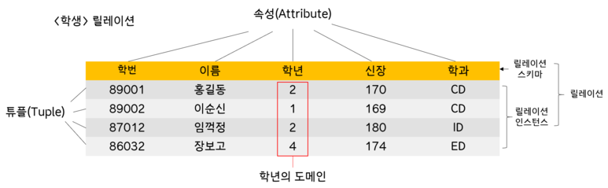

> 관계 데이터 모델과 관계 데이터 모델의 핵심인 릴레이션에 대해 학습한다.

- [5.1. 관계 데이터 모델의 개념](#51-관계-데이터-모델의-개념)
  - [5.1.1. 관계 데이터 모델의 기본 용어](#511-관계-데이터-모델의-기본-용어)
  - [5.1.2. 릴레이션과 데이터베이스 구성](#512-릴레이션과-데이터베이스-구성)
  - [5.1.3. 릴레이션의 특징](#513-릴레이션의-특징)
  - [5.1.4. 키의 종류](#514-키의-종류)
- [5.2. 관계 데이터 모델의 제약](#52-관계-데이터-모델의-제약)
  - [5.2.1. 개체 무결성 제약조건](#521-개체-무결성-제약조건)
  - [5.2.2. 참조 무결성 제약조건](#522-참조-무결성-제약조건)

---

## 5.1. 관계 데이터 모델의 개념

### 5.1.1. 관계 데이터 모델의 기본 용어

관계 데이터 모델에서는 하나의 객체에 대한 데이터를 릴레이션(테이블) 하나에 담아 데이터베이스에 저장한다

- **속성**  
  릴레이션의 열을 속성 또는 attribute라고 부른다. 각 속성에 대한 도메인이 정해져있다.
- **투플**  
  릴레이션의 행, 릴레이션의 개체 인스턴스이다.
- **도메인**  
  속성 하나가 가질 수 있는 모든 값의 집합. 속성이 가질 수 있는 모든 값을 일일이 나열하기 어려운 경우, 데이터 타입으로 정의된다.
- **널 값**  
  릴레이션에 있는 특정 투플 속성의 적절한 값이 없을 경우, null값이 대입된다.
- **차수**
  하나의 릴레이션에서 속성 전체의 갯수
- **카디널리티(cardinality)**
  하나의 릴레이션에서 투플 전체의 갯수

### 5.1.2. 릴레이션과 데이터베이스 구성

- **릴레이션 스키마**  
  릴레이션 스키마는 릴레이션의 이름과 릴레이션에 포함된 모든 속성의 이름으로 정의하는 논리적 구조

- **릴레이션 인스턴스**  
  릴레이션 인스턴스는 어느 한 시점에 릴레이션에 존재하는 투플들의 집합

- **데이터베이스 스키마와 데이터베이스 인스턴스**  
  데이터베이스 스키마는 데이터베이스에 존재하는 릴레이셔의 스키마를 모아놓은 것, 데이터베이스 인스턴스는 어느 한 시점에서 데이터베이스에 저장된 데이터 내용의 전체 집합

### 5.1.3. 릴레이션의 특징

- **투플의 유일성**  
  하나의 릴레이션에는 동일한 투플이 존재할 수 없다.

- **투플의 무순서**  
  하나의 릴레이션에서 투플 사이의 순서는 무의미하다.

- **속성의 무순서**  
  하나의 릴레이션에서 투플 사이의 순서는 무의미하다.

- **속성의 원자성**  
  속성 값으로 하나의 값만 가질 수 있다.

### 5.1.4. 키의 종류

> 투플을 유일하기 구별해주는 역할의 속성, 혹은 속성들의 집합.

- **슈퍼키**  
  유일성을 만족하는 속성 또는 속성들의 집합
- **후보키**  
  유일성과 최소성을 만족하는 최소한의 속성들의 집합. 즉 하나의 속성으로 구성된 슈퍼키는 후보키이다.
- **기본키**  
  여러 후보키 중에서 기본적으로 사용할 키
  - 널 값을 가지지 않는 후보키
  - 값이 자주 변경되지 않는 후보키
  - 단순한 후보키
- **대체키**  
  기본키로 선택되지 못한 후보키들
- **외래키**  
  속성 값으로 자기 자신 혹은 다른 릴레이션의 기본키를 가지는 속성
  - 참조하는 릴레이션: 외래키 속성을 가진 릴레이션
  - 참조되는 릴레이션: 기본키를 가진 릴레이션

## 5.2. 관계 데이터 모델의 제약

무결성이란 데이터가 정확하고 유효하게 유지된 상태를 말한다.

### 5.2.1. 개체 무결성 제약조건

<mark style='background-color: #fff5b1'>기본키를 구성하는 모든 속성은 널 값을 가질 수 없다.</mark>
투플이 삽임되는 연산과 투플의 기본키 속성 값이 변경되는 연산이 발생할 때, 기본키에 널 값이 포함되는 상황에서는 연산을 거부한다.

### 5.2.2. 참조 무결성 제약조건

<mark style='background-color: #fff5b1'>외래키는 참조할 수 없는 값을 가질 수 없다.</mark>
널 값을 외래키로 가지는 것은 참조 무결성 제약조건을 위반하지 않는다.  
참조되는 릴레이션에 존재하는 투플을 삭제하거나, 기본키를 변경하는 연산은 참조 무결성 제약조건을 위반하지 않는 경우에만 수행한다. 이는 연산을 수행하지 않거나, 참조되는 릴레이션을 함께 수정하는 방법으로 구현된다.
