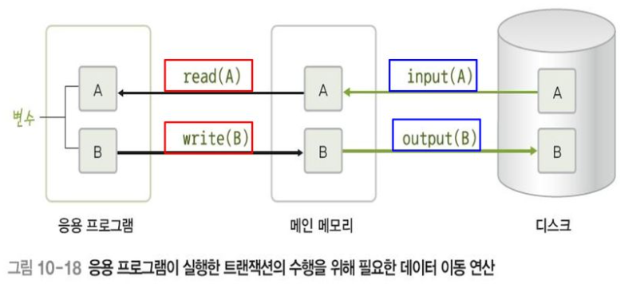
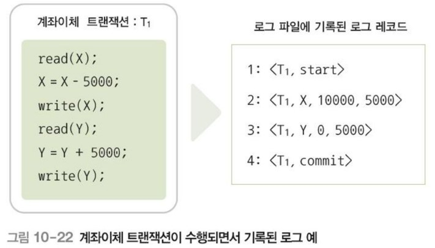
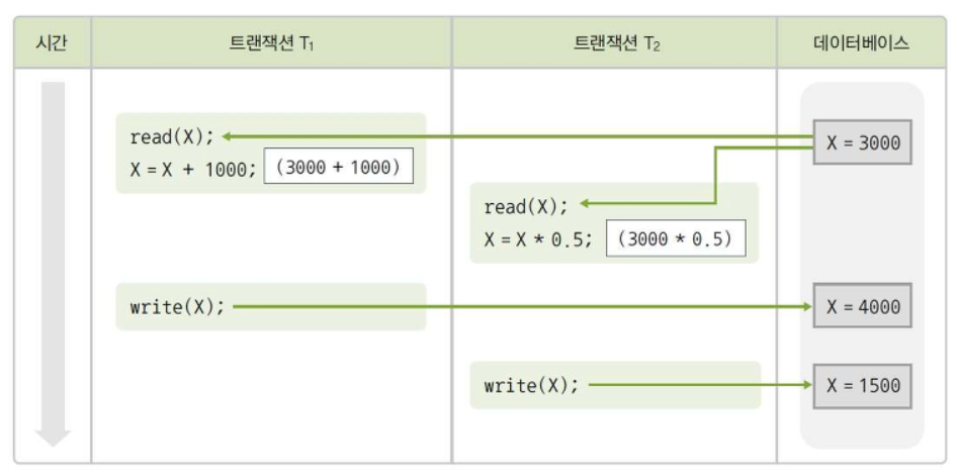
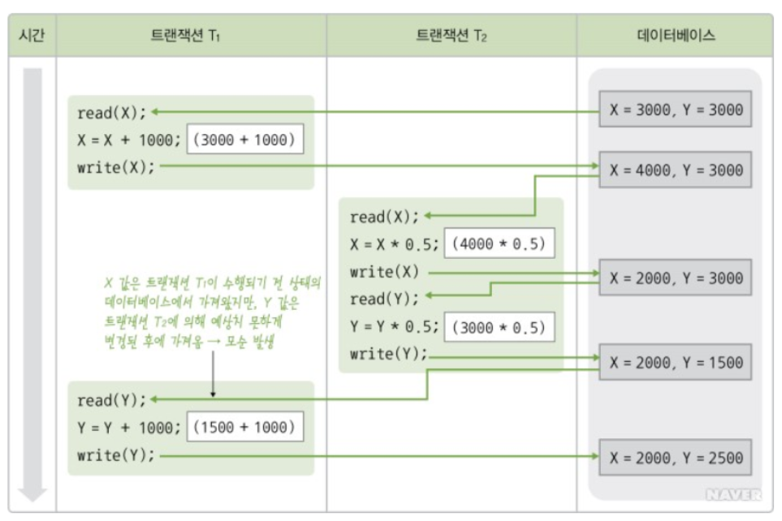
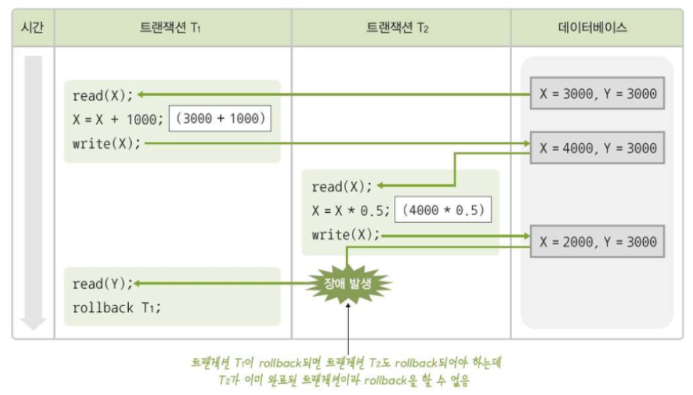
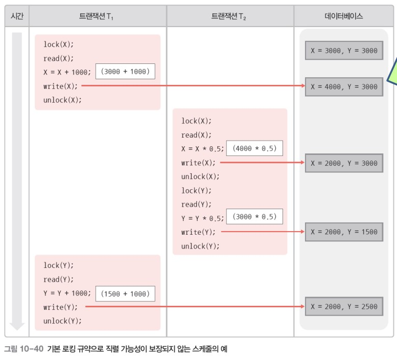
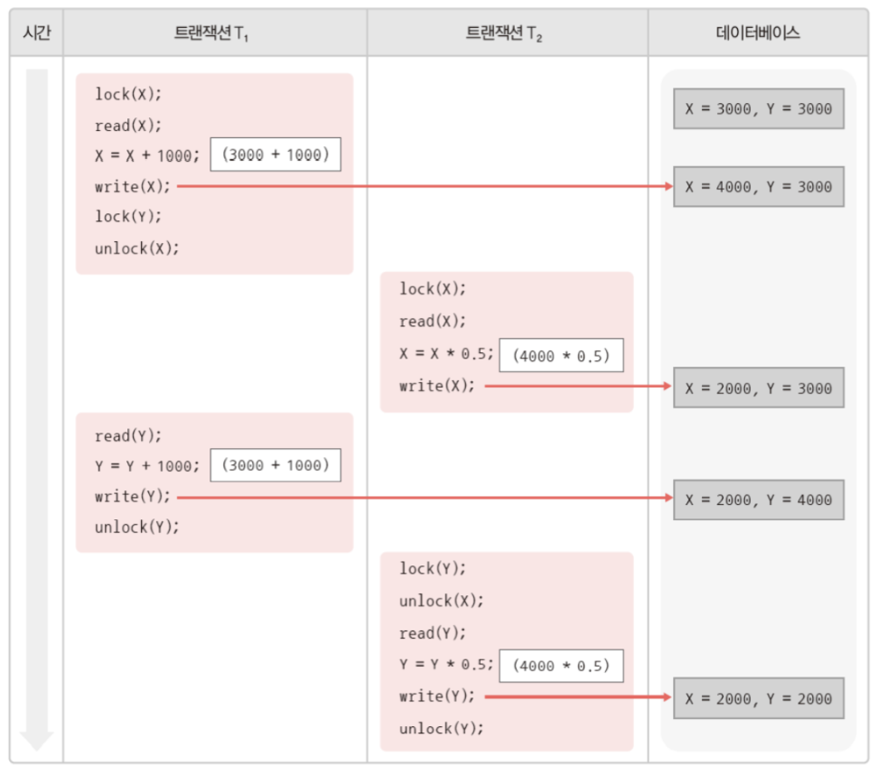

> 데이터베이스에 문제가 발생했을 때 이를 원래 상태로 회복하고, 사용자들이 데이터베이스를 동시에 사용하더라도 다툼 없이 사이좋게 사용할 수 있도록 하는 병행 제어 기능을 학습한다.

- [10.1. 트랜잭션](#101-트랜잭션)
  - [10.1.1. 트랜잭션의 개념](#1011-트랜잭션의-개념)
  - [10.1.2. 트랜잭션의 특성](#1012-트랜잭션의-특성)
  - [10.1.3. 트랜잭션의 연산](#1013-트랜잭션의-연산)
  - [10.1.4. 트랜잭션의 상태](#1014-트랜잭션의-상태)
- [10.2. 장애와 회복](#102-장애와-회복)
  - [10.2.1. 장애와 유형](#1021-장애와-유형)
  - [10.2.2. 데이터베이스의 저장 연산](#1022-데이터베이스의-저장-연산)
  - [10.2.3. 회복 기법](#1023-회복-기법)
- [10.3. 병행 제어](#103-병행-제어)
  - [10.3.1. 병행 수행과 병행 제어](#1031-병행-수행과-병행-제어)
  - [10.3.2. 병행 수행의 문제](#1032-병행-수행의-문제)
  - [10.3.3. 트랜잭션 스케쥴](#1033-트랜잭션-스케쥴)
  - [10.3.4. 병행 제어 기법](#1034-병행-제어-기법)

---

## 10.1. 트랜잭션

### 10.1.1. 트랜잭션의 개념

> 트랜잭션은 작업 하나를 수행하는 데 필요한 데이터베이스의 연산(SQL문)들을 모아놓은 것으로, 데이터베이스에서 논리적인 작업의 단위가 된다. 또한 데이터베이스에 장애가 발생했을 대 데이터를 복구하는 작업의 단위도 된다.

예를들어 A가 B에게 500원을 이체하는 계좌이체 트랜잭션은 다음과 같이 2개의 SQL문으로 구성할 수 있다.

```sql
UPDATE 계좌
SET 잔액 = 잔액 - 500
WHERE 계좌소유자 = 'A';

UPDATE 계좌
SET 잔액 = 잔액 + 500
WHERE 계좌소유자 = 'B';
```

만일 시스템의 장애로 첫 번째 SQL문만 실행되는 오류가 발생하였다면, 시스템이 정상적으로 작동하게 되었을 때 두 번째 UPDATE문을 실행하거나, 첫 번째 UPDATE문의 실행을 취소하여 트랜잭션을 작업 전 상태로 되돌아가게 해야 한다.

트랜잭션은 복구작업과 제어작업을 수행하는 중요한 단위로써, 트랜잭션의 모든 명령문이 완벽하게 처리되거나 하나도 처리되지 않아야 한다.

### 10.1.2. 트랜잭션의 특성

- **원자성**  
  트랜잭션을 구성하는 연산들은 모두 실행되거나, 혹은 하나도 실행되지 않아야 한다. 즉 트랜잭션을 구성하는 연산 중 일부만 데이터베이스에 반영되는 일이 없게 한다.
- **일관성**  
  트랜잭션이 이루어진 후에도 데이터베이스의 일관성을 유지해야 한다. 즉 데이터베이스의 특징적인 제약이나 규칙을 만족해야 한다.
- **격리성**  
  현재 수행 중인 트랜잭션이 완료될 때까지 트랜잭션이 생성한 중간 연산 결과에 다른 트랜잭션들이 접근할 수 없음을 의미한다.
- **지속성**  
  트랜잭션이 성공적으로 완료된 후 데이터베이스에 반영한 수행 결과는 어떠한 경우에도 손실되지 않고 영구적이다. 즉, 시스템에 장애가 발생하더라도 트랜잭션 작업 결과는 없어지지 않고 데이터베이스에 그대로 남아 있도록 회복 기능을 가져야한다.

<mark style='background-color: #fff5b1'>위 트랜잭션의 4가지 특성은 각각 DBMS의 회복과 병행지원 기능으로 만족된다.</mark>

| DBMS 기능      | 트랜잭션 특성  |
| -------------- | -------------- |
| 회복 기능      | 원자성, 지속성 |
| 병행 제어 기능 | 일관성, 격리성 |

### 10.1.3. 트랜잭션의 연산

- **commit 연산**
  - 트랜잭션의 수행이 성공적으로 완료되었음을 선언하는 연산.
  - 연산의 결과를 데이터베이스에 반영한다.
- **rollback 연산**
  - 트랜잭션의 수행이 실패했음을 선언하는 연산.
  - 트랜잭션의 연산 결과를 취소하고 트랜잭션이 수행되기 전의 상태로 돌아간다.

### 10.1.4. 트랜잭션의 상태


- **활동 상태**  
  트랜잭션이 수행 중인 상태
- **부분 완료 상태**  
  트랜잭션의 마지막 연산까지 완료된 상태
- **완료 상태**  
  commit 연산으로 트랜잭션의 수행 결과가 DB에 반영된 상태
- **실패 상태**  
  트랜잭션을 더 이상 정상적으로 수행할 수 없는 상태
- **철회 상태**  
  트랜잭션이 수행되기 전 데이터베이스 상태로 트랜잭션이 종료된 상태  
  철회된 트랜잭션은 상황에 다라 다시 수행되거나 폐기된다.

## 10.2. 장애와 회복

데이터베이스의 회복 기능은 트랜잭션의 원자성을 보장하며, 데이터 베이스를 일관된 상태로 유지시킨다.

### 10.2.1. 장애와 유형

> 시스템이 제대로 동작하지 않는 상태를 장애라고 한다.

| 유형          | 의미                                                                                         |
| ------------- | -------------------------------------------------------------------------------------------- |
| 트랜잭션 장애 | 트랜잭션의 논리적 오류, 잘못된 데이터 입력, 시스템 자원의 과다 사용, 처리 대상 데이터의 부재 |
| 시스템 장애   | 하드웨어 이상으로 메인 메모리에 저장된 정보가 손실되거나 교착된 상태                         |
| 미디어 장애   | 디스크 헤드의 손상이나 고장 등으로 데이터베이스의 일부가 손상된 상태                         |

### 10.2.2. 데이터베이스의 저장 연산

- **저장장치 종류**  
  저장 장치는 장애가 발생했을 때 대응하는 방법에 따라 3 종류로 분류할 수 있다.

  | 저장 장치          | 설명                                                                                                     |
  | ------------------ | -------------------------------------------------------------------------------------------------------- |
  | 휘발성 저장 장치   | 장애가 발생하면 저장된 데이터가 손실된다                                                                 |
  | 비휘발성 저장 장치 | 장애가 발생해도 저장된 데이터가 손실되지 않는다. 다만 저장장치 자체에 이상이 발생하면 데이터가 손실된다. |
  | 안정 저장 장치     | 비휘발성 저장 장치를 이용해 데이터 복사본을 여러 개 만드는 것                                            |

- **데이터 이동 연산**  
  데이터베이스의 데이터를 CPU가 처리하기 위해서는 메인메모리로 데이터를 읽어와야 한다. 디스크와 메인 메모리 간의 데이터 이동은 블록단위로 수행된다.

  | 연산     | 의미                                                                           |
  | -------- | ------------------------------------------------------------------------------ |
  | input()  | 디스크 블록에 저장되어 잇는 데이터를 메인 메모리 버퍼 블록으로 이동시키는 연산 |
  | output() | 메인 메모리 버퍼 블록에 있는 데이터를 디스크 블록으로 이동시키는 연산          |
  | read()   | 메인 메모리 버퍼 블록에 저장되어 있는 데이터를 프로그램 변수로 읽어오는 연산   |
  | write()  | 프로그램 변수 값을 메인 메모리 버퍼 블록에 있는 데이터에 기록하는 연산         |

  
  <!--  -->

### 10.2.3. 회복 기법

데이터베이스 관리 시스템에 잇는 회복 관리자는 장애 발생을 탐지하고, 장애가 탐지되면 데이터베이스 복구 기능을 제공한다. **데이터베이스를 복구하는 동안에는 데이터베이스에 접근하여 업무를 처리할 수 없다.**

- **회복을 위한 연산**  
  데이터베이스 회복의 핵심원리는 데이터 중복(백업)이다.

  | 연산       | 의미                                                              |
  | ---------- | ----------------------------------------------------------------- |
  | 덤프(dump) | 데이터베이스 전체를 다른 저장 장치에 주기적으로 복사하는 방법     |
  | 로그(log)  | 데이터베이스에서 변경 연산이 실행될 때마다 레코드를 기록하는 방법 |

  장애가 발생하였을 때는, 중복 저장한 데이터를 이용해 데이터베이스를 복구한다.

  | 연산         | 의미                                                                                               |
  | ------------ | -------------------------------------------------------------------------------------------------- |
  | 재실행(redo) | 가장 최근에 저장한 데이터베이스 복사본을 가져오고, 로그를 이용해 저장 이후 변경 연산을 재실행한다. |
  | 취소(undo)   | 로그를 이용해 지금까지 실행된 변경 연산을 취소한다.                                                |

- **로그 레코드**

  로그는 데이터 손실이 발생하지 않는 저장 장치에 저장해두며, 로그 파일은 레코드 단위로 기록된다.

  | 레코드                        | 설명                                                   |
  | ----------------------------- | ------------------------------------------------------ |
  | \<T, start>                   | 트랜잭션 T 수행 시작                                   |
  | \<T, X, old_value, new_value> | 트랜잭션 T가 데이터 X를 old_value에서 new_value로 변경 |
  | \<T, commit>                  | 트랜잭션 T가 성공적으로 완료                           |
  | \<T, abort>                   | 트랜잭션 T가 철회                                      |

  

- **회복 기법의 종류**

  - **즉시 갱신 회복 기법**

    <mark style='background-color: #fff5b1'>**트랜잭션 수행 중에 변경한 연산의 결과를 데이터베이스에 즉시 반영한 경우** (로그 레코드를 먼저 기록하고 데이터베이스를 변경한다)</mark>  
    트랜잭션이 완료되기 전에 장애가 발생한 경우 undo 연산을 실행하고, 트랜잭션이 완료된 후에 장애가 발생한 경우 redo 연산을 실행한다.

  - **지연 갱신 회복 기법**

    <mark style='background-color: #fff5b1'>**트랜잭션이 부분 완료된 이후에 로그에 기록된 내용을 데이터베이스에 한 번에 반영**하는 경우</mark>  
    트랜잭션이 완료되기 전에 장애가 발생한 경우 로그만 버리고, 트랜잭션이 완료된 후에 장애가 발생한 경우 redo 연산을 실행한다.

  - **검사 시점 회복 기법**

    **일정 시간 간격으로 검사시점을 만들어 로그 회복 기법의 시간을 단축시키는 방법.**  
    일정 시간 간격으로 메인 메모리에 모든 로그 레코드를 안정 저장 장치의 로그 파일에 기록하며, 트랜잭션을 데이터베이스에 반영한다. 그 다음, 검사 시점을 표시하는 \<checkpoint L> 로그 레코드를 로그 파일에 기록한다. L은 현재 실행되고 있는 트랜잭션 리스트이다.  
    장애가 발생하면 \<checkpoint L> 로그 레코드를 찾아 그 이후의 로그 기록에만 회복 작업을 수행한다.

  - **미디어 회복 기법**

    비휘발성 저장 장치인 디스크에 장애가 발생할 경우를 대비해 데이터베이스 전체를 일정 주기마다 다른 안전한 장치에 **덤프**한다.

## 10.3. 병행 제어

### 10.3.1. 병행 수행과 병행 제어

> 병행 수행은 트랜잭션이 차례로 번갈아 수행되는 인터리빙 방식으로 진행된다. 그런데 병행 수행되는 트랜잭션들이 동시에 같은 데이터에 접근하여 변경 연산을 실행하려고 할 경우, 예상치 못한 결과가 나타날 수도 있다.

> 여러 개의 트랜잭션이 병행 수행되더라도 정확한 결과를 얻을 수 있도록 제어하는 것을 병행 제어(동시성 제어)라고 한다.

### 10.3.2. 병행 수행의 문제

병행 수행 시 발생할 수 있는 문제들은 다음과 같다.

- **갱신 분실**  
  하나의 트랜잭션이 수행한 데이터 변경 연산의 결과를 다른 트랜잭션이 덮어써 변경 연산이 무효화되는 것  
  
- **모순성**  
  하나의 트랜잭션이 여러 개의 데이터 변경 연산을 실행할 대 일관성 없는 상태의 데이터베이스에서 데이터를 가져와 연산을 실행함으로써 모순된 결과가 발생하는 것  
  
- **연쇄 복귀**  
  장애가 발생한 트랜잭션이 rollback 연산을 실행하기 전에, 변경한 데이터를 가져가 사용하는 다른 트랜잭션이 수행을 완료해버려 해당 연산에 rollback연산을 실행할 수 없는 것  
  

### 10.3.3. 트랜잭션 스케쥴

> 트랜잭션 스케쥴은 트랜잭션에 포함되어 있는 연산들은 수행하는 순서이다.

- **직렬 스케쥴**
  - 인터리빙 방식을 이용하지 않고 트랜잭션별로 연산들을 순차적으로 실행시키는 것
  - 정확한 결과를 얻을 수 있지만, 병행 수행이라고 할 수 없다.
- **비직렬 스케쥴**
  - 인터리빙 방식을 이용하여 트랜잭션을 병행하여 실행시키는 것.
  - 병행 수행의 문제들이 발생할 수 있어 최종 수행 결과의 정확성을 보장할 수 없다.
- **직렬 가능 스케쥴**
  - 정확한 결과를 보장하는 비직렬 스케쥴

직렬 가능 스케쥴인지 여부를 판단하는 일은 비용이 많이 든다. 따라서 대부분의 데이터베이스 관리시스템은 병행제어기법을 사용한다.

### 10.3.4. 병행 제어 기법

> 병행 제어 기법은 병행 수행되는 트랜잭션들이 **미리 정의한 규약을 따름으로써 직렬 가능성을 보장하는 것이다.**

- **로킹 기법의 개념**  
  lock연산을 통해 데이터에 독점권을 가질 수 있고, unlock연산을 통해 데이터 독점권을 반납할 수 있다.  
  로킹 단위가 커질 수록 제어가 간단하지만 병행 수행이 어려워지고, 작아질수록 병행 수행이 자유로워지지만 제어가 어려워진다.  
  또한 처리 효율성을 높이리 위해 로킹의 제약조건은 크게 공용 lock과 전용 lock으로 분류된다.

  | 연산                 | 설명                                                                                                                                        |
  | -------------------- | ------------------------------------------------------------------------------------------------------------------------------------------- |
  | 공용(shared) lock    | 데이터에 read 연산을 실행할 수 있지만 write 연산은 실행할 수 없다. 여러 트랜잭션이 동시에 한 데이터에 대해 공용 lock 연산을 실행할 수 있다. |
  | 전용(exclusive) lock | 해당 트랜잭션만 데이터에 read / write 연산을 실행할 수 있다. 다른 트랜잭션은 어떠한 연산도 실행할 수 없다.                                  |
  | unlock               | lock연산에 대한 권한을 반납한다.                                                                                                            |

  기본 로킹규약만으로는 직렬가능성이 보장되지 않기 때문에 2단계 로킹 규약을 추가해야한다.
  

- **2단계 로킹 규약**  
  2단계 로킹 규약은 트랜잭션의 상태를 2가지로 나눈다.  
  | 상태 | 의미 |
  | --------- | ------------------------------------------------------------------------ |
  | 확장 단계 | 트랜잭션이 lock 연산만 실행할 수 있고, unlock 연산은 실행할 수 없는 단계 |
  | 축소 단계 | 트랜잭션이 unlock 연산만 실행할 수 있고, lock 연산은 실행할 수 없는 단계 |

  

  2단계 로킹 규약을 적용하면 트랜잭션의 직렬 가능성을 보장하지만, 교착 상태(daeadlock)가 발생할 수 있다. 교착상태는 트랜잭션들이 상대가 독점하고 잇는 데이터에 unlock연산이 실행되기를 서로 기다리면서 수행을 중단하고 있는 상태이다. 교착 상태는 처음부터 발생하지 않도록 예방하거나, 발생했을 때 빨리 탐지하여 필요한 조치를 취하는 방법으로 해결한다.
