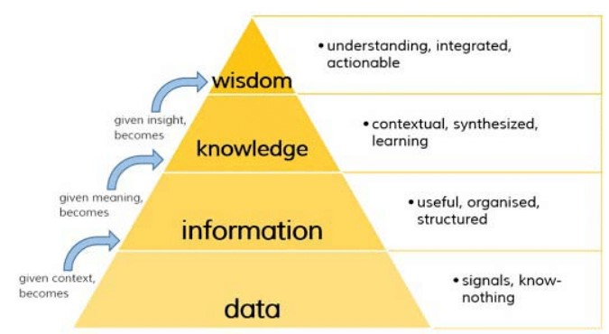

> 데이터 혁명으로 표현되는 기술 혁신의 시대에는, 많은 데이터 중 필요한 데이터를 선별하고, 신뢰도 높은 방법으로 분석한 결과를 사용할 수 있어야 한다.

- [13.1. 데이터 과학](#131-데이터-과학)
  - [13.1.1. 데이터 과학의 필요성](#1311-데이터-과학의-필요성)
  - [13.1.2. 데이터 과학의 개념](#1312-데이터-과학의-개념)
- [13.2. 빅데이터](#132-빅데이터)
  - [13.2.1. 빅데이터의 개념](#1321-빅데이터의-개념)
  - [13.2.2. 빅데이터의 특징](#1322-빅데이터의-특징)
  - [13.2.3. 빅데이터의 기술](#1323-빅데이터의-기술)
- [13.3. 빅데이터 저장 기술: NoSQL](#133-빅데이터-저장-기술-nosql)
  - [13.3.1. NoSQL의 등장](#1331-nosql의-등장)
  - [13.3.2. NoSQL의 특징](#1332-nosql의-특징)
  - [13.3.3. NoSQL의 종류](#1333-nosql의-종류)
- [13.4. 빅데이터 분석 기술: 데이터 마이닝](#134-빅데이터-분석-기술-데이터-마이닝)
  - [13.4.1. 데이터 분석의 개념](#1341-데이터-분석의-개념)
  - [13.4.2. 기계 학습과 데이터 마이닝](#1342-기계-학습과-데이터-마이닝)
  - [13.4.3. 데이터 마이닝](#1343-데이터-마이닝)
- [13.5. 빅데이터 표현 기술: 데이터 시각화](#135-빅데이터-표현-기술-데이터-시각화)
  - [13.5.1. 데이터 시각화 개념](#1351-데이터-시각화-개념)
  - [13.5.2. 데이터 시각화 방법](#1352-데이터-시각화-방법)
  - [13.5.3. 데이터 시각화 도구](#1353-데이터-시각화-도구)

---

## 13.1. 데이터 과학

### 13.1.1. 데이터 과학의 필요성

IT 기술의 발달로 수집된 방대한 양의 데이터는 전통적인 방법으로 저장하고 관리하기에는 거울 정도이다. 또한 방대한 양의 데이터 속에서 숨겨진 규칙과 패턴을 찾아내 문제 해결에 활용하기 위해서 데이터 과학의 필요성이 대두되었다.

### 13.1.2. 데이터 과학의 개념

> 데이터를 수집한 후 분석을 통해 데이터를 정확히 이해함으로써 그 속에 숨겨진 새로운 지식을 발견하고이를 문제 해결에 활용하는 모든 과정

데이터 과학의 목푤르 보다 잘 이해하기 위해서 DIKW 계층구조를 살펴보자.

- **데이터(data)**  
  관찰하거나 측정하여 수집한 사실이나 값  
  Ex. 매달 책의 판매량
- **정보(infromation)**  
  데이터를 목적에 맞게 가공한 것  
  Ex. 연간 분기별 판매량의 합계
- **지식(knowledge)**  
  규칙과 패턴을 통해 찾아낸 유용한 정보  
  Ex. 2분기가 되면 더운 여름 실내에서 독서를 즐기는 사람들이 늘어난다는 규칙
- **지혜(wisdom)**  
  지식에 통찰력을 더해 창의적인 아이디어를 도출하는 것  
  Ex. 지식을 토대로 2분기 새로 출간할 책의 콘텐츠를 기획

데이터 과학에서 많은 양의 데이터를 수집하고 분석하기 위해서는 컴퓨터고하가의 분야의 데이터 마이닝, 기계 학습, 프로그래밍 능력과 함께 통계학 분야의 다양한 통계 기법을 활용할 수 있는 능력이 필요하다. 그리고 데이터를 적용하려는 적용 분야에 대한 이해도 필요하다.

## 13.2. 빅데이터

### 13.2.1. 빅데이터의 개념

> 좁은 정의로는 기존의 데이터베이스가 저장하고 관리할 수 있는 범위를 넘어서는 대규모의 다양한 데이터, 넓은 정의로는 대규모의 데이터를 저장 및 관리하는 기술과 이를 분석하는 기술까지도 포함한다.

대규모 데이터를 목적에 따라 가공하고 분석함으로써 다양한 분야에 적용햘 수 있다.

### 13.2.2. 빅데이터의 특징

- **데이터 양**  
  빅데이터는 테라바이트 단위 이상의 대량 데이터이다.
- **속도**  
  빅데이터는 수집과 분석을 정해진 시간 내에 처리해야한다. 많은 양의 데이터가 빠르게 생성되기 때문에 가치있는 정보를 추출하기 위해서는 분석 또한 빠르게 처리해야한다.
- **다양성**  
  빅데이터는 정형, 반정형, 비정형 같은 다양한 형태의 데이터를 포함한다.
- **가치**  
  빅데이터에 대한 분석으로 얻은 결과는 문제 해결을 위한 의사 결정에 활용될 만한 유용한 가치를 가지고 있어야 한다.
- **정확성**  
  빅데이터로 만든 결과는 정확하고 신뢰할 수 있어야 한다. 이를 위해서는 데이터 자체가 높은 정확성을 유지하는 것이 중요하다.
- **시각화**  
  빅데이터를 다양한 분야에서 많은 사람에게 제공하기 위해서는 분석결과를 이해하기 쉽게 시각화해서 표편하는 것이 좋다.
- **가변성**  
  데이터 자체가 맥락에 따라 의미가 달라지는 가변적인 특징을 가지고 있음을 인식하고, 수집과 분석 작업에 반영해야한다.

### 13.2.3. 빅데이터의 기술

빅데이터를 위한 기술은 크게 다음과 같이 3가지로 나눌 수 있다.

- **저장 기술**  
  기존의 관계 데이터베이스가 저장하고 관리할 수 있는 범위를 넘어서는 다양한 형태의 대규모 데이터를 저장 및 관리하기 위한 기술이 등장하였다.
  - **하둡(Haddop)**  
    대용량 데이터를 분산 처리할 수 있는 자바 기반의 오픈 소스 프레임워크이다.  
    하둡 분산 파일 시스템 HDFS(Haddop Distributed File System)에 데이터를 저아하고, 분산 처리 시스템인 맵리듀스(MapReduce)를 이용해 데이터를 처리한다.
  - **NoSQL**  
    관계 데이터 모델과 SQL을 사용하지 않는 데이터베이스 시스템으로, 일관성보다는 가용성과 확장성에 중점을 두고 있다. 비정형 데이터를 저장하기 위해 유연한 데이터 모델을 지원하고, 관계 데이터베이스와 동일한 데이터 처리가 가능하면서도 분산처리와 병령처리가 가능하다. 대표적으로 H베이스, 카산드라, 몽고DB, 카우치DB등이 있다.
- **분석 기술**  
  데이터 마이닝, 기계 학습, 자연어 처리, 패턴 인식 등의 기술이 빅데이터 분석에 사용된다.  
  비정형 데이터의 대표적인 예로는 텍스트가 포함되는데, 텍스트 분석에는 다음과 같은 분석 기술들이 있다.
  - **텍스트 마이닝**  
    반정형 또는 비정형 텍스트에서 자연어 처리 기술을 기반으로 가치있는 정보를 추출하고 가공한다.
  - **오피니언 마이닝**  
    SNS등에 기록된 사용자들의 의견을 수집하고 분석하여, 제품이나 서비스에 대한 긍정, 부정, 중립 등의 선호도를 추출한다.
  - **소셜 네트워크 분석**  
    소셜 네트워크의 연결 구조나 강도를 바탕으로 사용자의 영향력, 관심사, 성향, 행동패턴 등을 추출한다.
  - **군집 분석**  
    데이터 간의 유사도를 측정한 후 이를 바탕으로 특성이 비슷한 데이터를 합쳐가면서 최종적으로 유사 특성의 데이터 집합을 추출한다.
- **표현 기술**  
  빅데이터 추출한 의미를 시각적으로 표현하기 위해 R을 주로 사용한다. R은 통계 기반의 데이터 분석과 다양한 시각화를 위한 언어이다. R을 이용해 기본 통계 기법부터 최신 데이터 마이닝 기법까지 적용할 수 있을 뿐더러, 다양한 프로그래밍 언어와 운영체제에서 사용이 가능하다.

## 13.3. 빅데이터 저장 기술: NoSQL

### 13.3.1. NoSQL의 등장

> 대량의 비정형 데이터의 저장과 처리를 위해 관계 데이터베이스를 대신할 새로운 대안으로 제시된 것이 NoSQL이다.

관계 데이터베이스는 트랜잭션을 통해 ACID(원자성, 일관성, 격리성, 지속성)을 보증하여 안정적인 데이터 관리가 가능하고, 조인을 포함해 복잡한 조건의 데이터 검색이 가능하다. 하지만 기하급수적으로 늘어나는 멀티미디어 데이터를 클러스터 환경으로 관리하는데는 기존의 관계 데이터베이스가 효율적으로 동작하지 않는다

### 13.3.2. NoSQL의 특징

| 구분          | 관계 데이터베이스                    | NoSQL                                                  |
| ------------- | ------------------------------------ | ------------------------------------------------------ |
| 처리 데이터   | 정형 데이터                          | 정형 데이터, 비정형(반정형)데이터                      |
| 대용량 데이터 | 대용량 처리 시 성능 저하             | 대용량 데이터 처리 지원                                |
| 스키마        | 미리 정해진 스키마가 존재            | 스키마가 없거나 변경이 자유로움                        |
| 트랜잭션      | 트랜잭션을 통해 일관성 유지를 보장함 | 트랜잭션을 지원하지 않아 일관성 유지를 보장하기 어려움 |
| 검색 기능     | 조인 등의 복잡한 검색 기능 제공      | 단순한 데이터 검색 기능 제공                           |
| 확장성        | 클러스터 환경에 적합하지 않음        | 클러스터 환경에 적합함                                 |
| 라이선스      | 고가의 라이선스 비용                 | 오픈 소스                                              |
| 대표적 사례   | Oracle, MySQL, MS SQL                | 카산드라, 몽고DB, H베이스                              |

- NoSQL은 트랜잭션 기능을 제공하지 않는 대신, 저렴한 비용을 여러 대의 컴픁에서 데이터를 분산,저장,처리하는 것이 가능하다.
- 스키마 없이 동작하기 때문에 데이터 구조를 미리 정의할 필요강 없고, 수시로 그 구조를 바꿀 수 있어 비정형데이터를 저장하기 적합하다.
- 복잡한 조건으로 검색 가능한 관계데이터베이스와 달리, NoSQL은 데이터 마이닝과 가틍ㄴ 별도의 분석 기술을 통해 의미를 찾아야 한다.

### 13.3.3. NoSQL의 종류

- **키-값 데이터베이스**
  키와 값의 쌍으로 데이터가 저장된다.  
  어떠한 형태의 값도 저장할 수 있지만, 키를 통해 특정 값을 지정하기 때문에 키를 이용해 값 전체를 검색할 수 는 있지만 값의 일부를 검색할 수는 없다.  
  Ex) 다이나모DB, 레디스
- **문서 기반 데이터베이스**
  키와 문서의 쌍으로 데이터가 저장된다.  
  문서는 트리 형태의 계층적 구조가 존재하는 JSON, XML과 같은 반정형 형태이다. 따라서 키를 통해 문서 전체를 검색할 소도 있고, XQuery와 같은 문서 대상 질의언어를 이용해 문서의 일부를 검색할 수도 있다.  
  Ex) 몽고DB, 카우치DB
- **컬럼 기반 데이터베이스**
  키와 컬럼 패밀리의 쌍으로 데이터가 저장된다.  
  컬럼 패밀리는 테이블에서 한 개의 투플을 구성하는 속성들의 모임으로 생각할 수 있고, 키는 각 행을 구분하는 키로 컬럼 패밀리를 식별한다.  
  관계 데이터 모델의 테이블과 다르게 다양한 형태의 데이터를 값으로 저장할 수 있고, 행(키)마다 컬럼의 구성을 다르게 할 수 있다.  
  Ex) 빅테이블, H베이스, 카산드라
- **그래프 기반 데이터베이스**
  노드에 데이터를 저장하고 간선으로 데이터 간의 관계를 표현하는 그래프 형태이다.  
  질의는 그래프 순회 과정을 통해 처리하고, 다른 NoSQL 데이터 모델과 달리 트랜잭션으로 통해 ACID를 지원하기 때문에 클러스터 환경에 적합하지 않다. 연관데이터를 추천해주거나 SNS에서 친구 찾기 질의를 효율적으로 수행하는데 적합하다.  
  Ex) Neo4J, 오리엔트DB, 아젠스그래프

## 13.4. 빅데이터 분석 기술: 데이터 마이닝

### 13.4.1. 데이터 분석의 개념

> 데이터 안에 숨겨진 정보를 찾아내는 과정

SQL를 통해 질의 검색 또한 데이터 분석 기술이라 할 수 있다. 하지만 기존의 정형화된 데이터보다 다양한 형태의 비정형 데이터를 기반으로 엄청난 양의 데이터를 처리하기 위해서는 새로운 데이터 분석 기술이 필요하다.

### 13.4.2. 기계 학습과 데이터 마이닝

> 데이터 마이닝은 수집된 데이터에서 규칙과 패턴을 찾아 지식을 발견하는 것이라면, 기계 학습은 수집되 데이터로 프로그램을 학습시켜서 새로운 데이터가 입력되었을 때 결과를 예측하는 것이다.

이 둘은 워낙 중복되는 부분이 많기 때문에, 일각에서는 '통계학 분야에서 바라보면 데이터 마이닝, 컴퓨터 과학분야에서 바라보면 기계 학습'이라고도 말한다.

### 13.4.3. 데이터 마이닝

데이터 마이닝의 대표적인 분석 기법은 다음과 같이 세 가지로 나눌 수 있다.

- **분류 분석**  
  새로운 데이터가 어떤 그룹 또는 등급에 속하는지를 판단하는데 사용되는 분석 기법이다.  
  그룹을 구분하는 것은 군집 분석과 유사하지만, 분류 분석은 군집 분석과 달리 미리 정의된 기준에 따라 기존 데이터의 그룹이 나뉘어 있다.  
  기법) 로지스틱 회귀모형, 의사결정나무, K-최근접 이웃모형, 베이즈분류모형, 인공신경망, 지지벡터기계, 유전 알고리즘
- **군집 분석**  
  미리 정해진 기준이 없는 상태에서 유사한 특성을 공유하는 데이터들을 여러 개의 독립적인 군집으로 나누는 분석 기법이다.  
  군집의 개수나 형태를 미리 가정하지 않은 상태에서 데이터 간의 유사성을 기반으로 데이터들을 군집지은다. 군집 분석은 계층적 군집과 비계층적 군집으로 또 나눌 수 있다.
  - **계층적 군집**  
    가장 유사한 데이터를 묶어나가는 과정을 반복하며 원하는 갯수의 군집을 형성한다.  
    기법) 최단 연결법, 최장 연결법, 평균 연결법, 중심 연결법, 와드 연결법
  - **비계층적 군집**  
    군집을 나눌 수 있는 모든 방법을 생각해본 후 가장 최적화된 군집을 형성한다.  
    기법) K-중심 군집
- **연관 분석**  
  데이터 간의 발생 빈도를 분석하여 그 속에 숨겨진 연관 규칙을 파악하는 분석 기법으로, 장바구니 분석이라고도 부른다.  
  기법) Apriori 알고리즘

## 13.5. 빅데이터 표현 기술: 데이터 시각화

### 13.5.1. 데이터 시각화 개념

> 데이터 분석을 통해 추출한 결과를 모두가 이해하기 쉽고 보기 좋게 그림이나 그래프 등으로 표현하는 것.

최그넹 인포그래픽과 데이터 시각화를 같은 의미로 사용하는 경우가 많지만, 인포그래픽은 정보의 내용을 명확하고 직관적으로 전달하는 데 초점을 맞춘 것이라면, 데이터 시각화는 분석 결과를 그대로 표현하는 것에 그치지 않고 시각화 전에는 보이지 않던 규칙이나 패턴을 찾는 분석 작업의 한 과정으로 볼 수 있다.

### 13.5.2. 데이터 시각화 방법

- **시간 시각화**  
  시간의 흐름에 따른 데이터의 변화난 경향을 시각적으로 표현하는 방법으로 그래프를 주로 사용한다.
- **분포 시각화**  
  선택이나 분류 기준에 따라 전체적으로 데이터가 각 부분에 어떻게 분포되어 있는지를 시각적으로 표현하는 방법으로 트리맵, 원그래프, 도넛 차트 등을 주로 사용한다.
- **관계 시각화**  
  데이터 간에 어떤 관계가 있는지, 즉 어떤 상관관계가 있는지를 시각적으로 표현하는 방법으로 버블 차트, 사나점도 등을 활용한다.
- **비교 시각화**  
  여러 항목의 데이터 값을 함께 비교해서 유사성이나 차이를 시각적으로 표현하기 위한 방법으로 바샇여 차트, 히트맵, 스타 차트 등을 주로 활용한다.
- **공간 시각화**  
  지도 위에 데이터를 표시하여 장소나 지역에 따른 데이터 분포를 시각화하는 방법으로 지도 매핑, 통계 주제도, 단계 구분도 등을 주로 활용한다.

### 13.5.3. 데이터 시각화 도구

빅데이터를 대상으로 하는 시각화에 대한 필요성이 증가하면서 태블로, 그래프비즈, 태그 클라우드, 게피, 프로세싱, 퓨전 테이블 등의 다양한 시각화 도구가 출시되었다.

또한 R언어와 파이썬 또한 시각화를 지원하는 프로그래밍 언어로 주목받고 있다.
