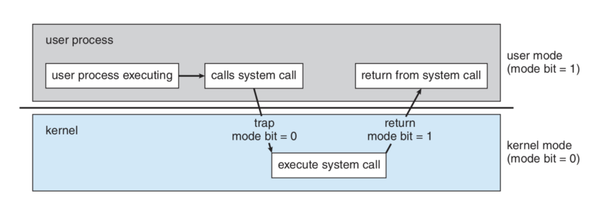
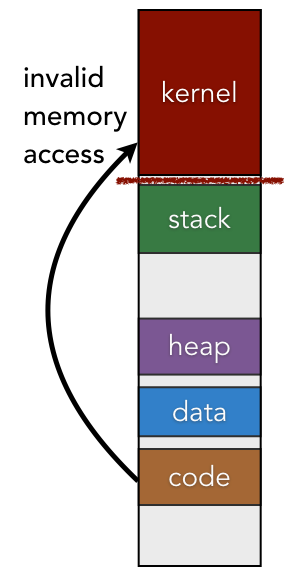
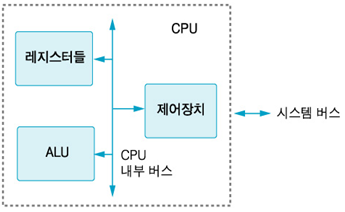
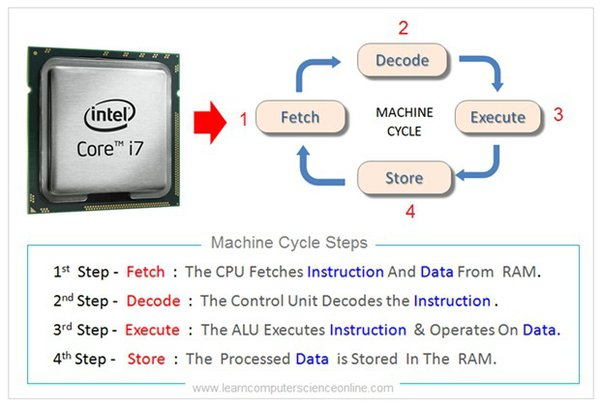
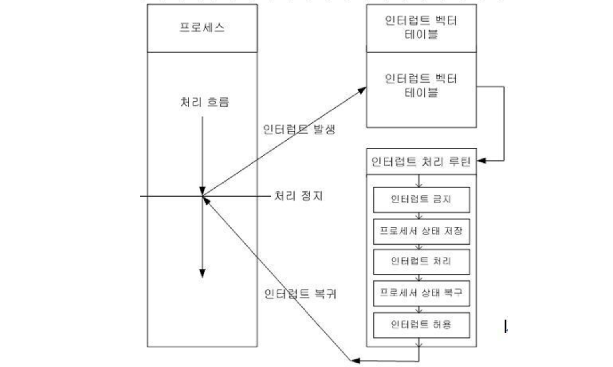

## 3.1.1. 운영체제의 역할과 구조

### 운영체제의 역할

운영체제의 역할은 크게 4가지가 있습니다.

1. **프로세스 관리**
   
CPU 스케쥴링을 통해 CPU 시간을 적절히 분배하여 다양한 프로세스들이 실행될 수 있도록 합니다

2. **메모리 관리**
   
한정된 메모리를 여러 프로세스에 나눠 할당합니다

3. **디스크 파일 관리**
   
파일의 생성, 삭제, 복사, 이동 등을 지원하고, 파일 보안과 엑세스 권한을 관리합니다

4. **I/O 디바이스 관리**
   
컴퓨터 시스템과 외부 장치 간의 데이터 입출력을 관리합니다

### 운영체제의 구조

운영체제는 인터페이스, 시스템콜, 커널, 드라이버로 이루어져 있습니다.

- **인터페이스**
  
사용자와의 인터페이스를 말하며, GUI 혹은 CUI로 제공됩니다.

- **시스템 콜**
   
응용 프로그램이 운영체제의 서비스에 접근하기 위해 사용하는 인터페이스입니다. 응용 프로그램은 시스템 콜을 호출하면 운영체제에게 특정 작업을 요청하고, 운영체제는 해당 작업을 수행한 후 결과를 응용 프로그램에 반환합니다

- **커널**
   
커널은 운영체제의 핵심 부분으로, 앞 서 말한 운영체제의 4가지 역할을 담당하며 응용프로그램과 하드웨어 간 통신을 중개합니다

- **드라이버**
   
하드웨어 장치를 제어하기 위한 소프트웨어 모듈로써, 운영체제가 하드웨어를 제어할 수 있는 API를 제공합니다

### 시스템 콜의 동작

시스템 콜(System Call)은 응용 프로그램이 운영체제의 서비스에 접근하기 위해 사용하는 인터페이스입니다.

응용 프로그램은 사용자 공간(User Space)에 위치하고, 운영체제는 커널 공간(Kernel Space)에 위치합니다. 응용 프로그램은 보안 및 안정성을 위해 직접적으로 하드웨어나 운영체제의 기능을 조작할 수 없기 때문에, 시스템 콜을 통해 운영체제에게 작업을 요청해야 합니다. 일반적으로 고수준 언어(C, C++, Python 등)에서 제공하는 라이브러리 함수를 통해 시스템 콜을 호출할 수 있습니다.

시스템 콜이 동작할 때 modebit을 참고해서 유저모드와 커널모드를 구분합니다. modebit은 플래그 변수로써, 1은 유저 모드 0은 커널 모드를 의미합니다.

### 커널과 메모리

커널은 운영체제의 핵심 기능으로 시스템이 부팅될 때 메모리에 로드되어 실행됩니다. 일반적으로 최상단 메모리 영역에 위치하며, 다른 응용 프로그램이나 사용자 공간과는 분리된 커널 공간에 상주합니다

일부 특수한 경우에 대해서, 커널 코드가 모듈로써 필요할 때만 메모리에 로드되어 사용될 수도 있지만, 기본적인 커널은 여전히 메모리에 상주하고 있습니다.

### 하드웨어 드라이버

하드웨어 드라이버는 해당 장치와 상호작용하기 위해 필요한 명령어 세트, 제어 방법, 데이터 포맷 등을 OS에 맞는 표준화되 인터페이스(API)로 제공합니다. 이를 통해 운영체제는 표준화된 인터페이스를 통해 다양한 하드웨어 장치를 관리할 수 있습니다.

드라이버는 일반적으로 하드웨어 제조사가 개발하고 제공합니다. 운영체제의 다양한 버전 및 플랫폼에 대한 드라이버를 개발함으로써, 자사의 하드웨어가 다양한 운영체제와 상호작용할 수 있도록 합니다.

## 3.1.2. 컴퓨터의 요소

컴퓨터는 CPU, DMA 컨트롤러, 메모리, 타이머, 디바이스 컨트롤러 등으로 이루어져 있습니다.

### CPU의 구조

CPU는 다음 4가지로 이루어져 있습니다.

- **제어장치(CU, Control Unit)**
   
제어 장치는 CPU의 핵심 요소로서, 명령어를 읽고 해석하여 다른 CPU와 컴퓨터의 구성 요소들을 제어합니다.

- **레지스터**
   
CPU 내부의 임시기억 장치로써 메모리에 비해 매우 빠르게 동작합니다.

- **산술논리연산장치(ALU, Arithmetic Logic Unit)**
   
덧셈, 뺄셈과 같은 두 숫자의 산술연산과, 논리합, 논리곱과 같은 논리연산을 수행합니다.

- **내부 버스**
   
CPU 내부 요소 및 메모리 사이에서 데이터와 제어 신호를 전달하는 통로입니다.

### 제어장치

제어 장치는 CPU의 핵심요소로서 다음과 같은 기능을 수행합니다.

- **명령어 해석**
   
프로그램 카운터(PC)로부터 가져온 명령어를 해석하여 필요한 작업을 식별합니다.

- **제어 신호 생성**
   
명령어의 해석 결과에 따라 제어 신호를 생성합니다. 제어 신호를 통해 CPU 및 컴퓨터의 다른 구성 요소들의 동작을 조정할 수 있습니다.

- **실행 주기 제어**
  
명령어의 실행 주기 간 전환을 관리합니다.

### 레지스터

레지스터는 CPU 내부에서 데이터를 저장하고 처리하는 데에 사용되는 작고 빠른 메모리입니다. CPU에는 다양한 종류의 레지스터가 있습니다.

- **프로그램 카운터(Program Counter, PC):**
   
현재 실행 중인 명령어의 주소를 가리키는 레지스터입니다.

- **명령어 레지스터(Instruction Register, IR)**
   
현재 실행 중인 명령어를 저장하는 레지스터입니다.

- **누산기(Accumulator, ACC)**
   
산술 및 논리 연산의 중간 결과를 저장하는 레지스터입니다.

- **인덱스 레지스터(Index Register)**
   
메모리에서 데이터를 효율적으로 접근하기 위해 사용되는 레지스터입니다. 주로 배열이나 구조체의 요소에 접근할 때 사용되며, 해당 요소의 주소를 계산하여 저장합니다.

- **스택 포인터(Stack Pointer, SP)**
   
프로그램의 실행 중에 함수 호출 시, 복귀를 위해 사용되는 레지스터입니다.

- **범용 레지스터(General Purpose Register)**
   
다양한 목적으로 사용되는 일반적인 목적의 레지스터입니다. 연산에 필요한 데이터를 저장하거나 중간 결과를 보관하는 데 사용됩니다.

### CPU의 연산 과정

CPU의 연산 사이클은 Fetch(검색), Decode(해독), Execute(실행), Write Back(기록)로 구성됩니다.

1. **Fetch (검색) 단계**
   
프로그램 카운터(PC)가 가리키는 주소에서 명령어를 검색합니다. 검색된 명령어는 메모리로부터 가져와 <mark>명령어 레지스터(IR)</mark>에 저장됩니다.
   프로그램 카운터는 다음 명령어의 주소로 업데이트됩니다.

2. **Decode (해독) 단계**
   
명령어 레지스터(IR)에 저장된 명령어는 해독하여 어떤 동작을 수행할지 결정합니다.

3. **Execute (실행) 단계**
   
명령어에 따라 필요한 연산이 산술논리연산장치를 이용해 수행합니다. 연산 결과는 <mark>누산기(ACC)</mark>에 저장됩니다.

4. **Write Back (기록) 단계**
   
연산 결과를 메모리에 저장합니다.

### 인터럽트

인터럽트는 어떤 신호가 들어왔을 때, 현재 실행 중인 프로그램의 흐름을 잠시 중단하고 인터럽트 핸들러 함수로 제어를 전달되는 것을 말합니다.

- **하드웨어 인터럽트**

  - **입출력(I/O) 장치의 완료 신호:** 데이터 전송이 완료되었거나 디스크 작업이 완료되었을 때 해당 장치에서 인터럽트를 발생시킬 수 있습니다.
  - **타이머 인터럽트:** 컴퓨터 시스템은 주기적으로 타이머를 사용하여 일정 시간 간격으로 인터럽트를 발생시킵니다.
  - **외부 이벤트:** 전원 이상, 네트워크 카드의 신호 등 외부에서 발생하는 이벤트에 의해 하드웨어 인터럽트가 발생할 수 있습니다.

- **소프트웨어 인터럽트**
  - **시스템 콜:** 프로그램이 운영체제의 특정 기능을 사용하기 위해 시스템 호출을 수행할 때 소프트웨어 인터럽트를 사용합니다.
  - **예외 처리:** 프로그램 내에서 예외 상황이 발생했을 때, 예외 처리 루틴을 실행하기 위해 소프트웨어 인터럽트를 발생시킵니다.
  - **사용자 정의 인터럽트:** 프로그래머가 정의한 특정 이벤트나 상황에 대한 처리를 위해 소프트웨어 인터럽트를 사용할 수 있습니다.

인터럽트 핸들러 함수는 일반적으로 운영체제 내부에 내장되어 있는 함수입니다. 운영체제가 시작될 때, 인터럽트 벡터 테이블(Vector Table)이라는 특정 영역에 인터럽트 번호와 해당 인터럽트에 대응하는 핸들러 함수의 주소를 등록합니다. 인터럽트가 발생하면 CPU는 해당 인터럽트 번호를 확인하고, 인터럽트 벡터 테이블을 참조하여 해당 인터럽트에 대응하는 핸들러 함수로 제어를 전달합니다

인터럽트 핸들러 함수는 일반적으로 다음과 같은 역할을 수행합니다:

- **상태 저장 및 복원**
  
인터럽트 핸들러 함수는 현재 실행 중인 프로세스의 상태를 저장하고, 인터럽트 처리를 위해 필요한 임시 데이터를 보관합니다. 이후 인터럽트 처리가 완료되면 이전 상태로 복원하여 중단된 프로세스를 계속 실행할 수 있도록 합니다.

- **인터럽트 처리**
  
인터럽트 핸들러 함수는 발생한 인터럽트의 종류를 식별하고 해당 인터럽트에 대한 적절한 처리를 수행합니다. 예를 들어, 하드웨어 인터럽트는 하드웨어 장치의 상태 변경을 처리하고, 소프트웨어 인터럽트는 시스템 호출 또는 예외 상황을 처리할 수 있습니다.

- **우선순위 및 스케줄링**
  
인터럽트 핸들러 함수는 여러 인터럽트가 동시에 발생하는 경우 우선순위에 따라 처리를 조정합니다. 높은 우선순위의 인터럽트가 먼저 처리되며, 우선순위 스케줄링을 통해 리소스를 효율적으로 관리합니다.

### DMA 컨트롤러

DMA(Direct Memory Access) 컨트롤러는 CPU의 개입 없이 직접 메모리와 입출력(I/O) 장치 간의 데이터 전송을 처리하는 장치입니다. DMA 컨트롤러는 CPU의 명령에 따라 동작하고, 그 결과를 CPU에 다시 보고합니다.

DMA는 CPU 디바이스로의 인터럽트 요청을 줄이고, CPU의 데이터 전송 작업을 부담함으로써 CPU의 성능을 높여줍니다.

## 3.1.3. 부가 질문

### CPU와 OS의 관계

OS는 컴퓨터의 자원을 관리하는 소프트웨어이며, CPU는 OS가 다른 컴퓨터 자원을 관리하기 위해 사용하는 중요한 하드웨어 부품입니다.

하지만 반대로 컴퓨터가 부팅 시에는, CPU가 일련의 부트스트랩 프로세스를 자동으로 동작하며 OS를 메모리에 로드합니다.

### 컴퓨터 부팅 과정

1. 컴퓨터는 ROM의 0번지에 위치한 BIOS를 자동으로 실행합니다. BIOS는 컴퓨터의 펌웨어(Firmware)로서 비휘발성 메모리에 저장된 하드웨어 내장 소프트웨어입니다.

2. BIOS(Basic Input Output System)은 POST(Power On Self Test)를 실행하여 하드웨어의 상태를 체크합니다.

3. BIOS는 하드디스크의 첫번째 섹터에(512바이트) 있는 MBR에 접근하여 부트 로더를 메모리에서 실행시킵니다. 부트 로더는 OS를 메모리에 로드하는 동작을 포합합니다.
