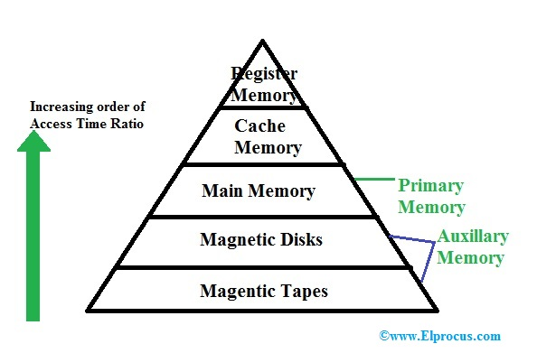
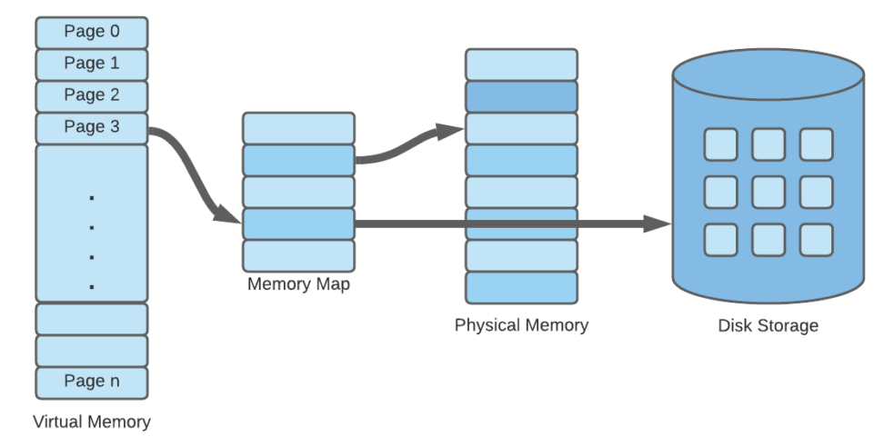
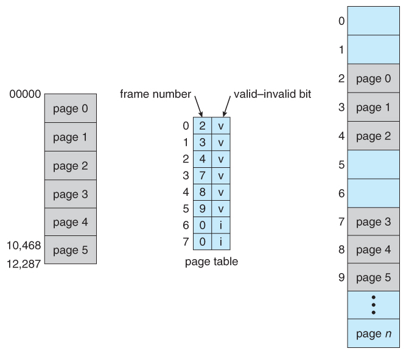

## 3.2.1. 메모리 계층

### 메모리 계층 구조에 대해 설명해주세요

컴퓨터의 메모리는 계층 구조로 이루어져 있습니다. 지역성의 원리를 바탕으로, 자주 사용되는 데이터를 더 빠르게 접근하게 함으로써 CPU의 성능을 높일 수 있기 때문입니다. CPU에 가까운 메모리일수록 작고 속도가 빠릅니다.

- **레지스터(Register)**  
  가장 빠르고 용량이 작습니다. CPU 내부에 위치하여 CPU 연산에 필요한 데이터나 중간 결과가 저장됩니다.

- **캐시(Cache)**  
  레지스터와 메인 메모리 사이에 위치하여, CPU와 메인 메모리 간 데이터 전송 속도 차이를 완화시킵니다.

- **메인 메모리(Main Memory)**  
  프로그램의 실행 코드와 데이터를 저장하며, CPU는 메인 메모리에서 데이터를 읽습니다.

- **보조 저장장치(Auxiliary Storage)**  
  하드 디스크 드라이브(HDD), 솔리드 스테이트 드라이브 (SSD) 등을 말합니다. 주 메모리보다 느리지만 큰 용량을 가지고 **비휘발성**입니다. 프로그램, 데이터, 파일 등을 영구 저장하는 데에 사용됨니다.

### CPU 캐싱방법에 대해 설명해주세요

캐시는 CPU와 주 메모리 사이에서 CPU의 데이터 액세스 속도를 개선하기 위해 사용됩니다. 캐시는 주로 지역성(Locality) 원리에 따라 메모리의 데이터를 캐싱하고, 이를 CPU에 더 빠른 속도로 제공할 수 있습니다.

지역성은 시간 지역성(Temporal Locality)과 공간 지역성(Spatial Locality) 두가지로 구분됩니다.

- **시간 지역성(Temporal Locality)**  
  최근에 액세스된 데이터는, 잠시 후에도 다시 액세스될 가능성이 높다는 개념입니다. 이를 이용하여 캐시는 최근에 액세스된 데이터를 저장해두고, CPU가 다시 해당 데이터에 액세스할 때 빠르게 제공합니다.

- **공간 지역성(Spatial Locality)**  
  CPU가 액세스한 데이터, 그와 인접한 주소 공간에 있는 데이터도 엑세스될 가능성이 높다는 개념입니다. 이를 이용하여 캐시는 CPU가 액세스한 데이터와 함께 인접한 주소 공간에 있는 데이터도 함께 저장해두고, CPU가 이후에 인접 데이터에 액세스할 때 빠르게 제공합니다.

### 캐시 히트와 캐시 미스란 무엇인가요?

**캐시 히트**는 CPU가 요청한 데이터를 캐시에서 성공적으로 찾아낸 경우를 의미합니다. 반대로 **캐시 미스**는 CPU가 요청한 데이터를 캐시에서 찾지 못한 경우를 의미합니다. 캐시 히트와 캐시 미스는 서로 반비례 관계이며 캐시 히트율이 높을 수록 CPU 효율이 좋아집니다.

### 캐시 매핑에 대해 설명해주세요

캐시 매핑(Cache Mapping)은 메모리의 데이터를 캐시의 특정 위치(인덱스)에 매핑하는 방법을 의미합니다. 캐시는 메모리에 비해 한정된 용량을 가지고 있기 때문에 메모리의 데이터를 캐시에 모두 저장할 수는 없습니다. **따라서 두 개 이상의 데이터 블록이 동일한 캐시 라인에 매핑되는 캐싱충돌이 일어날 수 밖에 업습니다.**

캐시 충돌(Cache Collision)이 일어나면, 이전에 캐시에 저장된 데이터가 덮어씌워지게 되고, 이는 곧 유효한 데이터가 불필요하게 제거 됨을 의미합니다. 따라서 캐시충돌을 낮추는 캐싱매핑 기법은 곧 캐시히트율을 높일 수 있습니다.

일반적으로 사용되는 세 가지 캐시 매핑 방법은 다음과 같습니다.

- **직접 매핑(Direct Mapping)**  
  직접 매핑은 메모리 블록마다 고정된 캐시 라인에 매핑하는 방식입니다. 예를 들어, 메모리 주소 1 ~ 100을 캐시 라인 1에 매핑하고, 메모리 주소 101~200을 캐시 라인 2 매핑하는 식입니다. 이 방식은 메모리 주소를 캐시 인덱스로 직접 사용하므로 검색이 빠르지만, 캐시 충돌이 잦게 발생합니다.

- **연관 매핑(Associative Mapping)**  
  완전 연관 매핑은 메모리 블록이 캐시의 어떤 위치에라도 매핑하는 방식입니다. 이 방식은 캐시 충돌을 최소화할 수 있지만, 검색을 위해 모든 캐시 라인을 탐색해야 하므로 검색이 느립니다.

- **집합 연관 매핑(Set Associative Mapping)**  
  집합 연관 매핑은 직접 매핑과 완전 연관 매핑의 장점을 조합한 방식입니다. 메모리의 블록은 캐시의 일부 집합에 매핑되고, 각 집합은 여러 개의 라인으로 구성되어 있습니다. 집합 연관 매핑은 캐시 충돌을 줄이면서도 검색 시간을 효율적으로 관리할 수 있는 중간적인 해결책입니다.

### 웹브라우저에서 쓰이는 캐싱을 설명해주세요

캐시는 비교적 접근이 빠른 곳에 데이터를 저장하는 것을 의미합니다. 브라우저에서는 쿠키, 로컬/세션 스토리지 등을 사용하여 서버에 비해 더 빠르게 데이터를 접근할 수 있습니다.

- **쿠키**  
  만료기한이 있는 키-값 저장소입니다. 4kb까지 데이터를 저장할 수 있고, same site 옵션에 따라 저장된 쿠키를 http 요청과 함께 자동으로 전송합니다.

- **로컬 스토리지**  
  만료기한이 없는 키-값 저장소입니다. 10MB까지 저장할 수 있으며 웹브라우저를 닫아도 유지됩니다.

- **세션 스토리지**  
  만료기한이 없는 키-값 저장소입니다. 5MB까지 저장할 수 있으며 탭을 닫을 때 데이터가 삭제됩니다.

## 3.2.2. 메모리 관리

가상 메모리 관련 YouTube: [[10분 테코톡] 🧚🏻 배럴의 가상 메모리](https://www.youtube.com/watch?v=5pEDL6c--_k)

### 가상 메모리란 무엇인가요?

한정된 메모리에 올릴 수 있는 프로세스의 갯수는 한정적입니다. 이러한 한계를 극복하고자 프로세스의 필요한 부분만을 메모리에 올리고, 나머지 부분은 디스크 메모리 영역에 대기시키는 기술이 제안되었습니다.

(디스크의 메모리 영역은 데이터 영억과 다르게 시간효율성에 따라 데이터를 저장하고 있습니다. 따라서 기존 데이터 영역보다 더 빠르게 데이터에 접근할 수 있습니다.)

**이처럼 기존 메인 메모리에 디스크 메모리 영역을 포함한 더 큰 메모리 자원을 관리하는 기술이 가상 메모리입니다.**

### 가상 메모리의 동작과정을 설명해주세요

가상 메모리의 동작과정을 설명하기 위해서는, 몇 가지 추가 개념을 알아야 합니다.

- **페이지 테이블**  
  페이지 테이블은 가상 메모리와 실제 메모리 간의 매핑 정보를 저장하는 데이터 구조입니다. 가상 메모리 시스템에서 페이지 테이블은 **가상 주소의 페이지 번호**와 **실제 메모리의 프레임 번호** 간의 매핑을 관리하며, 주소 변환에 사용됩니다. 페이지 테이블은 메인 메모리에 저장되며 운영체제가 관리합니다.

  

- **TLB(Translation Lookaside Buffer)**  
  메인 메모리에 있는 페이지 테이블의 일부 정보를 저장하는 캐시입니다. TLB 캐시 히트가 발생하면 보다 빠르게 메모리 주소를 매핑할 수 있습니다.

- **MMU(Memory Management Unit)**  
  MMU는 CPU와 메모리 사이에 위치하며, 프로세서가 메모리에 접근할 때 가상 주소를 실제 메모리 주소로 변환해주는 하드웨어 장치입니다. MMU는 먼저 TLB를 참조하고, TLB에 정보가 없는 경우 페이지 테이블을 참조합니다.

### 페이지 폴트와 스와핑에 대해 설명해주세요

**페이지 폴트**는 가상 메모리 시스템에서 발생하는 상황으로, 프로세스가 요청한 페이지가 현재 메인 메모리가 아닌, 디스크 영역에 존재하는 경우를 의미합니다. 이러한 경우, **메모리와 디스크 간의 프로세스를 이동시키는 스와핑 작업**을 통해 필요한 프로세스를 디스크로부터 메모리에 로드합니다.

페이지 폴트가 발생하면 운영 체제는 다음과 같은 절차를 따릅니다.

1. **페이지 폴트 예외 처리**  
   운영 체제는 예외를 처리하기 위해 페이지 폴트 핸들러를 실행합니다.

2. **페이지 폴트 원인 분석**  
   페이지 폴트 핸들러는 페이지 폴트의 원인을 분석합니다. 예를 들어, 페이지가 처음으로 접근한 것인지 혹은 페이지 부재로 인한 것인지를 확인합니다.

3. **필요한 페이지 로드**  
   운영 체제는 디스크에서 해당 페이지를 가져와 메인 메모리에 할당합니다.

4. **페이지 테이블 업데이트**  
   운영 체제는 페이지 테이블을 업데이트하여 가상 주소와 물리 주소 간의 매핑 정보를 수정합니다.

5. **프로세스 재개**  
   페이지 폴트 핸들러의 처리가 완료되면, 프로세스는 중단되었던 지점부터 재개되어 요청한 페이지에 접근할 수 있습니다.

### 페이지 교체 알고리즘에 대해 설명해주세요

스와핑 작업은 상대적으로 시간이 소요되는 작업이기에 CPU 성능을 낮춥니다. 따라서 페이지 폴트 발생 시, 적절한 페이지 교체 알고리즘을 선택하여 스와핑 횟수를 최소화해야합니다.

- **오프라인 알고리즘**  
  가장 먼 미래에 참조되는 페이지와 현재 할당하는 페이지를 바꾸는 알고리즘입니다. 실현 불가능하지만 가장 좋은 알고리즘으로써 성능 비교에 대한 상한기준으로 쓰입니다.
- **FIFO**  
  FIFO(First In First Out)는 가장 먼저 할당되었던 페이지와 교체하는 알고리즘입니다.
- **LRU**  
  LRU(Least Recently Used)는 가장 참조가 오래된 페이지와 교체하는 알고리즘입니다.
- **LFU**  
  LFU(Least Frequently Used)는 가장 참조 횟수가 적은 페이지와 교체하는 알고리즘입니다.
- **NRU**  
   NRU(Not Recently Used)는 참조 비트와 수정 비트 2가지 기준으로 페이지를 교체하는 알고리즘 입니다.

  다음과 같이 4개의 클래스를 두어, 낮은 클래스에 해당하는 페이지가 먼저 교체됩니다. 동일 클래스의 경우 보통 페이지 번호가 낮은 것을 선택합니다.

  또한 비트 테이블은 주기적으로 업데이트 됩니다.

  | 클래스 | 참조 비트 | 수정 비트 |
  | ------ | --------- | --------- |
  | 0      | 0         | 0         |
  | 1      | 0         | 1         |
  | 2      | 1         | 0         |
  | 3      | 1         | 1         |

### 스레싱이라 무엇이고, 어떻게 해결할 수 있을지 설명해주세요

스레싱(thrashing은) 컴퓨터 시스템에서 발생하는 현상으로, 메모리 부족 상황에서 과도한 페이지 폴트가 발생하여 대부분의 시간을 페이지 교체 작업에 소비하게 되는 현상을 말합니다.

스레싱의 해결방법은 다음과 같습니다.

- **페이지 교체 알고리즘 변경**  
  효율적인 페이지 교체 알고리즘을 선택하여 페이지 폴트의 빈도를 줄이고, 더 나은 성능을 얻을 수 있습니다.

- **작업 집중**  
  한 프로세스에게 더 많은 메모리 자원을 할당하고, 다른 프로세스들은 제한된 메모리를 사용하도록 조정하여 작업 집중을 통해 성능을 개선할 수 있습니다.

- **Working Set**  
  Working Set은 지역성을 통해 결정된 페이지 집합으로, Working set을 미리 메모리에 로드하여 페이지 폴트율을 낮출 수 있습니다.

- **Page Fault Frequency (PFF)**  
  PFF가 상한선에 도달하면 프레임을 늘리고, 하한선에 도달하면 프레임을 줄이는 방식으로 페이지 폴트율을 낮출 수 있습니다.

### 프로세스 메모리 할당방식에 대해 설명해주세요

메모리에 프로그램을 할당하는 방식에는 다음과 같은 종류가 있습니다.

- **연속 할당**  
  하나의 프로그램을 메모리에 연속적으로 할당하는 것을 말합니다. 연속 할당에는 고정 분할 방식과 가변 분할 방식이 있습니다.

  - **고정 분할 방식**
    메모리를 미리 나누어 관리하는 방식이며, 메모리가 미리 나눠져 있기 때문에 융통성이 없습니다. 또한, 내부 단편화가 발생합니다. 내부 단편화란 메모리를 나눈 크기보다 프로그램이 작아서 빈 공간이 발생하는 현상을 의미합니다.

    

  - **가변 분할 방식**

    매 시점 프로그램의 크기에 맞게 동적으로 메모리를 나누는 방식이며, 외부 단편화가 발생합니다. 외부 단편화란 메모리를 나눈 크기보다 프로그램이 커서 들어가지는 못하는 현상을 말합니다.

    

- **불연속 할당**  
  하나의 프로그램을 메모리에 분산하여 할당하는 방식을 의미합니다. 불연속 할당에는 페이징, 세그멘테이션, 페이지드 세그멘테이션 기법이 있습니다.

  - **페이징 (Paging)**  
    페이징은 프로세스를 일정한 크기(보통 4KB)인 페이지(Page)로 나누는 방법입니다. 각 페이지는 고정된 크기를 가지며, 논리적인 연속성을 갖습니다. 페이지 테이블을 사용하여 가상 주소와 물리 주소 간의 변환을 수행해야 합니다.

  - **세그멘테이션 (Segmentation)**  
    세그멘테이션은 프롯스를 세그먼트(Segment)라는 단위로 나누는 방법입니다. 프로세스를 이루는 메모리는 코드, 데이터, 스택, 힙 영역으로 이뤄지는데, 세그먼트는 이를 적절하게 묶은 단위입니다. 세그먼트 테이블을 사용하여 가상 주소와 물리 주소 간의 변환을 수행합니다. 세그멘테이션은 프로세스의 주소 공간을 논리적으로 구분하여 관리함으로써 프로그램의 유연성과 보안을 높일 수 있습니다. 하지만 홀의 크기가 균일하지 않다는 단점이 있습니다.

  - **페이지드 세그멘테이션 (Paged Segmentation)**  
    페이지드 세그멘테이션은 페이징과 세그멘테이션을 결합한 메모리 관리 기법입니다. 프로세스의 주소 공간을 세그먼트로 나눈 후, 각 세그먼트를 페이지로 나눕니다. 각 페이지는 고정된 크기를 가지며, 주소 매핑은 페이지 테이블과 세그먼트 테이블을 통해 수행됩니다.
