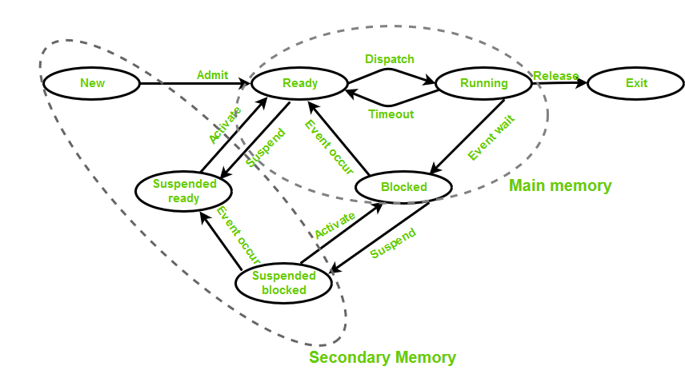
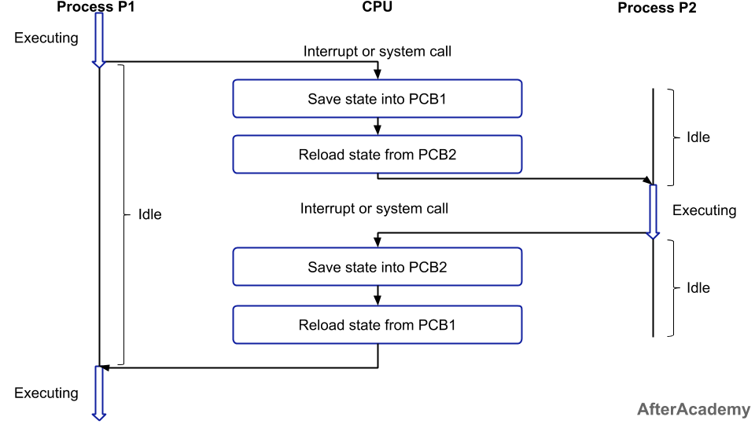

## 3.3.1. 프로세스와 컴파일 과정

### 컴파일 과정에 대해 설명해주세요

프로그램의 컴파일 과정은 다음과 같은 과정으로 이뤄집니다.


1.  **전처리(Preprocessing)**  
    컴파일 과정의 초기 단계로, 소스 코드를 컴파일하기 전에 사전에 처리되어야 하는 작업들을 수행합니다. 이 단계에서는 전처리기가 사용되며, 전처리기는 소스 코드 파일을 읽어들여 특정 지시문을 처리하거나 텍스트를 변경하는 역할을 합니다.

    예를 들어, #include 지시문과 같은 헤더 파일의 내용을 소스 코드에 포함시키거나 주석을 제거합니다. 참고로 **헤더 파일이란, 라이브러리에 포함된 함수, 구조체, 상수 등의 선언을 담고 있는 파일로 Java의 interface와 유사한 역할을 합니다.**

2.  **컴파일(Compilation)**  
     컴파일러는 문법 검사, 의미 분석, 코드 최적화 등의 작업을 수행하여 오류를 찾고 어셈블리어로 변환합니다. 컴파일의 세부과정을 간단히 설명하면 다음과 같습니다.

    1.  **렉싱(Lexing) 또는 토크나이징(Tokenizing)**  
        소스 코드를 작은 단위인 토큰(Token)으로 나누는 과정입니다. **토큰이란** 예약어, 변수, 상수, 연산자 등과 같이 코드를 이루는 최소 단위입니다.

    2.  **파싱(Parsing)**
        토큰들을 문법적 구조로 분석하는 과정입니다.

    3.  **추상 구문 트리(Abstract Syntax Tree, AST) 생성**  
        파싱된 결과를 기반으로 추상 구문 트리를 생성합니다. **추상 구문 트리는 프로그램의 구문 구조를 트리 형태**로 나타냅니다. 문장, 식, 표현식, 제어 흐름 구조 등을 노드로 표현하고, 각 노드 간의 관계를 링크로 연결합니다. 이러한 트리 구조를 통해 프로그램의 구문을 계층적이고 구조화된 형태로 표현하고, 그 유효성을 검사할 수 있습니다.

    4.  **중간 코드 생성**

    추상 구문 트리를 기반으로 중간 언어 또는 목적 코드를 생성합니다. 중간 언어는 고수준 언어와 기계어 사이의 추상화된 표현이며, 여러 플랫폼에서 실행 가능한 형태입니다.

3.  **어셈블(Assemble)**  
    어셈블리어로 작성된 소스 코드를 해석하고, 운영체제에 맞는 기계어 명령어(목적코드)로 번역합니다.

4.  **링킹(Linking)**  
    링커(linker)는 다른 라이브러리 파일과 컴파일된 목적 파일을 하나로 결합하여 실행 가능한 파일을 생성합니다.

### 정적 라이브러리와 동적 라이브러리의 차이를 설명해주세요

**정적 라이브러리는 컴파일 시에 전체 코드가 실행 파일에 포함되는 방식입니다.** 정적 라이브러리는 실행 파일의 크기가 커지는 단점이 있지만, 실행 시에 라이브러리의 의존성이 없으므로 배포 및 이식성 측면에서 편리합니다.

**동적 라이브러리는 런타임 시에 필요한 모듈을 동적으로 로드하여 사용하는 방식입니다.** 컴파일 시에는 라이브러리의 심볼(함수, 변수 등)에 대한 필수 정보만을 컴파일된 실행 파일에 포함시킵니다. 프로그램이 실행되는 도중, 필요한 시점에 로드됩니다.

따라서 동적 라이브러리는 실행 파일과 별도의 컴파일된 파일 형태로 제공되어야 합니다. 동적 라이브러리 파일은 보통 확장자가 .dll (Windows), .so (Linux/Unix), .dylib (macOS) 입니다.

동적 라이브러리는 여러 프로그램이 공유하여 사용할 수 있으며, 실행 파일의 크기를 줄이고 라이브러리 업데이트 및 유지보수가 용이하다는 장점이 있습니다.

### 인터프리터 언어는 어떻게 실행되나요?

인터프리터 언어는 말 그대로 인터프리터 언어이기 때문에 **컴파일되지 않습니다.**<mark>대신 인터프리터가 코드와 함께 메모리에 로드되어, 런타임 과정에서 소스 코드를 한 줄 씩 해석해 CPU에게 전달합니다. 또한 인터프리터는 운영체제로부터 스택과 힙과 같은 메모리 영역을 관리권한도 부여받습니다.</mark>

운영체제는 동일한 언어라도 각 프로그램마다 인터프리터 인스턴스를 생성해서 메모리를 할당하지만, 인터프리터와 프로그램의 메모리 공간 자체는 분리되어 있습니다.

앞 서 인터프리터어 언어는 컴파일 되지 않는다고 했지만, <mark>로드 시점에 인터프리터가 언어가 해석할 수 있는 형태로 변환되기는 합니다.</mark> 예를 들어, Python은 로드 시점에 바이트 코드로 변한되고, JavaScript는 추상구문트리(AST)형태로 변환됩니다.

## 3.3.2. 프로세스의 상태

### 프로세스 사이클에 대해 설명해주세요



- **생성 상태(create)**  
  프로세스가 생성되 상태를 의미합니다. 운영체제에 필요한 자원(메모리, 파일 핸들, 스레드 등)이 할당되고, PCB가 생성됩니다. 생성된 프로세스는 준비 상태로 이동합니다.

- **대기 상태(ready)**  
  스케줄러에 따라 CPU 시간을 할당받기 위해 대기하는 상태입니다.

- **실행 상태(run)**  
  프로세스가 CPU를 할당받아 실행되고 있는 상태입니다.

- **중단 상태(blocked)**  
  프로세스가 특정 이벤트를 발생까지 대기하는 상태입니다. 예를 들어, 프로세스가 파일의 읽기/쓰기 완료를 기다리는 경우, 입출력 작업 완료 이벤트가 발생하기 전까지 중단 상태로 들어갑니다. 이벤트가 발생하면 대기 상태로 전환됩니다.

- **일시 중단 상태(suspended blocked)**  
  중단 상태에서 운영체제에 의해 추가로 중단된 상태를 의미합니다. 메모리 부족이나 낮은 우선순위로 인해 발생할 수 있습니다. 중단이 해제되면 프로세스는 중단 상태로 복귀합니다.

- **일시 대기 상태(suspended ready)**
  대기 상태인데 운영체제에 의해 추가로 중단된 상태를 의미합니다. 역시 메모리 부족이나 우낮은 우선순위로 인해 발생할 수 있습니다. 중단이 해제되면 프로세스는 대기 상태로 복귀합니다.

- **종료 상태(terminated)**  
  프로세스가 자원을 운영체제에게 반환하고 종료되는 시점입니다.

### fork()와 exec()함수에 대해 설명해주세요

현재 대부분의 운영체제는 fork()와 exec()함수를 사용하여 새로운 프로세스를 생성합니다.

- **fork() 함수**  
   fork() 함수는 현재 실행 중인 프로세스를 복제하여 새로운 PID의 자식 프로세스를 생성합니다. 부모 프로세스의 자원(메모리, 파일 핸들, 열린 소켓 등)까지 복사되어 지식 프로세스에게 공유됩니다.

- **exec() 함수**  
  exec() 함수는 현재 프로세스에 새로운 프로세스를 로드하고 실행하는 함수입니다. 따라서 exec() 함수를 통해 다른 프로그램을 실행할 수 있습니다. <mark>보통 새로운 프로그램을 실행하고자 할 때, fork()함수를 실행헤 새로운 메모리를 할당 받고, 이어서 exec()함수로 할당받은 메모리의 새로운 프로그램을 로드합니다.</mark>

새로운 프로그램을 실행하기 위해 fork()와 exec()함수를 조합하는 이유는 크게 두가지입니다.

- **단순성과 효율성**  
  fork() 함수를 이용하면 비교적 간단하고 효율적인 방법으로 프로세스를 생성할 수 있습니다. 부모 프로세스의 상태를 단순히 복사하여 자식 프로세스를 생성하기 때문에, 복잡한 자원 할당이나 초기화 작업을 대체할 수 있습니다.

- **프로세스 트리**  
  fork() 함수를 사용하면 프로세스 트리 구조가 만들어집니다. fork() 함수로 만들어진 자식 프로세스는 기존 프로세스를 부모 프로세스로 가리킵니다. 부모 프로세스는 자식 프로세스의 동작을 제어할 수 있기 때문에, 결과적으로 전체 프로세스의 제어가 용이해집니다.

프로세스 트리는 `pstree`명령어로 확인할 수 있습니다. 아래 그림에섯 systemd는 최근 리눅스 운여체제의 init(초기화)프로세스로써 프로세스 트리의 루트노드에 해당합니다.


### 좀비프로세스와 고아프로세스에 대해 설명해주세요

- **좀비 프로세스**  
   **좀비 프로세스는 이미 종료된 프로세스의 상태 정보가 여전히 시스템 프로세스 테이블에 남아 있는 상태를 말합니다.** 자식 프로세스가 종료되었지만, 부모 프로세스가 해당 자식 프로세스의 종료 상태를 수집하지 않은 경우에 발생합니다. 좀비 프로세스는 리소스를 소비하지 않지만, 시스템 프로세스스 테이블의 한정된 자원을 점유하고 있으므로, 좀비 프로세스가 지속해서 쌓일 경우 시스템의 성능에 영향을 줄 수 있습니다.

  **좀비 프로세스는, 부모 프로세스가 자식 프로세스의 종료 상태를 수집(Collect)하도록 구현함으로써 해결할 수 있습니다.** 부모 프로세스는 wait() 함수를 사용하여 자식 프로세스의 종료 상태를 수집하고, 해당 프로세스를 시스템 프로세스 테이블에서 제거합니다.

- **고아 프로세스**  
   **고아 프로세스는 부모 프로세스가 종료되었지만 자식 프로세스가 여전히 실행 중인 상태를 말합니다.** 고아 프로세스는 부모 프로세스가 없어져 종료 상태를 처리할 수 없기 때문에 결과적으로 좀비 프로세스와 동일한 문제를 야기합니다.

  **리눅스에서는 고아 프로세스의 부모 프로세스를 init 프로세스로 변경하여 관리합니다.** init 프로세스는 프로세스 트리의 루트 노드로써, 일반적으로 PID 1을 갖고 있습니다.

## 3.3.3. 프로세스의 메모리 구조

### 프로세스의 메모링 구조를 설명해주세요

프로세스의 메모리 구조는 크게 코드, 데이터, 스택, 힙 영역 4가지로 구분할 수 있습니다. 이 중 코드와 데이터 영역은 정적으로 할당되고, 스택과 힙은 동적으로 할당됩니다.


- **코드 영역 (Text Segment)**  
  프로그램의 실행 코드가 위치하는 영역입니다. CPU가 읽어 실행하는 명령어들이 저장되어 있습니다.

- **데이터 영역 (Data Segment)**  
  프로그램의 전역 변수, 정적 변수(static), 상수(const)가 저장되는 영역입니다. 초기화된 데이터와 초기화되지 않은 데이터를 구분하여, 초기화되지 않은 데이터는 BSS(Block Started by Symbol) 영역에 할당합니다.

- **스택 영역 (Stack Segment)**  
  지역 변수, 매개변수, 함수 호출 정보 등이 저장되는 영역입니다. 함수 호출 시 생성되는 지역 변수와 함께 함수 호출 스택 프레임이 쌓이고, 함수 종료 시에 자동을 제거됩니다.

- **힙 영역 (Heap Segment)**  
  동적으로 할당된 메모리가 저장되는 영역입니다. 프로그래머가 `malloc()`, `free()`함수 등을 이용해서 직접 메모리를 관리할 수 있습니다. 힙 영역은 배열, 구조체, 객체 등의 데이터를 동적으로 생성할 때 사용됩니다.

## 3.3.4. PCB

### 프로세스 제어 블록에 대해 설명해주세요

프로세스 제어 블록 (PCB, Process Control Block)은 운영체제가 각 프로세스를 관리하기 위해 생성하는 메타데이터입니다. PCB는 운영체제가 프로세스를 스케쥴링하는 데 사용됩니다. <mark>때문에 다른 프로세스와 별도로, 메모리 커널 스택의 가장 앞부분에서 관리됩니다.</mark>

PCB에는 다음과 같은 정보를 포함합니다.

- **프로세스 식별자(Process ID, PID)**

- **프로세스 상태**  
  준비(Ready), 실행(Running), 대기(Waiting) 등의 프로세스 상태 정보

- **프로그램 카운터(Program Counter, PC)**  
  프로세스에서 다음 실행해야 할 명령어의 주소를 가리키는 포인터

- **CPU 레지스터 상태**  
  프로세스의 다음 실행을 위해 저장해야할 레지스터 정보

- **CPU 스케줄링 정보**  
  프로세스의 우선순위와 같은 스케줄링 알고리즘에 필요한 정보

- **메모리 관리 정보**
  프로세스가 사용하는 메모리 공간에 대한 정보(범위, 기준 주소, 한계 주소 등)

- **I/O 정보**  
  프로세스에 할당된 I/O 디바이스 목록

### 컨텍스트 스위칭이란 무엇인가요?



**컨텍스트 스위칭(Context Switching)은 운영체제가 PCB를 이용하여 프로세스 간의 전환을 수행하는 과정입니다.** 컨텍스트 스위칭은 CPU 스케쥴링이나 인터럽트로 인해 발생할 수 있습니다. 또한 컨텍스트 스위칭 작업에는 유휴 시간(Idle Time)이라는 비용이 발생하기 때문에 CPU 스케쥴리은 이를 고려해서 설계되어야 합니다.

1. 먼저 현재 실행 중인 프로세스의 레지스터 값, 프로그램 카운터, 스택 포인터 등의 상태를 PCB에 저장합니다.
2. 그리고 다음 프로세스의 PCB에서 저장된 상태를 레지스터로 복원하고, 프로그램 카운터를 설정하여 실행을 시작합니다.

## 3.3.5. 멀티프로세싱

### 멀티 프로세싱이란 무엇인가요?

**멀티 프로세싱은 하나 이상의 독립적인 프로세스를 동시에 실행하는 컴퓨팅 환경을 말합니다.** 이를 통해 CPU는 하나 이상의 일을 병렬적으로 처리할 수 있으며, 일부 프로세스에 문제가 발생하더라도 다른 프로세스를 문제없이 처리할 수 있습니다. <mark>싱글코어 CPU에서 멀티 프로세싱을 지원하기 위해서, 앞서 설명한 컨텍스트 스위칭과 CPU 스케쥴링 알고리즘이 사용됩니다.</mark>

### 크롬 브라우저의 멀티 프로세스에 대해 아는대로 설명해주세요

크롬 브라우저는 멀티 프로세스 아키텍처를 사용하여 동작합니다. 여러 개의 독립적인 프로세스를 병렬적으로 실행함으로써, 전체 프로그램의 안정성과 보안을 향상시킬 수 있다는 장점이 있습니다.

- **브라우저 프로세스(Main Process)**  
  크롬 브라우저를 실행하는 주요 프로세스입니다. 주소 표시줄, 탭 관리, 네트워크 요청 등의 기능을 담당합니다.

- **렌더러 프로세스(Renderer Processes)**  
  렌더러 프로세스는 HTML, CSS, JavaScript 등을 해석하여 화면을 렌더링합니다. <mark>렌더러 프로세스는 각 탭마다 생성됩니다. 때문에 하나의 탭에서 오류가 발생하더라도 다른 탭에는 영향을 주지 않는다는 장점이 있습니다.</mark>

- **GPU 프로세스(GPU Processes)**  
  GPU 가속을 위한 별도의 GPU 프로세스 입니다.

- **플러그인 프로세스(Plugin Processes)**  
  웹 사이트에서 사용되는 플러그인을 제어합니다.

### IPC 기술의 종류와 개요를 간략하게 설명해주세요

**IPC(Inter Process Communication)는 서로 다른 프로세스 간에 데이터를 주고받는 기술이며,** 다음과 같은 종류가 있습니다.

- **공유 메모리(Shared Memory)**  
  여러 프로세스가 동일한 가상메모리 영역을 공유하는 IPC 기술입니다. 프로세스는 공유 메모리 영역에 데이터를 쓰거나 읽을 수 있으며, 데이터의 동기화를 위한 동기화 기법이 필요합니다.

- **파일(File)**  
  파일을 통ㅎ 데이터를 주고받는 IPC 기술입니다. 프로세스는 파일에 데이터를 쓰고, 다른 프로세스는 해당 파일에서 데이터를 읽을 수 있습니다. 보통 임시적인 데이터 교환을 위해 사용됩니다.

- **소켓(Socket)**  
  네트워크 통신을 기반으로 한 IPC 기술입니다. IP 주소와 포트 번호로 구성된 소켓을 사용하여 다른 프로세스와 통신할 수 있습니다. TCP/IP 기반의 소켓은 신뢰성 있는 연결 지향 통신을 제공하며, UDP 기반의 소켓은 비연결형 통신을 제공합니다.

- **익명 파이프(Unamed Pipe)**  
   부모-자식 프로세스 간 단방향 통신을 위한 IPC 기술입니다. 한 프로세스에서 파이프의 한쪽 끝에 데이터를 기록하고, 다른 프로세스는 파이프의 다른 끝에서 데이터를 읽을 수 있습니다.

  ```c
  int main() {
      int pipefd[2];
      char buffer[1024];
      pid_t pid;

      // 파이프 생성
      if (pipe(pipefd) == -1) {
          perror("pipe");
          exit(EXIT_FAILURE);
      }

      // 새로운 프로세스 생성
      pid = fork();

      if (pid > 0) {
          // 부모 프로세스
          close(pipefd[0]);  // 읽기 엔드 닫기

          char message[] = "Hello, child process!";

          // 파이프에 데이터 쓰기
          write(pipefd[1], message, strlen(message));

          // 파이프 쓰기 엔드 닫기
          close(pipefd[1]);

          printf("Parent process sent message to child process: %s\n", message);
      } else if (pid == 0) {
          // 자식 프로세스
          close(pipefd[1]);  // 쓰기 엔드 닫기

          // 파이프에서 데이터 읽기
          read(pipefd[0], buffer, sizeof(buffer));

          // 파이프 읽기 엔드 닫기
          close(pipefd[0]);

          printf("Child process received message from parent process: %s\n", buffer);
      } else {
          perror("fork");
          exit(EXIT_FAILURE);
      }

      return 0;
  }
  ```

- **명명된 파이프(Named Pipe)**

  명명된 파이프는 파일 시스템에 존재하는 특수한 파일입니다. 일반 파일 IPC와 다르게 양방향 통신을 지원하고, 데이터는 임시적으로 저장됩니다. 파이프의 이름은 컴퓨터에서 유일해야하며, 이름이 중복될 경우 오류가 발생합니다.

  명명된 파이프를 지원하기 위해서는 서버-클라이언트 모델로 동작하는 파이프 서버가 필요합니다. 파이프 서버는 명명된 파이프를 여러 클라이언트(프로세스)에게 제공하는 역할을 합니다. 파이프 서버는 운영체제가 시스템 콜(system call)을 통해 제공합니다.

  c 언어에서 파이프를 생성하기 위해 mkfifo() 함수를 사용하고, 파일 디스크립터를 통해 접근할 수 있습니다.

  ```c
  int main() {
    int fd;
    char buffer[BUFFER_SIZE];

    // Named Pipe 생성
    mkfifo("my_pipe", 0666);

    // 자식 프로세스 생성
    pid_t pid = fork();

    if (pid == 0) {
        // 자식 프로세스 (데이터를 읽음)
        fd = open("my_pipe", O_RDONLY);
        read(fd, buffer, BUFFER_SIZE);
        printf("자식 프로세스: 받은 메시지 - %s\n", buffer);
        close(fd);
    } else {
        // 부모 프로세스 (데이터를 씀)
        fd = open("my_pipe", O_WRONLY);
        write(fd, "안녕하세요!", 14);
        printf("부모 프로세스: 메시지 전송\n");
        close(fd);
    }

    return 0;
  }
  ```

- **메시지 큐(Message Queue)**  
  메시지 기반의 통신을 지원하는 IPC 기술입니다. 프로세스는 메시지 큐에 메시지를 보내고, 다른 프로세스는 해당 큐에서 메시지를 읽을 수 있습니다. 메시지 큐는 비동기적이고 유연한 통신을 제공합니다.

## 3.3.6. 스레드와 멀티스레딩

### 스레드와 멀티스레드에 대해 설명해주세요.

**스레드(Thread)란 프로세스의 실행 가능한 가장 작은 단위입니다.** 프로세스는 여러 개의 스레드를 가질 수 있으며, 각각의 스레드는 다른 스레드와 프로세스의 자원(코드, 데이터, 힙, 파일, 네트워크 연결 등)을 공유합니다. 하지만 동시에 각각의 스레드는 <mark>자체적인 레지스터 세트와 스택을 가지고 있습니다.</mark>

**멀티스레딩(Multithreading)은 하나의 프로세스 내에서 여러 개의 스레드를 동시에 실행하는 프로그래밍 기법입니다.** 멀티 스레딩은 멀티 프로세스와 마찬가지로 시분할 기법이나 CPU 멀티코어로 구현될 수 있습니다. 멀티 스레딩을 통해 하나의 프로세스에서 여러 개의 기능을 병렬적으로 수행할 수 있지만, 스레드 간 상호작용 및 동기화에 주의가 필요합니다.

Python에서는 threading 모듈을 사용하여 멀티스레드를 구현할 수 있습니다.

```python
import threading

def my_function():
    # 스레드로 실행될 함수
    print("Hello from a thread!")

# 스레드 생성 및 실행
my_thread = threading.Thread(target=my_function)
my_thread.start()

# 메인 스레드의 실행
print("Hello from the main thread!")
```

Java에서는 Thread 클래스나 Runnable 인터페이스를 사용하여 멀티스레드를 구현할 수 있습니다.

```java
class MyRunnable implements Runnable {
    public void run() {
        // 스레드로 실행될 메서드
        System.out.println("Hello from a thread!");
    }
}

public class Main {
    public static void main(String[] args) {
        // 스레드 생성 및 실행
        Thread myThread = new Thread(new MyRunnable());
        myThread.start();

        // 메인 스레드의 실행
        System.out.println("Hello from the main thread!");
    }
}
```

### 멀티스레딩과 멀티프로세스를 비교해주세요

멀티 스레딩이 멀티 프로세스에 비해 가지는 장단점을 통해 둘을 비교하겠습니다.

- **멀티스레딩 장점**

  - 컨텍스트 스위치 비용이 적게 듭니다. 스레드는 하나의 프로세스 내에서 생성되고 관리되므로, 컨텍스트 스위칭이 프로세스보다 빠르게 이뤄집니다.
  - 빠르게 데이터를 공유합니다. 스레드는 동일한 주소 공간을 공유하므로, IPC 기술 없이 더 빠르게 공유 자원에 접근할 수 있습니다.

- **멀티스레딩 단점**

  - 하나의 스레드가 비정상적으로 종료되면, 전체 프로세스가 영향을 받을 수 있습니다.
  - 스레드 간의 자원 공유를 동기화 해야하고, 실패 시 교착상태 등의 문제가 발생할 수 있습니다.

<mark>따라서 멀티 프로세싱은 안정성을 요구하는 작업에 적합하며, 멀티 스레딩은 빠른 속도가 요구되는 경우에 적합합니다.</mark>

### 자바스크립트의 이벤트 루프를 스레드 관점에서 설명해주세요

자바스크립트는 단일 스레드 기반의 언어이기 때문에 한 번에 하나의 작업만을 처리할 수 있습니다. **따라서 자바스크립트는 비동기 처리를 위해 이벤트 루프(Event Loop)라는 메커니즘을 사용합니다.** 이벤트 루프는 크게 콜 스택, 이벤트 큐, 웹 API로 구성됩니다.


- **콜 스택(Call Stack)**
  자바스크립트 코드의 함수 호출 정보가 쌓이는 곳입니다. 메모리의 스택과 유사하게 동작합니다.

- **이벤트 큐(Event Queue)**
  완료된 비동기 작업의 콜백 함수와 이벤트들이 대기하는 곳입니다.

- **웹 API(Web APIs)**
  브라우저나 Node.js에서 제공하는 비동기 함수들이 실행되는 곳입니다. 별도의 멀티 스레드 풀을 가지고 있습니다.

1. 자바스크립트 코드 실행이 시작되고, 콜 스택에 함수 호출 정보가 쌓입니다.
2. 비동기 함수가 호출되면 해당 작업은 콜 스택에서 Web API로 넘어갑니다.
3. Web API가 직업을 완료했을 경우, 비동기 함수의 콜백 함수는 이벤트 큐에 쌓입니다.
4. 콜 스택이 비어있을 때, 이벤트 루프는 이벤트 큐의 작업을 콜 스택으로 이동시켜 실행합니다.
5. 이벤트 루프는 이러한 과정을 반복하여 비동기 작업을 순차적으로 처리합니다.

## 3.3.7. 공유 자원과 임계 영역

### 공유자원과 임계영역이란 무엇인가요?

공유 자원과 임계 영역은 병행 컴퓨팅 환경에서 발생할 수 있는 동기화와 관련된 개념입니다.

**공유 자원은 여러 개의 스레드나 프로세스가 동시에 접근하고 수정할 수 있는 데이터나 자원을 말합니다.** 여기에는 메모리, 파일, 네트워크 연결 등이 포함됩니다.

**임계 영역은 공유 자원에 접근하는 코드 영역을 말합니다.** 여러 개의 스레드나 프로세스가 동시에 공유 자원에 변경을 시도할 경우, 동시성 문제가 발생할 수 있습니다. 따라서 임계 영역을 보호하기 위해 동기화 메커니즘이 사용됩니다. 동기화 메커니즘은 임계 영역에 동시 접근하는 스레드 또는 프로세스 간의 실행 순서를 제어하고, 상호 배제(Mutual Exclusion)를 구현합니다.

### 뮤텍스에 대해 설명해주세요

뮤텍스(Mutex)는 상호 배제를 구현하기 위한 동기화 기법 중 하나로, 오직 하나의 스레드만 뮤텍스를 소유하고 사용할 수 있도록 보장합니다.


1. 스레드는 임계 영역에 진입하기 전에 뮤텍스를 획득하기 위해 락(Lock)을 호출합니다.

2. 현재 뮤텍스가 점유 중이라면, 대기하거나 다른 작업을 수행할 수 있습니다.

3. 뮤텍스가 잠겨있는 동안 스레드는 안전하게 공유 자원에 접근할 수 있습니다. 이 과정에서 해당 공유자원은 다른 스레드가 접근하지 못하도록 보호되고 있습니다.

4. 작업이 완료되면 스레드는 뮤텍스를 반납하기 위해 언락(Unlock)을 호출합니다. 대기 중인 다른 스레드가 뮤텍스를 획득하고 자원에 접근할 수 있게 됩니다.

### 세마포어에 대해 설명해주세요

**세마포어 역시 동기화와 상호 배제를 위해 사용되는 동시성 제어 도구입니다.**

세마포어는 동시성 제어를 위해 정수 타입의 변수를 사용합니다. 이 변수는 공유 자원에 접근할 수 있는 스레드 갯수를 의미합니다. 스레드가 공유 자원에 접근할 때 **대기(Wait, P) 연산**을 통해 세마포어의 값이 감소되고, 반대로 해제될 때는 **시그널(Signal, V) 연산**으로 값이 증가합니다.


- **바이너리 세마포어 (Binary Semaphore)**  
  바이너리 세마포어는 0 또는 1의 값만 가지는 세마포어입니다. 따라서 한 번에 오직 하나의 스레드만이 세마포어를 획득할 수 있는 뮤텍스와 유사하게 동작합니다. 어떤 스레드가 세마포어를 획득하면 값이 0이 되고, 그 동안 다른 스레드가 획득하려고 시도하면 대기 상태로 전환됩니다. 세마포어를 반납하면 값이 1이 되며, 대기 중인 스레드 중 하나가 세마포어를 획득하고 실행을 계속할 수 있습니다.
- **카운팅 세마포어 (Counting Semaphore)**
  카운팅 세마포어는 양의 정수 값을 가지는 세마포어입니다. 어떤 스레드가 세마포어를 획득할 때마다 값이 감소하고, 세마포어를 반납하면 값이 증가합니다. 값이 0인 경우에는 더 이상 감소하지 못하고 스레드가 대기 상태로 전환됩니다.
  카운팅 세마포어는 스레드 풀의 크기를 제어하는 등의 용도로 사용됩니다. 예를 들어, 데이터베이스 커넥션 풀에서 사용 가능한 커넥션의 수를 제어하기 위해 카운팅 세마포어를 사용할 수 있습니다.

## 3.3.8. 교착 상태

### 교착상태와 그 원인을 설명해주세요

**교착상태(데드락, Deadlock)는 동시에 두 개 이상의 프로세스가 서로가 가진 자원을 대기하며 무한히 진행하지 못하는 상태이며** 다음의 네 가지 조건이 모두 충족될 때 발생합니다.

- **상호 배제 (Mutual Exclusion)**  
  한 프로세스가 자원을 점유하고 있을 때, 다른 프로세스가 해당 자원에 접근할 수 없습니다.

- **점유와 대기 (Hold and Wait)**  
  한 프로세스가 최소한 하나의 자원을 점유한 상태로, 다른 자원을 대기하고 있어야 합니다.

- **비선점 (No Preemption)**  
  다른 프로세스로부터 자원을 강제로 가져올 수 없습니다.

- **순환 대기 (Circular Wait)**  
  프로세스의 집합에서 각 프로세스가 순환적으로 다음 프로세스가 요구하는 자원을 점유하고 있습니다.

### 교착상태의 해결방법을 말해주세요

**교착상태(데드락, Deadlock)를 해결하기 위한 방법은 다음과 같이 4가지로 구분할 수 있습니다.**

- **예방 (Prevention)**  
  교착상태의 원인이 애초에 발생하지 않도록 자원할당 방식을 설계합니다.

  - **상호 배제 예방**  
    여러 프로세스가 동시에 자원을 점유할 수 있도록 상호 배제 조건을 완화합니다. 예를 들어, 공유 가능한 자원에 대한 읽기 접근은 동시에 허용하고, 쓰기 접근은 상호 배제하여 동시에 하나의 프로세스만 접근할 수 있도록 합니다.

  - **점유와 대기 예방**  
    프로세스가 자원을 요청할 때, 다른 자원을 이미 점유하고 있는 프로세스는 대기하지 않고, 필요한 모든 자원을 동시에 요청해야 합니다.

  - **비선점 예방**  
    프로세스가 자원을 요청할 때, 이미 다른 프로세스가 점유하고 있는 자원을 빼앗을 수 있는 비선점 정책을 마련합니다.

  - **순환 대기 예방**  
    자원에 고유한 순서를 부여하여, 프로세스가 자원을 요청할 때 순환 대기 조건이 만족되지 않도록 합니다.

- **회피 (Avoidance)**  
  교착 상태 가능성을 먼저 확인하고 자원을 할당합니다.

  - **은행원 알고리즘**  
    자원을 할당하기 전에 시뮬레이션을 통해 안전한 상태인지를 미리 검사합니다.

- **회복 (Recovery)**  
  교착 상태가 발생하면 이를 탐지하고, 일부 자원을 회수하거나 프로세스를 중지시킴으로써 해결합니다.

- **무시 (Ignore)**  
  교착 상태를 무시하고 교착 상태가 발생하더라도 아무 조치도 취하지 않습니다. 이는 교착상태가 실제로 발생할 가능성이 거의 없어, 교착 상태를 해결하기 위한 비용이 더 클 때 채택할 수 있습니다.

<!-- ### 은행원 알고리즘

은행원 알고리즘(Banker's Algorithm)은 교착상태를 회피하기 위한 알고리즘 중 하나입니다. 은행원 알고리즘은 프로세스가 자원을 요청할 때 시스템이 안전한 상태인지 사전에 검사하여, 교착상태가 발생할 가능성이 있는 경우 자원을 할당하지 않습니다.

은행원 알고리즘은 다음의 가정을 기반으로 작동합니다:
- 시스템은 고정된 수의 자원 유형과 각 자원 유형별로 총 자원 수를 가지고 있습니다.
- 각 프로세스는 자원을 요청하기 전에 최대로 필요로 하는 자원의 양을 미리 선언합니다.
- 프로세스는 자원을 사용한 후 반환할 수 있으며, 다른 프로세스는 그 자원을 요청할 수 있습니다.

은행원 알고리즘의 작동 과정은 다음과 같습니다:

1. 시스템은 현재 사용 가능한 자원과 각 프로세스의 최대 자원 요구량을 추적합니다.
2. 프로세스가 자원을 요청하면 시스템은 해당 요청이 안전 상태를 유지하는지 검사합니다.
3. 안전 상태 판단을 위해 가상의 자원 할당을 수행하고, 시뮬레이션을 통해 시스템이 교착상태에 빠지지 않는지 확인합니다.
4. 안전 상태인 경우, 자원을 실제로 할당하고 프로세스가 작업을 수행할 수 있도록 합니다.
5. 안전 상태가 유지되지 않는 경우, 프로세스는 자원을 기다려야 합니다.

은행원 알고리즘은 자원 할당 그래프를 사용하여 시뮬레이션합니다. 이 그래프는 각 프로세스와 각 자원 유형 간의 관계를 나타내며, 안전 상태 판단을 위해 사이클이 없는지 확인합니다. 사이클이 없는 경우, 시스템은 안전 상태로 간주되며 자원을 할당할 수 있습니다. 사이클이 있는 경우, 교착상태가 발생할 수 있으므로 자원을 할당하지 않습니다.

은행원 알고리즘은 프로세스가 자원을 요청할 때마다 안전 상태를 검사해야 하므로 추가적인 오버헤드가 발생합니다. 그러나 안전한 자원 할당을 보장하여 교착상태를 효과적으로 회피할 수 있습니다.

```python
available = [3, 3]  # 각 자원 유형별 현재 사용 가능한 자원 수
maximum = [[7, 5], [3, 2], [9, 0], [2, 2], [4, 3]]  # 각 프로세스의 최대 자원 요구량
allocation = [[0, 1], [2, 0], [3, 0], [2, 1], [0, 0]]  # 각 프로세스가 현재 할당된 자원

def is_safe_state(available, maximum, allocation):
    num_resources = len(available)
    num_processes = len(maximum)

    # 필요 자원, 남은 자원, 작업 완료 여부를 추적하는 배열 초기화
    need = [[maximum[i][j] - allocation[i][j] for j in range(num_resources)] for i in range(num_processes)]
    work = available.copy()
    finish = [False] * num_processes

    # 안전 상태 판단을 위한 가상의 작업 수행
    while True:
        # 현재 상태에서 수행 가능한 프로세스를 찾음
        found = False
        for i in range(num_processes):
            if not finish[i] and all(need[i][j] <= work[j] for j in range(num_resources)):
                # 프로세스가 수행 가능한 경우
                found = True
                break

        if not found:
            break

        # 프로세스에 자원 할당
        for j in range(num_resources):
            work[j] += allocation[i][j]
        finish[i] = True

    # 모든 프로세스가 완료되었는지 확인
    return all(finish)

# 안전 상태인지 확인
if is_safe_state(available, maximum, allocation):
    print("시스템은 안전한 상태입니다.")
else:
    print("시스템이 교착상태에 빠질 수 있습니다.")
``` -->
