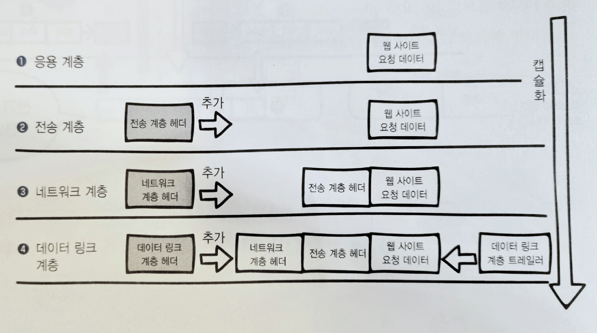
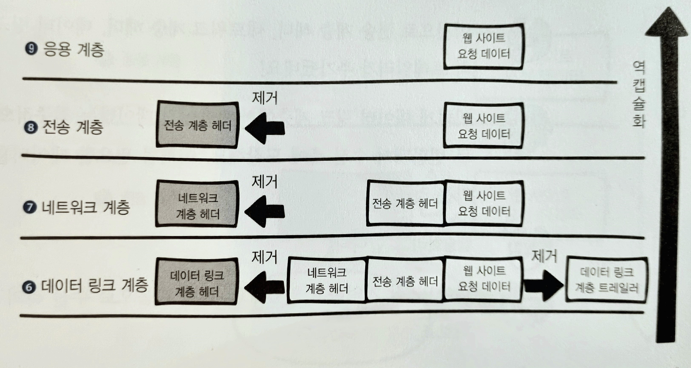

미즈구치 카츠야, 『모두의 네트워크』, 이승룡 역, 길벗(2022), 2장

# Ch2. 네트워크의 기본 규칙 <!-- omit in toc -->

- [2.1. 네트워크의 규칙](#21-네트워크의-규칙)
  - [2.1.1. 프로토콜](#211-프로토콜)
- [2.2. OSI 모델과 TCP/IP 모델](#22-osi-모델과-tcpip-모델)
  - [2.2.1. OSI 모델](#221-osi-모델)
  - [2.2.2. TCP/IP 모델](#222-tcpip-모델)
- [2.3. 캡슐화와 역캡슐화](#23-캡슐화와-역캡슐화)
  - [2.3.1. 캡슐화와 역캡슐화](#231-캡슐화와-역캡슐화)
- [2.4. VPN](#24-vpn)
  - [2.4.1. VPN 동작 과정](#241-vpn-동작-과정)

네트워크 통신의 기본 규칙인 프로토콜 개념에 대해 학습한다.

## 2.1. 네트워크의 규칙

### 2.1.1. 프로토콜

> 컴퓨터 또는 전자기기 간의 원활한 통신을 위해 약속한 통신 규약

인터넷은 TCP/IP 프로토콜 기반 하에 동작한다.  
인터넷을 통한 이메일 송수신에는 SMTP (Simple Mail Transfer Protocol)이 적용되고, 전 세계의 메일서버가 이를 따른다.
월드 와이드 웹 역시 HTTP(HyperText Transfer Protocol)를 따른다.

## 2.2. OSI 모델과 TCP/IP 모델

### 2.2.1. OSI 모델

> ISO(isos: 그리스어로 평등하다)라는 약칭을 가진 국제 표준화기구가 제안한 인터넷 통신 모델이다. 인터넷 프로토콜의 표준안(청사진)이라고 볼 수 있다.

OSI 모델은 통신 시스템을 7개의 추상적인 계층으로 나누었다. 각 계층의 자신만의 특정 작업을 수행하며, 자신의 바로 위아래 계층과 정보를 주고받는다.

| 계층  |                  이름                  |                                          설명                                           |
| :---: | :------------------------------------: | :-------------------------------------------------------------------------------------: |
| 7계층 |   Application Layer (응용 계층)    |                             어플리케이션 서비스가 동작한다.                             |
| 6계층 |   Presentaion Layer (표현 계층)    | 응용 계층이 데이터를 사용할 수 있도록 가공한다. (인코딩/디코딩, 암호화/복호화, 압축 등) |
| 5계층 |     Session Layer (세션 계층)      |                      세션을 확립, 유지, 중단하는 작업을 수행한다.                       |
| 4계층 |    Transport Layer (전송 계층)     |                         신뢰할 수 있는 데이터 통신을 구현한다.                          |
| 3계층 |   Network Layer (네트워크 계층)    |        논리주소(IP주소)를 바탕으로 데이터의 통신경로를 결정한다(데이터 라우팅).         |
| 2계층 | Data Link Layer (데이터 링크 계층) |           물리주소(MAC주소)를 바탕으로 기기 간의 데이터 전송(1홉)을 담당한다.           |
| 1계층 |     Physical Layer (물리 계층)     |                시스템 간의 물리적인 연결과 전기 신호를 변환 및 제어한다.                |

### 2.2.2. TCP/IP 모델

> OSI 참조 모델을 기반으로 상업적이고 실무적으로 이용될 수 있도록 단순화된 모델로, 현재 인터넷 통신에서 가장 보편적으로 쓰이는 프로토콜의 모음이다.

<table  style="text-align:center">
  <tr>
    <td>OSI</td>
    <td>TCP/IP</td>
  </tr>
  <tr>
    <td>Application Layer (응용 계층)</td>
    <td rowspan="3">Application Layer (응용 계층)</td>
  </tr>
  <tr>
    <td>Presentation Layer (표현 계층)</td>
  </tr>
  <tr>
    <td>Session Layer (세션 계층)</td>
  </tr>
  <tr>
    <td>Transport Layer (전송 계층)</td>
    <td>Transport Layer (전송 계층)</td>
  </tr>
  <tr>
    <td>Network Layer (네트워크 계층)</td>
    <td>Internet Layer (인터넷 계층)</td>
  </tr>
  <tr>
    <td>Data Link Layer (데이터 링크 계층)</td>
    <td rowspan="3">Network Access Layer (네트워크 접속 계층)</td>
  </tr>
  <tr>
    <td>Physical Layer (물리 계층)</td>
  </tr>
</table>

## 2.3. 캡슐화와 역캡슐화

### 2.3.1. 캡슐화와 역캡슐화

- **캡슐화**
  송신측 컴퓨터의 각 계층에서, 수신측 컴퓨터의 동일 계층에서 필요한 정보(헤더와 트레일러)를 데이터에 추가하며 하위 계층으로 보내는 과정
- **역캡슐화**
  수신측 컴퓨터의 각 계층에서, 데이터를 처리하기 위해 헤더와 트레일러를 제거하며 상위 계층으로 보내는 과정

## 2.4. VPN

> 여러 인트라넷과 개별 클라이언트를 인터넷을 통해 연결하는 사설 통신망이다.

인트라넷은 해당되는 컴퓨터만 전용선으로 연결해서 제3자가 함부로 접근하지 못하게 만든다. 따라서 회선이 없는 지역에서는 망 자체에 접근이 불가능해지고, 그에 따라 전국, 해외 단위로 회사가 커지면 커질수록 전용선 구축 비용이 천문학적으로 늘어난다. 따라서 **인트라넷을 확장성이 뛰어난 인터넷처럼 사용할 수 있도록 나타난 기술이 VPN이다.**

### 2.4.1. VPN 동작 과정

1. 클라이언트는 VPN 서버에 인증 정보와 함께 연결을 요청한다.이 때, 일반적으로 사용되는 인증 방식으로는 이름/비밀번호, 인증서 등이 있다.
2. VPN 서버는 클라이언트의 인증 정보를 확인하고, 이 둘 간에 암호화 키가 생성된다.
3. 클라이언트와 VPN 서버 사이의 데이터 전송은 IPsec과 같은 프로토콜을 통해 암호화 되고, 이처럼 암호화된 통신 채널을 VPN 터널이라고 한다.
4. VPN을 사용하면, 클라이언트의 IP 주소는 VPN 서버의 IP 주소로 대체되어 사설망으로의 접근 및 데이터 전송이 가능해진다.
